# Prilagoditev Phi-3 z Azure AI Foundry

Poglejmo, kako prilagoditi Microsoftov jezikovni model Phi-3 Mini z uporabo Azure AI Foundry. Prilagoditev omogoča, da Phi-3 Mini prilagodite specifičnim nalogam, kar model naredi še zmogljivejši in bolj kontekstualno zavedajoč.

## Premisleki

- **Zmožnosti:** Kateri modeli so prilagodljivi? Kaj lahko osnovni model doseže po prilagoditvi?
- **Stroški:** Kakšen je cenovni model prilagoditve?
- **Prilagodljivost:** Koliko lahko spremenim osnovni model – in na kakšen način?
- **Udobje:** Kako poteka prilagoditev – ali moram pisati svojo kodo? Ali potrebujem svojo računalniško infrastrukturo?
- **Varnost:** Prilagojeni modeli lahko predstavljajo varnostna tveganja – ali obstajajo zaščitni ukrepi za preprečevanje nenamernih škodljivih posledic?

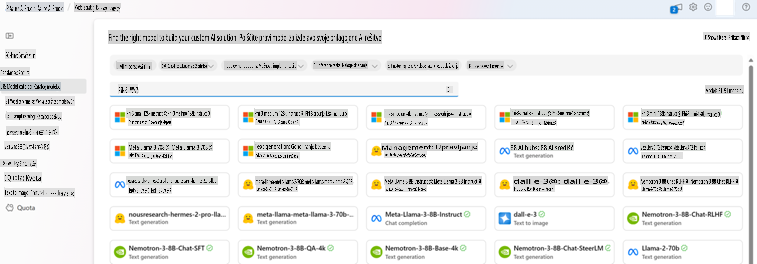

## Priprava na prilagoditev

### Predpogoji

> [!NOTE]
> Za modele družine Phi-3 je ponudba prilagoditve po principu plačila po uporabi na voljo samo za vozlišča, ustvarjena v regijah **East US 2**.

- Naročnina na Azure. Če je nimate, ustvarite [plačljiv Azure račun](https://azure.microsoft.com/pricing/purchase-options/pay-as-you-go), da začnete.

- [Projekt AI Foundry](https://ai.azure.com?WT.mc_id=aiml-138114-kinfeylo).
- Azure vloge za nadzor dostopa (Azure RBAC) se uporabljajo za dodeljevanje dostopa do operacij v Azure AI Foundry. Za izvajanje korakov v tem članku mora biti vaš uporabniški račun dodeljen vlogi __Azure AI Developer__ v skupini virov.

### Registracija ponudnika naročnin

Preverite, ali je naročnina registrirana za ponudnika virov `Microsoft.Network`.

1. Prijavite se v [Azure portal](https://portal.azure.com).
1. V levem meniju izberite **Subscriptions**.
1. Izberite naročnino, ki jo želite uporabiti.
1. V levem meniju izberite **AI project settings** > **Resource providers**.
1. Prepričajte se, da je **Microsoft.Network** na seznamu ponudnikov virov. Če ga ni, ga dodajte.

### Priprava podatkov

Pripravite svoje podatke za učenje in validacijo za prilagoditev modela. Vaši podatki za učenje in validacijo morajo vsebovati primere vhodov in izhodov, ki prikazujejo, kako želite, da model deluje.

Poskrbite, da vsi primeri za učenje sledijo pričakovani obliki za napovedovanje. Za učinkovito prilagajanje modelov zagotovite uravnotežen in raznolik nabor podatkov.

To vključuje vzdrževanje ravnotežja podatkov, vključitev različnih scenarijev in občasno izpopolnjevanje podatkov za učenje, da se uskladijo z resničnimi pričakovanji, kar vodi do natančnejših in uravnoteženih odzivov modela.

Različne vrste modelov zahtevajo različno obliko podatkov za učenje.

### Zaključevanje pogovora

Podatki za učenje in validacijo **morajo** biti oblikovani kot dokument JSON Lines (JSONL). Za `Phi-3-mini-128k-instruct` mora biti nabor podatkov za prilagoditev oblikovan v pogovorni obliki, ki jo uporablja API za zaključevanje pogovorov.

### Primer oblike datoteke

```json
    {"messages": [{"role": "system", "content": "You are an Xbox customer support agent whose primary goal is to help users with issues they are experiencing with their Xbox devices. You are friendly and concise. You only provide factual answers to queries, and do not provide answers that are not related to Xbox."}, {"role": "user", "content": "Is Xbox better than PlayStation?"}, {"role": "assistant", "content": "I apologize, but I cannot provide personal opinions. My primary job is to assist you with any issues related to your Xbox device. Do you have any Xbox-related issues that need addressing?"}]}
    {"messages": [{"role": "system", "content": "You are an Xbox customer support agent whose primary goal is to help users with issues they are experiencing with their Xbox devices. You are friendly and concise. You only provide factual answers to queries, and do not provide answers that are not related to Xbox."}, {"role": "user", "content": "Can I play PC games on my Xbox?"}, {"role": "assistant", "content": "While Xbox consoles don't natively support PC games, they can play an array of Xbox games, many of which are also available on PC. Can I assist you with finding games compatible with your Xbox device?"}]}
    {"messages": [{"role": "system", "content": "You are an Xbox customer support agent whose primary goal is to help users with issues they are experiencing with their Xbox devices. You are friendly and concise. You only provide factual answers to queries, and do not provide answers that are not related to Xbox."}, {"role": "user", "content": "I'm having trouble connecting my Xbox to the Wi-Fi."}, {"role": "assistant", "content": "No worries, let's go through the network settings on your Xbox. Can you please tell me what happens when you try to connect it to the Wi-Fi?"}]}
```

Podprta vrsta datoteke je JSON Lines. Datoteke so naložene v privzeto podatkovno shrambo in so na voljo v vašem projektu.

## Prilagoditev Phi-3 z Azure AI Foundry

Azure AI Foundry vam omogoča prilagajanje velikih jezikovnih modelov vašim osebnim naborom podatkov z uporabo procesa, imenovanega prilagoditev. Prilagoditev prinaša pomembno vrednost, saj omogoča prilagoditev in optimizacijo za specifične naloge in aplikacije. To vodi do izboljšane zmogljivosti, stroškovne učinkovitosti, manjše zakasnitve in prilagojenih rezultatov.

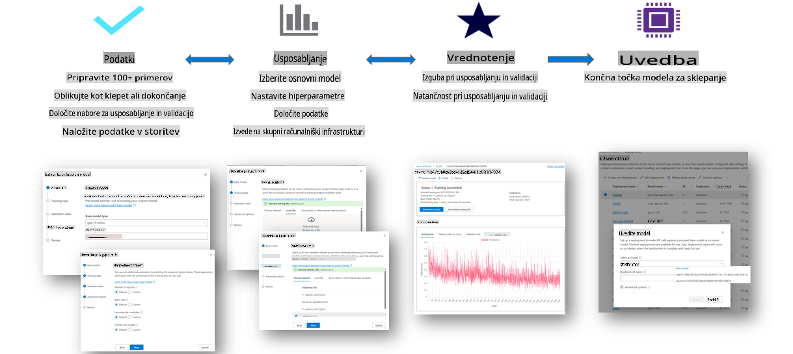

### Ustvarjanje novega projekta

1. Prijavite se v [Azure AI Foundry](https://ai.azure.com).

1. Izberite **+New project**, da ustvarite nov projekt v Azure AI Foundry.

    

1. Izvedite naslednje naloge:

    - Ime projekta (**Hub name**) mora biti edinstveno.
    - Izberite **Hub**, ki ga želite uporabiti (po potrebi ustvarite novega).

    

1. Za ustvarjanje novega vozlišča izvedite naslednje naloge:

    - Vnesite **Hub name**, ki mora biti edinstveno.
    - Izberite svojo Azure **Subscription**.
    - Izberite **Resource group**, ki jo želite uporabiti (po potrebi ustvarite novo).
    - Izberite **Location**, ki ga želite uporabiti.
    - Izberite **Connect Azure AI Services**, ki ga želite uporabiti (po potrebi ustvarite novega).
    - Izberite **Connect Azure AI Search** in izberite **Skip connecting**.

    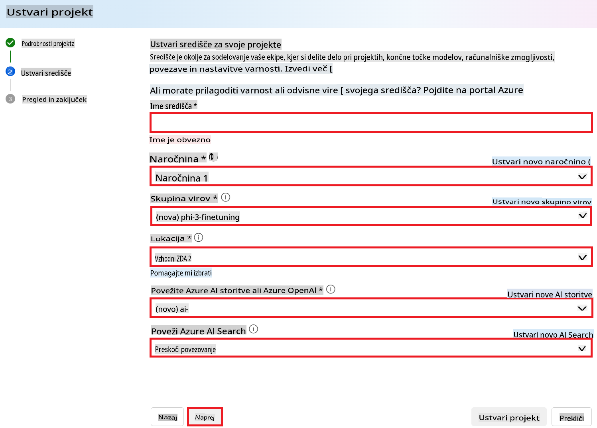

1. Izberite **Next**.
1. Izberite **Create a project**.

### Priprava podatkov

Pred prilagoditvijo zberite ali ustvarite nabor podatkov, ki je pomemben za vašo nalogo, kot so navodila za pogovor, vprašanja in odgovori ali katerikoli drugi relevantni besedilni podatki. Očistite in predhodno obdelajte te podatke z odstranitvijo šuma, obravnavo manjkajočih vrednosti in tokenizacijo besedila.

### Prilagoditev modelov Phi-3 v Azure AI Foundry

> [!NOTE]
> Prilagoditev modelov Phi-3 je trenutno podprta v projektih, lociranih v East US 2.

1. Izberite **Model catalog** v levem zavihku.

1. V iskalno vrstico vnesite *phi-3* in izberite model phi-3, ki ga želite uporabiti.

    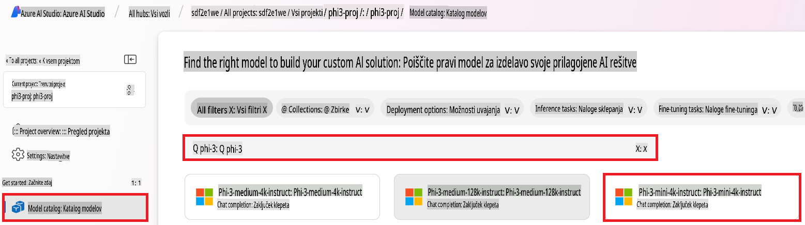

1. Izberite **Fine-tune**.

    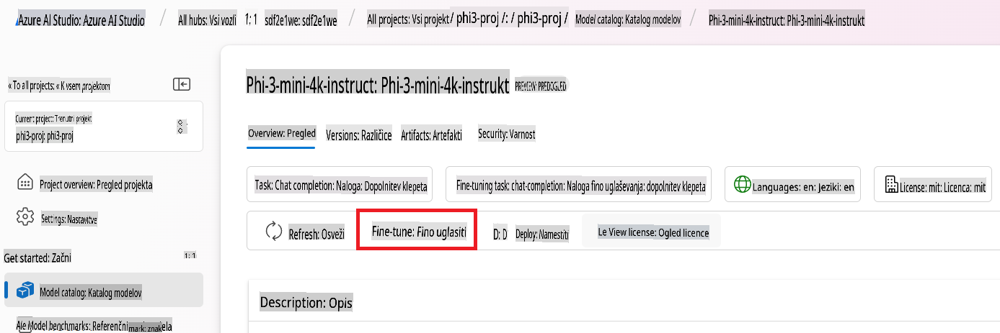

1. Vnesite ime za **Fine-tuned model name**.

    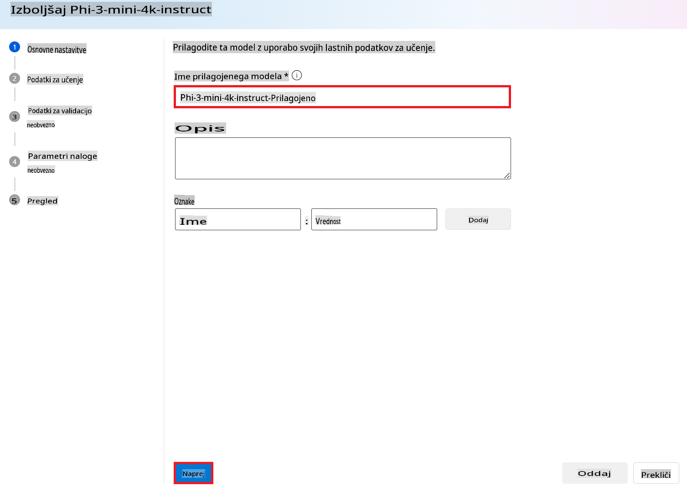

1. Izberite **Next**.

1. Izvedite naslednje naloge:

    - Izberite **task type** kot **Chat completion**.
    - Izberite **Training data**, ki ga želite uporabiti. Naložite ga lahko prek podatkov Azure AI Foundry ali iz lokalnega okolja.

    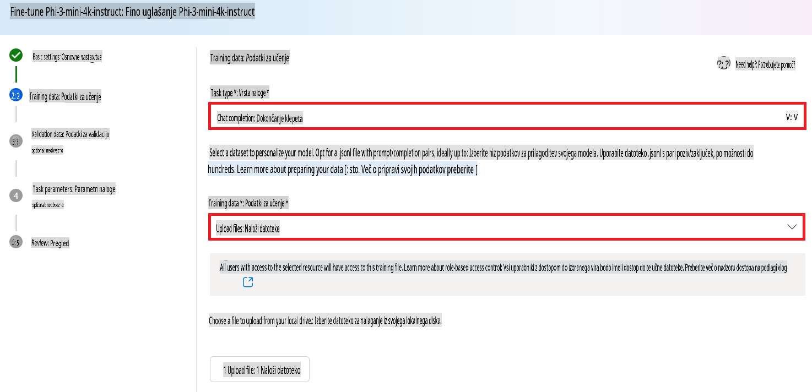

1. Izberite **Next**.

1. Naložite **Validation data**, ki ga želite uporabiti, ali izberite **Automatic split of training data**.

    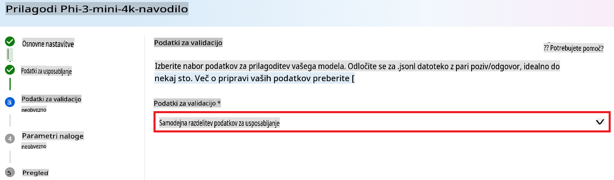

1. Izberite **Next**.

1. Izvedite naslednje naloge:

    - Izberite **Batch size multiplier**, ki ga želite uporabiti.
    - Izberite **Learning rate**, ki ga želite uporabiti.
    - Izberite **Epochs**, ki jih želite uporabiti.

    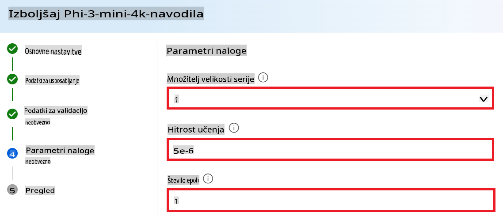

1. Izberite **Submit**, da začnete proces prilagoditve.

    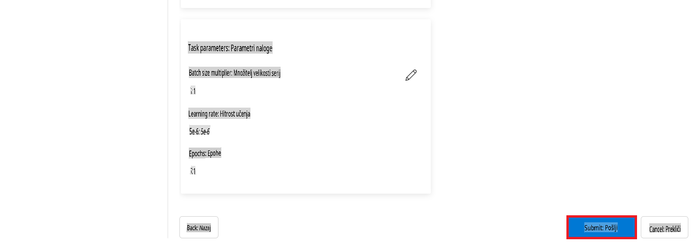

1. Ko je vaš model prilagojen, bo stanje prikazano kot **Completed**, kot je prikazano na spodnji sliki. Zdaj lahko model uvedete in ga uporabite v svoji aplikaciji, v igrišču ali v pretoku pozivov. Za več informacij si oglejte [Kako uvesti modele družine Phi-3 z Azure AI Foundry](https://learn.microsoft.com/azure/ai-studio/how-to/deploy-models-phi-3?tabs=phi-3-5&pivots=programming-language-python).

    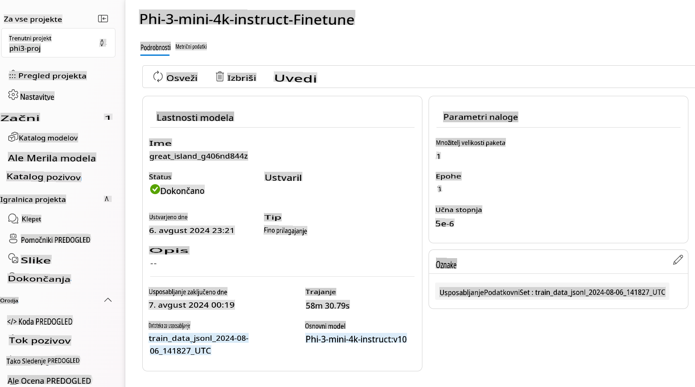

> [!NOTE]
> Za podrobnejše informacije o prilagoditvi Phi-3 obiščite [Fine-tune Phi-3 models in Azure AI Foundry](https://learn.microsoft.com/azure/ai-studio/how-to/fine-tune-phi-3?tabs=phi-3-mini).

## Čiščenje prilagojenih modelov

Prilagojen model lahko izbrišete s seznama modelov za prilagoditev v [Azure AI Foundry](https://ai.azure.com) ali s strani s podrobnostmi modela. Izberite prilagojen model, ki ga želite izbrisati, na strani za prilagoditev in nato izberite gumb Delete, da izbrišete prilagojen model.

> [!NOTE]
> Ne morete izbrisati prilagojenega modela, če ima obstoječo uvedbo. Najprej morate izbrisati uvedbo modela, preden lahko izbrišete prilagojen model.

## Stroški in kvote

### Premisleki o stroških in kvotah za modele Phi-3, prilagojene kot storitev

Phi modeli, prilagojeni kot storitev, so na voljo pri Microsoftu in integrirani z Azure AI Foundry za uporabo. Cenik lahko najdete pri [uvajanju](https://learn.microsoft.com/azure/ai-studio/how-to/deploy-models-phi-3?tabs=phi-3-5&pivots=programming-language-python) ali prilagajanju modelov pod zavihkom Pricing and terms v čarovniku za uvedbo.

## Filtriranje vsebine

Modeli, uvedeni kot storitev s plačilom po uporabi, so zaščiteni z Azure AI Content Safety. Ko so uvedeni na realnočasovne končne točke, se lahko odločite za izklop te funkcionalnosti. Z omogočenim Azure AI content safety tako vhodni pozivi kot zaključki preidejo skozi niz klasifikacijskih modelov, namenjenih zaznavanju in preprečevanju škodljive vsebine. Sistem filtriranja vsebine zaznava in ukrepa glede določenih kategorij potencialno škodljive vsebine tako v vhodnih pozivih kot v zaključkih. Več o tem lahko preberete na [Azure AI Content Safety](https://learn.microsoft.com/azure/ai-studio/concepts/content-filtering).

**Konfiguracija prilagoditve**

Hiperparametri: Določite hiperparametre, kot so hitrost učenja, velikost paketa in število učnih epoch.

**Funkcija izgube**

Izberite ustrezno funkcijo izgube za svojo nalogo (npr. cross-entropy).

**Optimizator**

Izberite optimizator (npr. Adam) za posodobitve gradientov med učenjem.

**Postopek prilagoditve**

- Naložite predhodno usposobljen model: Naložite kontrolno točko Phi-3 Mini.
- Dodajte prilagojene plasti: Dodajte plasti za specifične naloge (npr. glavo za klasifikacijo za navodila za pogovor).

**Usposobite model**
Prilagodite model z uporabo pripravljenega nabora podatkov. Spremljajte napredek učenja in po potrebi prilagodite hiperparametre.

**Vrednotenje in validacija**

Validacijski nabor: Razdelite svoje podatke na učni in validacijski nabor.

**Ocenite zmogljivost**

Uporabite metrike, kot so natančnost, F1-ocena ali perplexity, za oceno zmogljivosti modela.

## Shranjevanje prilagojenega modela

**Kontrolna točka**
Shranjeni model prilagoditve za prihodnjo uporabo.

## Uvedba

- Uvedba kot spletna storitev: Uvedite prilagojen model kot spletno storitev v Azure AI Foundry.
- Testiranje končne točke: Pošljite testna vprašanja na uvedeno končno točko, da preverite njeno funkcionalnost.

## Iteracija in izboljšave

Iteracija: Če zmogljivost ni zadovoljiva, iterirajte z nastavitvijo hiperparametrov, dodajanjem več podatkov ali daljšim prilagajanjem.

## Spremljanje in izboljševanje

Neprestano spremljajte vedenje modela in ga po potrebi izboljšajte.

## Prilagoditev in razširitev

Prilagojene naloge: Phi-3 Mini lahko prilagodite za različne naloge, ki presegajo navodila za pogovor. Raziskujte druge primere uporabe!
Eksperimentirajte: Preizkusite različne arhitekture, kombinacije plasti in tehnike za izboljšanje zmogljivosti.

> [!NOTE]
> Prilagoditev je iterativen proces. Eksperimentirajte, učite se in prilagodite svoj model, da dosežete najboljše rezultate za svojo specifično nalogo!

**Izjava o omejitvi odgovornosti**:  
Ta dokument je bil preveden s pomočjo storitev strojnega prevajanja z umetno inteligenco. Čeprav si prizadevamo za natančnost, vas prosimo, da upoštevate, da lahko avtomatizirani prevodi vsebujejo napake ali netočnosti. Izvirni dokument v njegovem izvirnem jeziku je treba obravnavati kot avtoritativni vir. Za ključne informacije priporočamo profesionalni človeški prevod. Ne prevzemamo odgovornosti za morebitne nesporazume ali napačne razlage, ki izhajajo iz uporabe tega prevoda.