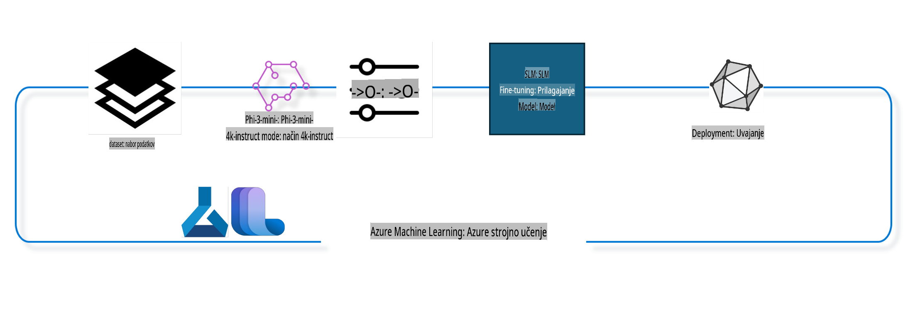

## Kako uporabiti komponente za zaključevanje pogovorov iz sistemskega registra Azure ML za fino nastavitev modela

V tem primeru bomo izvedli fino nastavitev modela Phi-3-mini-4k-instruct, da zaključimo pogovor med dvema osebama z uporabo podatkovnega nabora ultrachat_200k.



Primer bo pokazal, kako izvesti fino nastavitev z uporabo Azure ML SDK in Pythona ter nato razmestiti fino nastavljen model na spletno končno točko za sklepanje v realnem času.

### Podatki za učenje

Uporabili bomo podatkovni nabor ultrachat_200k. To je močno filtrirana različica podatkovnega nabora UltraChat, ki je bil uporabljen za učenje modela Zephyr-7B-β, naprednega 7B modela za pogovor.

### Model

Za prikaz, kako lahko uporabnik fino nastavi model za nalogo zaključevanja pogovorov, bomo uporabili model Phi-3-mini-4k-instruct. Če ste ta zvezek odprli s specifične kartice modela, ne pozabite zamenjati imena specifičnega modela.

### Naloge

- Izberite model za fino nastavitev.
- Izberite in raziščite podatke za učenje.
- Konfigurirajte nalogo za fino nastavitev.
- Zaženite nalogo za fino nastavitev.
- Preglejte metrike učenja in evalvacije.
- Registrirajte fino nastavljen model.
- Razmestite fino nastavljen model za sklepanje v realnem času.
- Počistite vire.

## 1. Nastavitev predpogojev

- Namestite odvisnosti.
- Povežite se z delovnim prostorom AzureML. Več o tem si preberite pri nastavitvi avtentikacije SDK. Zamenjajte <WORKSPACE_NAME>, <RESOURCE_GROUP> in <SUBSCRIPTION_ID> spodaj.
- Povežite se s sistemskim registrom AzureML.
- Nastavite opcijsko ime eksperimenta.
- Preverite ali ustvarite računsko enoto.

> [!NOTE]
> Zahteve za en sam GPU vozlišče lahko vključujejo več GPU kartic. Na primer, eno vozlišče Standard_NC24rs_v3 ima 4 NVIDIA V100 GPU-je, medtem ko ima Standard_NC12s_v3 2 NVIDIA V100 GPU-ja. Za te informacije si oglejte dokumentacijo. Število GPU kartic na vozlišče je nastavljeno v parametru gpus_per_node spodaj. Pravilna nastavitev te vrednosti bo zagotovila izkoriščanje vseh GPU-jev na vozlišču. Priporočene konfiguracije GPU računalniških enot najdete tukaj in tukaj.

### Python knjižnice

Namestite odvisnosti z zagonom spodnje celice. To ni opcijski korak, če delate v novem okolju.

```bash
pip install azure-ai-ml
pip install azure-identity
pip install datasets==2.9.0
pip install mlflow
pip install azureml-mlflow
```

### Interakcija z Azure ML

1. Ta Python skripta se uporablja za interakcijo s storitvijo Azure Machine Learning (Azure ML). Tukaj je povzetek, kaj počne:

    - Uvozi potrebne module iz paketov azure.ai.ml, azure.identity in azure.ai.ml.entities. Prav tako uvozi modul time.

    - Poskusi se avtenticirati z uporabo DefaultAzureCredential(), ki zagotavlja poenostavljeno izkušnjo avtentikacije za hitro razvijanje aplikacij v oblaku Azure. Če to ne uspe, preklopi na InteractiveBrowserCredential(), ki ponudi interaktivni prijavni poziv.

    - Nato poskuša ustvariti instanco MLClient z uporabo metode from_config, ki prebere konfiguracijo iz privzete konfiguracijske datoteke (config.json). Če to ne uspe, ročno zagotovi subscription_id, resource_group_name in workspace_name za ustvarjanje MLClient instance.

    - Ustvari še eno instanco MLClient za Azure ML register z imenom "azureml". Ta register je mesto, kjer so shranjeni modeli, cevovodi za fino nastavitev in okolja.

    - Nastavi ime eksperimenta na "chat_completion_Phi-3-mini-4k-instruct".

    - Ustvari edinstven časovni žig s pretvorbo trenutnega časa (v sekundah od epohe kot plavajoče število) v celo število in nato v niz. Ta časovni žig se lahko uporabi za ustvarjanje edinstvenih imen in različic.

    ```python
    # Import necessary modules from Azure ML and Azure Identity
    from azure.ai.ml import MLClient
    from azure.identity import (
        DefaultAzureCredential,
        InteractiveBrowserCredential,
    )
    from azure.ai.ml.entities import AmlCompute
    import time  # Import time module
    
    # Try to authenticate using DefaultAzureCredential
    try:
        credential = DefaultAzureCredential()
        credential.get_token("https://management.azure.com/.default")
    except Exception as ex:  # If DefaultAzureCredential fails, use InteractiveBrowserCredential
        credential = InteractiveBrowserCredential()
    
    # Try to create an MLClient instance using the default config file
    try:
        workspace_ml_client = MLClient.from_config(credential=credential)
    except:  # If that fails, create an MLClient instance by manually providing the details
        workspace_ml_client = MLClient(
            credential,
            subscription_id="<SUBSCRIPTION_ID>",
            resource_group_name="<RESOURCE_GROUP>",
            workspace_name="<WORKSPACE_NAME>",
        )
    
    # Create another MLClient instance for the Azure ML registry named "azureml"
    # This registry is where models, fine-tuning pipelines, and environments are stored
    registry_ml_client = MLClient(credential, registry_name="azureml")
    
    # Set the experiment name
    experiment_name = "chat_completion_Phi-3-mini-4k-instruct"
    
    # Generate a unique timestamp that can be used for names and versions that need to be unique
    timestamp = str(int(time.time()))
    ```

## 2. Izberite osnovni model za fino nastavitev

1. Phi-3-mini-4k-instruct je lahek, napreden odprti model s 3,8 milijardami parametrov, zgrajen na podatkovnih nizih, uporabljenih za Phi-2. Model pripada družini modelov Phi-3, različica Mini pa je na voljo v dveh različicah, 4K in 128K, kar predstavlja dolžino konteksta (v tokenih), ki jo lahko podpira. Model moramo fino nastaviti za naš specifični namen, da ga lahko uporabimo. Te modele lahko prebrskate v katalogu modelov v AzureML Studiu, pri čemer filtrirate po nalogi zaključevanja pogovorov. V tem primeru uporabimo model Phi-3-mini-4k-instruct. Če ste odprli ta zvezek za drug model, ustrezno zamenjajte ime in različico modela.

    > [!NOTE]
    > lastnost id modela. To bo posredovano kot vhod za nalogo fine nastavitve. To je na voljo tudi kot polje Asset ID na strani s podrobnostmi modela v katalogu modelov AzureML Studio.

2. Ta Python skripta komunicira s storitvijo Azure Machine Learning (Azure ML). Tukaj je povzetek, kaj počne:

    - Nastavi model_name na "Phi-3-mini-4k-instruct".

    - Z metodo get lastnosti models objekta registry_ml_client pridobi najnovejšo različico modela z določenim imenom iz registra Azure ML. Metoda get je poklicana z dvema argumentoma: imenom modela in oznako, ki določa, da je treba pridobiti najnovejšo različico modela.

    - Na konzolo izpiše sporočilo, ki označuje ime, različico in id modela, ki bo uporabljen za fino nastavitev. Metoda format niza se uporablja za vstavljanje imena, različice in id modela v sporočilo. Ime, različica in id modela so dostopni kot lastnosti objekta foundation_model.

    ```python
    # Set the model name
    model_name = "Phi-3-mini-4k-instruct"
    
    # Get the latest version of the model from the Azure ML registry
    foundation_model = registry_ml_client.models.get(model_name, label="latest")
    
    # Print the model name, version, and id
    # This information is useful for tracking and debugging
    print(
        "\n\nUsing model name: {0}, version: {1}, id: {2} for fine tuning".format(
            foundation_model.name, foundation_model.version, foundation_model.id
        )
    )
    ```

## 3. Ustvarite računsko enoto za uporabo z nalogo

Naloga za fino nastavitev deluje SAMO z GPU računalniškimi enotami. Velikost računalniške enote je odvisna od velikosti modela in v večini primerov je težko določiti pravo računalniško enoto za nalogo. V tej celici uporabnika vodimo k izbiri prave računalniške enote za nalogo.

> [!NOTE]
> Spodaj navedene računalniške enote delujejo z najbolj optimizirano konfiguracijo. Kakršne koli spremembe konfiguracije lahko privedejo do napake Cuda Out Of Memory. V takšnih primerih poskusite nadgraditi računalniško enoto na večjo velikost.

> [!NOTE]
> Pri izbiri compute_cluster_size spodaj se prepričajte, da je računalniška enota na voljo v vaši skupini virov. Če določena računalniška enota ni na voljo, lahko oddate zahtevo za dostop do računalniških virov.

### Preverjanje podpore modela za fino nastavitev

1. Ta Python skripta komunicira z modelom Azure Machine Learning (Azure ML). Tukaj je povzetek, kaj počne:

    - Uvozi modul ast, ki zagotavlja funkcije za obdelavo dreves gramatike abstraktne sintakse Pythona.

    - Preveri, ali objekt foundation_model (ki predstavlja model v Azure ML) vsebuje oznako z imenom finetune_compute_allow_list. Oznake v Azure ML so pari ključ-vrednost, ki jih lahko ustvarite in uporabite za filtriranje in razvrščanje modelov.

    - Če je oznaka finetune_compute_allow_list prisotna, uporabi funkcijo ast.literal_eval za varno pretvorbo vrednosti oznake (niza) v Python seznam. Ta seznam je nato dodeljen spremenljivki computes_allow_list. Nato izpiše sporočilo, ki označuje, da je treba ustvariti računalniško enoto s seznama.

    - Če oznaka finetune_compute_allow_list ni prisotna, nastavi computes_allow_list na None in izpiše sporočilo, ki označuje, da oznaka finetune_compute_allow_list ni del oznak modela.

    - Skripta torej preverja določeno oznako v metapodatkih modela, pretvarja vrednost oznake v seznam, če obstaja, in ustrezno zagotavlja povratne informacije uporabniku.

    ```python
    # Import the ast module, which provides functions to process trees of the Python abstract syntax grammar
    import ast
    
    # Check if the 'finetune_compute_allow_list' tag is present in the model's tags
    if "finetune_compute_allow_list" in foundation_model.tags:
        # If the tag is present, use ast.literal_eval to safely parse the tag's value (a string) into a Python list
        computes_allow_list = ast.literal_eval(
            foundation_model.tags["finetune_compute_allow_list"]
        )  # convert string to python list
        # Print a message indicating that a compute should be created from the list
        print(f"Please create a compute from the above list - {computes_allow_list}")
    else:
        # If the tag is not present, set computes_allow_list to None
        computes_allow_list = None
        # Print a message indicating that the 'finetune_compute_allow_list' tag is not part of the model's tags
        print("`finetune_compute_allow_list` is not part of model tags")
    ```

### Preverjanje računalniške instance

1. Ta Python skripta komunicira s storitvijo Azure Machine Learning (Azure ML) in izvaja več preverjanj na računalniški instanci. Tukaj je povzetek, kaj počne:

    - Poskusi pridobiti računalniško instanco z imenom, shranjenim v compute_cluster, iz delovnega prostora Azure ML. Če je stanje zagotavljanja računalniške instance "failed", sproži napako ValueError.

    - Preveri, ali computes_allow_list ni None. Če ni, pretvori vse velikosti računalniških enot na seznamu v male črke in preveri, ali je velikost trenutne računalniške instance na seznamu. Če ni, sproži napako ValueError.

    - Če je computes_allow_list None, preveri, ali je velikost računalniške instance na seznamu nepodprtih velikosti GPU VM. Če je, sproži napako ValueError.

    - Pridobi seznam vseh razpoložljivih velikosti računalniških enot v delovnem prostoru. Nato iterira čez ta seznam in za vsako velikost računalniške enote preveri, ali se njeno ime ujema z velikostjo trenutne računalniške instance. Če se ujema, pridobi število GPU-jev za to velikost računalniške enote in nastavi gpu_count_found na True.

    - Če je gpu_count_found True, izpiše število GPU-jev v računalniški instanci. Če je gpu_count_found False, sproži napako ValueError.

    - Skripta torej izvaja več preverjanj na računalniški instanci v delovnem prostoru Azure ML, vključno s preverjanjem stanja zagotavljanja, velikosti v primerjavi z dovoljenim ali prepovedanim seznamom in številom GPU-jev, ki jih ima.

    ```python
    # Print the exception message
    print(e)
    # Raise a ValueError if the compute size is not available in the workspace
    raise ValueError(
        f"WARNING! Compute size {compute_cluster_size} not available in workspace"
    )
    
    # Retrieve the compute instance from the Azure ML workspace
    compute = workspace_ml_client.compute.get(compute_cluster)
    # Check if the provisioning state of the compute instance is "failed"
    if compute.provisioning_state.lower() == "failed":
        # Raise a ValueError if the provisioning state is "failed"
        raise ValueError(
            f"Provisioning failed, Compute '{compute_cluster}' is in failed state. "
            f"please try creating a different compute"
        )
    
    # Check if computes_allow_list is not None
    if computes_allow_list is not None:
        # Convert all compute sizes in computes_allow_list to lowercase
        computes_allow_list_lower_case = [x.lower() for x in computes_allow_list]
        # Check if the size of the compute instance is in computes_allow_list_lower_case
        if compute.size.lower() not in computes_allow_list_lower_case:
            # Raise a ValueError if the size of the compute instance is not in computes_allow_list_lower_case
            raise ValueError(
                f"VM size {compute.size} is not in the allow-listed computes for finetuning"
            )
    else:
        # Define a list of unsupported GPU VM sizes
        unsupported_gpu_vm_list = [
            "standard_nc6",
            "standard_nc12",
            "standard_nc24",
            "standard_nc24r",
        ]
        # Check if the size of the compute instance is in unsupported_gpu_vm_list
        if compute.size.lower() in unsupported_gpu_vm_list:
            # Raise a ValueError if the size of the compute instance is in unsupported_gpu_vm_list
            raise ValueError(
                f"VM size {compute.size} is currently not supported for finetuning"
            )
    
    # Initialize a flag to check if the number of GPUs in the compute instance has been found
    gpu_count_found = False
    # Retrieve a list of all available compute sizes in the workspace
    workspace_compute_sku_list = workspace_ml_client.compute.list_sizes()
    available_sku_sizes = []
    # Iterate over the list of available compute sizes
    for compute_sku in workspace_compute_sku_list:
        available_sku_sizes.append(compute_sku.name)
        # Check if the name of the compute size matches the size of the compute instance
        if compute_sku.name.lower() == compute.size.lower():
            # If it does, retrieve the number of GPUs for that compute size and set gpu_count_found to True
            gpus_per_node = compute_sku.gpus
            gpu_count_found = True
    # If gpu_count_found is True, print the number of GPUs in the compute instance
    if gpu_count_found:
        print(f"Number of GPU's in compute {compute.size}: {gpus_per_node}")
    else:
        # If gpu_count_found is False, raise a ValueError
        raise ValueError(
            f"Number of GPU's in compute {compute.size} not found. Available skus are: {available_sku_sizes}."
            f"This should not happen. Please check the selected compute cluster: {compute_cluster} and try again."
        )
    ```
usposabljanje cevovoda na podlagi različnih parametrov in nato izpis imena prikaza. ```python
    # Define a function to generate a display name for the training pipeline
    def get_pipeline_display_name():
        # Calculate the total batch size by multiplying the per-device batch size, the number of gradient accumulation steps, the number of GPUs per node, and the number of nodes used for fine-tuning
        batch_size = (
            int(finetune_parameters.get("per_device_train_batch_size", 1))
            * int(finetune_parameters.get("gradient_accumulation_steps", 1))
            * int(gpus_per_node)
            * int(finetune_parameters.get("num_nodes_finetune", 1))
        )
        # Retrieve the learning rate scheduler type
        scheduler = finetune_parameters.get("lr_scheduler_type", "linear")
        # Retrieve whether DeepSpeed is applied
        deepspeed = finetune_parameters.get("apply_deepspeed", "false")
        # Retrieve the DeepSpeed stage
        ds_stage = finetune_parameters.get("deepspeed_stage", "2")
        # If DeepSpeed is applied, include "ds" followed by the DeepSpeed stage in the display name; if not, include "nods"
        if deepspeed == "true":
            ds_string = f"ds{ds_stage}"
        else:
            ds_string = "nods"
        # Retrieve whether Layer-wise Relevance Propagation (LoRa) is applied
        lora = finetune_parameters.get("apply_lora", "false")
        # If LoRa is applied, include "lora" in the display name; if not, include "nolora"
        if lora == "true":
            lora_string = "lora"
        else:
            lora_string = "nolora"
        # Retrieve the limit on the number of model checkpoints to keep
        save_limit = finetune_parameters.get("save_total_limit", -1)
        # Retrieve the maximum sequence length
        seq_len = finetune_parameters.get("max_seq_length", -1)
        # Construct the display name by concatenating all these parameters, separated by hyphens
        return (
            model_name
            + "-"
            + "ultrachat"
            + "-"
            + f"bs{batch_size}"
            + "-"
            + f"{scheduler}"
            + "-"
            + ds_string
            + "-"
            + lora_string
            + f"-save_limit{save_limit}"
            + f"-seqlen{seq_len}"
        )
    
    # Call the function to generate the display name
    pipeline_display_name = get_pipeline_display_name()
    # Print the display name
    print(f"Display name used for the run: {pipeline_display_name}")
    ```

### Konfiguracija cevovoda

Ta Python skripta definira in konfigurira cevovod za strojno učenje z uporabo Azure Machine Learning SDK. Tukaj je povzetek, kaj počne:

1. Uvozi potrebne module iz Azure AI ML SDK.  
2. Pridobi komponento cevovoda z imenom "chat_completion_pipeline" iz registra.  
3. Definira cevovodno opravilo z uporabo `@pipeline` decorator and the function `create_pipeline`. The name of the pipeline is set to `pipeline_display_name`.

1. Inside the `create_pipeline` function, it initializes the fetched pipeline component with various parameters, including the model path, compute clusters for different stages, dataset splits for training and testing, the number of GPUs to use for fine-tuning, and other fine-tuning parameters.

1. It maps the output of the fine-tuning job to the output of the pipeline job. This is done so that the fine-tuned model can be easily registered, which is required to deploy the model to an online or batch endpoint.

1. It creates an instance of the pipeline by calling the `create_pipeline` function.

1. It sets the `force_rerun` setting of the pipeline to `True`, meaning that cached results from previous jobs will not be used.

1. It sets the `continue_on_step_failure` setting of the pipeline to `False`, kar pomeni, da se cevovod ustavi, če kateri koli korak ne uspe.  
4. Skratka, ta skripta definira in konfigurira cevovod za strojno učenje za nalogo dokončanja klepeta z uporabo Azure Machine Learning SDK.  

```python
    # Import necessary modules from the Azure AI ML SDK
    from azure.ai.ml.dsl import pipeline
    from azure.ai.ml import Input
    
    # Fetch the pipeline component named "chat_completion_pipeline" from the registry
    pipeline_component_func = registry_ml_client.components.get(
        name="chat_completion_pipeline", label="latest"
    )
    
    # Define the pipeline job using the @pipeline decorator and the function create_pipeline
    # The name of the pipeline is set to pipeline_display_name
    @pipeline(name=pipeline_display_name)
    def create_pipeline():
        # Initialize the fetched pipeline component with various parameters
        # These include the model path, compute clusters for different stages, dataset splits for training and testing, the number of GPUs to use for fine-tuning, and other fine-tuning parameters
        chat_completion_pipeline = pipeline_component_func(
            mlflow_model_path=foundation_model.id,
            compute_model_import=compute_cluster,
            compute_preprocess=compute_cluster,
            compute_finetune=compute_cluster,
            compute_model_evaluation=compute_cluster,
            # Map the dataset splits to parameters
            train_file_path=Input(
                type="uri_file", path="./ultrachat_200k_dataset/train_sft.jsonl"
            ),
            test_file_path=Input(
                type="uri_file", path="./ultrachat_200k_dataset/test_sft.jsonl"
            ),
            # Training settings
            number_of_gpu_to_use_finetuning=gpus_per_node,  # Set to the number of GPUs available in the compute
            **finetune_parameters
        )
        return {
            # Map the output of the fine tuning job to the output of pipeline job
            # This is done so that we can easily register the fine tuned model
            # Registering the model is required to deploy the model to an online or batch endpoint
            "trained_model": chat_completion_pipeline.outputs.mlflow_model_folder
        }
    
    # Create an instance of the pipeline by calling the create_pipeline function
    pipeline_object = create_pipeline()
    
    # Don't use cached results from previous jobs
    pipeline_object.settings.force_rerun = True
    
    # Set continue on step failure to False
    # This means that the pipeline will stop if any step fails
    pipeline_object.settings.continue_on_step_failure = False
    ```

### Oddaja opravila

1. Ta Python skripta odda opravilo cevovoda za strojno učenje v delovni prostor Azure Machine Learning in nato počaka, da se opravilo zaključi. Tukaj je povzetek, kaj počne:  

   - Pokliče metodo `create_or_update` objekta `jobs` v `workspace_ml_client`, da odda opravilo cevovoda. Cevovod, ki se bo izvedel, je določen z `pipeline_object`, eksperiment, pod katerim se izvaja opravilo, pa je določen z `experiment_name`.  
   - Nato pokliče metodo `stream` objekta `jobs` v `workspace_ml_client`, da počaka na dokončanje opravila cevovoda. Opravilo, na katerega čaka, je določeno z atributom `name` objekta `pipeline_job`.  
   - Skratka, ta skripta odda opravilo cevovoda za strojno učenje v delovni prostor Azure Machine Learning in nato počaka, da se opravilo zaključi.  

```python
    # Submit the pipeline job to the Azure Machine Learning workspace
    # The pipeline to be run is specified by pipeline_object
    # The experiment under which the job is run is specified by experiment_name
    pipeline_job = workspace_ml_client.jobs.create_or_update(
        pipeline_object, experiment_name=experiment_name
    )
    
    # Wait for the pipeline job to complete
    # The job to wait for is specified by the name attribute of the pipeline_job object
    workspace_ml_client.jobs.stream(pipeline_job.name)
    ```

## 6. Registracija fino uglašenega modela v delovni prostor

Registrirali bomo model iz izhoda opravila fino uglaševanja. S tem bomo sledili izvoru med fino uglašenim modelom in opravilo fino uglaševanja. Opravilo fino uglaševanja pa sledi izvoru osnovnega modela, podatkov in kode za usposabljanje.

### Registracija ML modela

1. Ta Python skripta registrira model strojnega učenja, ki je bil usposobljen v cevovodu Azure Machine Learning. Tukaj je povzetek, kaj počne:  

   - Uvozi potrebne module iz Azure AI ML SDK.  
   - Preveri, ali je izhod `trained_model` na voljo iz opravila cevovoda, tako da pokliče metodo `get` objekta `jobs` v `workspace_ml_client` in dostopa do njegovega atributa `outputs`.  
   - Sestavi pot do usposobljenega modela s formatiranjem niza z imenom opravila cevovoda in imenom izhoda ("trained_model").  
   - Določi ime za fino uglašen model, tako da doda "-ultrachat-200k" izvirnemu imenu modela in zamenja poševnice z vezaji.  
   - Pripravi registracijo modela z ustvarjanjem objekta `Model` z različnimi parametri, vključno s potjo do modela, tipom modela (MLflow model), imenom in različico modela ter opisom modela.  
   - Registrira model, tako da pokliče metodo `create_or_update` objekta `models` v `workspace_ml_client` z objektom `Model` kot argumentom.  
   - Izpiše registrirani model.  

   - Skratka, ta skripta registrira model strojnega učenja, ki je bil usposobljen v cevovodu Azure Machine Learning.  

```python
    # Import necessary modules from the Azure AI ML SDK
    from azure.ai.ml.entities import Model
    from azure.ai.ml.constants import AssetTypes
    
    # Check if the `trained_model` output is available from the pipeline job
    print("pipeline job outputs: ", workspace_ml_client.jobs.get(pipeline_job.name).outputs)
    
    # Construct a path to the trained model by formatting a string with the name of the pipeline job and the name of the output ("trained_model")
    model_path_from_job = "azureml://jobs/{0}/outputs/{1}".format(
        pipeline_job.name, "trained_model"
    )
    
    # Define a name for the fine-tuned model by appending "-ultrachat-200k" to the original model name and replacing any slashes with hyphens
    finetuned_model_name = model_name + "-ultrachat-200k"
    finetuned_model_name = finetuned_model_name.replace("/", "-")
    
    print("path to register model: ", model_path_from_job)
    
    # Prepare to register the model by creating a Model object with various parameters
    # These include the path to the model, the type of the model (MLflow model), the name and version of the model, and a description of the model
    prepare_to_register_model = Model(
        path=model_path_from_job,
        type=AssetTypes.MLFLOW_MODEL,
        name=finetuned_model_name,
        version=timestamp,  # Use timestamp as version to avoid version conflict
        description=model_name + " fine tuned model for ultrachat 200k chat-completion",
    )
    
    print("prepare to register model: \n", prepare_to_register_model)
    
    # Register the model by calling the create_or_update method of the models object in the workspace_ml_client with the Model object as the argument
    registered_model = workspace_ml_client.models.create_or_update(
        prepare_to_register_model
    )
    
    # Print the registered model
    print("registered model: \n", registered_model)
    ```

## 7. Namestitev fino uglašenega modela na spletno končno točko

Spletne končne točke zagotavljajo trajen REST API, ki ga je mogoče integrirati z aplikacijami, ki potrebujejo uporabo modela.

### Upravljanje končne točke

1. Ta Python skripta ustvari upravljano spletno končno točko v Azure Machine Learning za registrirani model. Tukaj je povzetek, kaj počne:  

   - Uvozi potrebne module iz Azure AI ML SDK.  
   - Določi edinstveno ime za spletno končno točko, tako da doda časovni žig nizu "ultrachat-completion-".  
   - Pripravi ustvarjanje spletne končne točke z ustvarjanjem objekta `ManagedOnlineEndpoint` z različnimi parametri, vključno z imenom končne točke, opisom končne točke in načinom preverjanja pristnosti ("key").  
   - Ustvari spletno končno točko, tako da pokliče metodo `begin_create_or_update` objekta `workspace_ml_client` z objektom `ManagedOnlineEndpoint` kot argumentom. Nato počaka, da se operacija ustvarjanja zaključi, tako da pokliče metodo `wait`.  

   - Skratka, ta skripta ustvari upravljano spletno končno točko v Azure Machine Learning za registrirani model.  

```python
    # Import necessary modules from the Azure AI ML SDK
    from azure.ai.ml.entities import (
        ManagedOnlineEndpoint,
        ManagedOnlineDeployment,
        ProbeSettings,
        OnlineRequestSettings,
    )
    
    # Define a unique name for the online endpoint by appending a timestamp to the string "ultrachat-completion-"
    online_endpoint_name = "ultrachat-completion-" + timestamp
    
    # Prepare to create the online endpoint by creating a ManagedOnlineEndpoint object with various parameters
    # These include the name of the endpoint, a description of the endpoint, and the authentication mode ("key")
    endpoint = ManagedOnlineEndpoint(
        name=online_endpoint_name,
        description="Online endpoint for "
        + registered_model.name
        + ", fine tuned model for ultrachat-200k-chat-completion",
        auth_mode="key",
    )
    
    # Create the online endpoint by calling the begin_create_or_update method of the workspace_ml_client with the ManagedOnlineEndpoint object as the argument
    # Then wait for the creation operation to complete by calling the wait method
    workspace_ml_client.begin_create_or_update(endpoint).wait()
    ```

> [!NOTE]  
> Tukaj lahko najdete seznam SKU-jev, ki so podprti za namestitev - [Managed online endpoints SKU list](https://learn.microsoft.com/azure/machine-learning/reference-managed-online-endpoints-vm-sku-list)  

### Namestitev ML modela

1. Ta Python skripta namesti registrirani model strojnega učenja na upravljano spletno končno točko v Azure Machine Learning. Tukaj je povzetek, kaj počne:  

   - Uvozi modul `ast`, ki zagotavlja funkcije za obdelavo dreves sintakse Python.  
   - Nastavi tip primerka za namestitev na "Standard_NC6s_v3".  
   - Preveri, ali je oznaka `inference_compute_allow_list` prisotna v osnovnem modelu. Če je, pretvori vrednost oznake iz niza v seznam Python in jo dodeli `inference_computes_allow_list`. Če ni, nastavi `inference_computes_allow_list` na `None`.  
   - Preveri, ali je določen tip primerka na seznamu dovoljenih. Če ni, izpiše sporočilo, ki uporabnika poziva, naj izbere tip primerka s seznama dovoljenih.  
   - Pripravi ustvarjanje namestitve z ustvarjanjem objekta `ManagedOnlineDeployment` z različnimi parametri, vključno z imenom namestitve, imenom končne točke, ID-jem modela, tipom in številom primerkov, nastavitvami za preverjanje živosti in nastavitvami zahtevkov.  
   - Ustvari namestitev, tako da pokliče metodo `begin_create_or_update` objekta `workspace_ml_client` z objektom `ManagedOnlineDeployment` kot argumentom. Nato počaka, da se operacija zaključi, tako da pokliče metodo `wait`.  
   - Nastavi promet končne točke tako, da usmeri 100 % prometa na namestitev "demo".  
   - Posodobi končno točko, tako da pokliče metodo `begin_create_or_update` objekta `workspace_ml_client` z objektom `endpoint` kot argumentom. Nato počaka, da se operacija zaključi, tako da pokliče metodo `result`.  

   - Skratka, ta skripta namesti registrirani model strojnega učenja na upravljano spletno končno točko v Azure Machine Learning.  

```python
    # Import the ast module, which provides functions to process trees of the Python abstract syntax grammar
    import ast
    
    # Set the instance type for the deployment
    instance_type = "Standard_NC6s_v3"
    
    # Check if the `inference_compute_allow_list` tag is present in the foundation model
    if "inference_compute_allow_list" in foundation_model.tags:
        # If it is, convert the tag value from a string to a Python list and assign it to `inference_computes_allow_list`
        inference_computes_allow_list = ast.literal_eval(
            foundation_model.tags["inference_compute_allow_list"]
        )
        print(f"Please create a compute from the above list - {computes_allow_list}")
    else:
        # If it's not, set `inference_computes_allow_list` to `None`
        inference_computes_allow_list = None
        print("`inference_compute_allow_list` is not part of model tags")
    
    # Check if the specified instance type is in the allow list
    if (
        inference_computes_allow_list is not None
        and instance_type not in inference_computes_allow_list
    ):
        print(
            f"`instance_type` is not in the allow listed compute. Please select a value from {inference_computes_allow_list}"
        )
    
    # Prepare to create the deployment by creating a `ManagedOnlineDeployment` object with various parameters
    demo_deployment = ManagedOnlineDeployment(
        name="demo",
        endpoint_name=online_endpoint_name,
        model=registered_model.id,
        instance_type=instance_type,
        instance_count=1,
        liveness_probe=ProbeSettings(initial_delay=600),
        request_settings=OnlineRequestSettings(request_timeout_ms=90000),
    )
    
    # Create the deployment by calling the `begin_create_or_update` method of the `workspace_ml_client` with the `ManagedOnlineDeployment` object as the argument
    # Then wait for the creation operation to complete by calling the `wait` method
    workspace_ml_client.online_deployments.begin_create_or_update(demo_deployment).wait()
    
    # Set the traffic of the endpoint to direct 100% of the traffic to the "demo" deployment
    endpoint.traffic = {"demo": 100}
    
    # Update the endpoint by calling the `begin_create_or_update` method of the `workspace_ml_client` with the `endpoint` object as the argument
    # Then wait for the update operation to complete by calling the `result` method
    workspace_ml_client.begin_create_or_update(endpoint).result()
    ```

## 8. Testiranje končne točke z vzorčnimi podatki

Pridobili bomo nekaj vzorčnih podatkov iz testnega nabora podatkov in jih poslali na spletno končno točko za sklepanje. Nato bomo prikazali označene rezultate skupaj z dejanskimi oznakami.  

### Branje rezultatov

1. Ta Python skripta prebere datoteko JSON Lines v pandas DataFrame, vzame naključni vzorec in ponastavi indeks. Tukaj je povzetek, kaj počne:  

   - Prebere datoteko `./ultrachat_200k_dataset/test_gen.jsonl` v pandas DataFrame. Funkcija `read_json` se uporablja z argumentom `lines=True`, ker je datoteka v formatu JSON Lines, kjer je vsaka vrstica ločen JSON objekt.  
   - Vzame naključni vzorec ene vrstice iz DataFrame. Funkcija `sample` se uporablja z argumentom `n=1`, da se določi število naključnih vrstic za izbiro.  
   - Ponastavi indeks DataFrame. Funkcija `reset_index` se uporablja z argumentom `drop=True`, da se izpusti izvirni indeks in ga nadomesti z novim indeksom privzetih celoštevilskih vrednosti.  
   - Prikaže prve 2 vrstice DataFrame z uporabo funkcije `head` z argumentom `2`. Vendar, ker DataFrame vsebuje samo eno vrstico po vzorčenju, bo prikazana le ta vrstica.  

   - Skratka, ta skripta prebere datoteko JSON Lines v pandas DataFrame, vzame naključni vzorec ene vrstice, ponastavi indeks in prikaže prvo vrstico.  

```python
    # Import pandas library
    import pandas as pd
    
    # Read the JSON Lines file './ultrachat_200k_dataset/test_gen.jsonl' into a pandas DataFrame
    # The 'lines=True' argument indicates that the file is in JSON Lines format, where each line is a separate JSON object
    test_df = pd.read_json("./ultrachat_200k_dataset/test_gen.jsonl", lines=True)
    
    # Take a random sample of 1 row from the DataFrame
    # The 'n=1' argument specifies the number of random rows to select
    test_df = test_df.sample(n=1)
    
    # Reset the index of the DataFrame
    # The 'drop=True' argument indicates that the original index should be dropped and replaced with a new index of default integer values
    # The 'inplace=True' argument indicates that the DataFrame should be modified in place (without creating a new object)
    test_df.reset_index(drop=True, inplace=True)
    
    # Display the first 2 rows of the DataFrame
    # However, since the DataFrame only contains one row after the sampling, this will only display that one row
    test_df.head(2)
    ```

### Ustvarjanje JSON objekta

1. Ta Python skripta ustvari JSON objekt s specifičnimi parametri in ga shrani v datoteko. Tukaj je povzetek, kaj počne:  

   - Uvozi modul `json`, ki zagotavlja funkcije za delo z JSON podatki.  
   - Ustvari slovar `parameters` s ključi in vrednostmi, ki predstavljajo parametre za model strojnega učenja. Ključi so "temperature", "top_p", "do_sample" in "max_new_tokens", njihove ustrezne vrednosti pa so 0.6, 0.9, True in 200.  
   - Ustvari drug slovar `test_json` z dvema ključema: "input_data" in "params". Vrednost ključa "input_data" je drug slovar s ključi "input_string" in "parameters". Vrednost "input_string" je seznam, ki vsebuje prvo sporočilo iz DataFrame `test_df`. Vrednost "parameters" je slovar `parameters`, ustvarjen prej. Vrednost "params" je prazen slovar.  
   - Odpre datoteko z imenom `sample_score.json`.  

```python
    # Import the json module, which provides functions to work with JSON data
    import json
    
    # Create a dictionary `parameters` with keys and values that represent parameters for a machine learning model
    # The keys are "temperature", "top_p", "do_sample", and "max_new_tokens", and their corresponding values are 0.6, 0.9, True, and 200 respectively
    parameters = {
        "temperature": 0.6,
        "top_p": 0.9,
        "do_sample": True,
        "max_new_tokens": 200,
    }
    
    # Create another dictionary `test_json` with two keys: "input_data" and "params"
    # The value of "input_data" is another dictionary with keys "input_string" and "parameters"
    # The value of "input_string" is a list containing the first message from the `test_df` DataFrame
    # The value of "parameters" is the `parameters` dictionary created earlier
    # The value of "params" is an empty dictionary
    test_json = {
        "input_data": {
            "input_string": [test_df["messages"][0]],
            "parameters": parameters,
        },
        "params": {},
    }
    
    # Open a file named `sample_score.json` in the `./ultrachat_200k_dataset` directory in write mode
    with open("./ultrachat_200k_dataset/sample_score.json", "w") as f:
        # Write the `test_json` dictionary to the file in JSON format using the `json.dump` function
        json.dump(test_json, f)
    ```

### Klicanje končne točke

1. Ta Python skripta pokliče spletno končno točko v Azure Machine Learning za ocenjevanje JSON datoteke. Tukaj je povzetek, kaj počne:  

   - Pokliče metodo `invoke` lastnosti `online_endpoints` objekta `workspace_ml_client`. Ta metoda se uporablja za pošiljanje zahteve spletni končni točki in pridobitev odgovora.  
   - Določi ime končne točke in namestitve z argumentoma `endpoint_name` in `deployment_name`. V tem primeru je ime končne točke shranjeno v spremenljivki `online_endpoint_name`, ime namestitve pa je "demo".  
   - Določi pot do JSON datoteke za ocenjevanje z argumentom `request_file`. V tem primeru je datoteka `./ultrachat_200k_dataset/sample_score.json`.  
   - Shrani odgovor končne točke v spremenljivko `response`.  
   - Izpiše surov odgovor.  

   - Skratka, ta skripta pokliče spletno končno točko v Azure Machine Learning za ocenjevanje JSON datoteke in izpiše odgovor.  

```python
    # Invoke the online endpoint in Azure Machine Learning to score the `sample_score.json` file
    # The `invoke` method of the `online_endpoints` property of the `workspace_ml_client` object is used to send a request to an online endpoint and get a response
    # The `endpoint_name` argument specifies the name of the endpoint, which is stored in the `online_endpoint_name` variable
    # The `deployment_name` argument specifies the name of the deployment, which is "demo"
    # The `request_file` argument specifies the path to the JSON file to be scored, which is `./ultrachat_200k_dataset/sample_score.json`
    response = workspace_ml_client.online_endpoints.invoke(
        endpoint_name=online_endpoint_name,
        deployment_name="demo",
        request_file="./ultrachat_200k_dataset/sample_score.json",
    )
    
    # Print the raw response from the endpoint
    print("raw response: \n", response, "\n")
    ```

## 9. Brisanje spletne končne točke

1. Ne pozabite izbrisati spletne končne točke, sicer bo števec obračunavanja še naprej tekel za računske vire, ki jih uporablja končna točka. Ta vrstica Python kode izbriše spletno končno točko v Azure Machine Learning. Tukaj je povzetek, kaj počne:  

   - Pokliče metodo `begin_delete` lastnosti `online_endpoints` objekta `workspace_ml_client`. Ta metoda se uporablja za začetek brisanja spletne končne točke.  
   - Določi ime končne točke za brisanje z argumentom `name`. V tem primeru je ime končne točke shranjeno v spremenljivki `online_endpoint_name`.  
   - Pokliče metodo `wait`, da počaka na dokončanje operacije brisanja. To je blokirajoča operacija, kar pomeni, da bo preprečila nadaljevanje skripte, dokler se brisanje ne zaključi.  

   - Skratka, ta vrstica kode začne brisanje spletne končne točke v Azure Machine Learning in počaka na dokončanje operacije.  

```python
    # Delete the online endpoint in Azure Machine Learning
    # The `begin_delete` method of the `online_endpoints` property of the `workspace_ml_client` object is used to start the deletion of an online endpoint
    # The `name` argument specifies the name of the endpoint to be deleted, which is stored in the `online_endpoint_name` variable
    # The `wait` method is called to wait for the deletion operation to complete. This is a blocking operation, meaning that it will prevent the script from continuing until the deletion is finished
    workspace_ml_client.online_endpoints.begin_delete(name=online_endpoint_name).wait()
    ```  

**Omejitev odgovornosti**:  
Ta dokument je bil preveden z uporabo storitev strojnega prevajanja z umetno inteligenco. Čeprav si prizadevamo za natančnost, vas opozarjamo, da lahko avtomatski prevodi vsebujejo napake ali netočnosti. Izvirni dokument v njegovem izvirnem jeziku naj velja za avtoritativni vir. Za ključne informacije je priporočljivo profesionalno človeško prevajanje. Ne prevzemamo odgovornosti za morebitna nesporazumevanja ali napačne razlage, ki izhajajo iz uporabe tega prevoda.