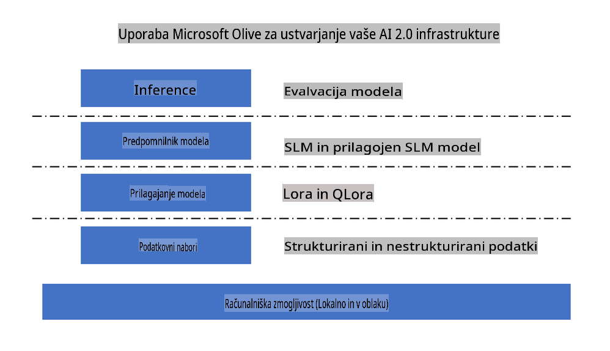
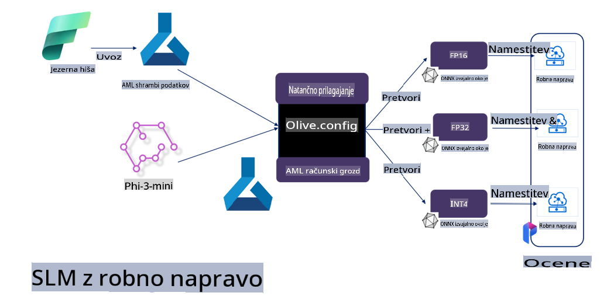

# **Fino uglaševanje Phi-3 z Microsoft Olive**

[Olive](https://github.com/microsoft/OLive?WT.mc_id=aiml-138114-kinfeylo) je enostavno orodje za optimizacijo modelov, ki upošteva strojno opremo in združuje vodilne industrijske tehnike za stiskanje, optimizacijo in prevajanje modelov.

Namenjen je poenostavitvi procesa optimizacije modelov strojnega učenja, da bi kar najbolje izkoristili specifične strojne arhitekture.

Ne glede na to, ali delate na aplikacijah v oblaku ali na robnih napravah, Olive omogoča enostavno in učinkovito optimizacijo vaših modelov.

## Ključne značilnosti:
- Olive združuje in avtomatizira tehnike optimizacije za ciljno strojno opremo.
- Ker ena sama tehnika optimizacije ne ustreza vsem scenarijem, Olive omogoča razširljivost, tako da strokovnjaki lahko vključijo svoje inovacije.

## Zmanjšanje inženirskega truda:
- Razvijalci se pogosto morajo učiti in uporabljati različne orodja, specifična za strojno opremo, da pripravijo in optimizirajo modele za uporabo.
- Olive poenostavi to izkušnjo z avtomatizacijo tehnik optimizacije za ciljno strojno opremo.

## Celovita rešitev za E2E optimizacijo:

S kombiniranjem in prilagajanjem integriranih tehnik Olive ponuja enotno rešitev za optimizacijo od začetka do konca.
Pri optimizaciji modelov upošteva omejitve, kot so natančnost in zakasnitev.

## Uporaba Microsoft Olive za fino uglaševanje

Microsoft Olive je zelo enostavno za uporabo, odprtokodno orodje za optimizacijo modelov, ki pokriva tako fino uglaševanje kot referenco na področju generativne umetne inteligence. Potrebna je le preprosta konfiguracija, skupaj z uporabo odprtokodnih manjših jezikovnih modelov in povezanih izvajalnih okolij (AzureML / lokalni GPU, CPU, DirectML). S pomočjo avtomatske optimizacije lahko dokončate fino uglaševanje ali referenco modela ter najdete najboljši model za uporabo v oblaku ali na robnih napravah. Podjetjem omogoča gradnjo lastnih industrijsko specifičnih modelov na lokaciji in v oblaku.



## Fino uglaševanje Phi-3 z Microsoft Olive 



## Primer kode in primer za Phi-3 Olive
V tem primeru boste z Olive izvedli:

- Fino uglaševanje LoRA adapterja za razvrščanje fraz v kategorije: Žalost, Veselje, Strah, Presenečenje.
- Združitev uteži adapterja z osnovnim modelom.
- Optimizacijo in kvantizacijo modela na int4.

[Primer kode](../../code/03.Finetuning/olive-ort-example/README.md)

### Namestitev Microsoft Olive

Namestitev Microsoft Olive je zelo preprosta in omogoča namestitev za CPU, GPU, DirectML in Azure ML.

```bash
pip install olive-ai
```

Če želite zagnati ONNX model z uporabo CPU-ja, lahko uporabite

```bash
pip install olive-ai[cpu]
```

Če želite zagnati ONNX model z uporabo GPU-ja, lahko uporabite

```python
pip install olive-ai[gpu]
```

Če želite uporabiti Azure ML, uporabite

```python
pip install git+https://github.com/microsoft/Olive#egg=olive-ai[azureml]
```

**Opomba**
Zahteve za OS: Ubuntu 20.04 / 22.04 

### **Config.json za Microsoft Olive**

Po namestitvi lahko preko konfiguracijske datoteke Config prilagodite različne nastavitve, specifične za model, vključno s podatki, računalniškimi viri, usposabljanjem, uporabo in generiranjem modela.

**1. Podatki**

Na Microsoft Olive je mogoče usposabljati z lokalnimi podatki ali podatki v oblaku, kar lahko nastavite v konfiguraciji.

*Nastavitve za lokalne podatke*

Preprosto lahko nastavite podatkovni niz, ki ga želite uporabiti za fino uglaševanje, običajno v json formatu, in ga prilagodite predlogi podatkov. To je treba prilagoditi glede na zahteve modela (na primer, prilagoditi formatu, ki ga zahteva Microsoft Phi-3-mini. Če imate druge modele, glejte zahteve za fino uglaševanje drugih modelov).

```json

    "data_configs": [
        {
            "name": "dataset_default_train",
            "type": "HuggingfaceContainer",
            "load_dataset_config": {
                "params": {
                    "data_name": "json", 
                    "data_files":"dataset/dataset-classification.json",
                    "split": "train"
                }
            },
            "pre_process_data_config": {
                "params": {
                    "dataset_type": "corpus",
                    "text_cols": [
                            "phrase",
                            "tone"
                    ],
                    "text_template": "### Text: {phrase}\n### The tone is:\n{tone}",
                    "corpus_strategy": "join",
                    "source_max_len": 2048,
                    "pad_to_max_len": false,
                    "use_attention_mask": false
                }
            }
        }
    ],
```

*Nastavitve za podatke v oblaku*

Z povezovanjem shrambe podatkov Azure AI Studio/Azure Machine Learning Service lahko povežete podatke v oblaku. Različne vire podatkov lahko uvozite v Azure AI Studio/Azure Machine Learning Service preko Microsoft Fabric in Azure Data, kar podpira fino uglaševanje podatkov.

```json

    "data_configs": [
        {
            "name": "dataset_default_train",
            "type": "HuggingfaceContainer",
            "load_dataset_config": {
                "params": {
                    "data_name": "json", 
                    "data_files": {
                        "type": "azureml_datastore",
                        "config": {
                            "azureml_client": {
                                "subscription_id": "Your Azure Subscrition ID",
                                "resource_group": "Your Azure Resource Group",
                                "workspace_name": "Your Azure ML Workspaces name"
                            },
                            "datastore_name": "workspaceblobstore",
                            "relative_path": "Your train_data.json Azure ML Location"
                        }
                    },
                    "split": "train"
                }
            },
            "pre_process_data_config": {
                "params": {
                    "dataset_type": "corpus",
                    "text_cols": [
                            "Question",
                            "Best Answer"
                    ],
                    "text_template": "<|user|>\n{Question}<|end|>\n<|assistant|>\n{Best Answer}\n<|end|>",
                    "corpus_strategy": "join",
                    "source_max_len": 2048,
                    "pad_to_max_len": false,
                    "use_attention_mask": false
                }
            }
        }
    ],
    
```

**2. Računalniška konfiguracija**

Če želite delati lokalno, lahko neposredno uporabite lokalne podatkovne vire. Če želite uporabiti vire Azure AI Studio/Azure Machine Learning Service, morate konfigurirati ustrezne Azure parametre, ime računalniške zmogljivosti itd.

```json

    "systems": {
        "aml": {
            "type": "AzureML",
            "config": {
                "accelerators": ["gpu"],
                "hf_token": true,
                "aml_compute": "Your Azure AI Studio / Azure Machine Learning Service Compute Name",
                "aml_docker_config": {
                    "base_image": "Your Azure AI Studio / Azure Machine Learning Service docker",
                    "conda_file_path": "conda.yaml"
                }
            }
        },
        "azure_arc": {
            "type": "AzureML",
            "config": {
                "accelerators": ["gpu"],
                "aml_compute": "Your Azure AI Studio / Azure Machine Learning Service Compute Name",
                "aml_docker_config": {
                    "base_image": "Your Azure AI Studio / Azure Machine Learning Service docker",
                    "conda_file_path": "conda.yaml"
                }
            }
        }
    },
```

***Opomba***

Ker se program izvaja preko kontejnerja na Azure AI Studio/Azure Machine Learning Service, je treba konfigurirati potrebno okolje. To je konfigurirano v conda.yaml okolju.

```yaml

name: project_environment
channels:
  - defaults
dependencies:
  - python=3.8.13
  - pip=22.3.1
  - pip:
      - einops
      - accelerate
      - azure-keyvault-secrets
      - azure-identity
      - bitsandbytes
      - datasets
      - huggingface_hub
      - peft
      - scipy
      - sentencepiece
      - torch>=2.2.0
      - transformers
      - git+https://github.com/microsoft/Olive@jiapli/mlflow_loading_fix#egg=olive-ai[gpu]
      - --extra-index-url https://aiinfra.pkgs.visualstudio.com/PublicPackages/_packaging/ORT-Nightly/pypi/simple/ 
      - ort-nightly-gpu==1.18.0.dev20240307004
      - --extra-index-url https://aiinfra.pkgs.visualstudio.com/PublicPackages/_packaging/onnxruntime-genai/pypi/simple/
      - onnxruntime-genai-cuda

    

```

**3. Izbira SLM**

Model lahko uporabite neposredno iz Hugging Face ali pa ga povežete z Model Catalog v Azure AI Studio/Azure Machine Learning. V spodnjem primeru kode bomo uporabili Microsoft Phi-3-mini kot primer.

Če imate model lokalno, lahko uporabite to metodo

```json

    "input_model":{
        "type": "PyTorchModel",
        "config": {
            "hf_config": {
                "model_name": "model-cache/microsoft/phi-3-mini",
                "task": "text-generation",
                "model_loading_args": {
                    "trust_remote_code": true
                }
            }
        }
    },
```

Če želite uporabiti model iz Azure AI Studio/Azure Machine Learning Service, lahko uporabite to metodo

```json

    "input_model":{
        "type": "PyTorchModel",
        "config": {
            "model_path": {
                "type": "azureml_registry_model",
                "config": {
                    "name": "microsoft/Phi-3-mini-4k-instruct",
                    "registry_name": "azureml-msr",
                    "version": "11"
                }
            },
             "model_file_format": "PyTorch.MLflow",
             "hf_config": {
                "model_name": "microsoft/Phi-3-mini-4k-instruct",
                "task": "text-generation",
                "from_pretrained_args": {
                    "trust_remote_code": true
                }
            }
        }
    },
```

**Opomba:**
Za integracijo z Azure AI Studio/Azure Machine Learning Service se pri nastavitvi modela prepričajte, da upoštevate številko različice in ustrezno poimenovanje.

Vsi modeli na Azure morajo biti nastavljeni na PyTorch.MLflow.

Potrebujete Hugging Face račun in ključ povezan z vrednostjo Key v Azure AI Studio/Azure Machine Learning.

**4. Algoritem**

Microsoft Olive zelo dobro podpira algoritma Lora in QLora za fino uglaševanje. Potrebno je le konfigurirati ustrezne parametre. Tukaj bom kot primer uporabil QLora.

```json
        "lora": {
            "type": "LoRA",
            "config": {
                "target_modules": [
                    "o_proj",
                    "qkv_proj"
                ],
                "double_quant": true,
                "lora_r": 64,
                "lora_alpha": 64,
                "lora_dropout": 0.1,
                "train_data_config": "dataset_default_train",
                "eval_dataset_size": 0.3,
                "training_args": {
                    "seed": 0,
                    "data_seed": 42,
                    "per_device_train_batch_size": 1,
                    "per_device_eval_batch_size": 1,
                    "gradient_accumulation_steps": 4,
                    "gradient_checkpointing": false,
                    "learning_rate": 0.0001,
                    "num_train_epochs": 3,
                    "max_steps": 10,
                    "logging_steps": 10,
                    "evaluation_strategy": "steps",
                    "eval_steps": 187,
                    "group_by_length": true,
                    "adam_beta2": 0.999,
                    "max_grad_norm": 0.3
                }
            }
        },
```

Če želite kvantizacijsko pretvorbo, glavna veja Microsoft Olive že podpira metodo onnxruntime-genai. Nastavite jo lahko glede na svoje potrebe:

1. Združite uteži adapterja z osnovnim modelom.
2. Pretvorite model v onnx model z zahtevano natančnostjo preko ModelBuilder.

Na primer, pretvorba v kvantiziran INT4.

```json

        "merge_adapter_weights": {
            "type": "MergeAdapterWeights"
        },
        "builder": {
            "type": "ModelBuilder",
            "config": {
                "precision": "int4"
            }
        }
```

**Opomba** 
- Če uporabljate QLoRA, kvantizacijska pretvorba z ONNXRuntime-genai trenutno ni podprta.

- Omeniti velja, da lahko zgornje korake nastavite glede na svoje potrebe. Ni potrebno, da popolnoma konfigurirate vse zgoraj naštete korake. Glede na vaše zahteve lahko uporabite samo določene korake algoritma brez finega uglaševanja. Na koncu je potrebno konfigurirati ustrezne pogone.

```json

    "engine": {
        "log_severity_level": 0,
        "host": "aml",
        "target": "aml",
        "search_strategy": false,
        "execution_providers": ["CUDAExecutionProvider"],
        "cache_dir": "../model-cache/models/phi3-finetuned/cache",
        "output_dir" : "../model-cache/models/phi3-finetuned"
    }
```

**5. Zaključeno fino uglaševanje**

Na ukazni vrstici zaženite v direktoriju olive-config.json

```bash
olive run --config olive-config.json  
```

**Omejitev odgovornosti**:  
Ta dokument je bil preveden z uporabo storitev strojnega prevajanja z umetno inteligenco. Čeprav si prizadevamo za natančnost, vas prosimo, da upoštevate, da lahko samodejni prevodi vsebujejo napake ali netočnosti. Izvirni dokument v njegovem izvirnem jeziku je treba obravnavati kot avtoritativni vir. Za ključne informacije je priporočljivo uporabiti profesionalno človeško prevajanje. Ne prevzemamo odgovornosti za morebitne nesporazume ali napačne razlage, ki bi izhajale iz uporabe tega prevoda.