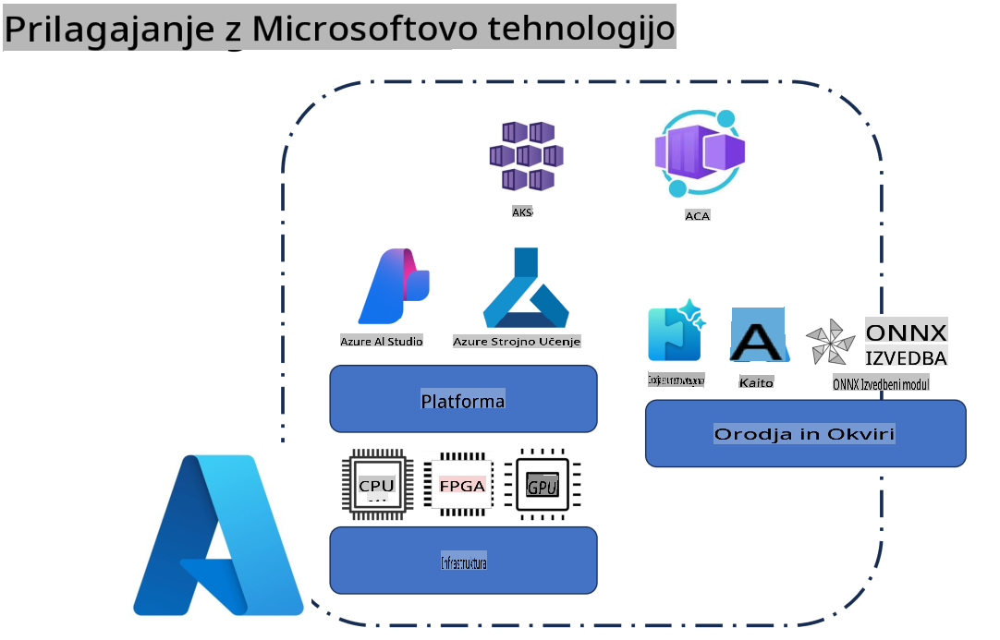
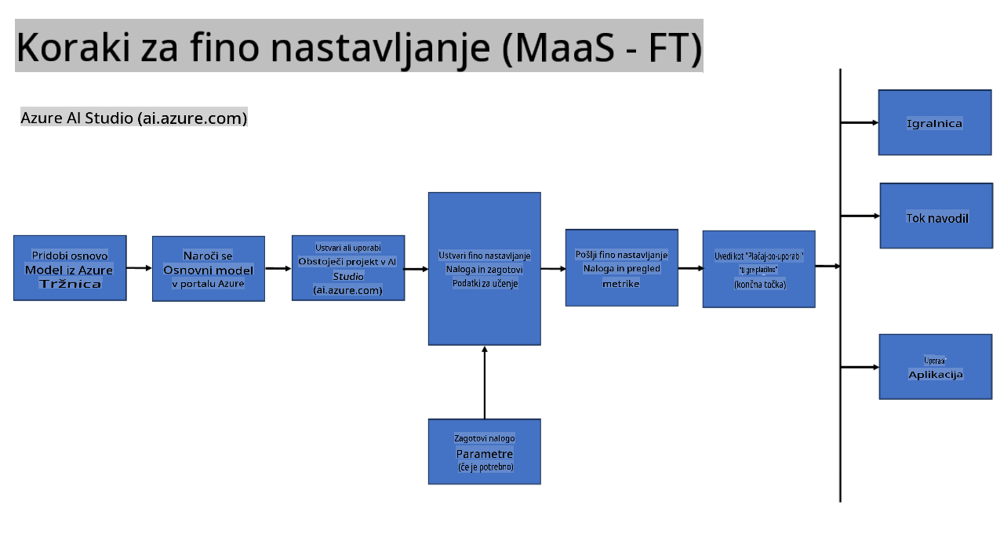
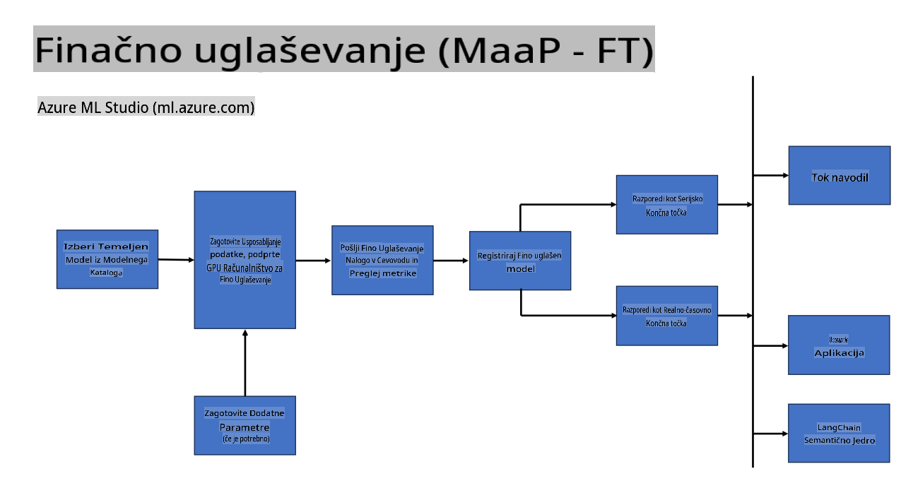
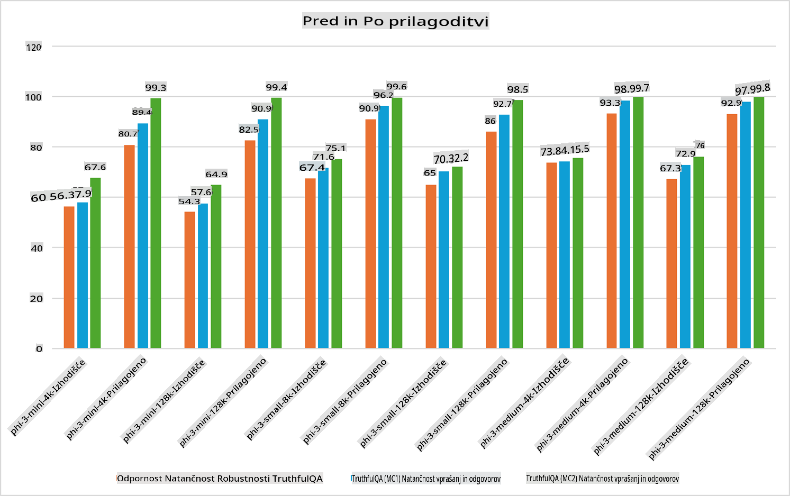

## Scenariji za prilagoditev

**Platforma** To vključuje različne tehnologije, kot so Azure AI Foundry, Azure Machine Learning, AI Tools, Kaito in ONNX Runtime. 

**Infrastruktura** To vključuje CPU in FPGA, ki sta ključna za proces prilagoditve. Tukaj so ikone za vsako od teh tehnologij.

**Orodja in okvirji** To vključuje ONNX Runtime in ONNX Runtime. Tukaj so ikone za vsako od teh tehnologij.
[Vstavi ikone za ONNX Runtime in ONNX Runtime]

Proces prilagoditve z Microsoftovimi tehnologijami vključuje različne komponente in orodja. S poznavanjem in uporabo teh tehnologij lahko učinkovito prilagodimo naše aplikacije in ustvarimo boljše rešitve. 

## Model kot storitev

Prilagodite model z gostovano prilagoditvijo, brez potrebe po ustvarjanju in upravljanju računalniške infrastrukture.

Prilagoditev brez strežnika je na voljo za modele Phi-3-mini in Phi-3-medium, kar razvijalcem omogoča hitro in enostavno prilagajanje modelov za oblačne in robne scenarije brez potrebe po organizaciji računalniških virov. Prav tako smo objavili, da je model Phi-3-small zdaj na voljo v okviru naše ponudbe Modeli-kot-storitev, kar razvijalcem omogoča hiter in enostaven začetek razvoja umetne inteligence brez upravljanja osnovne infrastrukture.

## Model kot platforma

Uporabniki sami upravljajo računalniške vire za prilagoditev svojih modelov.

[Vzorec prilagoditve](https://github.com/Azure/azureml-examples/blob/main/sdk/python/foundation-models/system/finetune/chat-completion/chat-completion.ipynb)

## Scenariji za prilagoditev 

| | | | | | | |
|-|-|-|-|-|-|-|
|Scenarij|LoRA|QLoRA|PEFT|DeepSpeed|ZeRO|DORA|
|Prilagajanje predhodno naučenih LLM-jev specifičnim nalogam ali domenam|Da|Da|Da|Da|Da|Da|
|Prilagoditev za NLP naloge, kot so klasifikacija besedila, prepoznavanje imenovanih entitet in strojno prevajanje|Da|Da|Da|Da|Da|Da|
|Prilagoditev za naloge vprašanj in odgovorov|Da|Da|Da|Da|Da|Da|
|Prilagoditev za generiranje odzivov, podobnih človeškim, v klepetalnih robotih|Da|Da|Da|Da|Da|Da|
|Prilagoditev za ustvarjanje glasbe, umetnosti ali drugih oblik ustvarjalnosti|Da|Da|Da|Da|Da|Da|
|Zmanjševanje računalniških in finančnih stroškov|Da|Da|Ne|Da|Da|Ne|
|Zmanjševanje porabe pomnilnika|Ne|Da|Ne|Da|Da|Da|
|Uporaba manj parametrov za učinkovito prilagoditev|Ne|Da|Da|Ne|Ne|Da|
|Pomnilniško učinkovita oblika podatkovnega paralelizma, ki omogoča dostop do skupnega GPU pomnilnika vseh razpoložljivih GPU naprav|Ne|Ne|Ne|Da|Da|Da|

## Primeri zmogljivosti prilagoditve

**Zavrnitev odgovornosti**:  
Ta dokument je bil preveden z uporabo storitev strojnega prevajanja z umetno inteligenco. Čeprav si prizadevamo za natančnost, vas prosimo, da upoštevate, da lahko avtomatizirani prevodi vsebujejo napake ali netočnosti. Izvirni dokument v njegovem izvirnem jeziku je treba obravnavati kot avtoritativni vir. Za ključne informacije priporočamo profesionalni človeški prevod. Ne prevzemamo odgovornosti za morebitna nesporazumevanja ali napačne razlage, ki izhajajo iz uporabe tega prevoda.