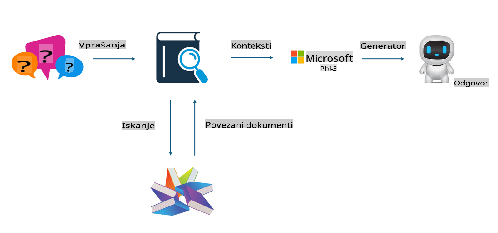

## Prilagajanje in RAG

## Pridobivanje podatkov z izboljšano generacijo

RAG združuje pridobivanje podatkov in generacijo besedila. Strukturirani in nestrukturirani podatki podjetja so shranjeni v vektorski bazi podatkov. Pri iskanju ustrezne vsebine se poiščejo ustrezni povzetki in vsebine, ki tvorijo kontekst, nato pa se s sposobnostjo dopolnjevanja besedila modelov LLM/SLM ustvari nova vsebina.

## Proces RAG

## Prilagajanje
Prilagajanje temelji na izboljšavi določenega modela. Ni treba začeti z algoritmom modela, vendar je treba podatke nenehno zbirati. Če želite natančnejšo terminologijo in jezikovno izražanje za industrijske aplikacije, je prilagajanje boljša izbira. Če pa se vaši podatki pogosto spreminjajo, lahko prilagajanje postane zapleteno.

## Kako izbrati
Če naš odgovor zahteva vključitev zunanjih podatkov, je RAG najboljša izbira.

Če potrebujete stabilno in natančno industrijsko znanje, bo prilagajanje dobra izbira. RAG daje prednost iskanju ustreznih vsebin, vendar morda ne bo vedno zajel specializiranih podrobnosti.

Prilagajanje zahteva visokokakovosten nabor podatkov, in če gre le za majhen obseg podatkov, razlika ne bo velika. RAG je bolj prilagodljiv.  
Prilagajanje je črna škatla, neke vrste metafizika, in notranji mehanizem je težko razumeti. Po drugi strani pa RAG omogoča lažje sledenje izvoru podatkov, kar učinkovito pomaga pri prilagoditvi napačnih informacij ali vsebinskih napak ter zagotavlja večjo preglednost.

**Omejitev odgovornosti**:  
Ta dokument je bil preveden s pomočjo storitev strojnega prevajanja z umetno inteligenco. Čeprav si prizadevamo za natančnost, vas prosimo, da upoštevate, da lahko avtomatski prevodi vsebujejo napake ali netočnosti. Izvirni dokument v svojem maternem jeziku je treba obravnavati kot avtoritativni vir. Za ključne informacije priporočamo profesionalni človeški prevod. Ne prevzemamo odgovornosti za morebitna nesporazumevanja ali napačne razlage, ki izhajajo iz uporabe tega prevoda.