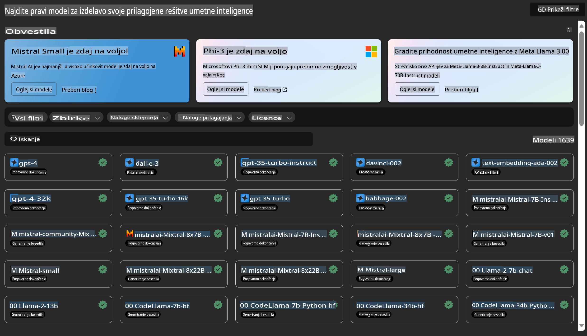

# **Predstavitev storitve Azure Machine Learning**

[Azure Machine Learning](https://ml.azure.com?WT.mc_id=aiml-138114-kinfeylo) je oblačna storitev za pospeševanje in upravljanje življenjskega cikla projektov strojnega učenja (ML).

Strokovnjaki za ML, podatkovni znanstveniki in inženirji jo lahko uporabljajo v svojih vsakodnevnih delovnih procesih za:

- Učenje in uvajanje modelov.
- Upravljanje operacij strojnega učenja (MLOps).
- Model lahko ustvarite v Azure Machine Learning ali pa uporabite model, izdelan na odprtokodnih platformah, kot so PyTorch, TensorFlow ali scikit-learn.
- Orodja MLOps vam pomagajo spremljati, ponovno učiti in ponovno uvajati modele.

## Za koga je namenjen Azure Machine Learning?

**Podatkovni znanstveniki in inženirji ML**

Uporabljajo lahko orodja za pospeševanje in avtomatizacijo svojih vsakodnevnih delovnih procesov.  
Azure ML ponuja funkcije za pravičnost, razložljivost, sledenje in revizijsko sledljivost.

**Razvijalci aplikacij**

Lahko brez težav integrirajo modele v aplikacije ali storitve.

**Razvijalci platform**

Imajo dostop do zanesljivega nabora orodij, podprtega z vzdržljivimi API-ji Azure Resource Manager.  
Ta orodja omogočajo gradnjo naprednih orodij za ML.

**Podjetja**

Z delovanjem v oblaku Microsoft Azure podjetja pridobijo prednosti znane varnosti in nadzora dostopa na podlagi vlog.  
Vzpostavijo lahko projekte za nadzor dostopa do zaščitenih podatkov in določenih operacij.

## Produktivnost za vse člane ekipe

Projekti ML pogosto zahtevajo ekipo z raznolikimi znanji za izgradnjo in vzdrževanje.

Azure ML ponuja orodja, ki vam omogočajo:
- Sodelovanje z ekipo prek deljenih beležnic, računalniških virov, strežniškega računanja, podatkov in okolij.
- Razvoj modelov s pravičnostjo, razložljivostjo, sledenjem in revizijsko sledljivostjo za izpolnjevanje zahtev glede sledljivosti in skladnosti z revizijami.
- Hitro in enostavno uvajanje modelov ML na obsežni ravni ter učinkovito upravljanje in nadzorovanje z MLOps.
- Izvajanje delovnih obremenitev strojnega učenja kjerkoli z vgrajenim nadzorom, varnostjo in skladnostjo.

## Orodja za platformo s široko združljivostjo

Vsak član ekipe ML lahko uporablja svoja priljubljena orodja za izvedbo nalog.  
Ne glede na to, ali izvajate hitre eksperimente, nastavljate hiperparametre, gradite cevovode ali upravljate sklepanja, lahko uporabljate znane vmesnike, kot so:
- Azure Machine Learning Studio
- Python SDK (v2)
- Azure CLI (v2)
- Azure Resource Manager REST API-ji

Ko izpopolnjujete modele in sodelujete skozi razvojni cikel, lahko v uporabniškem vmesniku Azure Machine Learning Studio delite in najdete vire, sredstva in metrike.

## **LLM/SLM v Azure ML**

Azure ML je dodal številne funkcije, povezane z LLM/SLM, ki združujejo LLMOps in SLMOps za ustvarjanje platforme generativne umetne inteligence na ravni podjetja.

### **Katalog modelov**

Podjetniški uporabniki lahko prek kataloga modelov uvajajo različne modele glede na različne poslovne scenarije ter zagotavljajo storitve Model as Service, ki so dostopne razvijalcem ali uporabnikom podjetja.

Katalog modelov v Azure Machine Learning Studio je središče za odkrivanje in uporabo širokega nabora modelov, ki omogočajo gradnjo aplikacij generativne umetne inteligence. Katalog modelov vključuje na stotine modelov različnih ponudnikov, kot so Azure OpenAI Service, Mistral, Meta, Cohere, Nvidia, Hugging Face, vključno z modeli, ki jih je izučil Microsoft.  
Modeli drugih ponudnikov kot Microsoft so opredeljeni kot Ne-Microsoftovi izdelki v Microsoftovih pogojih uporabe izdelkov in so predmet pogojev, priloženih modelu.

### **Cevovod nalog**

Jedro cevovoda strojnega učenja je razdelitev celotne naloge strojnega učenja na večkorakovno delovno pot.  
Vsak korak je obvladljiva komponenta, ki jo je mogoče razvijati, optimizirati, konfigurirati in avtomatizirati posebej. Koraki so povezani prek dobro definiranih vmesnikov.  
Storitev cevovoda Azure Machine Learning samodejno orkestrira vse odvisnosti med koraki cevovoda.

Pri prilagajanju SLM/LLM lahko s cevovodom upravljamo svoje podatke, procese učenja in generiranja.

### **Prompt flow**

**Prednosti uporabe Azure Machine Learning Prompt Flow**  
Azure Machine Learning Prompt Flow ponuja številne prednosti, ki uporabnikom pomagajo preiti od idej do eksperimentiranja in nazadnje do produkcijsko pripravljenih aplikacij, temelječih na LLM:

**Agilnost pri načrtovanju pozivov**

- Interaktivna avtorska izkušnja: Azure Machine Learning Prompt Flow ponuja vizualni prikaz strukture toka, kar uporabnikom omogoča, da enostavno razumejo in navigirajo po svojih projektih. Prav tako omogoča izkušnjo kodiranja, podobno beležnicam, za učinkovito razvijanje in odpravljanje napak v tokovih.
- Različice za prilagajanje pozivov: Uporabniki lahko ustvarijo in primerjajo več različic pozivov, kar olajša iterativni proces izboljšav.
- Evalvacija: Vgrajeni evalvacijski tokovi omogočajo uporabnikom ocenjevanje kakovosti in učinkovitosti svojih pozivov in tokov.
- Obsežni viri: Azure Machine Learning Prompt Flow vključuje knjižnico vgrajenih orodij, vzorcev in predlog, ki služijo kot izhodišče za razvoj, navdihujejo ustvarjalnost in pospešujejo proces.

**Pripravljenost podjetij za aplikacije, temelječe na LLM**

- Sodelovanje: Azure Machine Learning Prompt Flow podpira sodelovanje ekip, kar omogoča več uporabnikom, da skupaj delajo na projektih načrtovanja pozivov, delijo znanje in vzdržujejo nadzor različic.
- Vse-v-enem platforma: Azure Machine Learning Prompt Flow poenostavi celoten proces načrtovanja pozivov, od razvoja in evalvacije do uvajanja in spremljanja. Uporabniki lahko brez težav uvajajo svoje tokove kot končne točke Azure Machine Learning in spremljajo njihovo delovanje v realnem času, kar zagotavlja optimalno delovanje in stalne izboljšave.
- Rešitve za pripravljenost podjetij v Azure Machine Learning: Prompt Flow izkorišča robustne rešitve za pripravljenost podjetij v Azure Machine Learning, kar zagotavlja varno, razširljivo in zanesljivo osnovo za razvoj, eksperimentiranje in uvajanje tokov.

Z Azure Machine Learning Prompt Flow lahko uporabniki sprostijo svojo agilnost pri načrtovanju pozivov, učinkovito sodelujejo in izkoristijo rešitve na ravni podjetja za uspešen razvoj in uvajanje aplikacij, temelječih na LLM.

S kombinacijo računske moči, podatkov in različnih komponent Azure ML lahko podjetniški razvijalci enostavno gradijo svoje aplikacije umetne inteligence.

**Omejitev odgovornosti**:  
Ta dokument je bil preveden s pomočjo strojnih AI prevajalskih storitev. Čeprav si prizadevamo za natančnost, vas opozarjamo, da lahko avtomatski prevodi vsebujejo napake ali netočnosti. Izvirni dokument v njegovem izvirnem jeziku je treba obravnavati kot avtoritativni vir. Za ključne informacije priporočamo strokovni človeški prevod. Ne prevzemamo odgovornosti za morebitna nesporazumevanja ali napačne razlage, ki izhajajo iz uporabe tega prevoda.