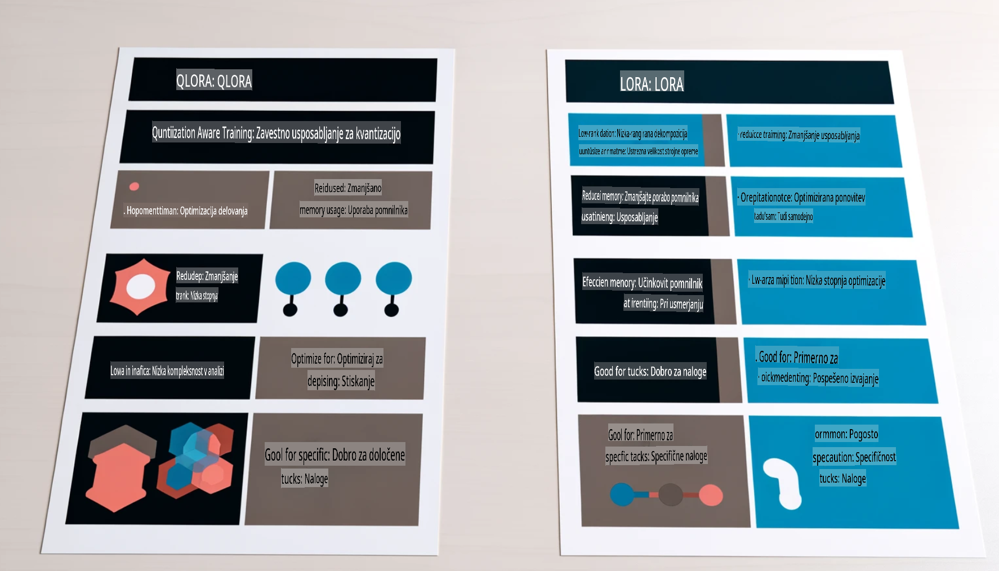

# **Naj Phi-3 postane strokovnjak v industriji**

Da bi model Phi-3 uvedli v industrijo, morate modelu Phi-3 dodati poslovne podatke iz industrije. Imamo dve različni možnosti: prva je RAG (Retrieval Augmented Generation), druga pa Fine Tuning.

## **RAG proti Fine-Tuning**

### **Retrieval Augmented Generation**

RAG združuje pridobivanje podatkov in generiranje besedila. Strukturirani in nestrukturirani podatki podjetja so shranjeni v vektorski bazi podatkov. Pri iskanju ustrezne vsebine se najdejo ustrezni povzetki in vsebine, ki tvorijo kontekst, nato pa se združijo z zmožnostmi dokončanja besedila LLM/SLM za generiranje vsebine.

### **Fine-tuning**

Fine-tuning temelji na izboljšavi določenega modela. Ni treba začeti z algoritmom modela, vendar je treba podatke nenehno zbirati. Če želite natančnejšo terminologijo in izražanje jezika v industrijskih aplikacijah, je fine-tuning boljša izbira. Vendar pa lahko postane fine-tuning zapleten, če se vaši podatki pogosto spreminjajo.

### **Kako izbrati**

1. Če naš odgovor zahteva uvedbo zunanjih podatkov, je RAG najboljša izbira.

2. Če potrebujete stabilno in natančno industrijsko znanje, bo fine-tuning dobra izbira. RAG daje prednost pridobivanju ustrezne vsebine, vendar morda ne bo vedno zajel specializiranih nians.

3. Fine-tuning zahteva visokokakovosten nabor podatkov, in če gre le za majhen obseg podatkov, ne bo veliko razlike. RAG je bolj prilagodljiv.

4. Fine-tuning je kot črna skrinjica, težko je razumeti njegov notranji mehanizem. RAG pa omogoča lažje iskanje vira podatkov, kar učinkovito zmanjša halucinacije ali napake v vsebini ter zagotavlja boljšo preglednost.

### **Scenariji**

1. Navpične industrije, ki zahtevajo specifično strokovno terminologijo in izraze – ***Fine-tuning*** bo najboljša izbira.

2. Sistemi za vprašanja in odgovore, ki vključujejo sintezo različnih znanj – ***RAG*** bo najboljša izbira.

3. Kombinacija avtomatiziranih poslovnih procesov – ***RAG + Fine-tuning*** je najboljša izbira.

## **Kako uporabljati RAG**

Vektorska baza podatkov je zbirka podatkov, shranjenih v matematični obliki. Vektorske baze podatkov olajšajo strojno učenje, da si zapomni prejšnje vnose, kar omogoča uporabo strojnega učenja za podporo primerom uporabe, kot so iskanje, priporočila in generiranje besedila. Podatke je mogoče prepoznati na podlagi metrik podobnosti in ne natančnih ujemanj, kar računalniškim modelom omogoča razumevanje konteksta podatkov.

Vektorska baza podatkov je ključna za realizacijo RAG. Podatke lahko pretvorimo v vektorsko shrambo prek vektorskih modelov, kot so text-embedding-3, jina-ai-embedding itd.

Več o ustvarjanju RAG aplikacij lahko izveste na [https://github.com/microsoft/Phi-3CookBook](https://github.com/microsoft/Phi-3CookBook?WT.mc_id=aiml-138114-kinfeylo)

## **Kako uporabljati Fine-tuning**

Najpogosteje uporabljena algoritma pri Fine-tuningu sta Lora in QLora. Kako izbrati?
- [Več informacij s tem vzorčnim zvezkom](../../../../code/04.Finetuning/Phi_3_Inference_Finetuning.ipynb)
- [Primer Python FineTuning vzorčnega skripta](../../../../code/04.Finetuning/FineTrainingScript.py)

### **Lora in QLora**

LoRA (Low-Rank Adaptation) in QLoRA (Quantized Low-Rank Adaptation) sta tehniki za prilagajanje velikih jezikovnih modelov (LLMs) z uporabo metode Parameter Efficient Fine Tuning (PEFT). PEFT tehnike so zasnovane za učinkovitejše treniranje modelov v primerjavi s tradicionalnimi metodami.  
LoRA je samostojna tehnika za prilagajanje, ki zmanjša pomnilniško obremenitev z uporabo nizko-rangirane aproksimacije matrike posodobitve uteži. Omogoča hitro treniranje in ohranja zmogljivost blizu tradicionalnih metod prilagajanja.

QLoRA je razširjena različica LoRA, ki vključuje kvantizacijske tehnike za nadaljnje zmanjšanje porabe pomnilnika. QLoRA kvantizira natančnost uteži v predtrenirani LLM na 4-bitno natančnost, kar je bolj pomnilniško učinkovito kot LoRA. Vendar pa je treniranje z QLoRA približno 30 % počasnejše kot pri LoRA zaradi dodatnih korakov kvantizacije in dekvantizacije.

QLoRA uporablja LoRA kot dodatek za odpravljanje napak, ki jih povzroča kvantizacija. QLoRA omogoča prilagajanje masivnih modelov z milijardami parametrov na relativno majhnih, široko dostopnih GPU-jih. Na primer, QLoRA lahko prilagodi model s 70 milijardami parametrov, ki bi običajno zahteval 36 GPU-jev, z uporabo le 2.

**Omejitev odgovornosti**:  
Ta dokument je bil preveden s pomočjo storitev strojnega prevajanja z umetno inteligenco. Čeprav si prizadevamo za natančnost, vas prosimo, da se zavedate, da lahko avtomatski prevodi vsebujejo napake ali netočnosti. Izvirni dokument v njegovem izvirnem jeziku je treba obravnavati kot avtoritativni vir. Za ključne informacije priporočamo strokovno človeško prevajanje. Ne prevzemamo odgovornosti za morebitne nesporazume ali napačne razlage, ki izhajajo iz uporabe tega prevoda.