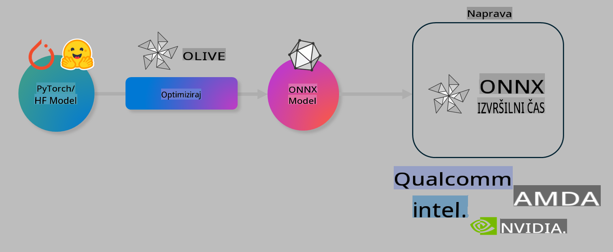

# Laboratorij: Optimizacija AI modelov za lokalno inferenco

## Uvod

> [!IMPORTANT]
> Ta laboratorij zahteva **Nvidia A10 ali A100 GPU** z ustreznimi gonilniki in nameščenim CUDA orodjem (različica 12+).

> [!NOTE]
> To je **35-minutni** laboratorij, ki vam bo omogočil praktičen uvod v osnovne koncepte optimizacije modelov za lokalno inferenco z uporabo OLIVE.

## Cilji učenja

Po koncu tega laboratorija boste z OLIVE lahko:

- Kvantizirali AI model z uporabo metode kvantizacije AWQ.
- Prilagodili AI model za specifično nalogo.
- Ustvarili LoRA adapterje (prilagojene modele) za učinkovito lokalno inferenco z ONNX Runtime.

### Kaj je Olive

Olive (*O*NNX *live*) je orodje za optimizacijo modelov z dodatnim CLI, ki omogoča izvajanje modelov na ONNX runtime +++https://onnxruntime.ai+++ z visoko kakovostjo in zmogljivostjo.



Vhod v Olive je običajno PyTorch ali Hugging Face model, izhod pa optimiziran ONNX model, ki se izvaja na napravi (ciljni platformi) z ONNX runtime. Olive optimizira model za AI pospeševalnik ciljne platforme (NPU, GPU, CPU), ki ga zagotovi proizvajalec strojne opreme, kot so Qualcomm, AMD, Nvidia ali Intel.

Olive izvaja *delovni tok*, ki je urejeno zaporedje posameznih nalog optimizacije modela, imenovanih *prehodi*. Primeri prehodov vključujejo: kompresijo modela, zajem grafa, kvantizacijo, optimizacijo grafa. Vsak prehod ima nabor parametrov, ki jih je mogoče prilagoditi za dosego najboljših metrik, kot sta natančnost in zakasnitev, ki jih ocenjuje ustrezni evalvator. Olive uporablja strategijo iskanja z algoritmom iskanja za samodejno nastavitev posameznih prehodov ali skupine prehodov.

#### Prednosti Olive

- **Manj frustracij in porabljenega časa** zaradi poskusov in napak pri ročnem eksperimentiranju z različnimi tehnikami optimizacije grafa, kompresije in kvantizacije. Določite svoje zahteve glede kakovosti in zmogljivosti, Olive pa bo samodejno našel najboljši model za vas.
- **40+ vgrajenih komponent za optimizacijo modelov**, ki pokrivajo najsodobnejše tehnike kvantizacije, kompresije, optimizacije grafa in prilagajanja.
- **Enostaven CLI** za pogoste naloge optimizacije modelov, na primer olive quantize, olive auto-opt, olive finetune.
- Vgrajeno pakiranje in uvajanje modelov.
- Podpora za generiranje modelov za **Multi LoRA strežbo**.
- Ustvarjanje delovnih tokov z uporabo YAML/JSON za orkestracijo nalog optimizacije in uvajanja modelov.
- Integracija z **Hugging Face** in **Azure AI**.
- Vgrajen mehanizem **predpomnjenja** za **zmanjšanje stroškov**.

## Navodila za laboratorij
> [!NOTE]
> Poskrbite, da ste nastavili Azure AI Hub in projekt ter konfigurirali A100 računalniško enoto, kot je opisano v Laboratoriju 1.

### Korak 0: Povežite se z Azure AI Compute

Povezali se boste z Azure AI Compute z uporabo funkcije oddaljenega dostopa v **VS Code.**

1. Odprite namizno aplikacijo **VS Code**:
1. Odprite **ukazno paleto** s **Shift+Ctrl+P**.
1. V ukazni paleti poiščite **AzureML - remote: Connect to compute instance in New Window**.
1. Sledite navodilom na zaslonu za povezavo z računalniško enoto. To vključuje izbiro vaše naročnine Azure, skupine virov, projekta in imena računalniške enote, ki ste jo nastavili v Laboratoriju 1.
1. Ko ste povezani z Azure ML Compute, bo to prikazano v **spodnjem levem delu Visual Code** `><Azure ML: Compute Name`

### Korak 1: Klonirajte to repozitorij

V VS Code lahko odprete nov terminal z **Ctrl+J** in klonirate ta repozitorij:

V terminalu bi morali videti poziv

```
azureuser@computername:~/cloudfiles/code$ 
```
Klonirajte rešitev 

```bash
cd ~/localfiles
git clone https://github.com/microsoft/phi-3cookbook.git
```

### Korak 2: Odprite mapo v VS Code

Za odpiranje ustrezne mape v VS Code izvedite naslednji ukaz v terminalu, ki bo odprl novo okno:

```bash
code phi-3cookbook/code/04.Finetuning/Olive-lab
```

Lahko pa mapo odprete z izbiro **File** > **Open Folder**. 

### Korak 3: Odvisnosti

Odprite terminal v VS Code na svoji Azure AI Compute instanci (nasvet: **Ctrl+J**) in izvedite naslednje ukaze za namestitev odvisnosti:

```bash
conda create -n olive-ai python=3.11 -y
conda activate olive-ai
pip install -r requirements.txt
az extension remove -n azure-cli-ml
az extension add -n ml
```

> [!NOTE]
> Namestitev vseh odvisnosti bo trajala približno **5 minut**.

V tem laboratoriju boste prenesli in naložili modele v Azure AI Model katalog. Da boste lahko dostopali do kataloga modelov, se morate prijaviti v Azure z:

```bash
az login
```

> [!NOTE]
> Med prijavo boste pozvani, da izberete svojo naročnino. Poskrbite, da izberete naročnino, ki je dodeljena za ta laboratorij.

### Korak 4: Izvedite Olive ukaze 

Odprite terminal v VS Code na svoji Azure AI Compute instanci (nasvet: **Ctrl+J**) in poskrbite, da je aktivirano okolje `olive-ai` conda:

```bash
conda activate olive-ai
```

Nato izvedite naslednje Olive ukaze v ukazni vrstici.

1. **Preglejte podatke:** V tem primeru boste prilagodili model Phi-3.5-Mini, da bo specializiran za odgovarjanje na vprašanja, povezana s potovanji. Koda spodaj prikaže prvih nekaj zapisov podatkovnega nabora, ki so v formatu JSON lines:
   
    ```bash
    head data/data_sample_travel.jsonl
    ```
1. **Kvantizirajte model:** Preden prilagodite model, ga najprej kvantizirajte z naslednjim ukazom, ki uporablja tehniko, imenovano Active Aware Quantization (AWQ) +++https://arxiv.org/abs/2306.00978+++. AWQ kvantizira uteži modela ob upoštevanju aktivacij, ki nastanejo med inferenco. To pomeni, da proces kvantizacije upošteva dejansko porazdelitev podatkov v aktivacijah, kar vodi do boljšega ohranjanja natančnosti modela v primerjavi s tradicionalnimi metodami kvantizacije uteži.
    
    ```bash
    olive quantize \
       --model_name_or_path microsoft/Phi-3.5-mini-instruct \
       --trust_remote_code \
       --algorithm awq \
       --output_path models/phi/awq \
       --log_level 1
    ```
    
    Kvantizacija AWQ traja približno **8 minut** in bo **zmanjšala velikost modela z ~7,5 GB na ~2,5 GB**.
   
   V tem laboratoriju vam bomo pokazali, kako vnesti modele iz Hugging Face (na primer: `microsoft/Phi-3.5-mini-instruct`). However, Olive also allows you to input models from the Azure AI catalog by updating the `model_name_or_path` argument to an Azure AI asset ID (for example:  `azureml://registries/azureml/models/Phi-3.5-mini-instruct/versions/4`). 

1. **Train the model:** Next, the `olive finetune` ukaz prilagodi kvantiziran model. Kvantizacija modela *pred* prilagajanjem namesto po njem daje boljšo natančnost, saj proces prilagajanja povrne nekaj izgube zaradi kvantizacije.
    
    ```bash
    olive finetune \
        --method lora \
        --model_name_or_path models/phi/awq \
        --data_files "data/data_sample_travel.jsonl" \
        --data_name "json" \
        --text_template "<|user|>\n{prompt}<|end|>\n<|assistant|>\n{response}<|end|>" \
        --max_steps 100 \
        --output_path ./models/phi/ft \
        --log_level 1
    ```
    
    Prilagajanje traja približno **6 minut** (s 100 koraki).

1. **Optimizirajte:** Ko je model prilagojen, ga zdaj optimizirajte z uporabo Olive ukaza `auto-opt` command, which will capture the ONNX graph and automatically perform a number of optimizations to improve the model performance for CPU by compressing the model and doing fusions. It should be noted, that you can also optimize for other devices such as NPU or GPU by just updating the `--device` and `--provider` - vendar bomo za namen tega laboratorija uporabili CPU.

    ```bash
    olive auto-opt \
       --model_name_or_path models/phi/ft/model \
       --adapter_path models/phi/ft/adapter \
       --device cpu \
       --provider CPUExecutionProvider \
       --use_ort_genai \
       --output_path models/phi/onnx-ao \
       --log_level 1
    ```
    
    Optimizacija traja približno **5 minut**.

### Korak 5: Hitri test inferenca modela

Za testiranje inferenca modela ustvarite Python datoteko v svoji mapi z imenom **app.py** in kopirajte naslednjo kodo:

```python
import onnxruntime_genai as og
import numpy as np

print("loading model and adapters...", end="", flush=True)
model = og.Model("models/phi/onnx-ao/model")
adapters = og.Adapters(model)
adapters.load("models/phi/onnx-ao/model/adapter_weights.onnx_adapter", "travel")
print("DONE!")

tokenizer = og.Tokenizer(model)
tokenizer_stream = tokenizer.create_stream()

params = og.GeneratorParams(model)
params.set_search_options(max_length=100, past_present_share_buffer=False)
user_input = "what is the best thing to see in chicago"
params.input_ids = tokenizer.encode(f"<|user|>\n{user_input}<|end|>\n<|assistant|>\n")

generator = og.Generator(model, params)

generator.set_active_adapter(adapters, "travel")

print(f"{user_input}")

while not generator.is_done():
    generator.compute_logits()
    generator.generate_next_token()

    new_token = generator.get_next_tokens()[0]
    print(tokenizer_stream.decode(new_token), end='', flush=True)

print("\n")
```

Izvedite kodo z:

```bash
python app.py
```

### Korak 6: Naložite model v Azure AI

Nalaganje modela v repozitorij modelov Azure AI omogoča deljenje modela z drugimi člani vaše razvojne ekipe in omogoča tudi nadzor različic modela. Za nalaganje modela zaženite naslednji ukaz:

> [!NOTE]
> Posodobite `{}` placeholders with the name of your resource group and Azure AI Project Name. 

To find your resource group `"resourceGroup"` in ime projekta Azure AI, nato zaženite naslednji ukaz:

```
az ml workspace show
```

Lahko pa greste na +++ai.azure.com+++ in izberete **management center** **project** **overview**.

Posodobite `{}` z imenom svoje skupine virov in imenom projekta Azure AI.

```bash
az ml model create \
    --name ft-for-travel \
    --version 1 \
    --path ./models/phi/onnx-ao \
    --resource-group {RESOURCE_GROUP_NAME} \
    --workspace-name {PROJECT_NAME}
```
Nato lahko vidite svoj naloženi model in ga uvedete na https://ml.azure.com/model/list

**Zavrnitev odgovornosti**:  
Ta dokument je bil preveden s pomočjo strojnih storitev za prevajanje z umetno inteligenco. Čeprav si prizadevamo za natančnost, vas prosimo, da se zavedate, da lahko samodejni prevodi vsebujejo napake ali netočnosti. Izvirni dokument v svojem maternem jeziku je treba obravnavati kot avtoritativni vir. Za ključne informacije je priporočljivo profesionalno človeško prevajanje. Ne prevzemamo odgovornosti za morebitna nesporazumevanja ali napačne razlage, ki izhajajo iz uporabe tega prevoda.