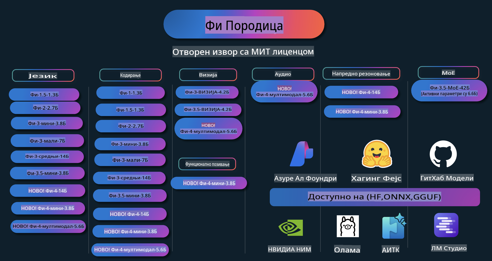

# Phi Kuvar: Praktični Primeri sa Microsoftovim Phi Modelima

  

  
  
  

  
  

Phi je serija AI modela otvorenog koda koje je razvila kompanija Microsoft.

Phi je trenutno najmoćniji i najisplativiji mali jezički model (SLM), sa odličnim rezultatima u višejezičnosti, rezonovanju, generisanju teksta/četa, kodiranju, slikama, zvuku i drugim scenarijima.

Možete implementirati Phi u oblaku ili na uređajima na ivici mreže, a lako možete kreirati generativne AI aplikacije sa ograničenim računalnim resursima.

Pratite ove korake da biste započeli sa korišćenjem ovih resursa:  
1. **Forkujte Repozitorijum**: Kliknite   
2. **Klonirajte Repozitorijum**:   `git clone https://github.com/microsoft/PhiCookBook.git`  
3. [**Pridružite se Microsoft AI Discord zajednici i upoznajte stručnjake i kolege programere**](https://discord.com/invite/ByRwuEEgH4?WT.mc_id=aiml-137032-kinfeylo)

## Sadržaj

- Uvod  
  - [Dobrodošli u Phi Porodicu](./md/01.Introduction/01/01.PhiFamily.md)  
  - [Podešavanje vašeg okruženja](./md/01.Introduction/01/01.EnvironmentSetup.md)  
  - [Razumevanje Ključnih Tehnologija](./md/01.Introduction/01/01.Understandingtech.md)  
  - [AI Bezbednost za Phi Modele](./md/01.Introduction/01/01.AISafety.md)  
  - [Podrška za Phi Hardver](./md/01.Introduction/01/01.Hardwaresupport.md)  
  - [Phi Modeli i Dostupnost na Različitim Platformama](./md/01.Introduction/01/01.Edgeandcloud.md)  
  - [Korišćenje Guidance-ai i Phi](./md/01.Introduction/01/01.Guidance.md)  
  - [GitHub Marketplace Modeli](https://github.com/marketplace/models)  
  - [Azure AI Katalog Modela](https://ai.azure.com)

- Izvođenje Phi u različitim okruženjima  
    - [Hugging Face](./md/01.Introduction/02/01.HF.md)  
    - [GitHub Modeli](./md/01.Introduction/02/02.GitHubModel.md)  
    - [Azure AI Foundry Katalog Modela](./md/01.Introduction/02/03.AzureAIFoundry.md)  
    - [Ollama](./md/01.Introduction/02/04.Ollama.md)  
    - [AI Toolkit VSCode (AITK)](./md/01.Introduction/02/05.AITK.md)  
    - [NVIDIA NIM](./md/01.Introduction/02/06.NVIDIA.md)

- Izvođenje Phi Porodice  
    - [Izvođenje Phi na iOS-u](./md/01.Introduction/03/iOS_Inference.md)  
    - [Izvođenje Phi na Androidu](./md/01.Introduction/03/Android_Inference.md)  
- [Inferencija Phi na Jetsonu](./md/01.Introduction/03/Jetson_Inference.md)
    - [Inferencija Phi na AI PC-ju](./md/01.Introduction/03/AIPC_Inference.md)
    - [Inferencija Phi sa Apple MLX Frameworkom](./md/01.Introduction/03/MLX_Inference.md)
    - [Inferencija Phi na lokalnom serveru](./md/01.Introduction/03/Local_Server_Inference.md)
    - [Inferencija Phi na udaljenom serveru koristeći AI Toolkit](./md/01.Introduction/03/Remote_Interence.md)
    - [Inferencija Phi sa Rust-om](./md/01.Introduction/03/Rust_Inference.md)
    - [Inferencija Phi--Vision lokalno](./md/01.Introduction/03/Vision_Inference.md)
    - [Inferencija Phi sa Kaito AKS, Azure kontejnerima (zvanična podrška)](./md/01.Introduction/03/Kaito_Inference.md)
- [Kvantifikacija porodice Phi](./md/01.Introduction/04/QuantifyingPhi.md)
    - [Kvantifikacija Phi-3.5 / 4 koristeći llama.cpp](./md/01.Introduction/04/UsingLlamacppQuantifyingPhi.md)
    - [Kvantifikacija Phi-3.5 / 4 koristeći generativne AI ekstenzije za onnxruntime](./md/01.Introduction/04/UsingORTGenAIQuantifyingPhi.md)
    - [Kvantifikacija Phi-3.5 / 4 koristeći Intel OpenVINO](./md/01.Introduction/04/UsingIntelOpenVINOQuantifyingPhi.md)
    - [Kvantifikacija Phi-3.5 / 4 koristeći Apple MLX Framework](./md/01.Introduction/04/UsingAppleMLXQuantifyingPhi.md)

- Evaluacija Phi
    - [Odgovorna AI](./md/01.Introduction/05/ResponsibleAI.md)
    - [Azure AI Foundry za evaluaciju](./md/01.Introduction/05/AIFoundry.md)
    - [Korišćenje Promptflow-a za evaluaciju](./md/01.Introduction/05/Promptflow.md)
 
- RAG sa Azure AI Search
    - [Kako koristiti Phi-4-mini i Phi-4-multimodal (RAG) sa Azure AI Search](https://github.com/microsoft/PhiCookBook/blob/main/code/06.E2E/E2E_Phi-4-RAG-Azure-AI-Search.ipynb)

- Primeri razvoja aplikacija sa Phi
  - Tekstualne i chat aplikacije
    - Primeri za Phi-4 🆕
      - [📓] [Chat sa Phi-4-mini ONNX modelom](./md/02.Application/01.TextAndChat/Phi4/ChatWithPhi4ONNX/README.md)
      - [Chat sa lokalnim Phi-4 ONNX modelom u .NET-u](../../md/04.HOL/dotnet/src/LabsPhi4-Chat-01OnnxRuntime)
      - [Chat .NET konzolna aplikacija sa Phi-4 ONNX koristeći Semantic Kernel](../../md/04.HOL/dotnet/src/LabsPhi4-Chat-02SK)
    - Primeri za Phi-3 / 3.5
      - [Lokalni chatbot u pretraživaču koristeći Phi3, ONNX Runtime Web i WebGPU](https://github.com/microsoft/onnxruntime-inference-examples/tree/main/js/chat)
      - [OpenVino Chat](./md/02.Application/01.TextAndChat/Phi3/E2E_OpenVino_Chat.md)
      - [Multi Model - Interaktivni Phi-3-mini i OpenAI Whisper](./md/02.Application/01.TextAndChat/Phi3/E2E_Phi-3-mini_with_whisper.md)
      - [MLFlow - Kreiranje omota i korišćenje Phi-3 sa MLFlow](./md//02.Application/01.TextAndChat/Phi3/E2E_Phi-3-MLflow.md)
      - [Optimizacija modela - Kako optimizovati Phi-3-min model za ONNX Runtime Web sa Olive](https://github.com/microsoft/Olive/tree/main/examples/phi3)
      - [WinUI3 aplikacija sa Phi-3 mini-4k-instruct-onnx](https://github.com/microsoft/Phi3-Chat-WinUI3-Sample/)
      - [WinUI3 Multi Model AI aplikacija za beleške - primer](https://github.com/microsoft/ai-powered-notes-winui3-sample)
      - [Fino podešavanje i integracija prilagođenih Phi-3 modela sa Prompt flow](./md/02.Application/01.TextAndChat/Phi3/E2E_Phi-3-FineTuning_PromptFlow_Integration.md)
      - [Fino podešavanje i integracija prilagođenih Phi-3 modela sa Prompt flow u Azure AI Foundry](./md/02.Application/01.TextAndChat/Phi3/E2E_Phi-3-FineTuning_PromptFlow_Integration_AIFoundry.md)
      - [Evaluacija fino podešenih Phi-3 / Phi-3.5 modela u Azure AI Foundry, fokusirajući se na Microsoftove principe odgovorne AI](./md/02.Application/01.TextAndChat/Phi3/E2E_Phi-3-Evaluation_AIFoundry.md)
- [📓] [Phi-3.5-mini-instruct primer za predviđanje jezika (kineski/engleski)](../../md/02.Application/01.TextAndChat/Phi3/phi3-instruct-demo.ipynb)
      - [Phi-3.5-Instruct WebGPU RAG Četbot](./md/02.Application/01.TextAndChat/Phi3/WebGPUWithPhi35Readme.md)
      - [Korišćenje Windows GPU-a za kreiranje Prompt flow rešenja sa Phi-3.5-Instruct ONNX](./md/02.Application/01.TextAndChat/Phi3/UsingPromptFlowWithONNX.md)
      - [Korišćenje Microsoft Phi-3.5 tflite za kreiranje Android aplikacije](./md/02.Application/01.TextAndChat/Phi3/UsingPhi35TFLiteCreateAndroidApp.md)
      - [Q&A .NET primer korišćenjem lokalnog ONNX Phi-3 modela sa Microsoft.ML.OnnxRuntime](../../md/04.HOL/dotnet/src/LabsPhi301)
      - [Konzolna čet aplikacija u .NET-u sa Semantic Kernel-om i Phi-3](../../md/04.HOL/dotnet/src/LabsPhi302)

  - Azure AI Inference SDK Primeri zasnovani na kodu 
    - Phi-4 Primeri 🆕
      - [📓] [Generisanje koda projekta korišćenjem Phi-4-multimodal](./md/02.Application/02.Code/Phi4/GenProjectCode/README.md)
    - Phi-3 / 3.5 Primeri
      - [Kreirajte svoj Visual Studio Code GitHub Copilot Chat sa Microsoft Phi-3 porodicom](./md/02.Application/02.Code/Phi3/VSCodeExt/README.md)
      - [Napravite svog Visual Studio Code Copilot agenta za čet sa Phi-3.5 pomoću GitHub modela](/md/02.Application/02.Code/Phi3/CreateVSCodeChatAgentWithGitHubModels.md)

  - Napredni primeri zaključivanja
    - Phi-4 Primeri 🆕
      - [📓] [Phi-4-mini primeri zaključivanja](./md/02.Application/03.AdvancedReasoning/Phi4/AdvancedResoningPhi4mini/README.md)
  
  - Demo prikazi
      - [Phi-4-mini demo prikazi hostovani na Hugging Face Spaces](https://huggingface.co/spaces/microsoft/phi-4-mini?WT.mc_id=aiml-137032-kinfeylo)
      - [Phi-4-multimodal demo prikazi hostovani na Hugging Face Spaces](https://huggingface.co/spaces/microsoft/phi-4-multimodal?WT.mc_id=aiml-137032-kinfeylo)
  - Vizuelni primeri
    - Phi-4 Primeri 🆕
      - [📓] [Korišćenje Phi-4-multimodal za čitanje slika i generisanje koda](./md/02.Application/04.Vision/Phi4/CreateFrontend/README.md) 
    - Phi-3 / 3.5 Primeri
      -  [📓][Phi-3-vision - Tekst sa slike u tekst](../../md/02.Application/04.Vision/Phi3/E2E_Phi-3-vision-image-text-to-text-online-endpoint.ipynb)
      - [Phi-3-vision-ONNX](https://onnxruntime.ai/docs/genai/tutorials/phi3-v.html)
      - [📓][Phi-3-vision CLIP Embedding](../../md/02.Application/04.Vision/Phi3/E2E_Phi-3-vision-image-text-to-text-online-endpoint.ipynb)
      - [DEMO: Phi-3 Reciklaža](https://github.com/jennifermarsman/PhiRecycling/)
      - [Phi-3-vision - Vizuelni jezički asistent - sa Phi3-Vision i OpenVINO](https://docs.openvino.ai/nightly/notebooks/phi-3-vision-with-output.html)
      - [Phi-3 Vision Nvidia NIM](./md/02.Application/04.Vision/Phi3/E2E_Nvidia_NIM_Vision.md)
      - [Phi-3 Vision OpenVino](./md/02.Application/04.Vision/Phi3/E2E_OpenVino_Phi3Vision.md)
      - [📓][Phi-3.5 Vision primer za više okvira ili više slika](../../md/02.Application/04.Vision/Phi3/phi3-vision-demo.ipynb)
      - [Phi-3 Vision lokalni ONNX model korišćenjem Microsoft.ML.OnnxRuntime .NET](../../md/04.HOL/dotnet/src/LabsPhi303)
      - [Meni baziran Phi-3 Vision lokalni ONNX model korišćenjem Microsoft.ML.OnnxRuntime .NET](../../md/04.HOL/dotnet/src/LabsPhi304)

  - Audio primeri
    - Phi-4 Primeri 🆕
      - [📓] [Ekstrakcija audio transkripta korišćenjem Phi-4-multimodal](./md/02.Application/05.Audio/Phi4/Transciption/README.md)
      - [📓] [Phi-4-multimodal Audio Primer](../../md/02.Application/05.Audio/Phi4/Siri/demo.ipynb)
      - [📓] [Phi-4-multimodal Primer za prevod govora](../../md/02.Application/05.Audio/Phi4/Translate/demo.ipynb)
      - [.NET konzolna aplikacija korišćenjem Phi-4-multimodal Audio za analizu audio fajla i generisanje transkripta](../../md/04.HOL/dotnet/src/LabsPhi4-MultiModal-02Audio)

  - MOE Primeri
    - Phi-3 / 3.5 Primeri
      - [📓] [Phi-3.5 Mixture of Experts Models (MoEs) primer za društvene mreže](../../md/02.Application/06.MoE/Phi3/phi3_moe_demo.ipynb)
      - [📓] [Izgradnja Retrieval-Augmented Generation (RAG) pipeline-a sa NVIDIA NIM Phi-3 MOE, Azure AI Search, i LlamaIndex](../../md/02.Application/06.MoE/Phi3/azure-ai-search-nvidia-rag.ipynb)
  - Primeri za pozivanje funkcija
    - Phi-4 Primeri 🆕
      -  [📓] [Korišćenje pozivanja funkcija sa Phi-4-mini](./md/02.Application/07.FunctionCalling/Phi4/FunctionCallingBasic/README.md)
  - Primeri za mešanje multimodala
    - Phi-4 Primeri 🆕
-  [📓] [Korišćenje Phi-4-multimodal kao tehnološki novinar](../../md/02.Application/08.Multimodel/Phi4/TechJournalist/phi_4_mm_audio_text_publish_news.ipynb)
      - [.NET konzolna aplikacija koja koristi Phi-4-multimodal za analizu slika](../../md/04.HOL/dotnet/src/LabsPhi4-MultiModal-01Images)

- Fino podešavanje uzoraka Phi
  - [Scenariji za fino podešavanje](./md/03.FineTuning/FineTuning_Scenarios.md)
  - [Fino podešavanje naspram RAG](./md/03.FineTuning/FineTuning_vs_RAG.md)
  - [Fino podešavanje: Neka Phi-3 postane stručnjak za industriju](./md/03.FineTuning/LetPhi3gotoIndustriy.md)
  - [Fino podešavanje Phi-3 pomoću AI Toolkit za VS Code](./md/03.FineTuning/Finetuning_VSCodeaitoolkit.md)
  - [Fino podešavanje Phi-3 pomoću Azure Machine Learning Service](./md/03.FineTuning/Introduce_AzureML.md)
  - [Fino podešavanje Phi-3 pomoću Lora](./md/03.FineTuning/FineTuning_Lora.md)
  - [Fino podešavanje Phi-3 pomoću QLora](./md/03.FineTuning/FineTuning_Qlora.md)
  - [Fino podešavanje Phi-3 pomoću Azure AI Foundry](./md/03.FineTuning/FineTuning_AIFoundry.md)
  - [Fino podešavanje Phi-3 pomoću Azure ML CLI/SDK](./md/03.FineTuning/FineTuning_MLSDK.md)
  - [Fino podešavanje pomoću Microsoft Olive](./md/03.FineTuning/FineTuning_MicrosoftOlive.md)
  - [Fino podešavanje pomoću Microsoft Olive Hands-On Lab](./md/03.FineTuning/olive-lab/readme.md)
  - [Fino podešavanje Phi-3-vision pomoću Weights and Bias](./md/03.FineTuning/FineTuning_Phi-3-visionWandB.md)
  - [Fino podešavanje Phi-3 pomoću Apple MLX Framework](./md/03.FineTuning/FineTuning_MLX.md)
  - [Fino podešavanje Phi-3-vision (zvanična podrška)](./md/03.FineTuning/FineTuning_Vision.md)
  - [Fino podešavanje Phi-3 pomoću Kaito AKS, Azure Containers (zvanična podrška)](./md/03.FineTuning/FineTuning_Kaito.md)
  - [Fino podešavanje Phi-3 i 3.5 Vision](https://github.com/2U1/Phi3-Vision-Finetune)

- Praktične radionice
  - [Istraživanje najsavremenijih modela: LLM-ovi, SLM-ovi, lokalni razvoj i još mnogo toga](https://github.com/microsoft/aitour-exploring-cutting-edge-models)
  - [Otključavanje potencijala NLP-a: Fino podešavanje pomoću Microsoft Olive](https://github.com/azure/Ignite_FineTuning_workshop)

- Akademski istraživački radovi i publikacije
  - [Udžbenici su sve što vam treba II: tehnički izveštaj za phi-1.5](https://arxiv.org/abs/2309.05463)
  - [Tehnički izveštaj za Phi-3: Visoko sposobni jezički model lokalno na vašem telefonu](https://arxiv.org/abs/2404.14219)
  - [Tehnički izveštaj za Phi-4](https://arxiv.org/abs/2412.08905)
  - [Optimizacija malih jezičkih modela za funkcije u vozilu](https://arxiv.org/abs/2501.02342)
  - [(WhyPHI) Fino podešavanje PHI-3 za odgovaranje na pitanja sa višestrukim izborom: metodologija, rezultati i izazovi](https://arxiv.org/abs/2501.01588)

## Korišćenje Phi modela

### Phi na Azure AI Foundry

Možete naučiti kako da koristite Microsoft Phi i kako da izgradite E2E rešenja na različitim hardverskim uređajima. Da biste sami iskusili Phi, započnite sa isprobavanjem modela i prilagođavanjem Phi za svoje scenarije koristeći [Azure AI Foundry Azure AI Model Catalog](https://aka.ms/phi3-azure-ai). Više možete saznati u odeljku Početak sa [Azure AI Foundry](/md/02.QuickStart/AzureAIFoundry_QuickStart.md).

**Igralište**
Svaki model ima posvećeno igralište za testiranje modela [Azure AI Playground](https://aka.ms/try-phi3).

### Phi na GitHub modelima

Možete naučiti kako da koristite Microsoft Phi i kako da izgradite E2E rešenja na različitim hardverskim uređajima. Da biste sami iskusili Phi, započnite sa isprobavanjem modela i prilagođavanjem Phi za svoje scenarije koristeći [GitHub Model Catalog](https://github.com/marketplace/models?WT.mc_id=aiml-137032-kinfeylo). Više možete saznati u odeljku Početak sa [GitHub Model Catalog](/md/02.QuickStart/GitHubModel_QuickStart.md).

**Igralište**
Svaki model ima posvećen [prostor za testiranje modela](/md/02.QuickStart/GitHubModel_QuickStart.md).

### Phi na Hugging Face-u

Model možete pronaći i na [Hugging Face](https://huggingface.co/microsoft)

**Prostor za testiranje**
[Hugging Chat prostor za testiranje](https://huggingface.co/chat/models/microsoft/Phi-3-mini-4k-instruct)

## Odgovorna AI

Microsoft je posvećen tome da pomogne svojim korisnicima da odgovorno koriste naše AI proizvode, deleći svoja saznanja i gradeći partnerske odnose zasnovane na poverenju putem alata kao što su Beleške o transparentnosti i Procene uticaja. Mnogi od ovih resursa mogu se pronaći na [https://aka.ms/RAI](https://aka.ms/RAI).  
Microsoftov pristup odgovornoj AI zasnovan je na našim principima AI: pravičnosti, pouzdanosti i sigurnosti, privatnosti i zaštiti, inkluzivnosti, transparentnosti i odgovornosti.

Veliki modeli prirodnog jezika, slike i govora - poput onih korišćenih u ovom primeru - mogu potencijalno da se ponašaju na nepravedan, nepouzdan ili uvredljiv način, što može dovesti do štetnih posledica. Molimo vas da se konsultujete sa [Beleškom o transparentnosti za Azure OpenAI uslugu](https://learn.microsoft.com/legal/cognitive-services/openai/transparency-note?tabs=text) kako biste bili informisani o rizicima i ograničenjima.

Preporučeni pristup za ublažavanje ovih rizika je uključivanje sigurnosnog sistema u vašu arhitekturu koji može otkriti i sprečiti štetno ponašanje. [Azure AI Content Safety](https://learn.microsoft.com/azure/ai-services/content-safety/overview) pruža nezavisan sloj zaštite, sposoban da detektuje štetan sadržaj generisan od strane korisnika ili AI u aplikacijama i uslugama. Azure AI Content Safety uključuje API-je za tekst i slike koji omogućavaju detekciju štetnog materijala. Unutar Azure AI Foundry-a, Content Safety usluga omogućava vam da pregledate, istražujete i isprobate uzorke koda za detekciju štetnog sadržaja u različitim modalitetima. Sledeća [dokumentacija za brzo pokretanje](https://learn.microsoft.com/azure/ai-services/content-safety/quickstart-text?tabs=visual-studio%2Clinux&pivots=programming-language-rest) vodi vas kroz proces slanja zahteva ovoj usluzi.

Još jedan aspekt koji treba uzeti u obzir je ukupna performansa aplikacije. Kod aplikacija sa više modaliteta i modela, performansa podrazumeva da sistem radi kako vi i vaši korisnici očekujete, uključujući i to da ne generiše štetne rezultate. Važno je proceniti performanse vaše aplikacije koristeći [Evaluatore za performanse i kvalitet, kao i za rizik i sigurnost](https://learn.microsoft.com/azure/ai-studio/concepts/evaluation-metrics-built-in). Takođe imate mogućnost da kreirate i procenjujete sa [prilagođenim evaluatorima](https://learn.microsoft.com/azure/ai-studio/how-to/develop/evaluate-sdk#custom-evaluators).

Možete proceniti vašu AI aplikaciju u razvojnom okruženju koristeći [Azure AI Evaluation SDK](https://microsoft.github.io/promptflow/index.html). Na osnovu testnog skupa podataka ili cilja, generacije vaše generativne AI aplikacije se kvantitativno mere pomoću ugrađenih ili prilagođenih evaluatora po vašem izboru. Da biste započeli sa Azure AI Evaluation SDK-om za evaluaciju vašeg sistema, možete pratiti [vodič za brzo pokretanje](https://learn.microsoft.com/azure/ai-studio/how-to/develop/flow-evaluate-sdk). Nakon što izvršite evaluaciju, možete [vizualizovati rezultate u Azure AI Foundry](https://learn.microsoft.com/azure/ai-studio/how-to/evaluate-flow-results). 

## Zaštitni znakovi

Ovaj projekat može sadržati zaštitne znakove ili logotipe za projekte, proizvode ili usluge. Ovlašćena upotreba Microsoft zaštitnih znakova ili logotipa podložna je i mora slediti [Microsoftova Pravila o zaštitnim znakovima i brendu](https://www.microsoft.com/legal/intellectualproperty/trademarks/usage/general).  
Korišćenje Microsoft zaštitnih znakova ili logotipa u modifikovanim verzijama ovog projekta ne sme izazvati konfuziju niti implicirati sponzorstvo od strane Microsofta. Svaka upotreba zaštitnih znakova ili logotipa trećih strana podleže pravilima tih trećih strana.

**Одрицање од одговорности**:  
Овај документ је преведен коришћењем машинских AI услуга за превођење. Иако се трудимо да обезбедимо тачност, молимо вас да имате у виду да аутоматски преводи могу садржати грешке или нетачности. Оригинални документ на његовом изворном језику треба сматрати меродавним извором. За критичне информације препоручује се професионални превод од стране људи. Не сносимо одговорност за било каква погрешна тумачења или неразумевања настала коришћењем овог превода.