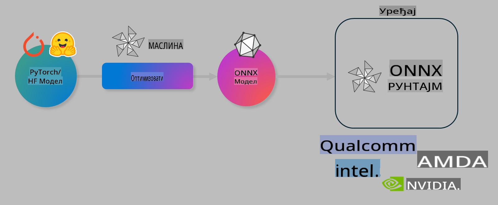

# Laboratorija. Optimizacija AI modela za inferenciju na uređaju

## Uvod 

> [!IMPORTANT]
> Ova laboratorija zahteva **Nvidia A10 ili A100 GPU** sa odgovarajućim drajverima i instaliranim CUDA alatom (verzija 12+).

> [!NOTE]
> Ovo je **laboratorija od 35 minuta** koja će vam pružiti praktičan uvod u osnovne koncepte optimizacije modela za inferenciju na uređaju koristeći OLIVE.

## Ciljevi učenja

Na kraju ove laboratorije, moći ćete da koristite OLIVE za:

- Kvantizaciju AI modela koristeći AWQ metodu kvantizacije.
- Fino podešavanje AI modela za određeni zadatak.
- Generisanje LoRA adaptera (fino podešen model) za efikasnu inferenciju na uređaju koristeći ONNX Runtime.

### Šta je Olive

Olive (*O*NNX *live*) je alat za optimizaciju modela sa pratećim CLI-jem koji vam omogućava da isporučite modele za ONNX runtime +++https://onnxruntime.ai+++ sa kvalitetom i performansama.



Ulaz za Olive je obično PyTorch ili Hugging Face model, a izlaz je optimizovani ONNX model koji se izvršava na uređaju (cilj implementacije) koristeći ONNX runtime. Olive optimizuje model za AI akcelerator cilja implementacije (NPU, GPU, CPU) koji obezbeđuje proizvođač hardvera kao što su Qualcomm, AMD, Nvidia ili Intel.

Olive izvršava *workflow*, što je uređeni niz pojedinačnih zadataka optimizacije modela nazvanih *passes* - primeri uključuju: kompresiju modela, hvatanje grafa, kvantizaciju, optimizaciju grafa. Svaki pass ima skup parametara koji se mogu prilagoditi kako bi se postigli najbolji metrički rezultati, kao što su tačnost i kašnjenje, koji se ocenjuju od strane odgovarajućeg evaluatora. Olive koristi strategiju pretrage koja primenjuje algoritam pretrage za automatsko podešavanje svakog passa pojedinačno ili grupe passova zajedno.

#### Prednosti Olive-a

- **Smanjuje frustraciju i vreme** potrebno za ručno eksperimentisanje različitih tehnika optimizacije grafa, kompresije i kvantizacije. Definišite svoje zahteve za kvalitet i performanse, a Olive će automatski pronaći najbolji model za vas.
- **Više od 40 ugrađenih komponenti za optimizaciju modela** koje pokrivaju najsavremenije tehnike kvantizacije, kompresije, optimizacije grafa i fino podešavanje.
- **Jednostavan CLI** za uobičajene zadatke optimizacije modela. Na primer, olive quantize, olive auto-opt, olive finetune.
- Ugrađeno pakovanje i implementacija modela.
- Podržava generisanje modela za **Multi LoRA serviranje**.
- Kreiranje workflow-a koristeći YAML/JSON za orkestraciju zadataka optimizacije i implementacije modela.
- Integracija sa **Hugging Face** i **Azure AI**.
- Ugrađen **mehanizam keširanja** za **smanjenje troškova**.

## Uputstva za laboratoriju
> [!NOTE]
> Uverite se da ste konfigurisali svoj Azure AI Hub i Projekat i postavili svoj A100 računar prema uputstvima iz Laboratorije 1.

### Korak 0: Povezivanje sa Azure AI Compute

Povezaćete se sa Azure AI compute koristeći funkciju za daljinsko povezivanje u **VS Code.** 

1. Otvorite svoju **VS Code** desktop aplikaciju:
1. Otvorite **command palette** koristeći **Shift+Ctrl+P**
1. U command palette pretražite **AzureML - remote: Connect to compute instance in New Window**.
1. Pratite uputstva na ekranu da biste se povezali sa Compute. Ovo uključuje odabir vaše Azure pretplate, Resource Group-a, Projekta i imena Compute instance koje ste postavili u Laboratoriji 1.
1. Kada se povežete sa svojom Azure ML Compute instancom, to će biti prikazano u **donjem levom uglu Visual Code-a** `><Azure ML: Compute Name`

### Korak 1: Klonirajte ovaj repo

U VS Code-u, možete otvoriti novi terminal koristeći **Ctrl+J** i klonirati ovaj repo:

U terminalu biste trebali videti prompt

```
azureuser@computername:~/cloudfiles/code$ 
```
Klonirajte rešenje 

```bash
cd ~/localfiles
git clone https://github.com/microsoft/phi-3cookbook.git
```

### Korak 2: Otvorite folder u VS Code-u

Da biste otvorili VS Code u odgovarajućem folderu, izvršite sledeću komandu u terminalu, koja će otvoriti novi prozor:

```bash
code phi-3cookbook/code/04.Finetuning/Olive-lab
```

Alternativno, možete otvoriti folder birajući **File** > **Open Folder**. 

### Korak 3: Završite instalaciju zavisnosti

Otvorite prozor terminala u VS Code-u na vašoj Azure AI Compute instanci (saveti: **Ctrl+J**) i izvršite sledeće komande za instalaciju zavisnosti:

```bash
conda create -n olive-ai python=3.11 -y
conda activate olive-ai
pip install -r requirements.txt
az extension remove -n azure-cli-ml
az extension add -n ml
```

> [!NOTE]
> Instalacija svih zavisnosti traje ~5 minuta.

U ovoj laboratoriji preuzimaćete i postavljati modele u Azure AI Model katalog. Da biste pristupili katalogu modela, potrebno je da se prijavite na Azure koristeći:

```bash
az login
```

> [!NOTE]
> Tokom prijavljivanja, od vas će se tražiti da odaberete svoju pretplatu. Uverite se da ste odabrali pretplatu koja vam je dodeljena za ovu laboratoriju.

### Korak 4: Izvršavanje Olive komandi 

Otvorite prozor terminala u VS Code-u na vašoj Azure AI Compute instanci (saveti: **Ctrl+J**) i uverite se da je aktivirano `olive-ai` conda okruženje:

```bash
conda activate olive-ai
```

Zatim izvršite sledeće Olive komande u komandnoj liniji.

1. **Inspekcija podataka:** U ovom primeru, fino podešavate Phi-3.5-Mini model kako bi bio specijalizovan za odgovaranje na pitanja vezana za putovanja. Kod ispod prikazuje prvih nekoliko zapisa iz skupa podataka, koji su u JSON lines formatu:
   
    ```bash
    head data/data_sample_travel.jsonl
    ```
1. **Kvantizacija modela:** Pre treniranja modela, prvo ga kvantizujete sledećom komandom koja koristi tehniku pod nazivom Active Aware Quantization (AWQ) +++https://arxiv.org/abs/2306.00978+++. AWQ kvantizuje težine modela uzimajući u obzir aktivacije proizvedene tokom inferencije. Ovo znači da proces kvantizacije uzima u obzir stvarnu distribuciju podataka u aktivacijama, što dovodi do boljeg očuvanja tačnosti modela u poređenju sa tradicionalnim metodama kvantizacije težina.
    
    ```bash
    olive quantize \
       --model_name_or_path microsoft/Phi-3.5-mini-instruct \
       --trust_remote_code \
       --algorithm awq \
       --output_path models/phi/awq \
       --log_level 1
    ```
    
    Proces kvantizacije traje **~8 minuta**, a veličina modela se smanjuje sa ~7.5GB na ~2.5GB.
   
   U ovoj laboratoriji prikazujemo kako da unesete modele iz Hugging Face-a (na primer: `microsoft/Phi-3.5-mini-instruct`). However, Olive also allows you to input models from the Azure AI catalog by updating the `model_name_or_path` argument to an Azure AI asset ID (for example:  `azureml://registries/azureml/models/Phi-3.5-mini-instruct/versions/4`). 

1. **Train the model:** Next, the `olive finetune` komanda fino podešava kvantizovani model. Kvantizacija modela *pre* fino podešavanja umesto posle daje bolje rezultate jer proces fino podešavanja oporavlja deo gubitka nastalog kvantizacijom.
    
    ```bash
    olive finetune \
        --method lora \
        --model_name_or_path models/phi/awq \
        --data_files "data/data_sample_travel.jsonl" \
        --data_name "json" \
        --text_template "<|user|>\n{prompt}<|end|>\n<|assistant|>\n{response}<|end|>" \
        --max_steps 100 \
        --output_path ./models/phi/ft \
        --log_level 1
    ```
    
    Fino podešavanje traje **~6 minuta** (sa 100 koraka).

1. **Optimizacija:** Kada je model obučen, sada ga optimizujete koristeći Olive-ovu `auto-opt` command, which will capture the ONNX graph and automatically perform a number of optimizations to improve the model performance for CPU by compressing the model and doing fusions. It should be noted, that you can also optimize for other devices such as NPU or GPU by just updating the `--device` and `--provider` argumente - ali za potrebe ove laboratorije koristićemo CPU.

    ```bash
    olive auto-opt \
       --model_name_or_path models/phi/ft/model \
       --adapter_path models/phi/ft/adapter \
       --device cpu \
       --provider CPUExecutionProvider \
       --use_ort_genai \
       --output_path models/phi/onnx-ao \
       --log_level 1
    ```
    
    Optimizacija traje **~5 minuta**.

### Korak 5: Brzi test inferencije modela

Za testiranje inferencije modela, kreirajte Python fajl u svom folderu pod nazivom **app.py** i kopirajte i nalepite sledeći kod:

```python
import onnxruntime_genai as og
import numpy as np

print("loading model and adapters...", end="", flush=True)
model = og.Model("models/phi/onnx-ao/model")
adapters = og.Adapters(model)
adapters.load("models/phi/onnx-ao/model/adapter_weights.onnx_adapter", "travel")
print("DONE!")

tokenizer = og.Tokenizer(model)
tokenizer_stream = tokenizer.create_stream()

params = og.GeneratorParams(model)
params.set_search_options(max_length=100, past_present_share_buffer=False)
user_input = "what is the best thing to see in chicago"
params.input_ids = tokenizer.encode(f"<|user|>\n{user_input}<|end|>\n<|assistant|>\n")

generator = og.Generator(model, params)

generator.set_active_adapter(adapters, "travel")

print(f"{user_input}")

while not generator.is_done():
    generator.compute_logits()
    generator.generate_next_token()

    new_token = generator.get_next_tokens()[0]
    print(tokenizer_stream.decode(new_token), end='', flush=True)

print("\n")
```

Izvršite kod koristeći:

```bash
python app.py
```

### Korak 6: Postavljanje modela u Azure AI

Postavljanje modela u Azure AI repozitorijum modela omogućava deljenje modela sa drugim članovima vašeg razvojnog tima i takođe obezbeđuje kontrolu verzija modela. Da biste postavili model, pokrenite sledeću komandu:

> [!NOTE]
> Ažurirajte `{}` placeholders with the name of your resource group and Azure AI Project Name. 

To find your resource group `"resourceGroup"i naziv Azure AI Projekta, pokrenite sledeću komandu 

```
az ml workspace show
```

Ili idite na +++ai.azure.com+++ i izaberite **management center** **project** **overview**

Ažurirajte `{}` mesta sa nazivom vaše Resource Group-e i Azure AI Projekta.

```bash
az ml model create \
    --name ft-for-travel \
    --version 1 \
    --path ./models/phi/onnx-ao \
    --resource-group {RESOURCE_GROUP_NAME} \
    --workspace-name {PROJECT_NAME}
```
Tada možete videti vaš postavljeni model i implementirati ga na https://ml.azure.com/model/list

**Одрицање од одговорности**:  
Овај документ је преведен коришћењем услуга машинског превођења заснованог на вештачкој интелигенцији. Иако се трудимо да обезбедимо тачност, имајте у виду да аутоматизовани преводи могу садржати грешке или нетачности. Оригинални документ на изворном језику треба сматрати меродавним извором. За критичне информације препоручује се професионални превод од стране људи. Не сносимо одговорност за било каква неспоразумевања или погрешна тумачења која могу проистећи из употребе овог превода.