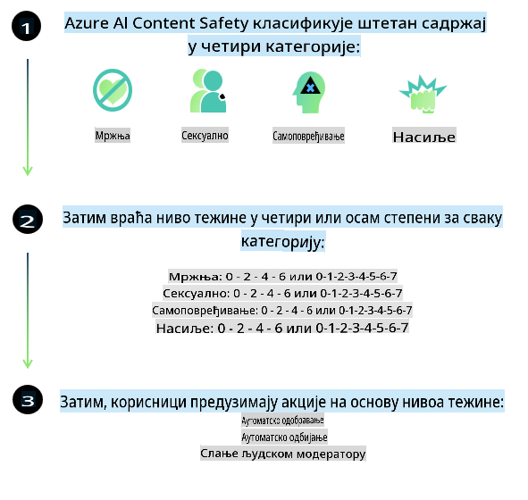
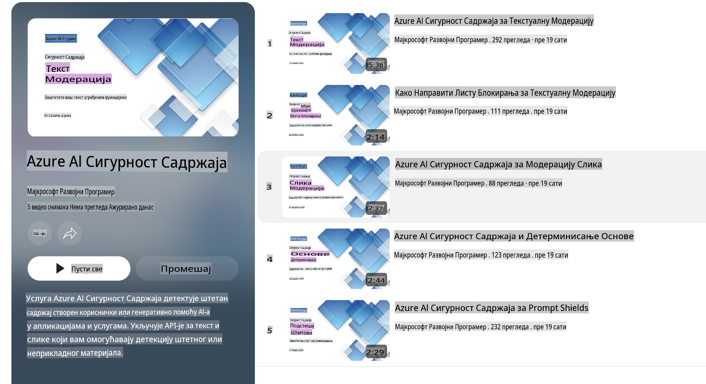

# Bezbednost AI-a za Phi modele
Porodica Phi modela razvijena je u skladu sa [Microsoft Standardom za Odgovorni AI](https://query.prod.cms.rt.microsoft.com/cms/api/am/binary/RE5cmFl), koji predstavlja skup zahteva na nivou kompanije, zasnovanih na sledećih šest principa: odgovornost, transparentnost, pravičnost, pouzdanost i bezbednost, privatnost i sigurnost, i inkluzivnost, koji čine [Microsoftove principe za Odgovorni AI](https://www.microsoft.com/ai/responsible-ai).

Kao i prethodni Phi modeli, usvojen je višestrani pristup evaluaciji i post-obuci za bezbednost, uz dodatne mere koje uzimaju u obzir višejezičke sposobnosti ovog izdanja. Naš pristup obuci i evaluaciji bezbednosti, uključujući testiranje na više jezika i kategorija rizika, detaljno je opisan u [Phi dokumentu o post-obuci za bezbednost](https://arxiv.org/abs/2407.13833). Iako Phi modeli imaju koristi od ovog pristupa, programeri bi trebalo da primenjuju najbolje prakse za odgovorni AI, uključujući mapiranje, merenje i ublažavanje rizika povezanih sa specifičnim slučajem upotrebe i kulturnim i jezičkim kontekstom.

## Najbolje prakse

Kao i drugi modeli, porodica Phi modela može se potencijalno ponašati na načine koji su nepravedni, nepouzdani ili uvredljivi.

Neki od ograničenih ponašanja SLM i LLM koje treba imati na umu uključuju:

- **Kvalitet usluge:** Phi modeli su prvenstveno obučeni na engleskom jeziku. Jezici osim engleskog mogu imati lošije performanse, a varijante engleskog jezika sa manjom zastupljenošću u podacima za obuku mogu imati lošije performanse u poređenju sa standardnim američkim engleskim.
- **Predstavljanje štetnih sadržaja i održavanje stereotipa:** Ovi modeli mogu previše ili premalo predstavljati određene grupe ljudi, zanemariti predstavljanje nekih grupa ili pojačati omalovažavajuće ili negativne stereotipe. Uprkos post-obuci za bezbednost, ova ograničenja mogu i dalje postojati zbog različitih nivoa zastupljenosti različitih grupa ili prevalencije primera negativnih stereotipa u podacima za obuku koji odražavaju stvarne obrasce i društvene predrasude.
- **Neprimeren ili uvredljiv sadržaj:** Ovi modeli mogu generisati druge vrste neprimerenog ili uvredljivog sadržaja, što može učiniti njihovu primenu neprikladnom za osetljive kontekste bez dodatnih mera prilagođenih specifičnom slučaju upotrebe.
- **Pouzdanost informacija:** Jezički modeli mogu generisati besmislen sadržaj ili izmišljene informacije koje deluju uverljivo, ali su netačne ili zastarele.
- **Ograničen obim za kod:** Većina podataka za obuku Phi-3 modela zasniva se na Python-u i koristi uobičajene pakete kao što su "typing, math, random, collections, datetime, itertools". Ako model generiše Python skripte koje koriste druge pakete ili skripte na drugim jezicima, snažno preporučujemo korisnicima da ručno provere sve API upotrebe.

Programeri bi trebalo da primenjuju najbolje prakse za odgovorni AI i odgovorni su za osiguravanje da specifičan slučaj upotrebe bude u skladu sa relevantnim zakonima i regulativama (npr. privatnost, trgovina itd.).

## Razmatranja za odgovorni AI

Kao i drugi jezički modeli, Phi modeli mogu se potencijalno ponašati na načine koji su nepravedni, nepouzdani ili uvredljivi. Neka od ograničenih ponašanja koja treba imati na umu uključuju:

**Kvalitet usluge:** Phi modeli su prvenstveno obučeni na engleskom jeziku. Jezici osim engleskog mogu imati lošije performanse. Varijante engleskog jezika sa manjom zastupljenošću u podacima za obuku mogu imati lošije performanse u poređenju sa standardnim američkim engleskim.

**Predstavljanje štetnih sadržaja i održavanje stereotipa:** Ovi modeli mogu previše ili premalo predstavljati određene grupe ljudi, zanemariti predstavljanje nekih grupa ili pojačati omalovažavajuće ili negativne stereotipe. Uprkos post-obuci za bezbednost, ova ograničenja mogu i dalje postojati zbog različitih nivoa zastupljenosti različitih grupa ili prevalencije primera negativnih stereotipa u podacima za obuku koji odražavaju stvarne obrasce i društvene predrasude.

**Neprimeren ili uvredljiv sadržaj:** Ovi modeli mogu generisati druge vrste neprimerenog ili uvredljivog sadržaja, što može učiniti njihovu primenu neprikladnom za osetljive kontekste bez dodatnih mera prilagođenih specifičnom slučaju upotrebe.

**Pouzdanost informacija:** Jezički modeli mogu generisati besmislen sadržaj ili izmišljene informacije koje deluju uverljivo, ali su netačne ili zastarele.

**Ograničen obim za kod:** Većina podataka za obuku Phi-3 modela zasniva se na Python-u i koristi uobičajene pakete kao što su "typing, math, random, collections, datetime, itertools". Ako model generiše Python skripte koje koriste druge pakete ili skripte na drugim jezicima, snažno preporučujemo korisnicima da ručno provere sve API upotrebe.

Programeri bi trebalo da primenjuju najbolje prakse za odgovorni AI i odgovorni su za osiguravanje da specifičan slučaj upotrebe bude u skladu sa relevantnim zakonima i regulativama (npr. privatnost, trgovina itd.). Važne oblasti za razmatranje uključuju:

**Raspodela:** Modeli možda nisu pogodni za scenarije koji bi mogli imati značajan uticaj na pravni status ili raspodelu resursa ili životnih prilika (npr. stanovanje, zapošljavanje, kredit itd.) bez dodatnih procena i tehnika za smanjenje pristrasnosti.

**Scenariji visokog rizika:** Programeri bi trebalo da procene prikladnost korišćenja modela u scenarijima visokog rizika gde nepravedni, nepouzdani ili uvredljivi izlazi mogu biti izuzetno skupi ili izazvati štetu. Ovo uključuje pružanje saveta u osetljivim ili stručnim domenima gde su tačnost i pouzdanost ključni (npr. pravni ili zdravstveni saveti). Dodatne mere zaštite treba implementirati na nivou aplikacije u skladu sa kontekstom primene.

**Dezinformacije:** Modeli mogu generisati netačne informacije. Programeri bi trebalo da prate najbolje prakse za transparentnost i informišu krajnje korisnike da komuniciraju sa AI sistemom. Na nivou aplikacije, programeri mogu izgraditi mehanizme za povratne informacije i procese za utemeljivanje odgovora u specifičnim informacijama u kontekstu upotrebe, tehniku poznatu kao Retrieval Augmented Generation (RAG).

**Generisanje štetnog sadržaja:** Programeri bi trebalo da procene izlaze u kontekstu i koriste dostupne klasifikatore bezbednosti ili prilagođena rešenja koja odgovaraju njihovom slučaju upotrebe.

**Zloupotreba:** Drugi oblici zloupotrebe, kao što su prevara, spam ili proizvodnja zlonamernog softvera, mogu biti mogući, i programeri bi trebalo da osiguraju da njihove aplikacije ne krše važeće zakone i regulative.

### Fino podešavanje i bezbednost AI sadržaja

Nakon fino podešavanja modela, toplo preporučujemo korišćenje mera [Azure AI Content Safety](https://learn.microsoft.com/azure/ai-services/content-safety/overview) za praćenje sadržaja koji generišu modeli, identifikaciju i blokiranje potencijalnih rizika, pretnji i problema sa kvalitetom.

[Azure AI Content Safety](https://learn.microsoft.com/azure/ai-services/content-safety/overview) podržava i tekstualni i slikovni sadržaj. Može se primeniti u oblaku, u izolovanim kontejnerima i na uređajima na ivici mreže ili ugrađenim uređajima.

## Pregled Azure AI Content Safety

Azure AI Content Safety nije univerzalno rešenje; može se prilagoditi kako bi se uskladilo sa specifičnim politikama kompanije. Pored toga, njegovi višejezički modeli omogućavaju razumevanje više jezika istovremeno.

- **Azure AI Content Safety**
- **Microsoft Developer**
- **5 videa**

Servis Azure AI Content Safety detektuje štetan sadržaj generisan od strane korisnika i AI sistema u aplikacijama i uslugama. Uključuje tekstualne i slikovne API-je koji omogućavaju detekciju štetnog ili neprimerenog materijala.

[AI Content Safety Plejlista](https://www.youtube.com/playlist?list=PLlrxD0HtieHjaQ9bJjyp1T7FeCbmVcPkQ)

**Одрицање од одговорности**:  
Овај документ је преведен коришћењем услуга машинског превођења заснованих на вештачкој интелигенцији. Иако тежимо тачности, молимо вас да имате у виду да аутоматски преводи могу садржати грешке или нетачности. Оригинални документ на његовом изворном језику треба сматрати ауторитативним извором. За критичне информације препоручује се професионални превод од стране људи. Не сносимо одговорност за било каква погрешна тумачења или неспоразуме који могу произаћи из коришћења овог превода.