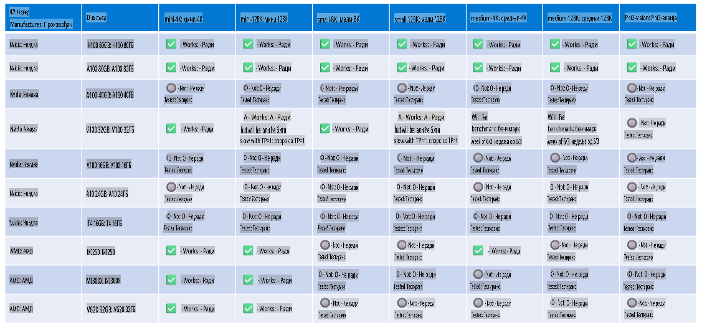

# Phi Hardverska Podrška

Microsoft Phi je optimizovan za ONNX Runtime i podržava Windows DirectML. Funkcioniše dobro na različitim tipovima hardvera, uključujući GPU-ove, CPU-ove, pa čak i mobilne uređaje.

## Hardver Uređaji  
Konkretno, podržani hardver uključuje:

- GPU SKU: RTX 4090 (DirectML)  
- GPU SKU: 1 A100 80GB (CUDA)  
- CPU SKU: Standard F64s v2 (64 vCPU-a, 128 GiB memorije)  

## Mobilni SKU

- Android - Samsung Galaxy S21  
- Apple iPhone 14 ili noviji sa A16/A17 procesorom  

## Phi Hardverske Specifikacije

- Minimalna konfiguracija koja je potrebna.  
- Windows: GPU kompatibilan sa DirectX 12 i minimum 4GB kombinovane RAM memorije  

CUDA: NVIDIA GPU sa Compute Capability >= 7.02  



## Pokretanje onnxruntime-a na više GPU-ova  

Trenutno dostupni Phi ONNX modeli su samo za jedan GPU. Moguće je omogućiti podršku za više GPU-ova za Phi model, ali ORT sa 2 GPU-a ne garantuje da će dati veći throughput u poređenju sa 2 instance ORT-a. Pogledajte [ONNX Runtime](https://onnxruntime.ai/) za najnovije informacije.

Na [Build 2024, GenAI ONNX tim](https://youtu.be/WLW4SE8M9i8?si=EtG04UwDvcjunyfC) je objavio da su omogućili multi-instance umesto multi-GPU za Phi modele.

Trenutno ovo omogućava da pokrenete jednu onnxruntime ili onnxruntime-genai instancu sa CUDA_VISIBLE_DEVICES promenljivom okruženja na sledeći način.

```Python
CUDA_VISIBLE_DEVICES=0 python infer.py
CUDA_VISIBLE_DEVICES=1 python infer.py
```

Slobodno istražite Phi dodatno na [Azure AI Foundry](https://ai.azure.com)

**Одрицање од одговорности**:  
Овај документ је преведен помоћу услуга машинског превођења заснованих на вештачкој интелигенцији. Иако настојимо да обезбедимо тачност, молимо вас да имате у виду да аутоматски преводи могу садржати грешке или нетачности. Оригинални документ на његовом изворном језику треба сматрати меродавним извором. За критичне информације препоручује се професионални превод од стране људи. Не преузимамо одговорност за било каква погрешна тумачења или неспоразуме који могу проистећи из употребе овог превода.