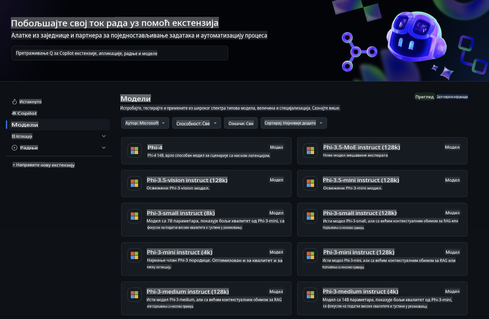
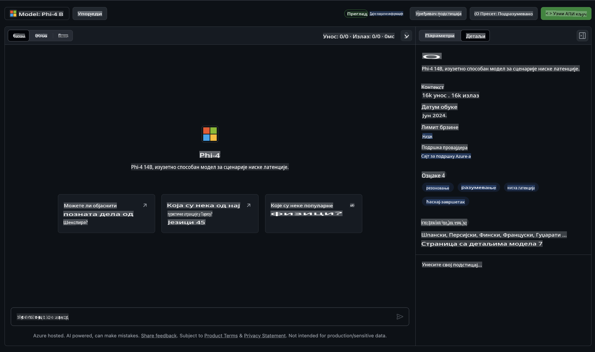
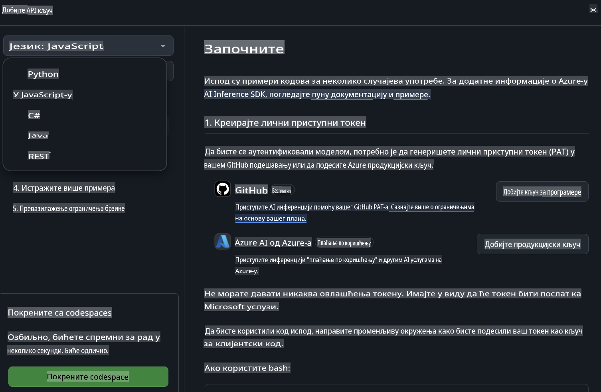
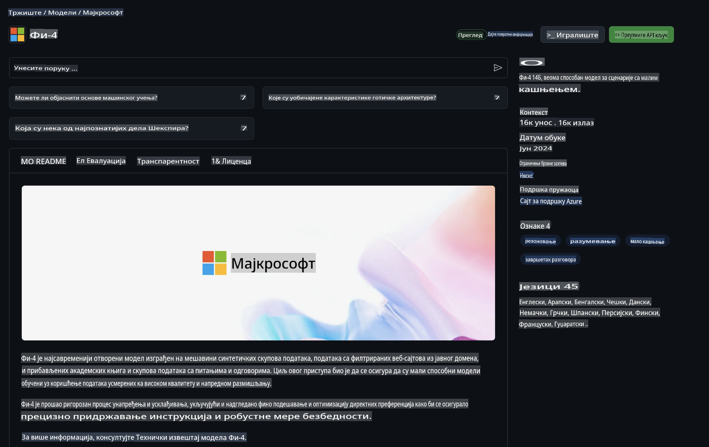

## Phi Porodica u GitHub Modelima

Dobrodošli na [GitHub Models](https://github.com/marketplace/models)! Sve je spremno da istražite AI modele hostovane na Azure AI.



Za više informacija o modelima dostupnim na GitHub Models, posetite [GitHub Model Marketplace](https://github.com/marketplace/models).

## Dostupni Modeli

Svaki model ima posvećen playground i primer koda.



### Phi Porodica u GitHub Model Katalogu

- [Phi-4](https://github.com/marketplace/models/azureml/Phi-4)

- [Phi-3.5-MoE instruct (128k)](https://github.com/marketplace/models/azureml/Phi-3-5-MoE-instruct)

- [Phi-3.5-vision instruct (128k)](https://github.com/marketplace/models/azureml/Phi-3-5-vision-instruct)

- [Phi-3.5-mini instruct (128k)](https://github.com/marketplace/models/azureml/Phi-3-5-mini-instruct)

- [Phi-3-Medium-128k-Instruct](https://github.com/marketplace/models/azureml/Phi-3-medium-128k-instruct)

- [Phi-3-medium-4k-instruct](https://github.com/marketplace/models/azureml/Phi-3-medium-4k-instruct)

- [Phi-3-mini-128k-instruct](https://github.com/marketplace/models/azureml/Phi-3-mini-128k-instruct)

- [Phi-3-mini-4k-instruct](https://github.com/marketplace/models/azureml/Phi-3-mini-4k-instruct)

- [Phi-3-small-128k-instruct](https://github.com/marketplace/models/azureml/Phi-3-small-128k-instruct)

- [Phi-3-small-8k-instruct](https://github.com/marketplace/models/azureml/Phi-3-small-8k-instruct)

## Kako Početi

Postoji nekoliko osnovnih primera spremnih za pokretanje. Možete ih pronaći u direktorijumu sa primerima. Ako želite odmah preći na omiljeni programski jezik, primeri su dostupni na sledećim jezicima:

- Python  
- JavaScript  
- C#  
- Java  
- cURL  

Postoji i posvećeno Codespaces okruženje za pokretanje primera i modela.



## Primer Koda

Ispod su primeri kodova za nekoliko slučajeva upotrebe. Za dodatne informacije o Azure AI Inference SDK, pogledajte kompletnu dokumentaciju i primere.

## Podešavanje

1. Kreirajte lični pristupni token  
Ne morate dodeliti nikakve dozvole tokenu. Imajte na umu da će token biti poslat Microsoft servisu.

Da biste koristili dole navedene kodove, kreirajte promenljivu okruženja kako biste postavili token kao ključ za klijentski kod.

Ako koristite bash:  
```
export GITHUB_TOKEN="<your-github-token-goes-here>"
```  
Ako koristite PowerShell:  
```
$Env:GITHUB_TOKEN="<your-github-token-goes-here>"
```  

Ako koristite Windows Command Prompt:  
```
set GITHUB_TOKEN=<your-github-token-goes-here>
```  

## Python Primer

### Instalacija zavisnosti  
Instalirajte Azure AI Inference SDK koristeći pip (zahteva: Python >=3.8):  

```
pip install azure-ai-inference
```  

### Pokrenite osnovni primer koda  

Ovaj primer demonstrira osnovni poziv API-ju za završetak četa. Koristi GitHub AI endpoint za inferenciju modela i vaš GitHub token. Poziv je sinhron.  

```python
import os
from azure.ai.inference import ChatCompletionsClient
from azure.ai.inference.models import SystemMessage, UserMessage
from azure.core.credentials import AzureKeyCredential

endpoint = "https://models.inference.ai.azure.com"
model_name = "Phi-4"
token = os.environ["GITHUB_TOKEN"]

client = ChatCompletionsClient(
    endpoint=endpoint,
    credential=AzureKeyCredential(token),
)

response = client.complete(
    messages=[
        UserMessage(content="I have $20,000 in my savings account, where I receive a 4% profit per year and payments twice a year. Can you please tell me how long it will take for me to become a millionaire? Also, can you please explain the math step by step as if you were explaining it to an uneducated person?"),
    ],
    temperature=0.4,
    top_p=1.0,
    max_tokens=2048,
    model=model_name
)

print(response.choices[0].message.content)
```  

### Pokrenite višestruki razgovor  

Ovaj primer pokazuje višestruki razgovor sa API-jem za završetak četa. Kada koristite model za čet aplikaciju, potrebno je da upravljate istorijom razgovora i šaljete najnovije poruke modelu.  

```
import os
from azure.ai.inference import ChatCompletionsClient
from azure.ai.inference.models import AssistantMessage, SystemMessage, UserMessage
from azure.core.credentials import AzureKeyCredential

token = os.environ["GITHUB_TOKEN"]
endpoint = "https://models.inference.ai.azure.com"
# Replace Model_Name
model_name = "Phi-4"

client = ChatCompletionsClient(
    endpoint=endpoint,
    credential=AzureKeyCredential(token),
)

messages = [
    SystemMessage(content="You are a helpful assistant."),
    UserMessage(content="What is the capital of France?"),
    AssistantMessage(content="The capital of France is Paris."),
    UserMessage(content="What about Spain?"),
]

response = client.complete(messages=messages, model=model_name)

print(response.choices[0].message.content)
```  

### Strimovanje izlaza  

Za bolje korisničko iskustvo, želećete da strimujete odgovor modela tako da se prvi token pojavi ranije i izbegnete čekanje na duge odgovore.  

```
import os
from azure.ai.inference import ChatCompletionsClient
from azure.ai.inference.models import SystemMessage, UserMessage
from azure.core.credentials import AzureKeyCredential

token = os.environ["GITHUB_TOKEN"]
endpoint = "https://models.inference.ai.azure.com"
# Replace Model_Name
model_name = "Phi-4"

client = ChatCompletionsClient(
    endpoint=endpoint,
    credential=AzureKeyCredential(token),
)

response = client.complete(
    stream=True,
    messages=[
        SystemMessage(content="You are a helpful assistant."),
        UserMessage(content="Give me 5 good reasons why I should exercise every day."),
    ],
    model=model_name,
)

for update in response:
    if update.choices:
        print(update.choices[0].delta.content or "", end="")

client.close()
```  

## BESPLATNO Korišćenje i Ograničenja za GitHub Modele



[Ograničenja za playground i besplatno API korišćenje](https://docs.github.com/en/github-models/prototyping-with-ai-models#rate-limits) osmišljena su da vam pomognu u eksperimentisanju sa modelima i prototipiranju AI aplikacija. Za korišćenje izvan tih ograničenja i skaliranje aplikacije, morate obezbediti resurse sa Azure naloga i autentifikovati se odatle umesto vašeg GitHub ličnog tokena. Ne morate menjati ništa drugo u kodu. Koristite ovaj link da otkrijete kako prevazići ograničenja besplatnog nivoa u Azure AI.

### Obaveštenja  

Zapamtite da prilikom interakcije sa modelom eksperimentišete sa AI, tako da su greške u sadržaju moguće.

Funkcija je podložna različitim ograničenjima (uključujući zahteve po minutu, zahteve po danu, tokene po zahtevu i istovremene zahteve) i nije dizajnirana za produkcijske slučajeve upotrebe.

GitHub Models koristi Azure AI Content Safety. Ovi filteri ne mogu biti isključeni kao deo GitHub Models iskustva. Ako odlučite da koristite modele putem plaćene usluge, podesite filtere sadržaja prema vašim zahtevima.

Ova usluga je pod GitHub-ovim Uslovima za Prethodna Izdanja.

**Одрицање од одговорности**:  
Овај документ је преведен коришћењем услуга машинског превођења заснованих на вештачкој интелигенцији. Иако настојимо да обезбедимо тачност, имајте у виду да аутоматски преводи могу садржати грешке или нетачности. Оригинални документ на његовом изворном језику треба сматрати ауторитативним извором. За критичне информације препоручује се професионални превод од стране људи. Не сносимо одговорност за било каква неспоразумe или погрешна тумачења која могу произаћи из коришћења овог превода.