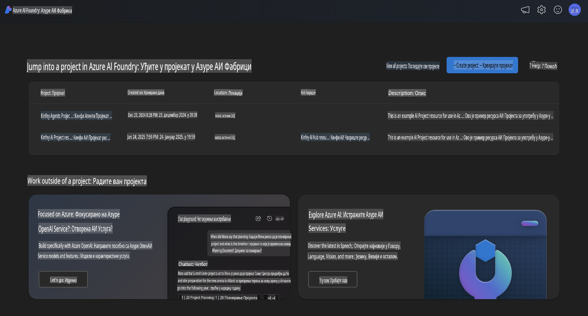
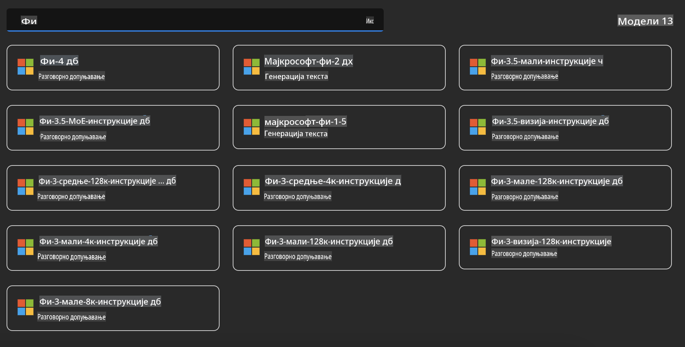
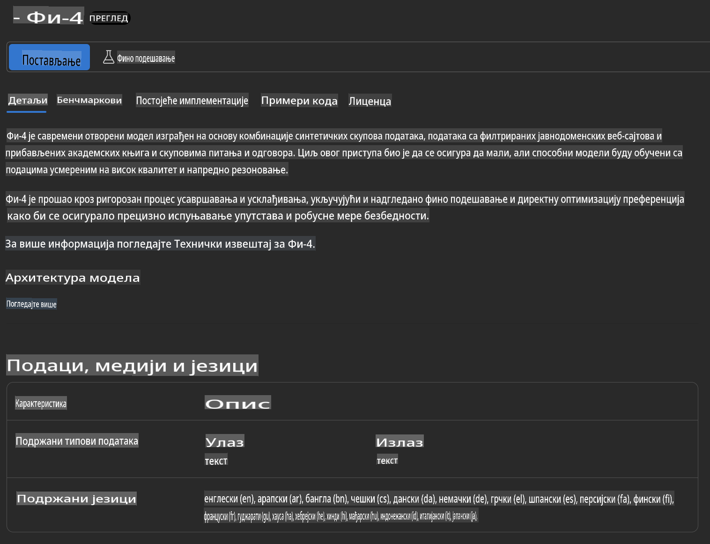
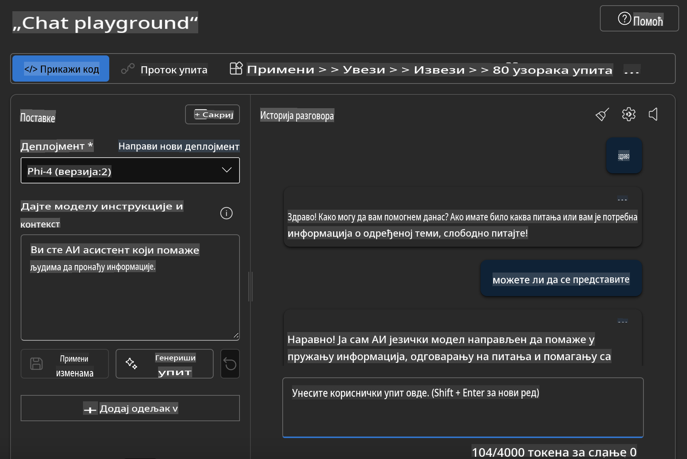

## Phi Porodica u Azure AI Foundry

[Azure AI Foundry](https://ai.azure.com) je pouzdana platforma koja omogućava programerima da podstaknu inovacije i oblikuju budućnost sa veštačkom inteligencijom na siguran, bezbedan i odgovoran način.

[Azure AI Foundry](https://ai.azure.com) je osmišljen za programere da:

- Prave generativne AI aplikacije na platformi poslovnog nivoa.
- Istražuju, razvijaju, testiraju i implementiraju koristeći najsavremenije AI alate i ML modele, uz poštovanje principa odgovorne AI prakse.
- Sarađuju sa timom tokom celokupnog životnog ciklusa razvoja aplikacija.

Uz Azure AI Foundry, možete istraživati širok spektar modela, usluga i mogućnosti, i krenuti sa izradom AI aplikacija koje najbolje odgovaraju vašim ciljevima. Platforma Azure AI Foundry omogućava skalabilnost za transformaciju prototipova u potpuno razvijene proizvodne aplikacije s lakoćom. Kontinuirano praćenje i usavršavanje podržavaju dugoročni uspeh.



Pored korišćenja Azure AOAI Service u Azure AI Foundry, možete koristiti i modele trećih strana u Azure AI Foundry Model Catalog. Ovo je dobar izbor ako želite da koristite Azure AI Foundry kao vašu AI platformu za rešenja.

Možemo brzo implementirati Phi Porodične Modele kroz Model Catalog u Azure AI Foundry.



### **Implementacija Phi-4 u Azure AI Foundry**



### **Testiranje Phi-4 u Azure AI Foundry Playground**



### **Pokretanje Python koda za pozivanje Azure AI Foundry Phi-4**

```python

import os  
import base64
from openai import AzureOpenAI  
from azure.identity import DefaultAzureCredential, get_bearer_token_provider  
        
endpoint = os.getenv("ENDPOINT_URL", "Your Azure AOAI Service Endpoint")  
deployment = os.getenv("DEPLOYMENT_NAME", "Phi-4")  
      
token_provider = get_bearer_token_provider(  
    DefaultAzureCredential(),  
    "https://cognitiveservices.azure.com/.default"  
)  
  
client = AzureOpenAI(  
    azure_endpoint=endpoint,  
    azure_ad_token_provider=token_provider,  
    api_version="2024-05-01-preview",  
)  
  

chat_prompt = [
    {
        "role": "system",
        "content": "You are an AI assistant that helps people find information."
    },
    {
        "role": "user",
        "content": "can you introduce yourself"
    }
] 
    
# Include speech result if speech is enabled  
messages = chat_prompt 

completion = client.chat.completions.create(  
    model=deployment,  
    messages=messages,
    max_tokens=800,  
    temperature=0.7,  
    top_p=0.95,  
    frequency_penalty=0,  
    presence_penalty=0,
    stop=None,  
    stream=False  
)  
  
print(completion.to_json())  

```

**Одрицање од одговорности**:  
Овај документ је преведен коришћењем услуга машинског превођења базираног на вештачкој интелигенцији. Иако се трудимо да обезбедимо тачност, молимо вас да имате у виду да аутоматизовани преводи могу садржати грешке или нетачности. Оригинални документ на изворном језику треба сматрати ауторитативним извором. За критичне информације препоручује се професионални превод од стране људи. Не сносимо одговорност за било каква неспоразума или погрешна тумачења настала коришћењем овог превода.