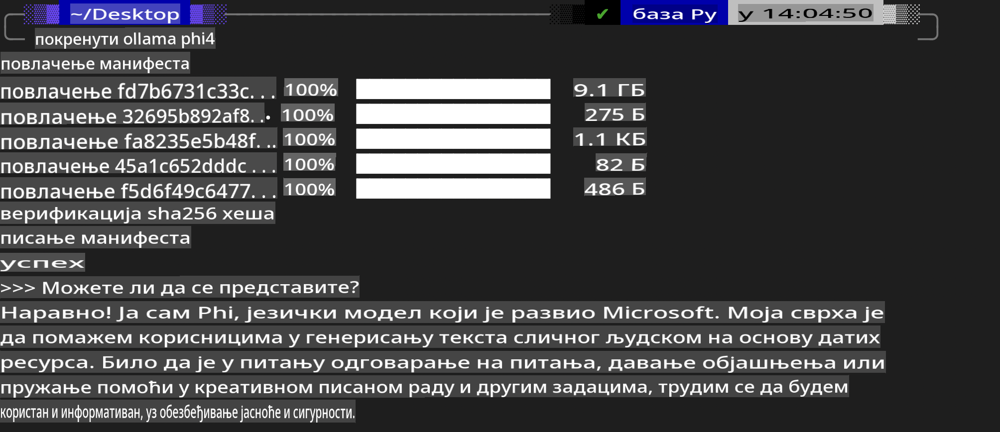
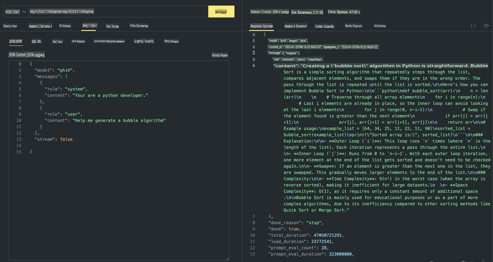

## Phi porodica u Ollama

[Ollama](https://ollama.com) omogućava većem broju ljudi da direktno koriste open source LLM ili SLM putem jednostavnih skripti, a takođe može kreirati API-je koji pomažu u lokalnim Copilot aplikacionim scenarijima.

## **1. Instalacija**

Ollama podržava rad na Windows, macOS i Linux operativnim sistemima. Možete instalirati Ollama putem ovog linka ([https://ollama.com/download](https://ollama.com/download)). Nakon uspešne instalacije, možete direktno koristiti Ollama skriptu za pozivanje Phi-3 kroz terminal prozor. Sve [dostupne biblioteke u Ollama](https://ollama.com/library) možete videti na linku. Ako otvorite ovaj repozitorijum u Codespace-u, Ollama će već biti instalirana.

```bash

ollama run phi4

```

> [!NOTE]
> Model će se preuzeti prvi put kada ga pokrenete. Naravno, možete i direktno odrediti već preuzet Phi-4 model. Kao primer koristimo WSL za pokretanje komande. Nakon što se model uspešno preuzme, možete direktno komunicirati putem terminala.



## **2. Pozivanje phi-4 API-ja iz Ollama**

Ako želite da pozovete Phi-4 API koji generiše Ollama, možete koristiti ovu komandu u terminalu da pokrenete Ollama server.

```bash

ollama serve

```

> [!NOTE]
> Ako koristite macOS ili Linux, imajte na umu da možete naići na sledeću grešku **"Error: listen tcp 127.0.0.1:11434: bind: address already in use"**. Ova greška se može pojaviti prilikom pokretanja komande. Možete je ignorisati, jer obično ukazuje na to da server već radi, ili možete zaustaviti i ponovo pokrenuti Ollama:

**macOS**

```bash

brew services restart ollama

```

**Linux**

```bash

sudo systemctl stop ollama

```

Ollama podržava dva API-ja: generate i chat. Možete pozvati model API koji Ollama pruža prema vašim potrebama, slanjem zahteva lokalnoj usluzi koja radi na portu 11434.

**Chat**

```bash

curl http://127.0.0.1:11434/api/chat -d '{
  "model": "phi3",
  "messages": [
    {
      "role": "system",
      "content": "Your are a python developer."
    },
    {
      "role": "user",
      "content": "Help me generate a bubble algorithm"
    }
  ],
  "stream": false
  
}'

This is the result in Postman



## Additional Resources

Check the list of available models in Ollama in [their library](https://ollama.com/library).

Pull your model from the Ollama server using this command

```bash
ollama pull phi4
```

Run the model using this command

```bash
ollama run phi4
```

***Note:*** Visit this link [https://github.com/ollama/ollama/blob/main/docs/api.md](https://github.com/ollama/ollama/blob/main/docs/api.md) to learn more

## Calling Ollama from Python

You can use `requests` or `urllib3` to make requests to the local server endpoints used above. However, a popular way to use Ollama in Python is via the [openai](https://pypi.org/project/openai/) SDK, since Ollama provides OpenAI-compatible server endpoints as well.

Here is an example for phi3-mini:

```python
import openai

client = openai.OpenAI(
    base_url="http://localhost:11434/v1",
    api_key="nokeyneeded",
)

response = client.chat.completions.create(
    model="phi4",
    temperature=0.7,
    n=1,
    messages=[
        {"role": "system", "content": "You are a helpful assistant."},
        {"role": "user", "content": "Write a haiku about a hungry cat"},
    ],
)

print("Response:")
print(response.choices[0].message.content)
```

## Calling Ollama from JavaScript 

```javascript
// Primer sažimanja fajla pomoću Phi-4
script({
    model: "ollama:phi4",
    title: "Summarize with Phi-4",
    system: ["system"],
})

// Primer sažimanja
const file = def("FILE", env.files)
$`Summarize ${file} in a single paragraph.`
```

## Calling Ollama from C#

Create a new C# Console application and add the following NuGet package:

```bash
dotnet add package Microsoft.SemanticKernel --version 1.34.0
```

Then replace this code in the `Program.cs` file

```csharp
using Microsoft.SemanticKernel;
using Microsoft.SemanticKernel.ChatCompletion;

// dodavanje servisa za chat completion pomoću lokalnog Ollama servera
#pragma warning disable SKEXP0001, SKEXP0003, SKEXP0010, SKEXP0011, SKEXP0050, SKEXP0052
builder.AddOpenAIChatCompletion(
    modelId: "phi4",
    endpoint: new Uri("http://localhost:11434/"),
    apiKey: "non required");

// pokretanje jednostavnog upita za chat servis
string prompt = "Write a joke about kittens";
var response = await kernel.InvokePromptAsync(prompt);
Console.WriteLine(response.GetValue<string>());
```

Run the app with the command:

```bash
dotnet run

**Одрицање од одговорности**:  
Овај документ је преведен коришћењем услуга машинског превођења заснованих на вештачкој интелигенцији. Иако се трудимо да обезбедимо тачност, молимо вас да имате у виду да аутоматски преводи могу садржати грешке или нетачности. Оригинални документ на изворном језику треба сматрати ауторитативним извором. За критичне информације препоручује се професионални људски превод. Не сносимо одговорност за било каква погрешна тумачења или неспоразуме који могу настати услед коришћења овог превода.