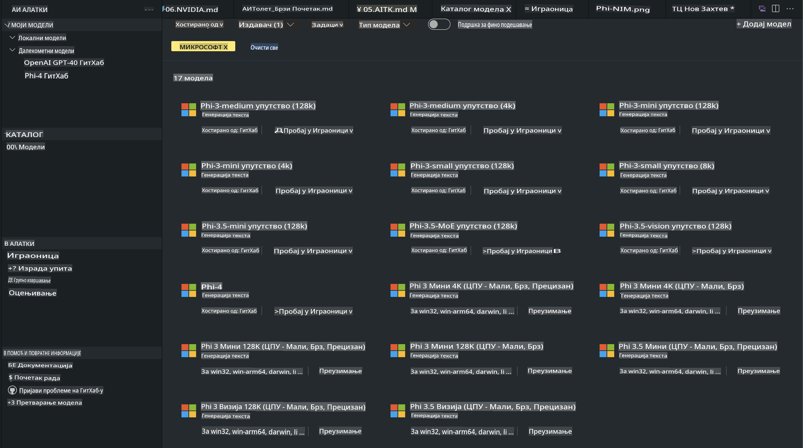

# Phi porodica u AITK

[AI Toolkit za VS Code](https://marketplace.visualstudio.com/items?itemName=ms-windows-ai-studio.windows-ai-studio) pojednostavljuje razvoj aplikacija sa generativnom veštačkom inteligencijom spajajući najnovije alate za razvoj veštačke inteligencije i modele iz Azure AI Foundry kataloga i drugih kataloga kao što je Hugging Face. Možete pregledati katalog AI modela koji pokreću GitHub Models i Azure AI Foundry katalozi modela, preuzeti ih lokalno ili na daljinu, fino prilagoditi, testirati i koristiti ih u vašoj aplikaciji.

AI Toolkit Preview radi lokalno. Lokalna inferencija ili fino prilagođavanje zavisi od modela koji odaberete, a možda će vam biti potreban GPU, kao što je NVIDIA CUDA GPU. GitHub modeli se takođe mogu direktno pokretati putem AITK.

## Početak rada

[Saznajte više o instalaciji Windows pod-sistema za Linux](https://learn.microsoft.com/windows/wsl/install?WT.mc_id=aiml-137032-kinfeylo)

i [promeni podrazumevanu distribuciju](https://learn.microsoft.com/windows/wsl/install#change-the-default-linux-distribution-installed).

[AI Toolkit GitHub Repo](https://github.com/microsoft/vscode-ai-toolkit/)

- Windows, Linux, macOS
  
- Za fino prilagođavanje na Windows i Linux platformama potreban vam je Nvidia GPU. Pored toga, **Windows** zahteva pod-sistem za Linux sa Ubuntu distribucijom 18.4 ili novijom. [Saznajte više o instalaciji Windows pod-sistema za Linux](https://learn.microsoft.com/windows/wsl/install) i [promeni podrazumevanu distribuciju](https://learn.microsoft.com/windows/wsl/install#change-the-default-linux-distribution-installed).

### Instalacija AI Toolkita

AI Toolkit dolazi kao [Visual Studio Code ekstenzija](https://code.visualstudio.com/docs/setup/additional-components#_vs-code-extensions), tako da je potrebno prvo instalirati [VS Code](https://code.visualstudio.com/docs/setup/windows?WT.mc_id=aiml-137032-kinfeylo), a zatim preuzeti AI Toolkit sa [VS Marketplace](https://marketplace.visualstudio.com/items?itemName=ms-windows-ai-studio.windows-ai-studio).
[AI Toolkit je dostupan na Visual Studio Marketplace](https://marketplace.visualstudio.com/items?itemName=ms-windows-ai-studio.windows-ai-studio) i može se instalirati kao i svaka druga VS Code ekstenzija.

Ako niste upoznati sa instalacijom VS Code ekstenzija, sledite sledeće korake:

### Prijavljivanje

1. U traci aktivnosti u VS Code izaberite **Extensions**
2. U pretraživaču ekstenzija ukucajte "AI Toolkit"
3. Izaberite "AI Toolkit for Visual Studio code"
4. Kliknite na **Install**

Sada ste spremni za korišćenje ekstenzije!

Bićete pozvani da se prijavite na GitHub, pa kliknite na "Allow" da nastavite. Bićete preusmereni na GitHub stranicu za prijavljivanje.

Prijavite se i sledite korake procesa. Nakon uspešnog završetka, bićete vraćeni u VS Code.

Kada instalirate ekstenziju, ikonica AI Toolkita će se pojaviti u vašoj traci aktivnosti.

Hajde da istražimo dostupne opcije!

### Dostupne opcije

Glavna bočna traka AI Toolkita je organizovana u:

- **Models**
- **Resources**
- **Playground**  
- **Fine-tuning**
- **Evaluation**

Ove opcije su dostupne u sekciji Resources. Da biste započeli, izaberite **Model Catalog**.

### Preuzimanje modela iz kataloga

Kada pokrenete AI Toolkit iz bočne trake VS Code-a, možete birati između sledećih opcija:



- Pronađite podržani model u **Model Catalog** i preuzmite ga lokalno
- Testirajte inferenciju modela u **Model Playground**
- Fino prilagodite model lokalno ili na daljinu u **Model Fine-tuning**
- Implementirajte fino prilagođene modele u oblaku putem komandne palete za AI Toolkit
- Procena modela

> [!NOTE]
>
> **GPU Vs CPU**
>
> Videćete da kartice modela prikazuju veličinu modela, platformu i tip akceleratora (CPU, GPU). Za optimizovane performanse na **Windows uređajima koji imaju barem jedan GPU**, izaberite verzije modela koje ciljaju samo Windows.
>
> Ovo osigurava da imate model optimizovan za DirectML akcelerator.
>
> Imena modela su u formatu
>
> - `{model_name}-{accelerator}-{quantization}-{format}`.
>
>Da biste proverili da li imate GPU na vašem Windows uređaju, otvorite **Task Manager** i izaberite karticu **Performance**. Ako imate GPU(ove), oni će biti navedeni pod imenima poput "GPU 0" ili "GPU 1".

### Pokretanje modela u playground-u

Kada su svi parametri postavljeni, kliknite na **Generate Project**.

Nakon što se vaš model preuzme, izaberite **Load in Playground** na kartici modela u katalogu:

- Pokrenite preuzimanje modela
- Instalirajte sve potrebne zavisnosti
- Kreirajte VS Code radno okruženje


### Korišćenje REST API-ja u vašoj aplikaciji 

AI Toolkit dolazi sa lokalnim REST API web serverom **na portu 5272** koji koristi [OpenAI chat completions format](https://platform.openai.com/docs/api-reference/chat/create). 

Ovo vam omogućava da testirate vašu aplikaciju lokalno bez oslanjanja na cloud AI model servis. Na primer, sledeći JSON fajl prikazuje kako da konfigurišete telo zahteva:

```json
{
    "model": "Phi-4",
    "messages": [
        {
            "role": "user",
            "content": "what is the golden ratio?"
        }
    ],
    "temperature": 0.7,
    "top_p": 1,
    "top_k": 10,
    "max_tokens": 100,
    "stream": true
}
```

Možete testirati REST API koristeći (na primer) [Postman](https://www.postman.com/) ili CURL (Client URL) alat:

```bash
curl -vX POST http://127.0.0.1:5272/v1/chat/completions -H 'Content-Type: application/json' -d @body.json
```

### Korišćenje OpenAI klijentske biblioteke za Python

```python
from openai import OpenAI

client = OpenAI(
    base_url="http://127.0.0.1:5272/v1/", 
    api_key="x" # required for the API but not used
)

chat_completion = client.chat.completions.create(
    messages=[
        {
            "role": "user",
            "content": "what is the golden ratio?",
        }
    ],
    model="Phi-4",
)

print(chat_completion.choices[0].message.content)
```

### Korišćenje Azure OpenAI klijentske biblioteke za .NET

Dodajte [Azure OpenAI klijentsku biblioteku za .NET](https://www.nuget.org/packages/Azure.AI.OpenAI/) u vaš projekat koristeći NuGet:

```bash
dotnet add {project_name} package Azure.AI.OpenAI --version 1.0.0-beta.17
```

Dodajte C# fajl pod nazivom **OverridePolicy.cs** u vaš projekat i zalepite sledeći kod:

```csharp
// OverridePolicy.cs
using Azure.Core.Pipeline;
using Azure.Core;

internal partial class OverrideRequestUriPolicy(Uri overrideUri)
    : HttpPipelineSynchronousPolicy
{
    private readonly Uri _overrideUri = overrideUri;

    public override void OnSendingRequest(HttpMessage message)
    {
        message.Request.Uri.Reset(_overrideUri);
    }
}
```

Zatim zalepite sledeći kod u vaš **Program.cs** fajl:

```csharp
// Program.cs
using Azure.AI.OpenAI;

Uri localhostUri = new("http://localhost:5272/v1/chat/completions");

OpenAIClientOptions clientOptions = new();
clientOptions.AddPolicy(
    new OverrideRequestUriPolicy(localhostUri),
    Azure.Core.HttpPipelinePosition.BeforeTransport);
OpenAIClient client = new(openAIApiKey: "unused", clientOptions);

ChatCompletionsOptions options = new()
{
    DeploymentName = "Phi-4",
    Messages =
    {
        new ChatRequestSystemMessage("You are a helpful assistant. Be brief and succinct."),
        new ChatRequestUserMessage("What is the golden ratio?"),
    }
};

StreamingResponse<StreamingChatCompletionsUpdate> streamingChatResponse
    = await client.GetChatCompletionsStreamingAsync(options);

await foreach (StreamingChatCompletionsUpdate chatChunk in streamingChatResponse)
{
    Console.Write(chatChunk.ContentUpdate);
}
```

## Fino prilagođavanje sa AI Toolkitom

- Počnite sa otkrivanjem modela i playground-om.
- Fino prilagođavanje modela i inferencija koristeći lokalne resurse.
- Daljinsko fino prilagođavanje i inferencija koristeći Azure resurse.

[Fino prilagođavanje sa AI Toolkitom](../../03.FineTuning/Finetuning_VSCodeaitoolkit.md)

## Resursi za pitanja i odgovore o AI Toolkitu

Molimo pogledajte našu [stranicu za pitanja i odgovore](https://github.com/microsoft/vscode-ai-toolkit/blob/main/archive/QA.md) za najčešće probleme i rešenja.

**Одрицање од одговорности**:  
Овај документ је преведен коришћењем услуга машинског превођења заснованих на вештачкој интелигенцији. Иако настојимо да обезбедимо тачност, имајте у виду да аутоматски преводи могу садржати грешке или нетачности. Оригинални документ на изворном језику треба сматрати меродавним извором. За критичне информације препоручује се професионални превод од стране људи. Не сносимо одговорност за било каква погрешна тумачења или неспоразуме који могу настати услед коришћења овог превода.