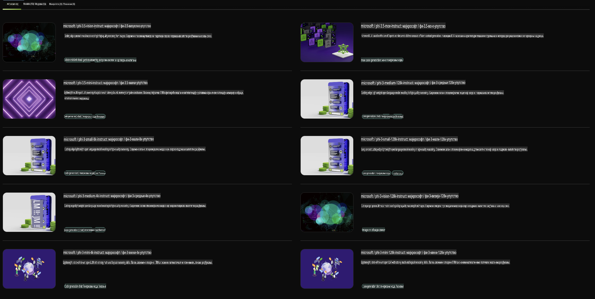

## Phi porodica u NVIDIA NIM-u

NVIDIA NIM je skup lako upotrebljivih mikroservisa dizajniranih za ubrzanje implementacije generativnih AI modela preko oblaka, data centara i radnih stanica. NIM-ovi su kategorizovani po porodicama modela i na osnovu pojedinačnih modela. Na primer, NVIDIA NIM za velike jezičke modele (LLM-ove) donosi moć najsavremenijih LLM-ova u poslovne aplikacije, pružajući neprevaziđene mogućnosti obrade i razumevanja prirodnog jezika.

NIM omogućava IT i DevOps timovima da samostalno hostuju velike jezičke modele (LLM-ove) u sopstvenim upravljanim okruženjima, dok istovremeno obezbeđuje programerima industrijske standardne API-je koji im omogućavaju da kreiraju moćne kopilote, chatbotove i AI asistente koji mogu transformisati njihovo poslovanje. Iskorišćavajući NVIDIA-ino vrhunsko GPU ubrzanje i skalabilnu implementaciju, NIM nudi najbrži put do inferenciranja sa neuporedivim performansama.

Možete koristiti NVIDIA NIM za inferenciranje Phi porodice modela.



### **Primeri - Phi-3-Vision u NVIDIA NIM-u**

Zamislite da imate sliku (`demo.png`) i želite da generišete Python kod koji obrađuje ovu sliku i čuva novu verziju (`phi-3-vision.jpg`).

Gornji kod automatizuje ovaj proces tako što:

1. Postavlja okruženje i potrebne konfiguracije.
2. Kreira prompt koji instruira model da generiše potreban Python kod.
3. Šalje prompt modelu i prikuplja generisani kod.
4. Ekstrahuje i izvršava generisani kod.
5. Prikazuje originalnu i obrađenu sliku.

Ovaj pristup koristi moć AI-a za automatizaciju zadataka obrade slika, čineći postizanje ciljeva lakšim i bržim.

[Rešenje primera koda](../../../../../code/06.E2E/E2E_Nvidia_NIM_Phi3_Vision.ipynb)

Razložimo šta ceo kod radi, korak po korak:

1. **Instaliranje potrebnog paketa**:
    ```python
    !pip install langchain_nvidia_ai_endpoints -U
    ```  
    Ova komanda instalira paket `langchain_nvidia_ai_endpoints`, osiguravajući da je u najnovijoj verziji.

2. **Uvoz potrebnih modula**:
    ```python
    from langchain_nvidia_ai_endpoints import ChatNVIDIA
    import getpass
    import os
    import base64
    ```  
    Ovi uvozi omogućavaju interakciju sa NVIDIA AI endpointima, bezbedno rukovanje lozinkama, interakciju sa operativnim sistemom i kodiranje/dekodiranje podataka u base64 formatu.

3. **Postavljanje API ključa**:
    ```python
    if not os.getenv("NVIDIA_API_KEY"):
        os.environ["NVIDIA_API_KEY"] = getpass.getpass("Enter your NVIDIA API key: ")
    ```  
    Ovaj kod proverava da li je postavljena promenljiva okruženja `NVIDIA_API_KEY`. Ako nije, korisnika se traži da unese svoj API ključ na bezbedan način.

4. **Definisanje modela i putanje slike**:
    ```python
    model = 'microsoft/phi-3-vision-128k-instruct'
    chat = ChatNVIDIA(model=model)
    img_path = './imgs/demo.png'
    ```  
    Ovo postavlja model koji će se koristiti, kreira instancu `ChatNVIDIA` sa specificiranim modelom i definiše putanju do fajla sa slikom.

5. **Kreiranje tekstualnog prompta**:
    ```python
    text = "Please create Python code for image, and use plt to save the new picture under imgs/ and name it phi-3-vision.jpg."
    ```  
    Ovo definiše tekstualni prompt koji instruira model da generiše Python kod za obradu slike.

6. **Kodiranje slike u Base64**:
    ```python
    with open(img_path, "rb") as f:
        image_b64 = base64.b64encode(f.read()).decode()
    image = f''
    ```  
    Ovaj kod čita fajl slike, kodira ga u base64 formatu i kreira HTML oznaku slike sa kodiranim podacima.

7. **Kombinovanje teksta i slike u prompt**:
    ```python
    prompt = f"{text} {image}"
    ```  
    Ovo kombinuje tekstualni prompt i HTML oznaku slike u jedan string.

8. **Generisanje koda korišćenjem ChatNVIDIA**:
    ```python
    code = ""
    for chunk in chat.stream(prompt):
        print(chunk.content, end="")
        code += chunk.content
    ```  
    Ovaj kod šalje prompt `ChatNVIDIA` model and collects the generated code in chunks, printing and appending each chunk to the `code` stringu.

9. **Ekstrakcija Python koda iz generisanog sadržaja**:
    ```python
    begin = code.index('```python') + 9  
    code = code[begin:]  
    end = code.index('```')
    code = code[:end]
    ```  
    Ovo ekstrahuje stvarni Python kod iz generisanog sadržaja uklanjanjem markdown formatiranja.

10. **Izvršavanje generisanog koda**:
    ```python
    import subprocess
    result = subprocess.run(["python", "-c", code], capture_output=True)
    ```  
    Ovo izvršava ekstrahovani Python kod kao podproces i hvata njegov izlaz.

11. **Prikazivanje slika**:
    ```python
    from IPython.display import Image, display
    display(Image(filename='./imgs/phi-3-vision.jpg'))
    display(Image(filename='./imgs/demo.png'))
    ```  
    Ove linije prikazuju slike koristeći modul `IPython.display`.

**Одрицање од одговорности**:  
Овај документ је преведен коришћењем услуга машинског превођења заснованих на вештачкој интелигенцији. Иако се трудимо да обезбедимо тачност, имајте у виду да аутоматизовани преводи могу садржати грешке или нетачности. Оригинални документ на изворном језику треба сматрати меродавним. За критичне информације препоручује се професионални превод од стране људи. Не сносимо одговорност за било каква погрешна тумачења или неразумевања настала услед коришћења овог превода.