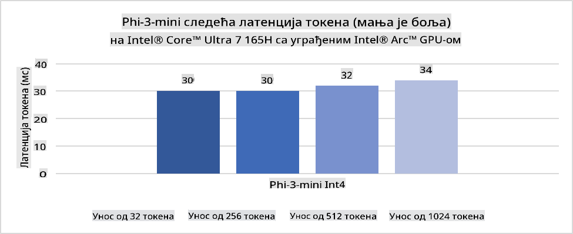
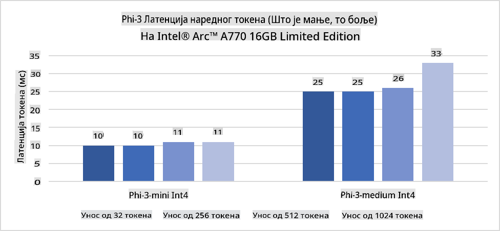
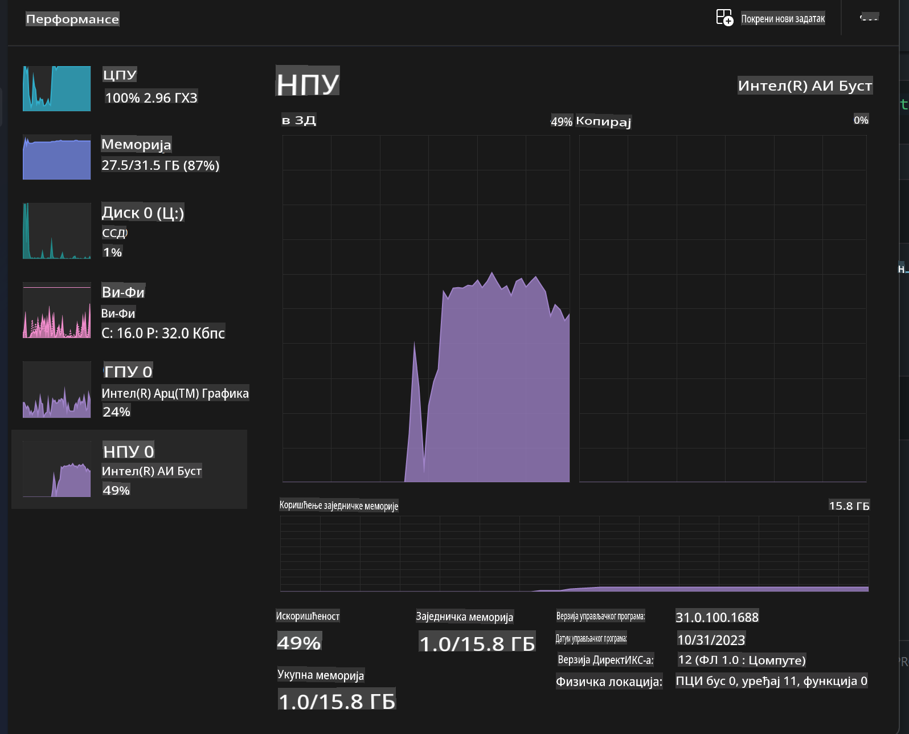
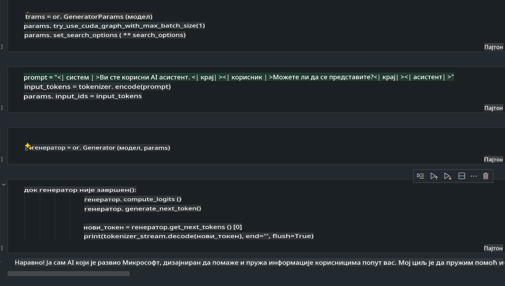
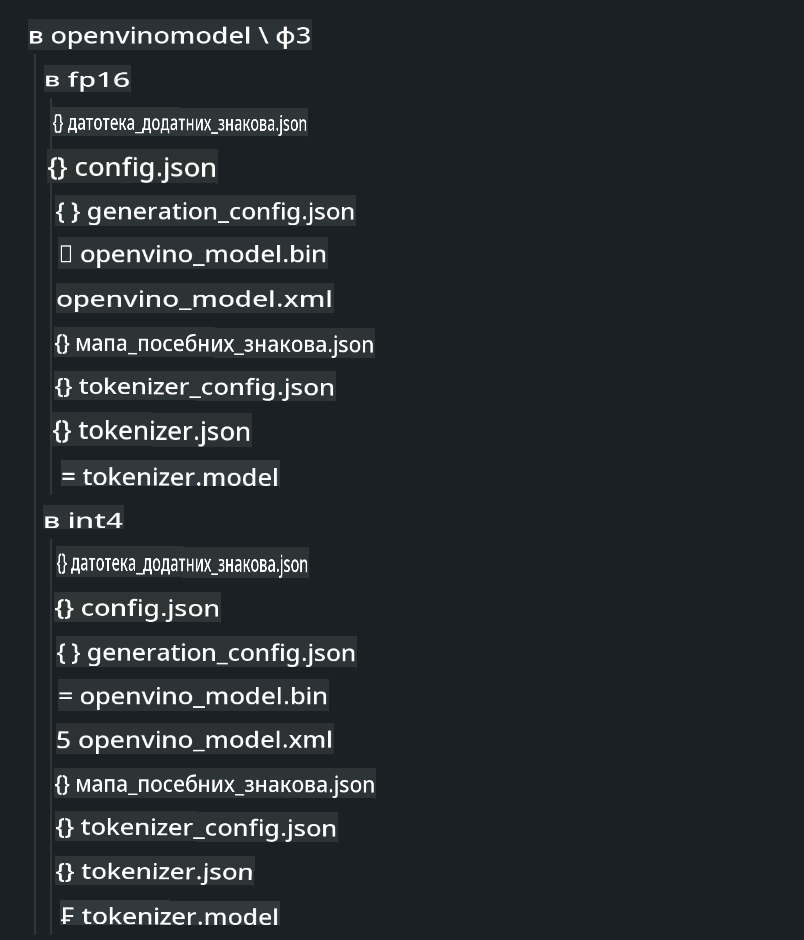
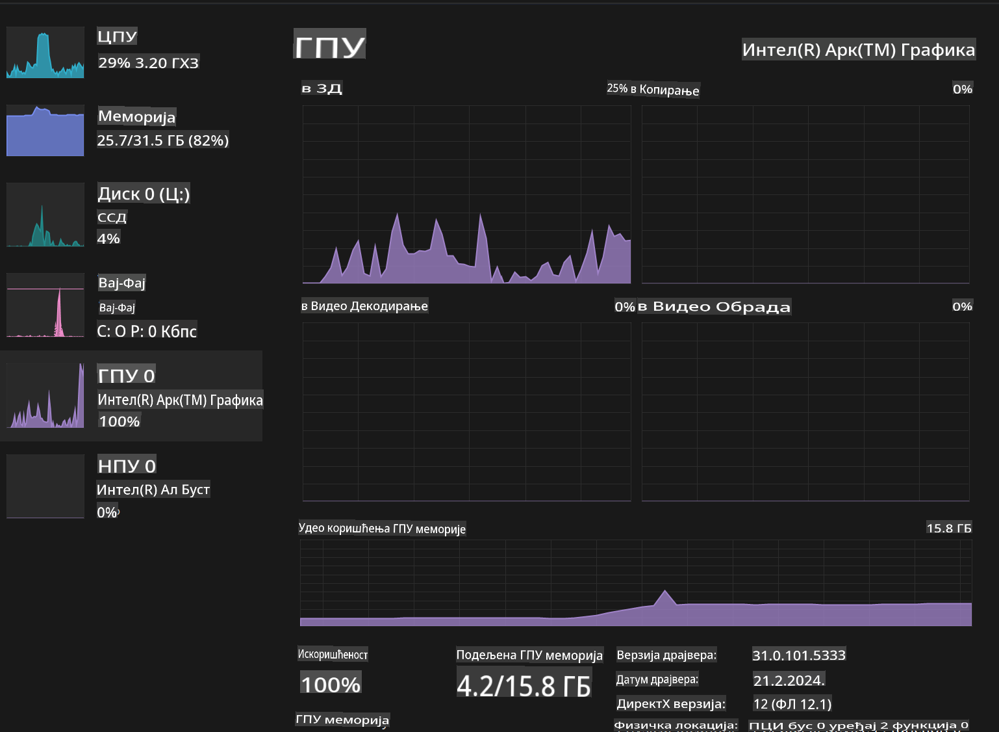

# **Inference Phi-3 na AI PC**

S razvojem generativne veštačke inteligencije i poboljšanjem hardverskih mogućnosti uređaja na ivici mreže, sve više generativnih AI modela sada može biti integrisano u uređaje korisnika kroz koncept "Bring Your Own Device" (BYOD). AI PC-ijevi su među ovim modelima. Počevši od 2024. godine, Intel, AMD i Qualcomm su sarađivali sa proizvođačima računara kako bi predstavili AI PC-ijeve koji omogućavaju lokalno pokretanje generativnih AI modela putem hardverskih modifikacija. U ovom tekstu fokusiraćemo se na Intel AI PC-ijeve i istražiti kako implementirati Phi-3 na Intel AI PC.

### Šta je NPU

NPU (Neural Processing Unit) je specijalizovani procesor ili jedinica za obradu na većem SoC-u, dizajniran posebno za ubrzavanje operacija neuronskih mreža i AI zadataka. Za razliku od univerzalnih CPU-ova i GPU-ova, NPU-ovi su optimizovani za paralelno računanje vođeno podacima, što ih čini veoma efikasnim u obradi ogromnih multimedijalnih podataka poput video zapisa i slika, kao i u obradi podataka za neuronske mreže. Posebno su vešti u obavljanju AI zadataka kao što su prepoznavanje govora, zamućivanje pozadine tokom video poziva i procesi uređivanja fotografija ili video zapisa poput detekcije objekata.

## NPU vs GPU

Iako se mnogi AI i mašinski zadaci izvršavaju na GPU-ovima, postoji ključna razlika između GPU-ova i NPU-ova.  
GPU-ovi su poznati po svojim sposobnostima paralelnog računanja, ali nisu svi GPU-ovi jednako efikasni van obrade grafike. NPU-ovi, s druge strane, su namenski izrađeni za složene proračune koji se koriste u operacijama neuronskih mreža, što ih čini veoma efikasnim za AI zadatke.

Ukratko, NPU-ovi su matematički genijalci koji ubrzavaju AI proračune i igraju ključnu ulogu u nadolazećoj eri AI PC-ijeva!

***Ovaj primer se zasniva na najnovijem Intel Core Ultra procesoru.***

## **1. Korišćenje NPU-a za pokretanje Phi-3 modela**

Intel® NPU uređaj je akcelerator za AI inferencu integrisan u Intel klijentske CPU-ove, počevši od Intel® Core™ Ultra generacije CPU-ova (ranije poznate kao Meteor Lake). Omogućava energetski efikasno izvršavanje zadataka neuronskih mreža.





**Intel NPU Acceleration Library**

Intel NPU Acceleration Library [https://github.com/intel/intel-npu-acceleration-library](https://github.com/intel/intel-npu-acceleration-library) je Python biblioteka dizajnirana da poboljša efikasnost vaših aplikacija korišćenjem Intel Neural Processing Unit-a (NPU) za izvođenje brzih proračuna na kompatibilnom hardveru.

Primer Phi-3-mini na AI PC-ju sa Intel® Core™ Ultra procesorima.


Instalirajte Python biblioteku koristeći pip

```bash

   pip install intel-npu-acceleration-library

```

***Napomena*** Projekat je još uvek u razvoju, ali referentni model je već veoma kompletan.

### **Pokretanje Phi-3 sa Intel NPU Acceleration Library**

Korišćenjem Intel NPU akceleracije, ova biblioteka ne utiče na tradicionalni proces kodiranja. Potrebno je samo koristiti biblioteku za kvantizaciju originalnog Phi-3 modela, kao što su FP16, INT8, INT4, na primer:

```python
from transformers import AutoTokenizer, pipeline,TextStreamer
from intel_npu_acceleration_library import NPUModelForCausalLM, int4
from intel_npu_acceleration_library.compiler import CompilerConfig
import warnings

model_id = "microsoft/Phi-3-mini-4k-instruct"

compiler_conf = CompilerConfig(dtype=int4)
model = NPUModelForCausalLM.from_pretrained(
    model_id, use_cache=True, config=compiler_conf, attn_implementation="sdpa"
).eval()

tokenizer = AutoTokenizer.from_pretrained(model_id)

text_streamer = TextStreamer(tokenizer, skip_prompt=True)
```

Nakon uspešne kvantizacije, nastavite izvršavanje kako biste pozvali NPU da pokrene Phi-3 model.

```python
generation_args = {
   "max_new_tokens": 1024,
   "return_full_text": False,
   "temperature": 0.3,
   "do_sample": False,
   "streamer": text_streamer,
}

pipe = pipeline(
   "text-generation",
   model=model,
   tokenizer=tokenizer,
)

query = "<|system|>You are a helpful AI assistant.<|end|><|user|>Can you introduce yourself?<|end|><|assistant|>"

with warnings.catch_warnings():
    warnings.simplefilter("ignore")
    pipe(query, **generation_args)
```

Tokom izvršavanja koda, možemo pratiti status rada NPU-a putem Task Manager-a.



***Primeri***: [AIPC_NPU_DEMO.ipynb](../../../../../code/03.Inference/AIPC/AIPC_NPU_DEMO.ipynb)

## **2. Korišćenje DirectML + ONNX Runtime za pokretanje Phi-3 modela**

### **Šta je DirectML**

[DirectML](https://github.com/microsoft/DirectML) je visokoperformansna, hardverski akcelerisana DirectX 12 biblioteka za mašinsko učenje. DirectML pruža GPU akceleraciju za uobičajene zadatke mašinskog učenja na širokom spektru podržanog hardvera i drajvera, uključujući sve DX12-kompatibilne GPU-ove od proizvođača kao što su AMD, Intel, NVIDIA i Qualcomm.

Kada se koristi samostalno, DirectML API je niskonivelska DirectX 12 biblioteka i pogodna je za visokoperformansne, niskolatentne aplikacije kao što su okviri, igre i druge aplikacije u realnom vremenu. Njegova besprekorna interoperabilnost sa Direct3D 12, kao i nizak režijski trošak i usklađenost na različitim hardverima, čine DirectML idealnim za ubrzavanje mašinskog učenja kada su potrebni i visoke performanse i pouzdanost rezultata.

***Napomena***: Najnoviji DirectML već podržava NPU (https://devblogs.microsoft.com/directx/introducing-neural-processor-unit-npu-support-in-directml-developer-preview/)

### DirectML i CUDA u pogledu sposobnosti i performansi:

**DirectML** je biblioteka za mašinsko učenje razvijena od strane Microsoft-a. Dizajnirana je za ubrzavanje zadataka mašinskog učenja na Windows uređajima, uključujući desktop računare, laptopove i uređaje na ivici mreže.  
- DX12-bazirano: DirectML je izgrađen na vrhu DirectX 12 (DX12), što omogućava široku hardversku podršku na GPU-ovima, uključujući i NVIDIA i AMD.  
- Šira podrška: Pošto koristi DX12, DirectML može raditi sa bilo kojim GPU-om koji podržava DX12, čak i sa integrisanim GPU-ovima.  
- Obrada slika: DirectML obrađuje slike i druge podatke koristeći neuronske mreže, što ga čini pogodnim za zadatke poput prepoznavanja slika, detekcije objekata i slično.  
- Jednostavnost postavke: Postavljanje DirectML-a je jednostavno i ne zahteva specifične SDK-ove ili biblioteke od proizvođača GPU-ova.  
- Performanse: U nekim slučajevima, DirectML daje dobre rezultate i može biti brži od CUDA-e, posebno za određene zadatke.  
- Ograničenja: Međutim, postoje situacije gde DirectML može biti sporiji, naročito kod velikih serija podataka u formatu float16.  

**CUDA** je NVIDIA-ina platforma za paralelno računanje i model programiranja. Omogućava programerima da koriste snagu NVIDIA GPU-ova za opšte računanje, uključujući mašinsko učenje i naučne simulacije.  
- Specifično za NVIDIA: CUDA je usko integrisana sa NVIDIA GPU-ovima i posebno dizajnirana za njih.  
- Visoko optimizovana: Pruža odlične performanse za zadatke ubrzane GPU-ovima, posebno uz korišćenje NVIDIA GPU-ova.  
- Široko korišćena: Mnogi okviri i biblioteke za mašinsko učenje (kao što su TensorFlow i PyTorch) imaju podršku za CUDA-u.  
- Prilagođavanje: Programeri mogu fino podešavati postavke CUDA-e za specifične zadatke, što može dovesti do optimalnih performansi.  
- Ograničenja: Međutim, zavisnost CUDA-e od NVIDIA hardvera može biti ograničavajuća ako želite širu kompatibilnost na različitim GPU-ovima.  

### Odabir između DirectML i CUDA

Izbor između DirectML i CUDA zavisi od vašeg specifičnog slučaja upotrebe, dostupnog hardvera i preferencija.  
Ako tražite širu kompatibilnost i jednostavnost postavke, DirectML može biti dobar izbor. Međutim, ako imate NVIDIA GPU-ove i potrebne su vam visoko optimizovane performanse, CUDA ostaje snažan kandidat. Ukratko, oba imaju svoje prednosti i nedostatke, pa uzmite u obzir svoje zahteve i raspoloživi hardver prilikom donošenja odluke.

### **Generativna AI sa ONNX Runtime**

U eri AI-ja, prenosivost AI modela je veoma važna. ONNX Runtime omogućava lako postavljanje treniranih modela na različite uređaje. Programeri ne moraju da brinu o okviru za inferencu i mogu koristiti jedinstveni API za završetak inferencije modela. U eri generativne AI, ONNX Runtime je takođe optimizovao kod (https://onnxruntime.ai/docs/genai/). Kroz optimizovani ONNX Runtime, kvantizovani generativni AI modeli mogu se izvršavati na različitim terminalima. U okviru generativne AI sa ONNX Runtime-om, možete koristiti AI model API putem Python-a, C#-a, C / C++-a. Naravno, implementacija na iPhone-u može koristiti Generativnu AI sa ONNX Runtime API-jem za C++.

[Primer koda](https://github.com/Azure-Samples/Phi-3MiniSamples/tree/main/onnx)

***Kompilacija generativne AI sa ONNX Runtime bibliotekom***

```bash

winget install --id=Kitware.CMake  -e

git clone https://github.com/microsoft/onnxruntime.git

cd .\onnxruntime\

./build.bat --build_shared_lib --skip_tests --parallel --use_dml --config Release

cd ../

git clone https://github.com/microsoft/onnxruntime-genai.git

cd .\onnxruntime-genai\

mkdir ort

cd ort

mkdir include

mkdir lib

copy ..\onnxruntime\include\onnxruntime\core\providers\dml\dml_provider_factory.h ort\include

copy ..\onnxruntime\include\onnxruntime\core\session\onnxruntime_c_api.h ort\include

copy ..\onnxruntime\build\Windows\Release\Release\*.dll ort\lib

copy ..\onnxruntime\build\Windows\Release\Release\onnxruntime.lib ort\lib

python build.py --use_dml


```

**Instalacija biblioteke**

```bash

pip install .\onnxruntime_genai_directml-0.3.0.dev0-cp310-cp310-win_amd64.whl

```

Ovo je rezultat pokretanja



***Primeri***: [AIPC_DirectML_DEMO.ipynb](../../../../../code/03.Inference/AIPC/AIPC_DirectML_DEMO.ipynb)

## **3. Korišćenje Intel OpenVino za pokretanje Phi-3 modela**

### **Šta je OpenVINO**

[OpenVINO](https://github.com/openvinotoolkit/openvino) je open-source alat za optimizaciju i implementaciju modela dubokog učenja. Omogućava povećane performanse dubokog učenja za modele vizije, zvuka i jezika iz popularnih okvira kao što su TensorFlow, PyTorch i drugi. Počnite sa OpenVINO-om. OpenVINO se takođe može koristiti u kombinaciji sa CPU-om i GPU-om za pokretanje Phi-3 modela.

***Napomena***: Trenutno, OpenVINO ne podržava NPU.

### **Instalacija OpenVINO biblioteke**

```bash

 pip install git+https://github.com/huggingface/optimum-intel.git

 pip install git+https://github.com/openvinotoolkit/nncf.git

 pip install openvino-nightly

```

### **Pokretanje Phi-3 sa OpenVINO**

Kao i kod NPU-a, OpenVINO omogućava pozivanje generativnih AI modela pokretanjem kvantizovanih modela. Prvo moramo kvantizovati Phi-3 model i završiti kvantizaciju modela putem komandne linije koristeći optimum-cli.

**INT4**

```bash

optimum-cli export openvino --model "microsoft/Phi-3-mini-4k-instruct" --task text-generation-with-past --weight-format int4 --group-size 128 --ratio 0.6  --sym  --trust-remote-code ./openvinomodel/phi3/int4

```

**FP16**

```bash

optimum-cli export openvino --model "microsoft/Phi-3-mini-4k-instruct" --task text-generation-with-past --weight-format fp16 --trust-remote-code ./openvinomodel/phi3/fp16

```

Konvertovani format izgleda ovako



Učitajte putanje modela (model_dir), povezane konfiguracije (ov_config = {"PERFORMANCE_HINT": "LATENCY", "NUM_STREAMS": "1", "CACHE_DIR": ""}) i hardverski akcelerisane uređaje (GPU.0) kroz OVModelForCausalLM.

```python

ov_model = OVModelForCausalLM.from_pretrained(
     model_dir,
     device='GPU.0',
     ov_config=ov_config,
     config=AutoConfig.from_pretrained(model_dir, trust_remote_code=True),
     trust_remote_code=True,
)

```

Tokom izvršavanja koda, možemo pratiti status rada GPU-a putem Task Manager-a.



***Primeri***: [AIPC_OpenVino_Demo.ipynb](../../../../../code/03.Inference/AIPC/AIPC_OpenVino_Demo.ipynb)

### ***Napomena***: Gore navedene tri metode imaju svoje prednosti, ali se preporučuje korišćenje NPU akceleracije za inferencu na AI PC-ju.

**Одрицање од одговорности**:  
Овај документ је преведен помоћу услуга машинског превођења заснованих на вештачкој интелигенцији. Иако настојимо да преводи буду тачни, имајте у виду да аутоматски преводи могу садржати грешке или нетачности. Оригинални документ на његовом изворном језику треба сматрати меродавним извором. За критичне информације препоручује се професионални превод од стране људи. Не сносимо одговорност за било каква погрешна тумачења или неспоразуме који могу настати коришћењем овог превода.