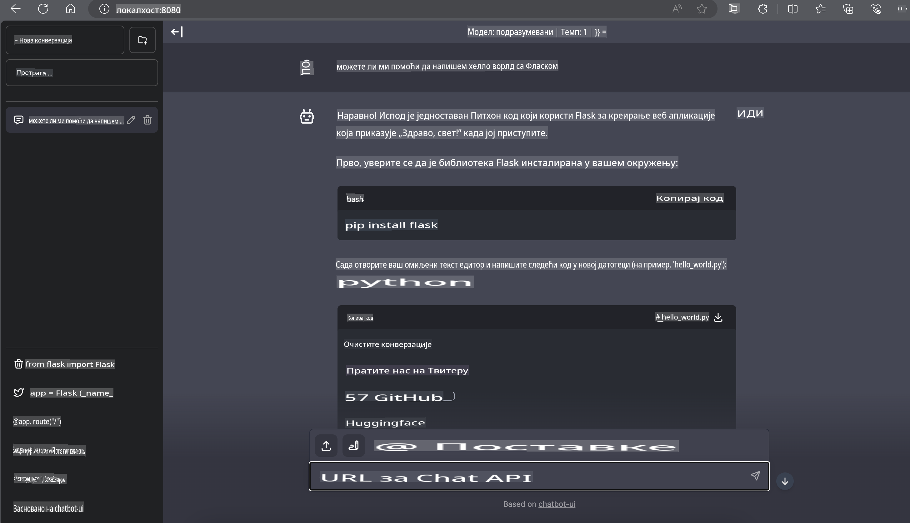

# **Inference Phi-3 na Nvidia Jetson-u**

Nvidia Jetson je serija ugrađenih računarskih ploča kompanije Nvidia. Modeli Jetson TK1, TX1 i TX2 koriste Tegra procesor (ili SoC) kompanije Nvidia, koji integriše centralnu procesorsku jedinicu (CPU) baziranu na ARM arhitekturi. Jetson je sistem sa niskom potrošnjom energije i dizajniran je za ubrzavanje primena u oblasti mašinskog učenja. Nvidia Jetson koriste profesionalni programeri za kreiranje revolucionarnih AI proizvoda u svim industrijama, kao i studenti i entuzijasti za praktično učenje o AI i izradu neverovatnih projekata. SLM se implementira na uređajima na ivici mreže, poput Jetson-a, omogućavajući bolju primenu industrijskih generativnih AI scenarija.

## Implementacija na NVIDIA Jetson-u:
Programeri koji rade na autonomnoj robotici i ugrađenim uređajima mogu koristiti Phi-3 Mini. Relativno mala veličina Phi-3 čini ga idealnim za implementaciju na ivici mreže. Parametri su pažljivo podešeni tokom obuke, čime se osigurava visoka tačnost odgovora.

### TensorRT-LLM Optimizacija:
NVIDIA-ina [TensorRT-LLM biblioteka](https://github.com/NVIDIA/TensorRT-LLM?WT.mc_id=aiml-138114-kinfeylo) optimizuje inferenciju velikih jezičkih modela. Podržava dugi kontekstualni prozor Phi-3 Mini-ja, poboljšavajući protok i latenciju. Optimizacije uključuju tehnike poput LongRoPE, FP8 i grupisanje tokom izvršavanja.

### Dostupnost i Implementacija:
Programeri mogu istražiti Phi-3 Mini sa kontekstualnim prozorom od 128K na [NVIDIA AI](https://www.nvidia.com/en-us/ai-data-science/generative-ai/). Pakovan je kao NVIDIA NIM, mikroservis sa standardnim API-jem koji se može implementirati bilo gde. Dodatno, [TensorRT-LLM implementacije na GitHub-u](https://github.com/NVIDIA/TensorRT-LLM).

## **1. Priprema**

a. Jetson Orin NX / Jetson NX

b. JetPack 5.1.2+
   
c. Cuda 11.8
   
d. Python 3.8+

## **2. Pokretanje Phi-3 na Jetson-u**

Možemo koristiti [Ollama](https://ollama.com) ili [LlamaEdge](https://llamaedge.com)

Ako želite da koristite gguf u oblaku i uređajima na ivici mreže istovremeno, LlamaEdge se može razumeti kao WasmEdge (WasmEdge je lagano, visokoperformansno, skalabilno WebAssembly okruženje pogodno za aplikacije zasnovane na oblaku, ivici mreže i decentralizovane aplikacije. Podržava serverless aplikacije, ugrađene funkcije, mikroservise, pametne ugovore i IoT uređaje. Možete implementirati kvantitativni model gguf na uređaje na ivici mreže i u oblaku putem LlamaEdge-a).


Evo koraka za korišćenje:

1. Instalirajte i preuzmite povezane biblioteke i datoteke

```bash

curl -sSf https://raw.githubusercontent.com/WasmEdge/WasmEdge/master/utils/install.sh | bash -s -- --plugin wasi_nn-ggml

curl -LO https://github.com/LlamaEdge/LlamaEdge/releases/latest/download/llama-api-server.wasm

curl -LO https://github.com/LlamaEdge/chatbot-ui/releases/latest/download/chatbot-ui.tar.gz

tar xzf chatbot-ui.tar.gz

```

**Napomena**: llama-api-server.wasm i chatbot-ui moraju biti u istom direktorijumu.

2. Pokrenite skripte u terminalu

```bash

wasmedge --dir .:. --nn-preload default:GGML:AUTO:{Your gguf path} llama-api-server.wasm -p phi-3-chat

```

Evo rezultata pokretanja:



***Primer koda*** [Phi-3 mini WASM Notebook Sample](https://github.com/Azure-Samples/Phi-3MiniSamples/tree/main/wasm)

U zaključku, Phi-3 Mini predstavlja značajan napredak u jezičkom modeliranju, kombinujući efikasnost, svesnost o kontekstu i NVIDIA-inu optimizaciju. Bilo da gradite robote ili aplikacije na ivici mreže, Phi-3 Mini je moćan alat koji vredi razmotriti.

**Одрицање од одговорности**:  
Овај документ је преведен коришћењем услуга машинског превођења заснованих на вештачкој интелигенцији. Иако настојимо да обезбедимо тачност, имајте у виду да аутоматизовани преводи могу садржати грешке или нетачности. Оригинални документ на његовом изворном језику треба сматрати ауторитативним извором. За критичне информације препоручује се професионални људски превод. Не сносимо одговорност за било какве неспоразуме или погрешна тумачења која могу настати употребом овог превода.