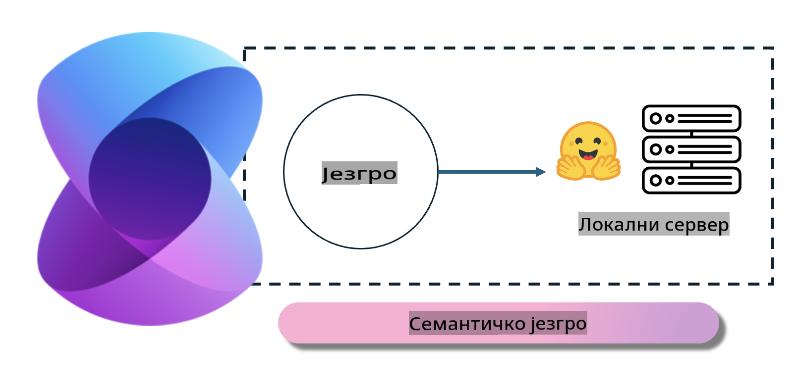
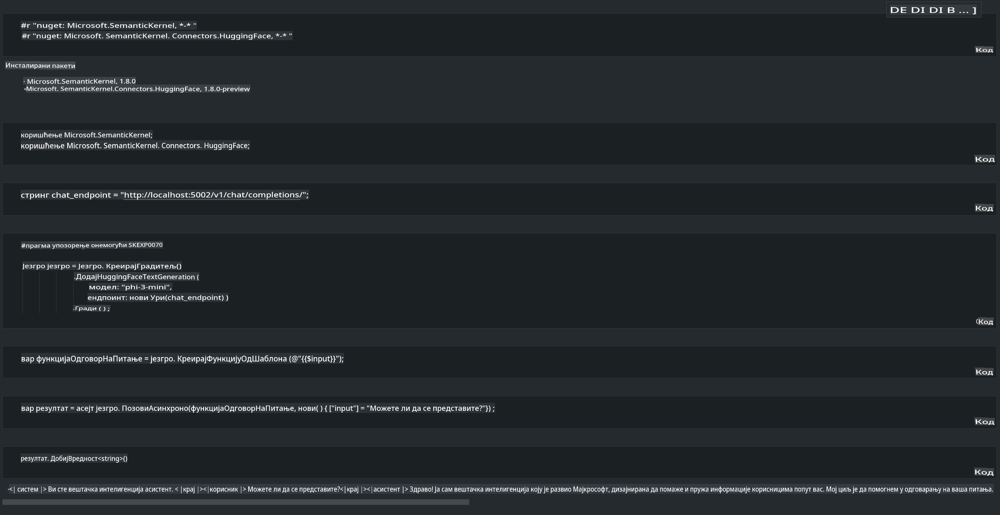

# **Inference Phi-3 na lokalnom serveru**

Možemo implementirati Phi-3 na lokalnom serveru. Korisnici mogu izabrati [Ollama](https://ollama.com) ili [LM Studio](https://llamaedge.com) rešenja, ili mogu napisati svoj kod. Lokalne servise Phi-3 možete povezati putem [Semantic Kernel](https://github.com/microsoft/semantic-kernel?WT.mc_id=aiml-138114-kinfeylo) ili [Langchain](https://www.langchain.com/) kako biste kreirali Copilot aplikacije.

## **Korišćenje Semantic Kernel za pristup Phi-3-mini**

U Copilot aplikaciji kreiramo aplikacije pomoću Semantic Kernel / LangChain. Ovaj tip aplikacionog okvira je generalno kompatibilan sa Azure OpenAI Service / OpenAI modelima, a takođe može podržavati open source modele sa Hugging Face-a i lokalne modele. Šta treba da uradimo ako želimo da koristimo Semantic Kernel za pristup Phi-3-mini? Koristeći .NET kao primer, možemo ga kombinovati sa Hugging Face konektorom u Semantic Kernel. Po podrazumevanim postavkama, može odgovarati model id-u na Hugging Face-u (prilikom prve upotrebe, model će biti preuzet sa Hugging Face-a, što može potrajati). Takođe možete povezati lokalno izgrađeni servis. Kada uporedimo ove dve opcije, preporučujemo korišćenje druge jer pruža veći stepen autonomije, naročito u poslovnim aplikacijama.

Iz slike se vidi da pristup lokalnim servisima putem Semantic Kernel omogućava lako povezivanje sa lokalno izgrađenim serverom za Phi-3-mini model. Ovde su prikazani rezultati pokretanja.

***Primer koda*** https://github.com/kinfey/Phi3MiniSamples/tree/main/semantickernel

**Одрицање од одговорности**:  
Овај документ је преведен коришћењем услуга машинског превођења заснованих на вештачкој интелигенцији. Иако настојимо да обезбедимо тачност, молимо вас да имате у виду да аутоматизовани преводи могу садржати грешке или нетачности. Оригинални документ на свом изворном језику треба сматрати меродавним извором. За критичне информације препоручује се професионални људски превод. Не сносимо одговорност за било каква неспоразумe или погрешна тумачења која произилазе из употребе овог превода.