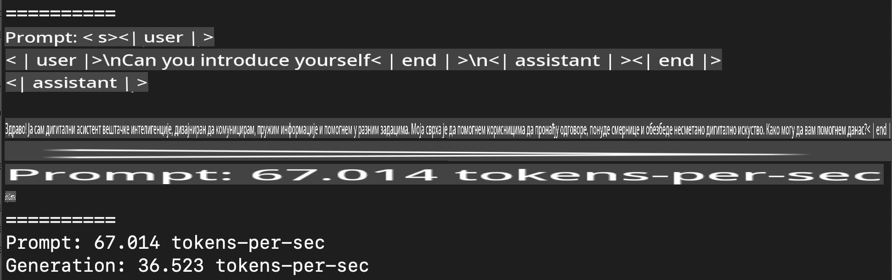
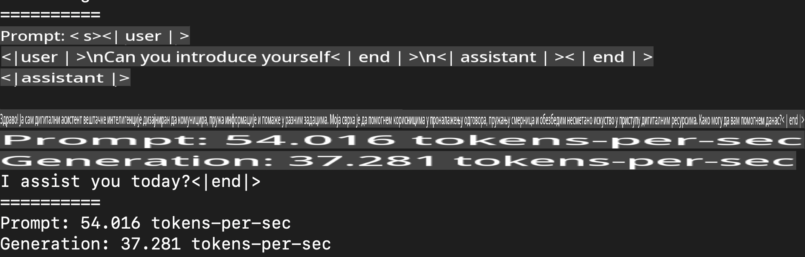
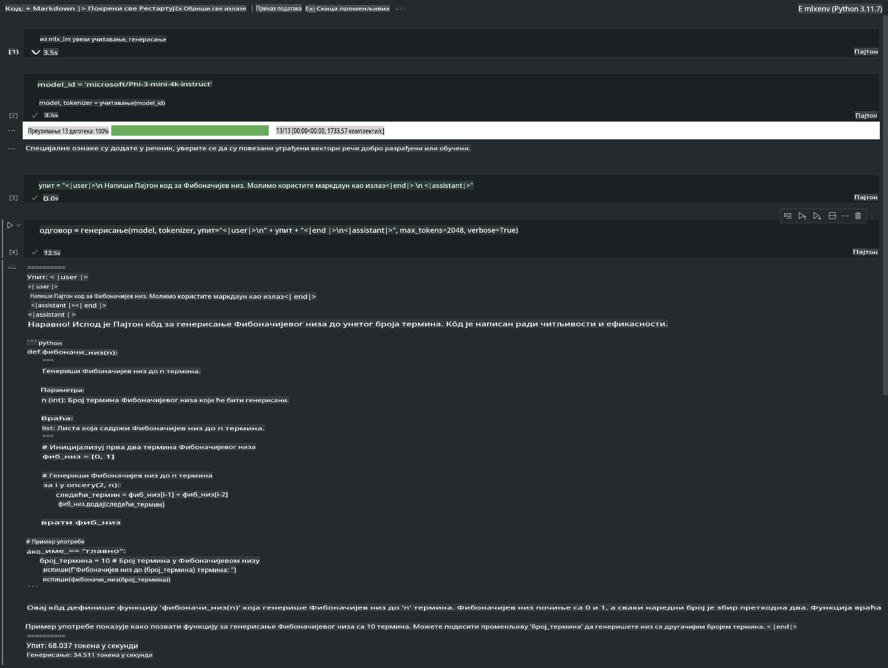

# **Inference Phi-3 sa Apple MLX Framework-om**

## **Šta je MLX Framework**

MLX je okvir za istraživanje mašinskog učenja na Apple silicon čipovima, koji donosi Apple tim za istraživanje mašinskog učenja.

MLX je dizajniran od strane istraživača mašinskog učenja za istraživače mašinskog učenja. Okvir je zamišljen da bude jednostavan za korišćenje, ali i dalje efikasan za obučavanje i implementaciju modela. Dizajn samog okvira je konceptualno jednostavan. Naš cilj je da istraživačima omogućimo lako proširivanje i unapređivanje MLX-a kako bi mogli brzo da istražuju nove ideje.

LLM-ovi mogu biti ubrzani na Apple Silicon uređajima putem MLX-a, a modeli se mogu lako pokretati lokalno.

## **Korišćenje MLX-a za inference Phi-3-mini**

### **1. Postavite MLX okruženje**

1. Python 3.11.x  
2. Instalirajte MLX biblioteku  

```bash

pip install mlx-lm

```

### **2. Pokretanje Phi-3-mini modela u Terminalu pomoću MLX-a**

```bash

python -m mlx_lm.generate --model microsoft/Phi-3-mini-4k-instruct --max-token 2048 --prompt  "<|user|>\nCan you introduce yourself<|end|>\n<|assistant|>"

```

Rezultat (moje okruženje je Apple M1 Max, 64GB) je



### **3. Kvantizacija Phi-3-mini modela pomoću MLX-a u Terminalu**

```bash

python -m mlx_lm.convert --hf-path microsoft/Phi-3-mini-4k-instruct

```

***Napomena:*** Model može biti kvantizovan pomoću mlx_lm.convert, a podrazumevana kvantizacija je INT4. Ovaj primer kvantizuje Phi-3-mini na INT4.

Model može biti kvantizovan pomoću mlx_lm.convert, a podrazumevana kvantizacija je INT4. U ovom primeru, Phi-3-mini se kvantizuje u INT4. Nakon kvantizacije, model će biti sačuvan u podrazumevanom direktorijumu ./mlx_model.

Možemo testirati kvantizovani model pomoću MLX-a iz terminala.

```bash

python -m mlx_lm.generate --model ./mlx_model/ --max-token 2048 --prompt  "<|user|>\nCan you introduce yourself<|end|>\n<|assistant|>"

```

Rezultat je



### **4. Pokretanje Phi-3-mini modela pomoću MLX-a u Jupyter Notebook-u**



***Napomena:*** Molimo vas da pročitate ovaj primer [kliknite na ovaj link](../../../../../code/03.Inference/MLX/MLX_DEMO.ipynb)

## **Resursi**

1. Saznajte više o Apple MLX Framework-u [https://ml-explore.github.io](https://ml-explore.github.io/mlx/build/html/index.html)

2. Apple MLX GitHub repozitorijum [https://github.com/ml-explore](https://github.com/ml-explore)

**Одрицање од одговорности**:  
Овај документ је преведен коришћењем услуга машинског превођења заснованих на вештачкој интелигенцији. Иако тежимо тачности, имајте у виду да аутоматизовани преводи могу садржати грешке или нетачности. Оригинални документ на његовом изворном језику треба сматрати ауторитативним извором. За критичне информације препоручује се професионални превод од стране људи. Не сносимо одговорност за било каква неспоразума или погрешна тумачења која могу настати услед коришћења овог превода.