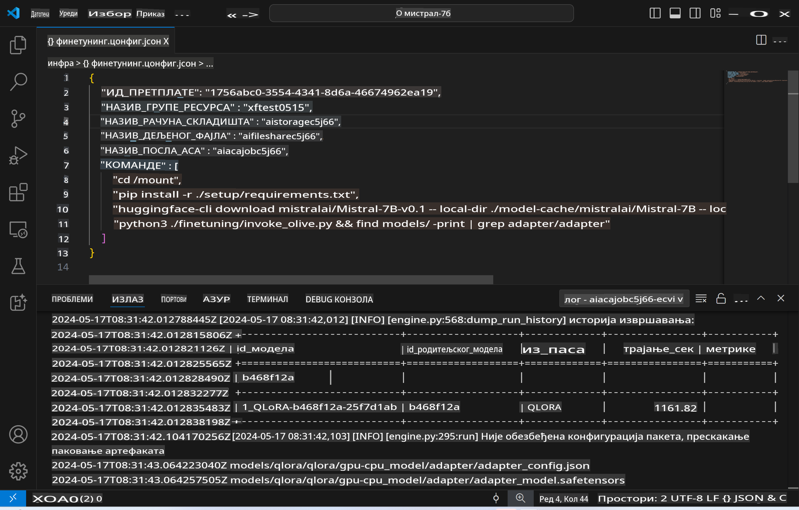
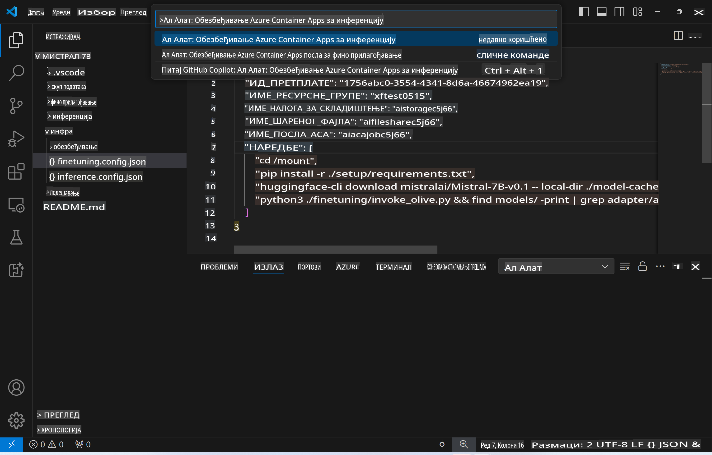
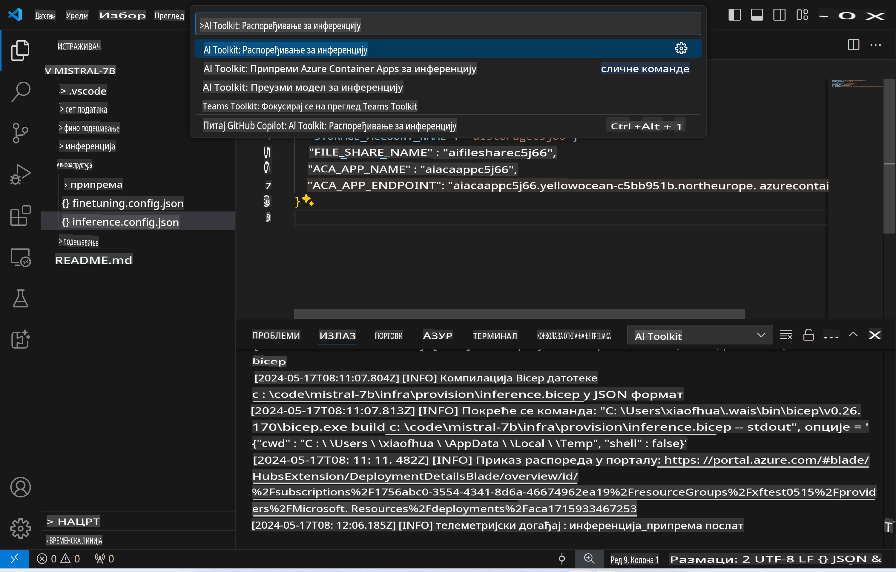

# Daljinsko Zaključivanje sa Fino-Podešenim Modelom

Nakon što su adapteri obučeni u daljinskom okruženju, koristite jednostavnu Gradio aplikaciju za interakciju sa modelom.



### Postavljanje Azure Resursa
Potrebno je da postavite Azure resurse za daljinsko zaključivanje tako što ćete izvršiti komandu `AI Toolkit: Provision Azure Container Apps for inference` iz komandne palete. Tokom ovog procesa, od vas će se tražiti da odaberete vašu Azure pretplatu i grupu resursa.  


Podrazumevano, pretplata i grupa resursa za zaključivanje treba da budu iste kao one korišćene za fino podešavanje. Zaključivanje će koristiti isto Azure Container App okruženje i pristupati modelu i adapteru modela koji su sačuvani u Azure Files, a koji su generisani tokom faze finog podešavanja.

## Korišćenje AI Alata 

### Implementacija za Zaključivanje  
Ako želite da izmenite kod za zaključivanje ili ponovo učitate model za zaključivanje, izvršite komandu `AI Toolkit: Deploy for inference`. Ovo će sinhronizovati vaš najnoviji kod sa ACA i ponovo pokrenuti repliku.  



Nakon uspešnog završetka implementacije, model je sada spreman za evaluaciju putem ovog krajnjeg sistema.

### Pristupanje API-ju za Zaključivanje

Možete pristupiti API-ju za zaključivanje klikom na dugme "*Idi na krajnju tačku zaključivanja*" koje se prikazuje u obaveštenju u VSCode-u. Alternativno, web API krajnja tačka može se pronaći pod `ACA_APP_ENDPOINT` u `./infra/inference.config.json` i u izlaznom panelu.


> **Napomena:** Krajnjoj tački za zaključivanje može biti potrebno nekoliko minuta da postane potpuno operativna.

## Komponente za Zaključivanje Uključene u Šablon
 
| Folder | Sadržaj |
| ------ |--------- |
| `infra` | Sadrži sve potrebne konfiguracije za daljinske operacije. |
| `infra/provision/inference.parameters.json` | Sadrži parametre za bicep šablone, koji se koriste za postavljanje Azure resursa za zaključivanje. |
| `infra/provision/inference.bicep` | Sadrži šablone za postavljanje Azure resursa za zaključivanje. |
| `infra/inference.config.json` | Konfiguracioni fajl, generisan komandom `AI Toolkit: Provision Azure Container Apps for inference`. Koristi se kao ulaz za druge komande u komandnoj paleti. |

### Korišćenje AI Alata za Konfigurisanje Azure Resursa
Konfigurišite [AI Alat](https://marketplace.visualstudio.com/items?itemName=ms-windows-ai-studio.windows-ai-studio)

Postavite Azure Container Apps za zaključivanje` command.

You can find configuration parameters in `./infra/provision/inference.parameters.json` file. Here are the details:
| Parameter | Description |
| --------- |------------ |
| `defaultCommands` | This is the commands to initiate a web API. |
| `maximumInstanceCount` | This parameter sets the maximum capacity of GPU instances. |
| `location` | This is the location where Azure resources are provisioned. The default value is the same as the chosen resource group's location. |
| `storageAccountName`, `fileShareName` `acaEnvironmentName`, `acaEnvironmentStorageName`, `acaAppName`,  `acaLogAnalyticsName` | These parameters are used to name the Azure resources for provision. By default, they will be same to the fine-tuning resource name. You can input a new, unused resource name to create your own custom-named resources, or you can input the name of an already existing Azure resource if you'd prefer to use that. For details, refer to the section [Using existing Azure Resources](../../../../../md/01.Introduction/03). |

### Using Existing Azure Resources

By default, the inference provision use the same Azure Container App Environment, Storage Account, Azure File Share, and Azure Log Analytics that were used for fine-tuning. A separate Azure Container App is created solely for the inference API. 

If you have customized the Azure resources during the fine-tuning step or want to use your own existing Azure resources for inference, specify their names in the `./infra/inference.parameters.json` fajl. Zatim, pokrenite komandu `AI Toolkit: Provision Azure Container Apps for inference` iz komandne palete. Ovo ažurira sve specificirane resurse i kreira one koji nedostaju.

Na primer, ako već imate postojeće Azure okruženje za kontejnere, vaš `./infra/finetuning.parameters.json` fajl bi trebalo da izgleda ovako:

```json
{
    "$schema": "https://schema.management.azure.com/schemas/2019-04-01/deploymentParameters.json#",
    "contentVersion": "1.0.0.0",
    "parameters": {
      ...
      "acaEnvironmentName": {
        "value": "<your-aca-env-name>"
      },
      "acaEnvironmentStorageName": {
        "value": null
      },
      ...
    }
  }
```

### Ručno Postavljanje  
Ako više volite da ručno konfigurišete Azure resurse, možete koristiti priložene bicep fajlove u `./infra/provision` folders. If you have already set up and configured all the Azure resources without using the AI Toolkit command palette, you can simply enter the resource names in the `inference.config.json` fajlu.

Na primer:

```json
{
  "SUBSCRIPTION_ID": "<your-subscription-id>",
  "RESOURCE_GROUP_NAME": "<your-resource-group-name>",
  "STORAGE_ACCOUNT_NAME": "<your-storage-account-name>",
  "FILE_SHARE_NAME": "<your-file-share-name>",
  "ACA_APP_NAME": "<your-aca-name>",
  "ACA_APP_ENDPOINT": "<your-aca-endpoint>"
}
```

**Одрицање од одговорности**:  
Овај документ је преведен коришћењем услуга машинског превођења заснованих на вештачкој интелигенцији. Иако тежимо прецизности, имајте у виду да аутоматски преводи могу садржати грешке или нетачности. Оригинални документ на његовом изворном језику треба сматрати ауторитативним извором. За критичне информације препоручује се професионални превод од стране људи. Не сносимо одговорност за било каква неспоразумевања или погрешна тумачења која могу настати услед коришћења овог превода.