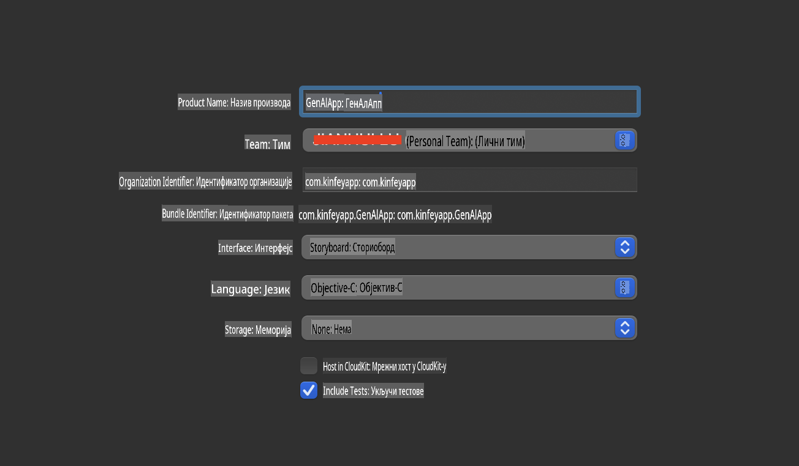
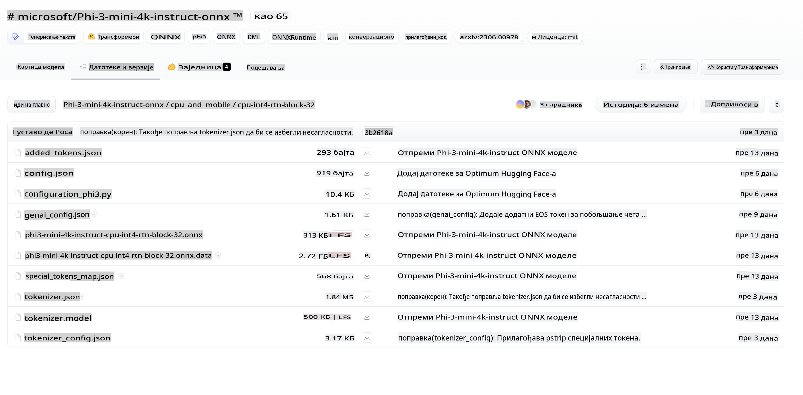
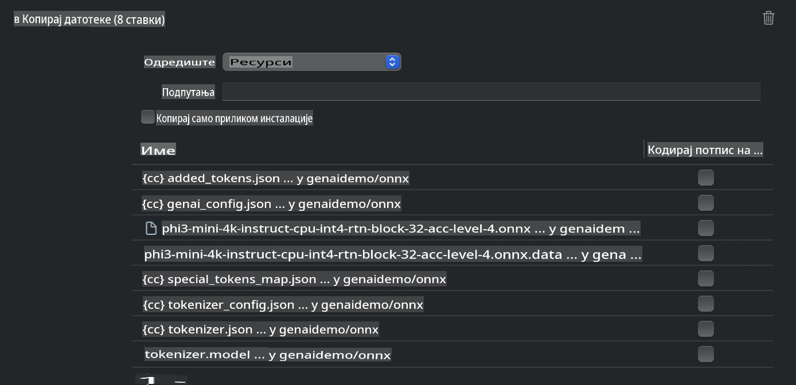
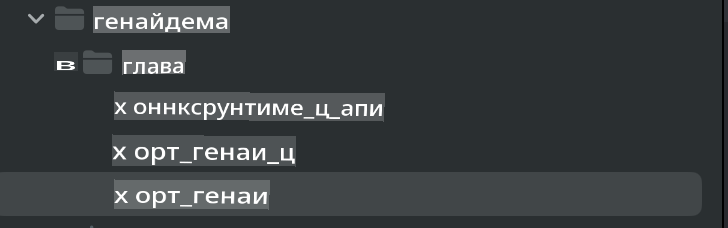
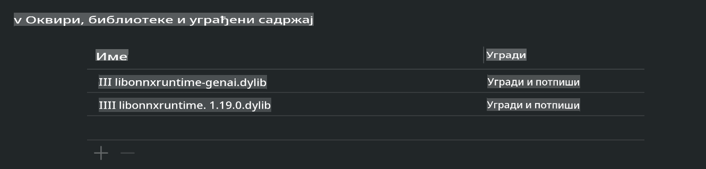
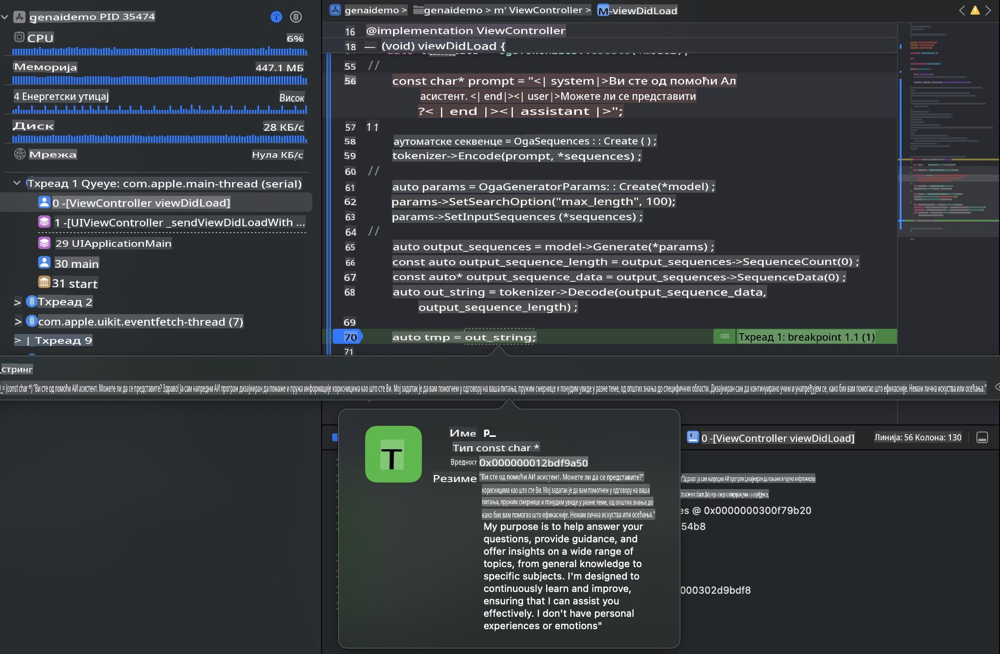

# **Inference Phi-3 na iOS-u**

Phi-3-mini je nova serija modela iz Microsoft-a koja omogućava primenu velikih jezičkih modela (LLMs) na uređajima na ivici mreže i IoT uređajima. Phi-3-mini je dostupan za iOS, Android i uređaje na ivici, omogućavajući generativnu AI tehnologiju u BYOD okruženjima. Sledeći primer pokazuje kako implementirati Phi-3-mini na iOS-u.

## **1. Priprema**

- **a.** macOS 14+
- **b.** Xcode 15+
- **c.** iOS SDK 17.x (iPhone 14 A16 ili noviji)
- **d.** Instalirajte Python 3.10+ (preporučuje se Conda)
- **e.** Instalirajte Python biblioteku: `python-flatbuffers`
- **f.** Instalirajte CMake

### Semantic Kernel i Inference

Semantic Kernel je okvir za aplikacije koji omogućava kreiranje aplikacija kompatibilnih sa Azure OpenAI Service, OpenAI modelima, pa čak i lokalnim modelima. Pristup lokalnim servisima putem Semantic Kernel-a omogućava laku integraciju sa vašim Phi-3-mini serverom modela koji sami hostujete.

### Pozivanje Kvantizovanih Modela sa Ollama ili LlamaEdge

Mnogi korisnici preferiraju korišćenje kvantizovanih modela za lokalno pokretanje modela. [Ollama](https://ollama.com) i [LlamaEdge](https://llamaedge.com) omogućavaju korisnicima da pozivaju različite kvantizovane modele:

#### **Ollama**

Možete pokrenuti `ollama run phi3` direktno ili ga konfigurisati offline. Kreirajte Modelfile sa putanjom do vašeg `gguf` fajla. Primer koda za pokretanje kvantizovanog modela Phi-3-mini:

```gguf
FROM {Add your gguf file path}
TEMPLATE \"\"\"<|user|> .Prompt<|end|> <|assistant|>\"\"\"
PARAMETER stop <|end|>
PARAMETER num_ctx 4096
```

#### **LlamaEdge**

Ako želite da koristite `gguf` i na cloud-u i na uređajima na ivici istovremeno, LlamaEdge je odlična opcija.

## **2. Kompajliranje ONNX Runtime-a za iOS**

```bash

git clone https://github.com/microsoft/onnxruntime.git

cd onnxruntime

./build.sh --build_shared_lib --ios --skip_tests --parallel --build_dir ./build_ios --ios --apple_sysroot iphoneos --osx_arch arm64 --apple_deploy_target 17.5 --cmake_generator Xcode --config Release

cd ../

```

### **Napomena**

- **a.** Pre kompajliranja, uverite se da je Xcode pravilno konfigurisan i postavite ga kao aktivni direktorijum za developere u terminalu:

    ```bash
    sudo xcode-select -switch /Applications/Xcode.app/Contents/Developer
    ```

- **b.** ONNX Runtime treba da se kompajlira za različite platforme. Za iOS, možete kompajlirati za `arm64` or `x86_64`.

- **c.** Preporučuje se korišćenje najnovijeg iOS SDK-a za kompajliranje. Međutim, možete koristiti i stariju verziju ako vam je potrebna kompatibilnost sa prethodnim SDK-ovima.

## **3. Kompajliranje Generativne AI sa ONNX Runtime-om za iOS**

> **Napomena:** Pošto je Generativna AI sa ONNX Runtime-om u preview fazi, budite svesni mogućih promena.

```bash

git clone https://github.com/microsoft/onnxruntime-genai
 
cd onnxruntime-genai
 
mkdir ort
 
cd ort
 
mkdir include
 
mkdir lib
 
cd ../
 
cp ../onnxruntime/include/onnxruntime/core/session/onnxruntime_c_api.h ort/include
 
cp ../onnxruntime/build_ios/Release/Release-iphoneos/libonnxruntime*.dylib* ort/lib
 
export OPENCV_SKIP_XCODEBUILD_FORCE_TRYCOMPILE_DEBUG=1
 
python3 build.py --parallel --build_dir ./build_ios --ios --ios_sysroot iphoneos --ios_arch arm64 --ios_deployment_target 17.5 --cmake_generator Xcode --cmake_extra_defines CMAKE_XCODE_ATTRIBUTE_CODE_SIGNING_ALLOWED=NO

```

## **4. Kreiranje App aplikacije u Xcode-u**

Izabrao sam Objective-C kao metod razvoja aplikacije, jer je za korišćenje Generativne AI sa ONNX Runtime C++ API-jem Objective-C bolje kompatibilan. Naravno, možete završiti i povezane pozive putem Swift bridging-a.



## **5. Kopiranje ONNX kvantizovanog INT4 modela u App aplikaciju**

Potrebno je uvesti INT4 kvantizovani model u ONNX formatu, koji prvo treba preuzeti.



Nakon preuzimanja, potrebno ga je dodati u direktorijum Resources projekta u Xcode-u.



## **6. Dodavanje C++ API-ja u ViewControllers**

> **Napomena:**

- **a.** Dodajte odgovarajuće C++ header fajlove u projekat.

  

- **b.** Uključite `onnxruntime-genai` dynamic library in Xcode.

  

- **c.** Use the C Samples code for testing. You can also add additional features like ChatUI for more functionality.

- **d.** Since you need to use C++ in your project, rename `ViewController.m` to `ViewController.mm` kako biste omogućili podršku za Objective-C++.

```objc

    NSString *llmPath = [[NSBundle mainBundle] resourcePath];
    char const *modelPath = llmPath.cString;

    auto model =  OgaModel::Create(modelPath);

    auto tokenizer = OgaTokenizer::Create(*model);

    const char* prompt = "<|system|>You are a helpful AI assistant.<|end|><|user|>Can you introduce yourself?<|end|><|assistant|>";

    auto sequences = OgaSequences::Create();
    tokenizer->Encode(prompt, *sequences);

    auto params = OgaGeneratorParams::Create(*model);
    params->SetSearchOption("max_length", 100);
    params->SetInputSequences(*sequences);

    auto output_sequences = model->Generate(*params);
    const auto output_sequence_length = output_sequences->SequenceCount(0);
    const auto* output_sequence_data = output_sequences->SequenceData(0);
    auto out_string = tokenizer->Decode(output_sequence_data, output_sequence_length);
    
    auto tmp = out_string;

```

## **7. Pokretanje aplikacije**

Kada je podešavanje završeno, možete pokrenuti aplikaciju da biste videli rezultate inferencije modela Phi-3-mini.



Za više primera koda i detaljna uputstva, posetite [Phi-3 Mini Samples repository](https://github.com/Azure-Samples/Phi-3MiniSamples/tree/main/ios).

**Одрицање од одговорности**:  
Овај документ је преведен коришћењем услуга машинског превођења заснованог на вештачкој интелигенцији. Иако настојимо да превод буде тачан, молимо вас да будете свесни да аутоматски преводи могу садржати грешке или нетачности. Оригинални документ на изворном језику треба сматрати ауторитативним извором. За критичне информације препоручује се професионални превод од стране људи. Не сносимо одговорност за било каква погрешна тумачења или неспоразуме који могу произаћи из коришћења овог превода.