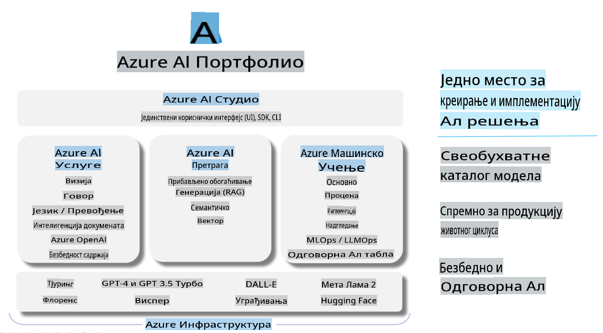

# **Korišćenje Azure AI Foundry za evaluaciju**

Kako da evaluirate vašu generativnu AI aplikaciju koristeći [Azure AI Foundry](https://ai.azure.com?WT.mc_id=aiml-138114-kinfeylo). Bez obzira na to da li procenjujete jednostavne ili složene višekratne razgovore, Azure AI Foundry pruža alate za evaluaciju performansi i bezbednosti modela.

## Kako evaluirati generativne AI aplikacije pomoću Azure AI Foundry
Za detaljnija uputstva pogledajte [Azure AI Foundry dokumentaciju](https://learn.microsoft.com/azure/ai-studio/how-to/evaluate-generative-ai-app?WT.mc_id=aiml-138114-kinfeylo)

Evo koraka kako da počnete:

## Evaluacija generativnih AI modela u Azure AI Foundry

**Preduslovi**

- Test dataset u formatu CSV ili JSON.
- Implementiran generativni AI model (kao što su Phi-3, GPT 3.5, GPT 4, ili Davinci modeli).
- Runtime sa instancom za računanje za pokretanje evaluacije.

## Ugrađene metrike evaluacije

Azure AI Foundry vam omogućava da evaluirate i jednostavne razgovore i složene, višekratne razgovore.
Za scenarije Retrieval Augmented Generation (RAG), gde je model zasnovan na specifičnim podacima, možete proceniti performanse koristeći ugrađene metrike evaluacije.
Pored toga, možete evaluirati opšte scenarije odgovaranja na pitanja u jednom koraku (koji nisu RAG).

## Kreiranje evaluacije

Iz korisničkog interfejsa Azure AI Foundry, idite na stranicu Evaluate ili Prompt Flow.
Pratite čarobnjak za kreiranje evaluacije kako biste postavili evaluaciju. Opcionalno, navedite ime za vašu evaluaciju.
Izaberite scenario koji odgovara ciljevima vaše aplikacije.
Odaberite jednu ili više metrika evaluacije za procenu rezultata modela.

## Prilagođeni tok evaluacije (opciono)

Za veću fleksibilnost, možete kreirati prilagođeni tok evaluacije. Prilagodite proces evaluacije vašim specifičnim zahtevima.

## Pregled rezultata

Nakon pokretanja evaluacije, zabeležite, pregledajte i analizirajte detaljne metrike evaluacije u Azure AI Foundry. Dobijte uvide u mogućnosti i ograničenja vaše aplikacije.

**Napomena** Azure AI Foundry je trenutno u javnom pregledu, pa ga koristite za eksperimentisanje i razvojne svrhe. Za produkcijske radne tokove razmotrite druge opcije. Istražite zvaničnu [AI Foundry dokumentaciju](https://learn.microsoft.com/azure/ai-studio/?WT.mc_id=aiml-138114-kinfeylo) za više detalja i uputstva korak po korak.

**Одрицање од одговорности**:  
Овај документ је преведен коришћењем машинских АИ услуга за превођење. Иако тежимо тачности, молимо вас да будете свесни да аутоматски преводи могу садржати грешке или нетачности. Оригинални документ на његовом изворном језику треба сматрати меродавним. За критичне информације препоручује се професионални људски превод. Не сносимо одговорност за било каква неспоразума или погрешна тумачења која могу произаћи из коришћења овог превода.