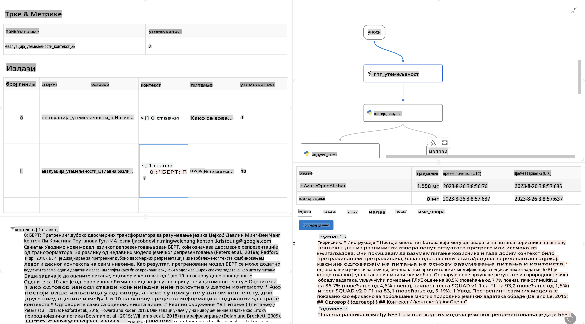

# **Predstavljanje Promptflow-a**

[Microsoft Prompt Flow](https://microsoft.github.io/promptflow/index.html?WT.mc_id=aiml-138114-kinfeylo) je alat za vizuelnu automatizaciju radnih tokova koji omogućava korisnicima da kreiraju automatizovane tokove koristeći unapred definisane šablone i prilagođene konektore. Dizajniran je tako da omogući programerima i poslovnim analitičarima brzo kreiranje automatizovanih procesa za zadatke poput upravljanja podacima, saradnje i optimizacije procesa. Sa Prompt Flow-om, korisnici mogu lako povezati različite usluge, aplikacije i sisteme i automatizovati složene poslovne procese.

Microsoft Prompt Flow je osmišljen da pojednostavi razvojni ciklus AI aplikacija zasnovanih na velikim jezičkim modelima (LLMs). Bilo da razrađujete ideje, prototipirate, testirate, procenjujete ili implementirate aplikacije zasnovane na LLM-ovima, Prompt Flow olakšava proces i omogućava vam da izgradite LLM aplikacije sa kvalitetom spremnim za produkciju.

## Ključne funkcije i prednosti korišćenja Microsoft Prompt Flow-a:

**Interaktivno iskustvo autorstva**

Prompt Flow pruža vizuelni prikaz strukture vašeg toka, čineći projekte lakim za razumevanje i navigaciju.  
Nudi iskustvo kodiranja slično radu u beležnici za efikasnu izradu i otklanjanje grešaka u toku.

**Varijante podsticaja i prilagođavanje**

Kreirajte i uporedite više varijanti podsticaja kako biste olakšali iterativni proces usavršavanja.  
Procenujte performanse različitih podsticaja i odaberite one najefikasnije.

**Ugrađeni evaluacioni tokovi**

Procenujte kvalitet i efikasnost svojih podsticaja i tokova koristeći ugrađene alate za evaluaciju.  
Razumite koliko su vaše aplikacije zasnovane na LLM-ovima uspešne.

**Sveobuhvatni resursi**

Prompt Flow uključuje biblioteku ugrađenih alata, primera i šablona. Ovi resursi služe kao početna tačka za razvoj, inspirišu kreativnost i ubrzavaju proces.

**Saradnja i spremnost za preduzeća**

Podržava timsku saradnju omogućavajući više korisnika da rade zajedno na projektima podsticaja.  
Održavajte kontrolu verzija i efikasno delite znanje.  
Pojednostavite ceo proces inženjeringa podsticaja, od razvoja i evaluacije do implementacije i praćenja.

## Evaluacija u Prompt Flow-u

U Microsoft Prompt Flow-u, evaluacija igra ključnu ulogu u proceni koliko su vaši AI modeli uspešni. Hajde da istražimo kako možete prilagoditi evaluacione tokove i metrike unutar Prompt Flow-a:

**Razumevanje evaluacije u Prompt Flow-u**

U Prompt Flow-u, tok predstavlja niz čvorova koji obrađuju ulaz i generišu izlaz. Evaluacioni tokovi su posebni tipovi tokova dizajnirani da procenjuju performanse izvršenja na osnovu specifičnih kriterijuma i ciljeva.

**Ključne karakteristike evaluacionih tokova**

Obično se pokreću nakon toka koji se testira, koristeći njegove izlaze.  
Izračunavaju ocene ili metrike za merenje performansi testiranog toka.  
Metrike mogu uključivati tačnost, relevantnost ili bilo koje druge relevantne mere.

### Prilagođavanje evaluacionih tokova

**Definisanje ulaza**

Evaluacioni tokovi moraju primati izlaze toka koji se testira. Definišite ulaze slično kao kod standardnih tokova.  
Na primer, ako procenjujete QnA tok, nazovite ulaz "odgovor". Ako procenjujete tok klasifikacije, nazovite ulaz "kategorija". Takođe mogu biti potrebni ulazi sa stvarnim podacima (npr. stvarne oznake).

**Izlazi i metrike**

Evaluacioni tokovi proizvode rezultate koji mere performanse testiranog toka.  
Metrike se mogu izračunavati pomoću Python-a ili LLM-ova (veliki jezički modeli).  
Koristite funkciju log_metric() za beleženje relevantnih metrika.

**Korišćenje prilagođenih evaluacionih tokova**

Razvijte sopstveni evaluacioni tok prilagođen vašim specifičnim zadacima i ciljevima.  
Prilagodite metrike na osnovu svojih evaluacionih ciljeva.  
Primenujte ovaj prilagođeni evaluacioni tok na serijska izvršenja za testiranje u velikom obimu.

## Ugrađene metode evaluacije

Prompt Flow takođe pruža ugrađene metode evaluacije.  
Možete podneti serijska izvršenja i koristiti ove metode za procenu koliko dobro vaš tok funkcioniše sa velikim skupovima podataka.  
Pogledajte rezultate evaluacije, uporedite metrike i iterirajte po potrebi.  
Zapamtite, evaluacija je ključna za osiguravanje da vaši AI modeli ispunjavaju željene kriterijume i ciljeve. Istražite zvaničnu dokumentaciju za detaljna uputstva o razvoju i korišćenju evaluacionih tokova u Microsoft Prompt Flow-u.

Ukratko, Microsoft Prompt Flow omogućava programerima da kreiraju visokokvalitetne LLM aplikacije pojednostavljivanjem inženjeringa podsticaja i pružanjem robusnog razvojnog okruženja. Ako radite sa LLM-ovima, Prompt Flow je vredan alat za istraživanje. Istražite [Prompt Flow Evaluation Documents](https://learn.microsoft.com/azure/machine-learning/prompt-flow/how-to-develop-an-evaluation-flow?view=azureml-api-2?WT.mc_id=aiml-138114-kinfeylo) za detaljna uputstva o razvoju i korišćenju evaluacionih tokova u Microsoft Prompt Flow-u.

**Одричање од одговорности**:  
Овај документ је преведен коришћењем машинских услуга за превођење помоћу вештачке интелигенције. Иако се трудимо да обезбедимо тачност, молимо вас да будете свесни да аутоматизовани преводи могу садржати грешке или нетачности. Оригинални документ на изворном језику треба сматрати ауторитативним извором. За критичне информације препоручује се професионални превод од стране људи. Не преузимамо одговорност за било каква погрешна тумачења или неспоразуме који могу произаћи из употребе овог превода.