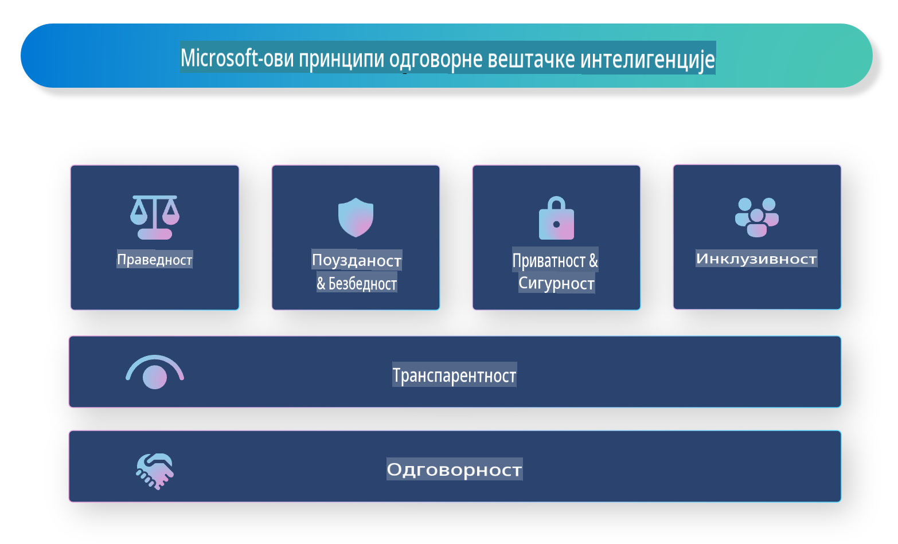

# **Predstavljanje odgovorne veštačke inteligencije**

[Microsoft Responsible AI](https://www.microsoft.com/ai/responsible-ai?WT.mc_id=aiml-138114-kinfeylo) je inicijativa koja ima za cilj da pomogne programerima i organizacijama da izgrade AI sisteme koji su transparentni, pouzdani i odgovorni. Ova inicijativa pruža smernice i resurse za razvoj odgovornih AI rešenja koja su u skladu sa etičkim principima, kao što su privatnost, pravičnost i transparentnost. Takođe ćemo istražiti neke od izazova i najboljih praksi povezanih sa izgradnjom odgovornih AI sistema.

## Pregled Microsoft Responsible AI 

**Etički principi** 

Microsoft Responsible AI se vodi nizom etičkih principa, kao što su privatnost, pravičnost, transparentnost, odgovornost i bezbednost. Ovi principi su osmišljeni da obezbede da se AI sistemi razvijaju na etički i odgovoran način.

**Transparentna veštačka inteligencija**

Microsoft Responsible AI naglašava važnost transparentnosti u AI sistemima. Ovo uključuje pružanje jasnih objašnjenja kako AI modeli funkcionišu, kao i obezbeđivanje javne dostupnosti izvora podataka i algoritama.

**Odgovorna veštačka inteligencija** 

[Microsoft Responsible AI](https://www.microsoft.com/ai/responsible-ai?WT.mc_id=aiml-138114-kinfeylo) promoviše razvoj odgovornih AI sistema koji mogu pružiti uvid u to kako AI modeli donose odluke. Ovo može pomoći korisnicima da razumeju i veruju rezultatima AI sistema.

**Uključivost** 

AI sistemi treba da budu dizajnirani tako da koriste svima. Microsoft ima za cilj stvaranje inkluzivne veštačke inteligencije koja uzima u obzir različite perspektive i izbegava pristrasnost ili diskriminaciju.

**Pouzdanost i bezbednost**

Osiguravanje da su AI sistemi pouzdani i bezbedni je ključno. Microsoft se fokusira na izgradnju robusnih modela koji funkcionišu dosledno i izbegavaju štetne ishode.

**Pravičnost u veštačkoj inteligenciji** 

Microsoft Responsible AI prepoznaje da AI sistemi mogu perpetuirati pristrasnosti ako su obučeni na pristrasnim podacima ili algoritmima. Inicijativa pruža smernice za razvoj pravičnih AI sistema koji ne diskriminišu na osnovu faktora kao što su rasa, pol ili starost.

**Privatnost i bezbednost podataka** 

Microsoft Responsible AI naglašava važnost zaštite privatnosti korisnika i bezbednosti podataka u AI sistemima. Ovo uključuje implementaciju snažne enkripcije podataka i kontrolu pristupa, kao i redovne provere ranjivosti AI sistema.

**Odgovornost i odgovornost** 

Microsoft Responsible AI promoviše odgovornost i svest u razvoju i implementaciji AI sistema. Ovo uključuje osiguravanje da su programeri i organizacije svesni potencijalnih rizika povezanih sa AI sistemima i preduzimanje koraka za smanjenje tih rizika.

## Najbolje prakse za izgradnju odgovornih AI sistema

**Razvijajte AI modele koristeći raznovrsne skupove podataka** 

Kako bi se izbegla pristrasnost u AI sistemima, važno je koristiti raznovrsne skupove podataka koji predstavljaju različite perspektive i iskustva.

**Koristite tehnike objašnjive veštačke inteligencije** 

Tehnike objašnjive veštačke inteligencije mogu pomoći korisnicima da razumeju kako AI modeli donose odluke, što može povećati poverenje u sistem.

**Redovno proveravajte AI sisteme na ranjivosti** 

Redovne provere AI sistema mogu pomoći u identifikaciji potencijalnih rizika i ranjivosti koje treba rešiti.

**Implementirajte snažnu enkripciju podataka i kontrolu pristupa** 

Enkripcija podataka i kontrola pristupa mogu pomoći u zaštiti privatnosti i bezbednosti korisnika u AI sistemima.

**Pridržavajte se etičkih principa u razvoju AI sistema** 

Pridržavanje etičkih principa, kao što su pravičnost, transparentnost i odgovornost, može pomoći u izgradnji poverenja u AI sisteme i osigurati da se oni razvijaju na odgovoran način.

## Korišćenje AI Foundry za odgovornu veštačku inteligenciju

[Azure AI Foundry](https://ai.azure.com?WT.mc_id=aiml-138114-kinfeylo) je moćna platforma koja omogućava programerima i organizacijama da brzo kreiraju inteligentne, savremene, tržišno spremne i odgovorne aplikacije. Evo nekih ključnih karakteristika i mogućnosti Azure AI Foundry:

**Unapred pripremljeni API-ji i modeli** 

Azure AI Foundry pruža unapred izgrađene i prilagodljive API-je i modele. Oni pokrivaju širok spektar AI zadataka, uključujući generativnu veštačku inteligenciju, obradu prirodnog jezika za razgovore, pretragu, praćenje, prevođenje, govor, viziju i donošenje odluka.

**Prompt Flow** 

Prompt Flow u Azure AI Foundry omogućava kreiranje iskustava za konverzacijsku veštačku inteligenciju. Omogućava dizajniranje i upravljanje tokovima razgovora, što olakšava izgradnju chatbotova, virtuelnih asistenata i drugih interaktivnih aplikacija.

**Retrieval Augmented Generation (RAG)** 

RAG je tehnika koja kombinuje pristupe zasnovane na preuzimanju i generativne pristupe. Poboljšava kvalitet generisanih odgovora koristeći i postojeće znanje (preuzimanje) i kreativnu generaciju (generisanje).

**Metričke procene i praćenja za generativnu veštačku inteligenciju** 

Azure AI Foundry pruža alate za procenu i praćenje generativnih AI modela. Možete proceniti njihove performanse, pravičnost i druge važne metrike kako biste osigurali odgovornu implementaciju. Dodatno, ako ste kreirali kontrolnu tablu, možete koristiti interfejs bez potrebe za kodiranjem u Azure Machine Learning Studio za prilagođavanje i generisanje Responsible AI Dashboard-a i povezanog izveštaja zasnovanog na [Responsible AI Toolbox](https://responsibleaitoolbox.ai/?WT.mc_id=aiml-138114-kinfeylo) Python bibliotekama. Ova izveštajna tabla pomaže u deljenju ključnih uvida vezanih za pravičnost, značaj karakteristika i druge aspekte odgovorne implementacije sa tehničkim i netehničkim učesnicima.

Da biste koristili AI Foundry za odgovornu veštačku inteligenciju, možete slediti ove najbolje prakse:

**Definišite problem i ciljeve vašeg AI sistema**

Pre nego što započnete proces razvoja, važno je jasno definisati problem ili cilj koji vaš AI sistem treba da reši. Ovo će vam pomoći da identifikujete podatke, algoritme i resurse potrebne za izgradnju efikasnog modela.

**Prikupite i obradite relevantne podatke** 

Kvalitet i količina podataka koji se koriste za obučavanje AI sistema mogu značajno uticati na njegove performanse. Stoga je važno prikupiti relevantne podatke, očistiti ih, obraditi i osigurati da su reprezentativni za populaciju ili problem koji pokušavate da rešite.

**Izaberite odgovarajući algoritam za evaluaciju** 

Postoji mnogo algoritama za evaluaciju. Važno je izabrati najprikladniji algoritam u zavisnosti od vaših podataka i problema.

**Procena i interpretacija modela** 

Nakon što ste izgradili AI model, važno je proceniti njegove performanse koristeći odgovarajuće metrike i interpretirati rezultate na transparentan način. Ovo će vam pomoći da identifikujete eventualne pristrasnosti ili ograničenja modela i unapredite ga po potrebi.

**Osigurajte transparentnost i objašnjivost** 

AI sistemi treba da budu transparentni i objašnjivi kako bi korisnici mogli da razumeju kako funkcionišu i kako se donose odluke. Ovo je posebno važno za aplikacije koje imaju značajan uticaj na ljudske živote, kao što su zdravstvo, finansije i pravni sistemi.

**Praćenje i ažuriranje modela** 

AI sistemi treba da se kontinuirano prate i ažuriraju kako bi ostali tačni i efikasni tokom vremena. Ovo zahteva stalno održavanje, testiranje i ponovnu obuku modela.

Zaključno, Microsoft Responsible AI je inicijativa koja ima za cilj da pomogne programerima i organizacijama da izgrade AI sisteme koji su transparentni, pouzdani i odgovorni. Imajte na umu da je implementacija odgovorne veštačke inteligencije ključna, a Azure AI Foundry nastoji da je učini praktičnom za organizacije. Prateći etičke principe i najbolje prakse, možemo osigurati da se AI sistemi razvijaju i implementiraju na odgovoran način koji koristi celokupnom društvu.

**Одрицање од одговорности**:  
Овај документ је преведен коришћењем услуга машинског превођења заснованих на вештачкој интелигенцији. Иако се трудимо да обезбедимо тачност, имајте у виду да аутоматизовани преводи могу садржати грешке или нетачности. Оригинални документ на изворном језику треба сматрати меродавним извором. За критичне информације препоручује се професионални људски превод. Не преузимамо одговорност за било какве неспоразуме или погрешна тумачења настала коришћењем овог превода.