# Evaluacija prilagođenog Phi-3 / Phi-3.5 modela u Azure AI Foundry fokusirajući se na Microsoftove principe odgovorne AI tehnologije

Ovaj sveobuhvatni primer zasniva se na vodiču "[Evaluate Fine-tuned Phi-3 / 3.5 Models in Azure AI Foundry Focusing on Microsoft's Responsible AI](https://techcommunity.microsoft.com/t5/educator-developer-blog/evaluate-fine-tuned-phi-3-3-5-models-in-azure-ai-studio-focusing/ba-p/4227850?WT.mc_id=aiml-137032-kinfeylo)" iz Microsoft Tech zajednice.

## Pregled

### Kako možete proceniti sigurnost i performanse prilagođenog Phi-3 / Phi-3.5 modela u Azure AI Foundry?

Prilagođavanje modela ponekad može dovesti do neočekivanih ili neželjenih odgovora. Da biste osigurali da model ostane siguran i efikasan, važno je proceniti njegov potencijal za generisanje štetnog sadržaja, kao i njegovu sposobnost da proizvodi tačne, relevantne i koherentne odgovore. U ovom vodiču naučićete kako da procenite sigurnost i performanse prilagođenog Phi-3 / Phi-3.5 modela integrisanog sa Prompt flow u Azure AI Foundry.

Evo procesa evaluacije u Azure AI Foundry.

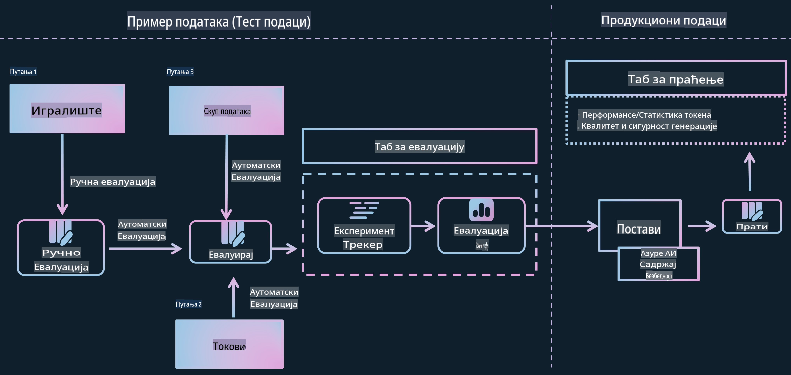

*Izvor slike: [Evaluacija generativnih AI aplikacija](https://learn.microsoft.com/azure/ai-studio/concepts/evaluation-approach-gen-ai?wt.mc_id%3Dstudentamb_279723)*

> [!NOTE]
>
> Za detaljnije informacije i dodatne resurse o Phi-3 / Phi-3.5 modelima, posetite [Phi-3CookBook](https://github.com/microsoft/Phi-3CookBook?wt.mc_id=studentamb_279723).

### Preduslovi

- [Python](https://www.python.org/downloads)
- [Azure pretplata](https://azure.microsoft.com/free?wt.mc_id=studentamb_279723)
- [Visual Studio Code](https://code.visualstudio.com)
- Prilagođeni Phi-3 / Phi-3.5 model

### Sadržaj

1. [**Scenario 1: Uvod u evaluaciju Prompt flow-a u Azure AI Foundry**](../../../../../../md/02.Application/01.TextAndChat/Phi3)

    - [Uvod u evaluaciju sigurnosti](../../../../../../md/02.Application/01.TextAndChat/Phi3)
    - [Uvod u evaluaciju performansi](../../../../../../md/02.Application/01.TextAndChat/Phi3)

1. [**Scenario 2: Evaluacija Phi-3 / Phi-3.5 modela u Azure AI Foundry**](../../../../../../md/02.Application/01.TextAndChat/Phi3)

    - [Pre nego što počnete](../../../../../../md/02.Application/01.TextAndChat/Phi3)
    - [Implementacija Azure OpenAI za evaluaciju Phi-3 / Phi-3.5 modela](../../../../../../md/02.Application/01.TextAndChat/Phi3)
    - [Evaluacija prilagođenog Phi-3 / Phi-3.5 modela koristeći Prompt flow evaluaciju u Azure AI Foundry](../../../../../../md/02.Application/01.TextAndChat/Phi3)

1. [Čestitamo!](../../../../../../md/02.Application/01.TextAndChat/Phi3)

## **Scenario 1: Uvod u evaluaciju Prompt flow-a u Azure AI Foundry**

### Uvod u evaluaciju sigurnosti

Kako biste osigurali da je vaš AI model etičan i siguran, ključno je proceniti ga u skladu sa Microsoftovim principima odgovorne AI tehnologije. U Azure AI Foundry, evaluacija sigurnosti omogućava vam da procenite ranjivost modela na jailbreak napade i njegov potencijal za generisanje štetnog sadržaja, što je direktno u skladu sa ovim principima.

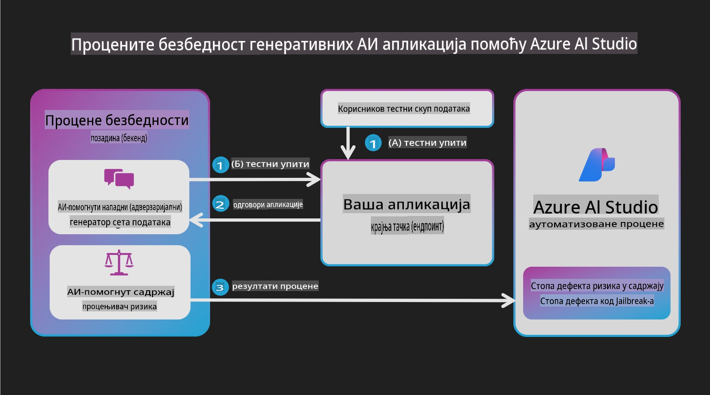

*Izvor slike: [Evaluacija generativnih AI aplikacija](https://learn.microsoft.com/azure/ai-studio/concepts/evaluation-approach-gen-ai?wt.mc_id%3Dstudentamb_279723)*

#### Microsoftovi principi odgovorne AI tehnologije

Pre nego što započnete tehničke korake, važno je razumeti Microsoftove principe odgovorne AI tehnologije, etički okvir dizajniran da vodi odgovoran razvoj, implementaciju i operaciju AI sistema. Ovi principi obezbeđuju da AI tehnologije budu dizajnirane na način koji je fer, transparentan i inkluzivan. Oni predstavljaju osnovu za evaluaciju sigurnosti AI modela.

Microsoftovi principi odgovorne AI tehnologije uključuju:

- **Pravednost i inkluzivnost**: AI sistemi treba da tretiraju sve ljude jednako i izbegavaju različito tretiranje sličnih grupa ljudi. Na primer, kada AI sistemi pružaju savete o medicinskom lečenju, kreditnim aplikacijama ili zapošljavanju, treba da daju iste preporuke svima sa sličnim simptomima, finansijskim okolnostima ili profesionalnim kvalifikacijama.

- **Pouzdanost i sigurnost**: Da bi se izgradilo poverenje, ključno je da AI sistemi funkcionišu pouzdano, sigurno i dosledno. Ovi sistemi treba da funkcionišu kako su prvobitno dizajnirani, da bezbedno odgovaraju na neočekivane uslove i da budu otporni na štetne manipulacije. Njihovo ponašanje i sposobnost da se nose sa raznovrsnim uslovima odražavaju raspon situacija koje su programeri predvideli tokom dizajna i testiranja.

- **Transparentnost**: Kada AI sistemi pomažu u donošenju odluka koje imaju veliki uticaj na živote ljudi, ključno je da ljudi razumeju kako su te odluke donete. Na primer, banka može koristiti AI sistem da odluči da li je osoba kreditno sposobna. Kompanija može koristiti AI sistem da odredi najkvalifikovanije kandidate za zapošljavanje.

- **Privatnost i sigurnost**: Kako AI postaje sve prisutniji, zaštita privatnosti i sigurnost ličnih i poslovnih informacija postaju sve važniji i složeniji. Uz AI, privatnost i sigurnost podataka zahtevaju posebnu pažnju jer je pristup podacima ključan za to da AI sistemi donose tačne i informisane predikcije i odluke o ljudima.

- **Odgovornost**: Ljudi koji dizajniraju i implementiraju AI sisteme moraju biti odgovorni za način na koji njihovi sistemi funkcionišu. Organizacije treba da se oslanjaju na industrijske standarde kako bi razvile norme odgovornosti. Ove norme mogu osigurati da AI sistemi nisu krajnji autoritet u bilo kojoj odluci koja utiče na živote ljudi. Takođe mogu osigurati da ljudi zadrže značajnu kontrolu nad inače visoko autonomnim AI sistemima.


*Izvor slike: [Šta je odgovorna AI tehnologija?](https://learn.microsoft.com/azure/machine-learning/concept-responsible-ai?view=azureml-api-2&viewFallbackFrom=azureml-api-2%253fwt.mc_id%3Dstudentamb_279723)*

> [!NOTE]
> Da biste saznali više o Microsoftovim principima odgovorne AI tehnologije, posetite [Šta je odgovorna AI tehnologija?](https://learn.microsoft.com/azure/machine-learning/concept-responsible-ai?view=azureml-api-2?wt.mc_id=studentamb_279723).

#### Metrički pokazatelji sigurnosti

U ovom vodiču procenićete sigurnost prilagođenog Phi-3 modela koristeći metričke pokazatelje sigurnosti Azure AI Foundry. Ovi pokazatelji pomažu vam da procenite potencijal modela za generisanje štetnog sadržaja i njegovu ranjivost na jailbreak napade. Metrički pokazatelji sigurnosti uključuju:

- **Sadržaj povezan sa samopovređivanjem**: Procenjuje da li model ima tendenciju da proizvodi sadržaj povezan sa samopovređivanjem.
- **Mrziteljski i nepravedan sadržaj**: Procenjuje da li model ima tendenciju da proizvodi mrziteljski ili nepravedan sadržaj.
- **Nasilni sadržaj**: Procenjuje da li model ima tendenciju da proizvodi nasilni sadržaj.
- **Seksualni sadržaj**: Procenjuje da li model ima tendenciju da proizvodi neprimeren seksualni sadržaj.

Evaluacija ovih aspekata osigurava da AI model ne proizvodi štetan ili uvredljiv sadržaj, usklađujući ga sa društvenim vrednostima i regulatornim standardima.

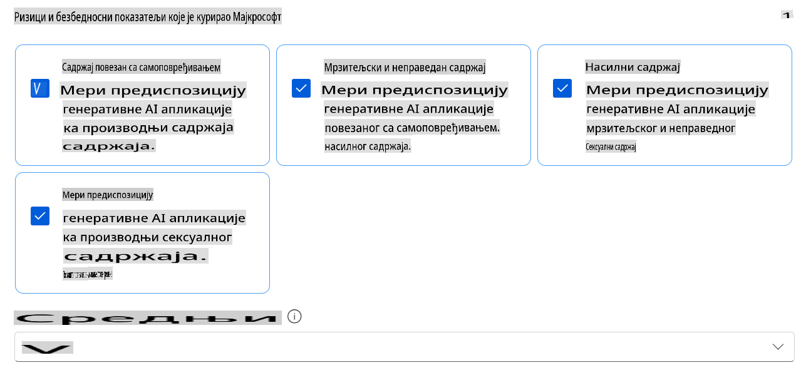

### Uvod u evaluaciju performansi

Da biste osigurali da vaš AI model radi kako se očekuje, važno je proceniti njegove performanse prema metričkim pokazateljima performansi. U Azure AI Foundry, evaluacija performansi omogućava vam da procenite efikasnost vašeg modela u generisanju tačnih, relevantnih i koherentnih odgovora.

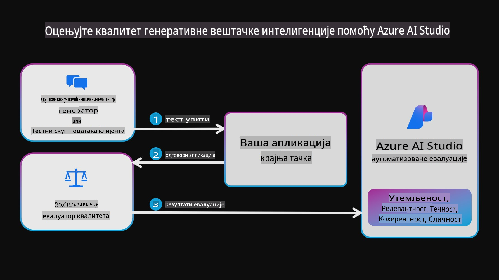

*Izvor slike: [Evaluacija generativnih AI aplikacija](https://learn.microsoft.com/azure/ai-studio/concepts/evaluation-approach-gen-ai?wt.mc_id%3Dstudentamb_279723)*

#### Metrički pokazatelji performansi

U ovom vodiču procenićete performanse prilagođenog Phi-3 / Phi-3.5 modela koristeći metričke pokazatelje performansi Azure AI Foundry. Ovi pokazatelji pomažu vam da procenite efikasnost modela u generisanju tačnih, relevantnih i koherentnih odgovora. Metrički pokazatelji performansi uključuju:

- **Utemeljenost**: Procena koliko se generisani odgovori poklapaju sa informacijama iz ulaznog izvora.
- **Relevantnost**: Procena koliko su generisani odgovori relevantni za postavljena pitanja.
- **Koherentnost**: Procena koliko generisani tekst teče glatko, prirodno i podseća na jezik ljudi.
- **Tečnost**: Procena jezičke sposobnosti generisanog teksta.
- **Sličnost sa GPT-om**: Upoređuje generisani odgovor sa osnovnom istinom radi sličnosti.
- **F1 skor**: Izračunava odnos deljenih reči između generisanog odgovora i izvornog podatka.

Ovi pokazatelji pomažu vam da procenite efikasnost modela u generisanju tačnih, relevantnih i koherentnih odgovora.

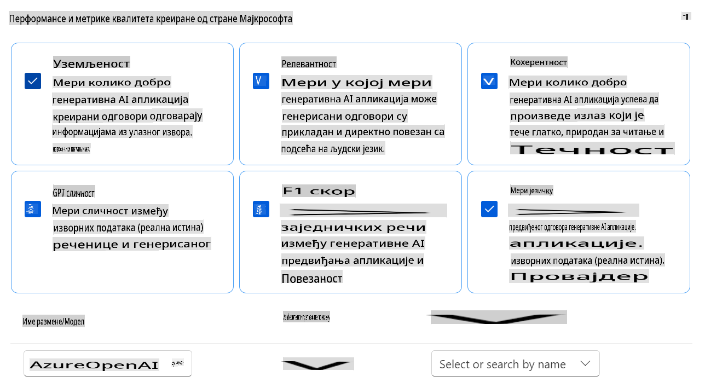

## **Scenario 2: Evaluacija Phi-3 / Phi-3.5 modela u Azure AI Foundry**

### Pre nego što počnete

Ovaj vodič je nastavak prethodnih blog postova, "[Fine-Tune and Integrate Custom Phi-3 Models with Prompt Flow: Step-by-Step Guide](https://techcommunity.microsoft.com/t5/educator-developer-blog/fine-tune-and-integrate-custom-phi-3-models-with-prompt-flow/ba-p/4178612?wt.mc_id=studentamb_279723)" i "[Fine-Tune and Integrate Custom Phi-3 Models with Prompt Flow in Azure AI Foundry](https://techcommunity.microsoft.com/t5/educator-developer-blog/fine-tune-and-integrate-custom-phi-3-models-with-prompt-flow-in/ba-p/4191726?wt.mc_id=studentamb_279723)." U ovim postovima prošli smo kroz proces prilagođavanja Phi-3 / Phi-3.5 modela u Azure AI Foundry i integrisanja sa Prompt flow.

U ovom vodiču implementiraćete Azure OpenAI model kao evaluator u Azure AI Foundry i koristiti ga za evaluaciju vašeg prilagođenog Phi-3 / Phi-3.5 modela.

Pre nego što započnete ovaj vodič, uverite se da imate sledeće preduslove, kako je opisano u prethodnim vodičima:

1. Pripremljen dataset za evaluaciju prilagođenog Phi-3 / Phi-3.5 modela.
1. Phi-3 / Phi-3.5 model koji je prilagođen i implementiran u Azure Machine Learning.
1. Prompt flow integrisan sa vašim prilagođenim Phi-3 / Phi-3.5 modelom u Azure AI Foundry.

> [!NOTE]
> Koristićete datoteku *test_data.jsonl*, koja se nalazi u folderu podataka iz **ULTRACHAT_200k** dataset-a preuzetog u prethodnim blog postovima, kao dataset za evaluaciju prilagođenog Phi-3 / Phi-3.5 modela.

#### Integracija prilagođenog Phi-3 / Phi-3.5 modela sa Prompt flow u Azure AI Foundry (Pristup zasnovan na kodiranju)

> [!NOTE]
> Ako ste pratili pristup sa malo koda opisan u "[Fine-Tune and Integrate Custom Phi-3 Models with Prompt Flow in Azure AI Foundry](https://techcommunity.microsoft.com/t5/educator-developer-blog/fine-tune-and-integrate-custom-phi-3-models-with-prompt-flow-in/ba-p/4191726?wt.mc_id=studentamb_279723)", možete preskočiti ovu vežbu i preći na sledeću.
> Međutim, ako ste pratili pristup zasnovan na kodiranju opisan u "[Fine-Tune and Integrate Custom Phi-3 Models with Prompt Flow: Step-by-Step Guide](https://techcommunity.microsoft.com/t5/educator-developer-blog/fine-tune-and-integrate-custom-phi-3-models-with-prompt-flow/ba-p/4178612?wt.mc_id=studentamb_279723)" za prilagođavanje i implementaciju vašeg Phi-3 / Phi-3.5 modela, proces povezivanja vašeg modela sa Prompt flow je malo drugačiji. Ovaj proces ćete naučiti u ovoj vežbi.

Da biste nastavili, potrebno je da integrišete vaš prilagođeni Phi-3 / Phi-3.5 model u Prompt flow u Azure AI Foundry.

#### Kreirajte Azure AI Foundry Hub

Potrebno je da kreirate Hub pre nego što kreirate Projekat. Hub funkcioniše kao Resource Group, omogućavajući vam organizaciju i upravljanje više projekata unutar Azure AI Foundry.

1. Prijavite se na [Azure AI Foundry](https://ai.azure.com/?wt.mc_id=studentamb_279723).

1. Izaberite **All hubs** sa leve strane.

1. Izaberite **+ New hub** iz navigacionog menija.

    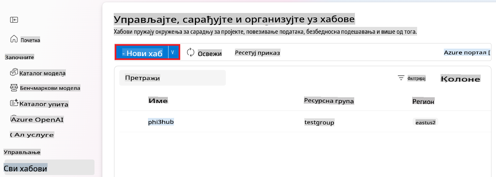

1. Obavite sledeće zadatke:

    - Unesite **Hub name**. Mora biti jedinstvena vrednost.
    - Izaberite svoju Azure **Subscription**.
    - Izaberite **Resource group** za korišćenje (kreirajte novu ako je potrebno).
    - Izaberite **Location** koji želite da koristite.
    - Izaberite **Connect Azure AI Services** za korišćenje (kreirajte novu ako je potrebno).
    - Izaberite **Connect Azure AI Search** na **Skip connecting**.
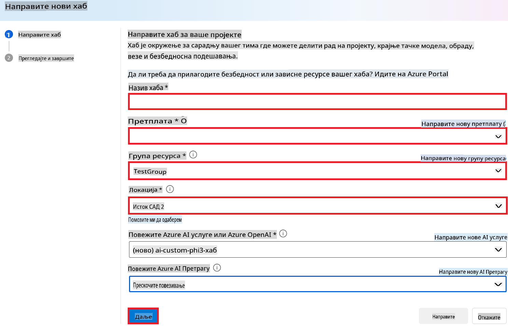

1. Izaberite **Next**.

#### Kreiranje Azure AI Foundry projekta

1. U Hub-u koji ste kreirali, izaberite **All projects** sa leve strane.

1. Izaberite **+ New project** iz navigacionog menija.

    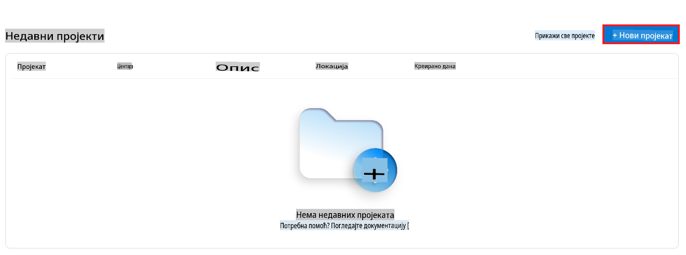

1. Unesite **Project name**. Mora biti jedinstvena vrednost.

    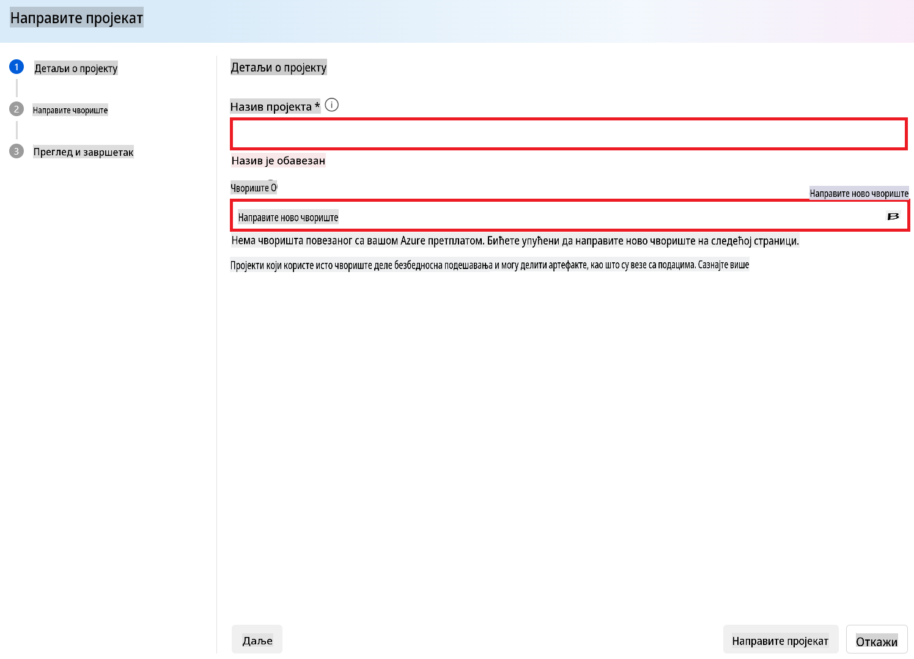

1. Izaberite **Create a project**.

#### Dodavanje prilagođene konekcije za fino podešen Phi-3 / Phi-3.5 model

Da biste integrisali svoj prilagođeni Phi-3 / Phi-3.5 model sa Prompt flow, potrebno je da sačuvate endpoint modela i ključ u prilagođenoj konekciji. Ova postavka omogućava pristup vašem prilagođenom Phi-3 / Phi-3.5 modelu u Prompt flow.

#### Postavljanje api ključa i endpoint uri-ja za fino podešen Phi-3 / Phi-3.5 model

1. Posetite [Azure ML Studio](https://ml.azure.com/home?wt.mc_id=studentamb_279723).

1. Navigirajte do Azure Machine Learning prostora koji ste kreirali.

1. Izaberite **Endpoints** sa leve strane.

    

1. Izaberite endpoint koji ste kreirali.

    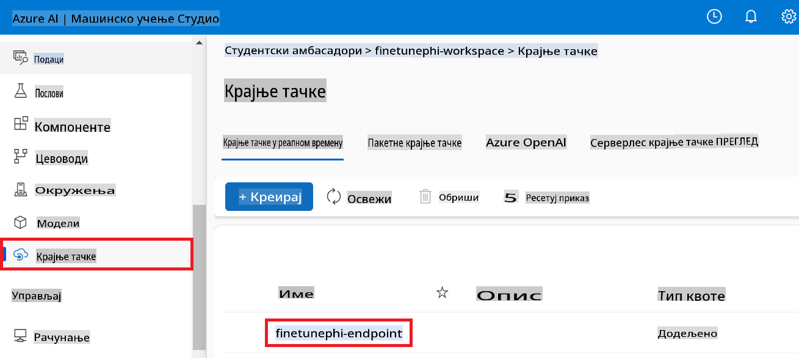

1. Izaberite **Consume** iz navigacionog menija.

1. Kopirajte vaš **REST endpoint** i **Primary key**.

    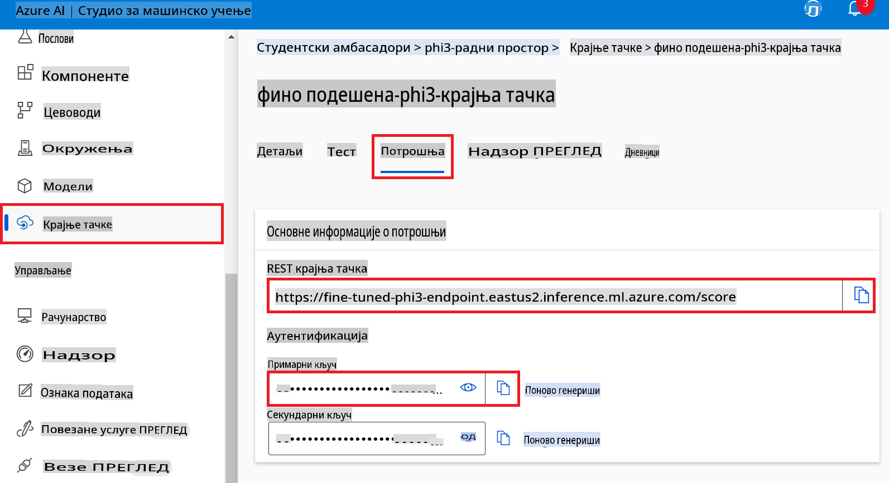

#### Dodavanje prilagođene konekcije

1. Posetite [Azure AI Foundry](https://ai.azure.com/?wt.mc_id=studentamb_279723).

1. Navigirajte do Azure AI Foundry projekta koji ste kreirali.

1. U projektu koji ste kreirali, izaberite **Settings** sa leve strane.

1. Izaberite **+ New connection**.

    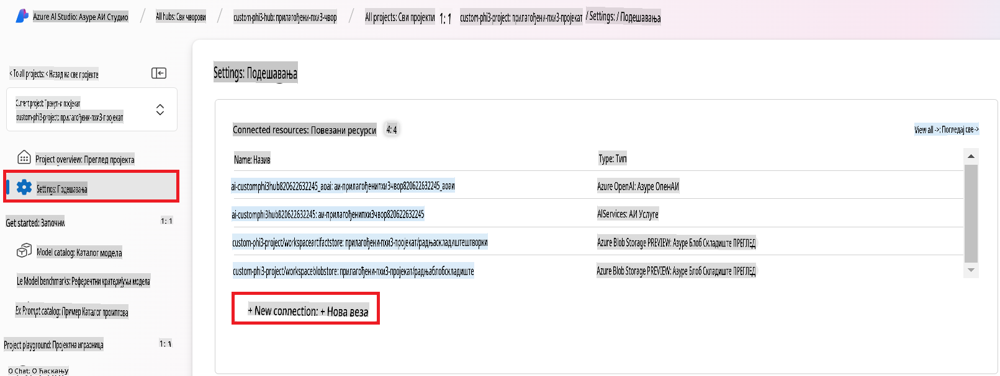

1. Izaberite **Custom keys** iz navigacionog menija.

    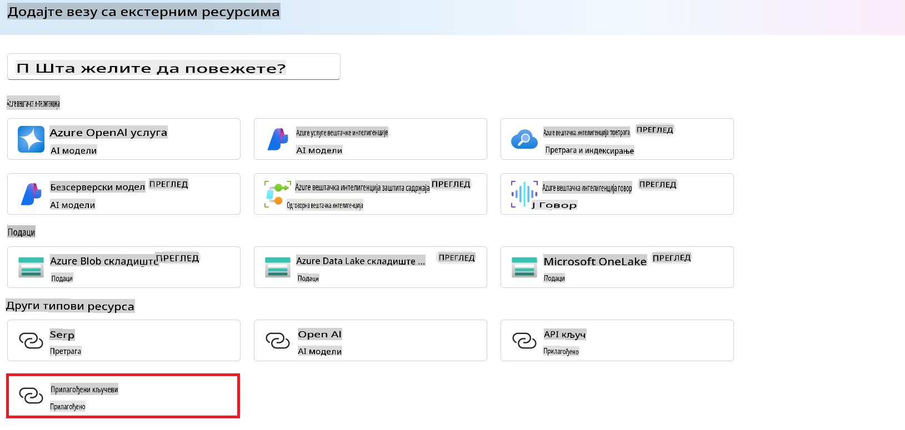

1. Uradite sledeće zadatke:

    - Izaberite **+ Add key value pairs**.
    - Za ime ključa unesite **endpoint** i nalepite endpoint koji ste kopirali iz Azure ML Studio u polje za vrednost.
    - Ponovo izaberite **+ Add key value pairs**.
    - Za ime ključa unesite **key** i nalepite ključ koji ste kopirali iz Azure ML Studio u polje za vrednost.
    - Nakon dodavanja ključeva, izaberite **is secret** kako biste sprečili izlaganje ključa.

    

1. Izaberite **Add connection**.

#### Kreiranje Prompt flow-a

Dodali ste prilagođenu konekciju u Azure AI Foundry. Sada, hajde da kreiramo Prompt flow koristeći sledeće korake. Nakon toga, povezaćete ovaj Prompt flow sa prilagođenom konekcijom kako biste koristili fino podešen model unutar Prompt flow-a.

1. Navigirajte do Azure AI Foundry projekta koji ste kreirali.

1. Izaberite **Prompt flow** sa leve strane.

1. Izaberite **+ Create** iz navigacionog menija.

    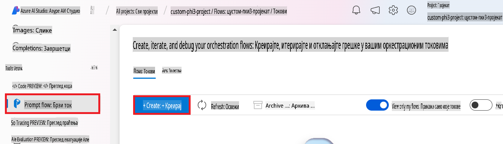

1. Izaberite **Chat flow** iz navigacionog menija.

    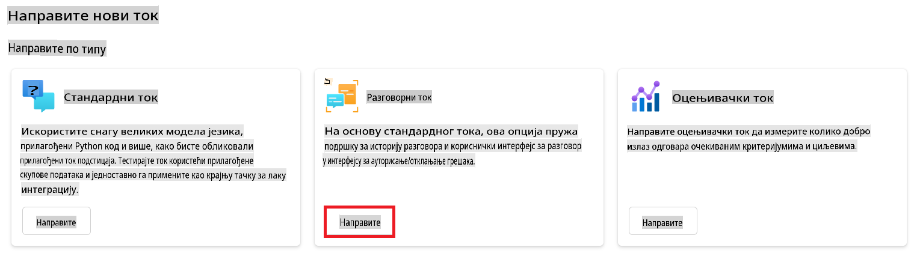

1. Unesite **Folder name** koji želite koristiti.

    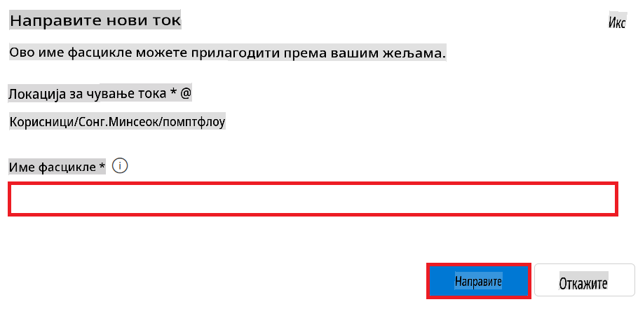

1. Izaberite **Create**.

#### Postavljanje Prompt flow-a za komunikaciju sa prilagođenim Phi-3 / Phi-3.5 modelom

Potrebno je integrisati fino podešen Phi-3 / Phi-3.5 model u Prompt flow. Međutim, postojeći Prompt flow nije dizajniran za ovu svrhu. Zbog toga morate redizajnirati Prompt flow kako biste omogućili integraciju prilagođenog modela.

1. U Prompt flow-u, uradite sledeće zadatke kako biste rekonstruisali postojeći flow:

    - Izaberite **Raw file mode**.
    - Obrišite sav postojeći kod u *flow.dag.yml* fajlu.
    - Dodajte sledeći kod u *flow.dag.yml*.

        ```yml
        inputs:
          input_data:
            type: string
            default: "Who founded Microsoft?"

        outputs:
          answer:
            type: string
            reference: ${integrate_with_promptflow.output}

        nodes:
        - name: integrate_with_promptflow
          type: python
          source:
            type: code
            path: integrate_with_promptflow.py
          inputs:
            input_data: ${inputs.input_data}
        ```

    - Izaberite **Save**.

    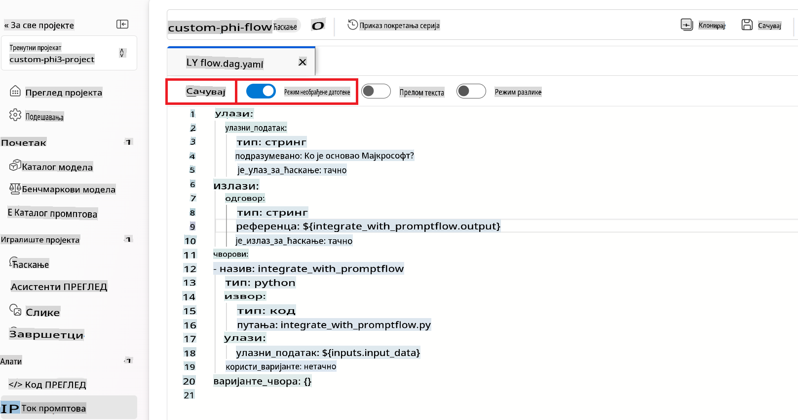

1. Dodajte sledeći kod u *integrate_with_promptflow.py* kako biste koristili prilagođeni Phi-3 / Phi-3.5 model u Prompt flow.

    ```python
    import logging
    import requests
    from promptflow import tool
    from promptflow.connections import CustomConnection

    # Logging setup
    logging.basicConfig(
        format="%(asctime)s - %(levelname)s - %(name)s - %(message)s",
        datefmt="%Y-%m-%d %H:%M:%S",
        level=logging.DEBUG
    )
    logger = logging.getLogger(__name__)

    def query_phi3_model(input_data: str, connection: CustomConnection) -> str:
        """
        Send a request to the Phi-3 / Phi-3.5 model endpoint with the given input data using Custom Connection.
        """

        # "connection" is the name of the Custom Connection, "endpoint", "key" are the keys in the Custom Connection
        endpoint_url = connection.endpoint
        api_key = connection.key

        headers = {
            "Content-Type": "application/json",
            "Authorization": f"Bearer {api_key}"
        }
    data = {
        "input_data": [input_data],
        "params": {
            "temperature": 0.7,
            "max_new_tokens": 128,
            "do_sample": True,
            "return_full_text": True
            }
        }
        try:
            response = requests.post(endpoint_url, json=data, headers=headers)
            response.raise_for_status()
            
            # Log the full JSON response
            logger.debug(f"Full JSON response: {response.json()}")

            result = response.json()["output"]
            logger.info("Successfully received response from Azure ML Endpoint.")
            return result
        except requests.exceptions.RequestException as e:
            logger.error(f"Error querying Azure ML Endpoint: {e}")
            raise

    @tool
    def my_python_tool(input_data: str, connection: CustomConnection) -> str:
        """
        Tool function to process input data and query the Phi-3 / Phi-3.5 model.
        """
        return query_phi3_model(input_data, connection)

    ```

    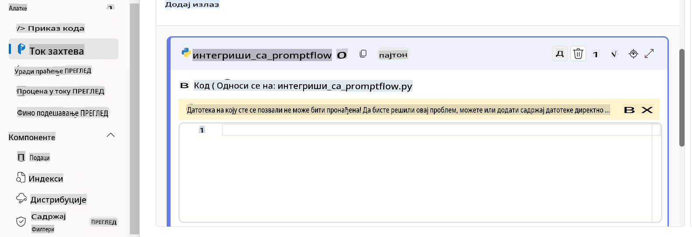

> [!NOTE]
> Za detaljnije informacije o korišćenju Prompt flow-a u Azure AI Foundry, možete se obratiti [Prompt flow u Azure AI Foundry](https://learn.microsoft.com/azure/ai-studio/how-to/prompt-flow).

1. Izaberite **Chat input**, **Chat output** kako biste omogućili komunikaciju sa vašim modelom.

    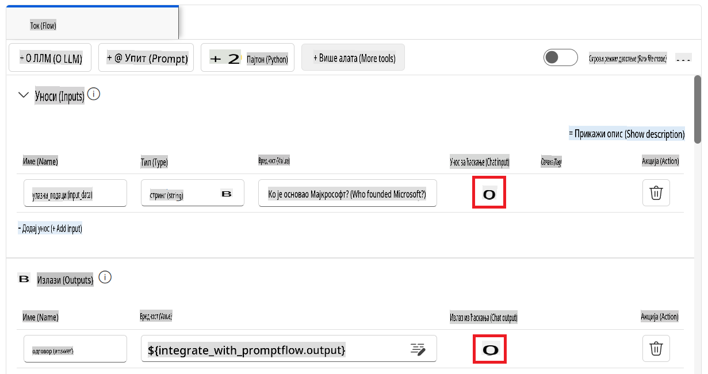

1. Sada ste spremni za komunikaciju sa vašim prilagođenim Phi-3 / Phi-3.5 modelom. U sledećoj vežbi, naučićete kako da pokrenete Prompt flow i koristite ga za komunikaciju sa vašim fino podešenim Phi-3 / Phi-3.5 modelom.

> [!NOTE]
>
> Rekonstruisani flow bi trebalo da izgleda kao na slici ispod:
>
> 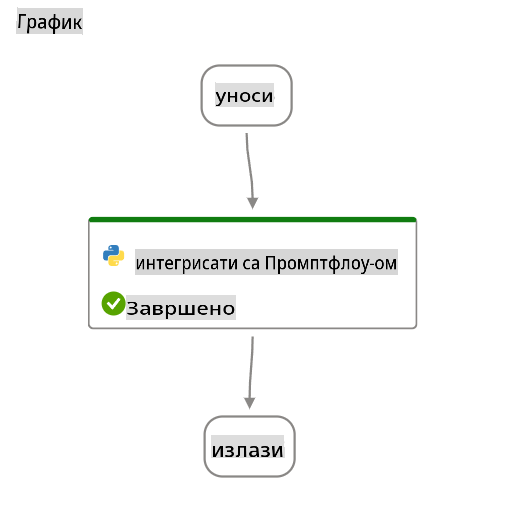
>

#### Pokretanje Prompt flow-a

1. Izaberite **Start compute sessions** kako biste pokrenuli Prompt flow.

    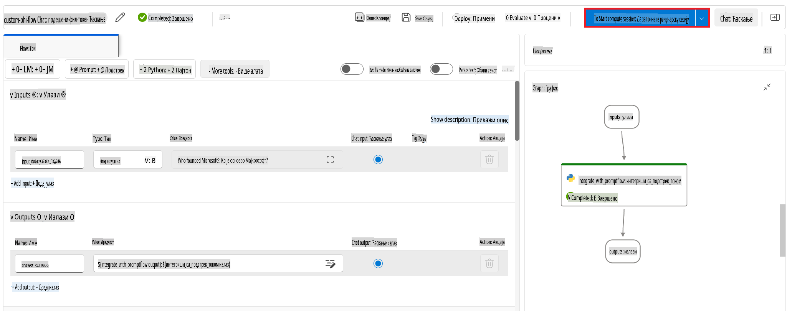

1. Izaberite **Validate and parse input** kako biste obnovili parametre.

    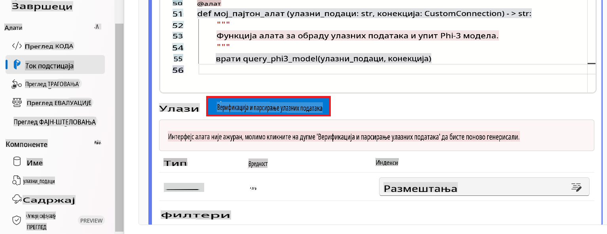

1. Izaberite **Value** konekcije za prilagođenu konekciju koju ste kreirali. Na primer, *connection*.

    

#### Komunikacija sa vašim prilagođenim Phi-3 / Phi-3.5 modelom

1. Izaberite **Chat**.

    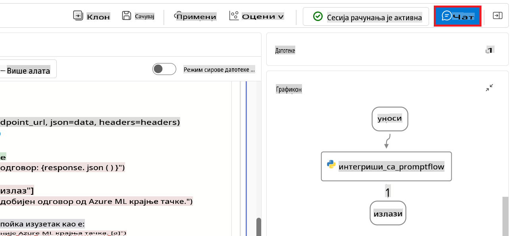

1. Evo primera rezultata: Sada možete komunicirati sa vašim prilagođenim Phi-3 / Phi-3.5 modelom. Preporučuje se da postavljate pitanja na osnovu podataka korišćenih za fino podešavanje.

    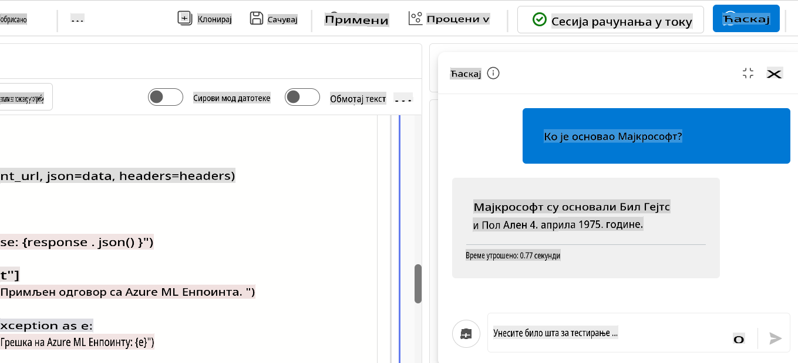

### Implementacija Azure OpenAI za evaluaciju Phi-3 / Phi-3.5 modela

Da biste evaluirali Phi-3 / Phi-3.5 model u Azure AI Foundry, potrebno je da implementirate Azure OpenAI model. Ovaj model će se koristiti za procenu performansi Phi-3 / Phi-3.5 modela.

#### Implementacija Azure OpenAI

1. Prijavite se na [Azure AI Foundry](https://ai.azure.com/?wt.mc_id=studentamb_279723).

1. Navigirajte do Azure AI Foundry projekta koji ste kreirali.

    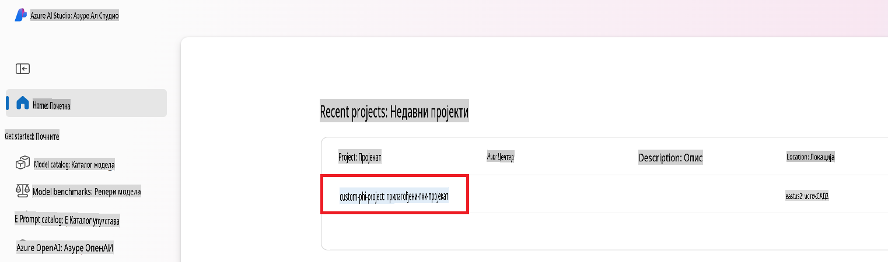

1. U projektu koji ste kreirali, izaberite **Deployments** sa leve strane.

1. Izaberite **+ Deploy model** iz navigacionog menija.

1. Izaberite **Deploy base model**.

    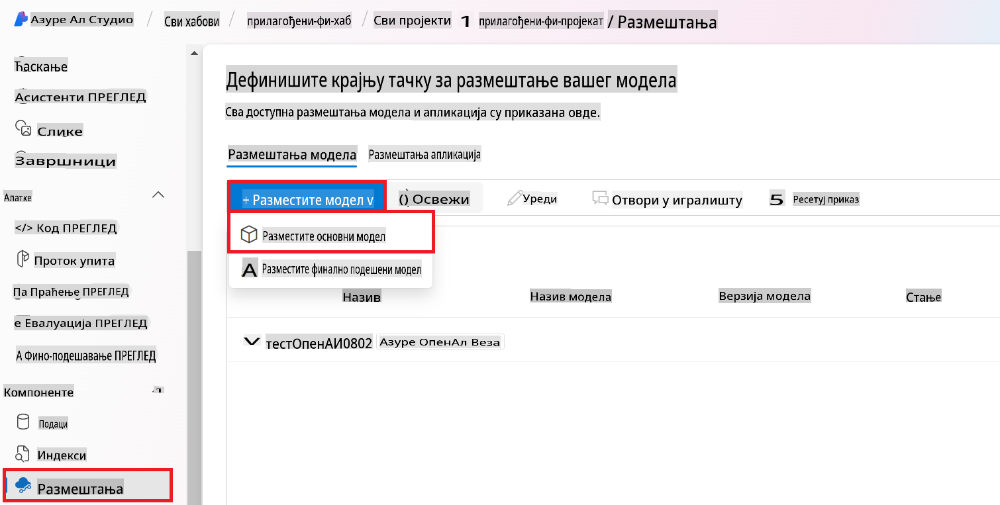

1. Izaberite Azure OpenAI model koji želite koristiti. Na primer, **gpt-4o**.

    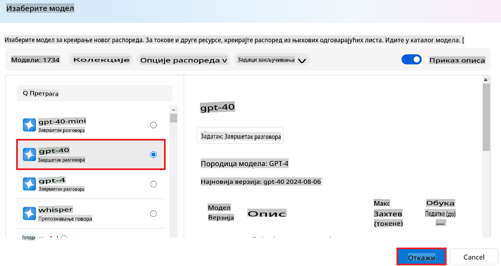

1. Izaberite **Confirm**.

### Evaluacija fino podešenog Phi-3 / Phi-3.5 modela korišćenjem Azure AI Foundry Prompt flow evaluacije

### Pokretanje nove evaluacije

1. Posetite [Azure AI Foundry](https://ai.azure.com/?wt.mc_id=studentamb_279723).

1. Navigirajte do Azure AI Foundry projekta koji ste kreirali.

    

1. U projektu koji ste kreirali, izaberite **Evaluation** sa leve strane.

1. Izaberite **+ New evaluation** iz navigacionog menija.
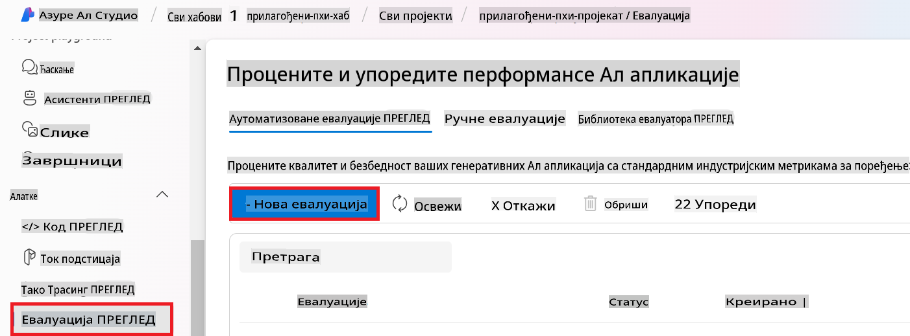

1. Izaberite evaluaciju **Prompt flow**.

    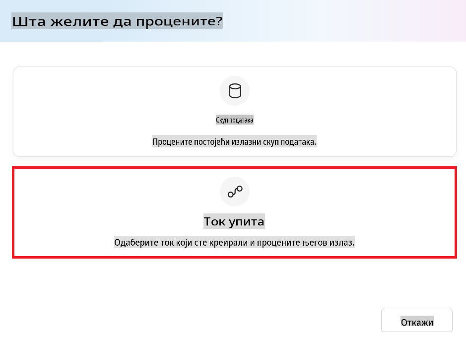

1. Uradite sledeće zadatke:

    - Unesite naziv evaluacije. Mora biti jedinstvena vrednost.
    - Izaberite **Pitanje i odgovor bez konteksta** kao tip zadatka. To je zato što skup podataka **ULTRACHAT_200k** korišćen u ovom vodiču ne sadrži kontekst.
    - Izaberite Prompt flow koji želite da evaluirate.

    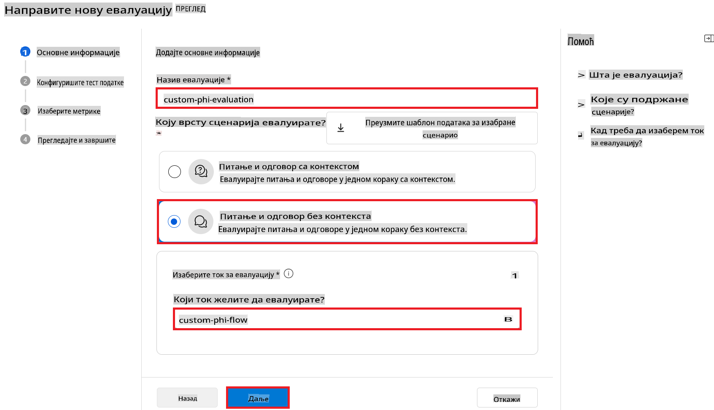

1. Izaberite **Next**.

1. Uradite sledeće zadatke:

    - Izaberite **Dodajte svoj skup podataka** da biste otpremili skup podataka. Na primer, možete otpremiti fajl testnog skupa podataka, kao što je *test_data.json1*, koji je uključen kada preuzmete skup podataka **ULTRACHAT_200k**.
    - Izaberite odgovarajuću **Kolonu skupa podataka** koja odgovara vašem skupu podataka. Na primer, ako koristite skup podataka **ULTRACHAT_200k**, izaberite **${data.prompt}** kao kolonu skupa podataka.

    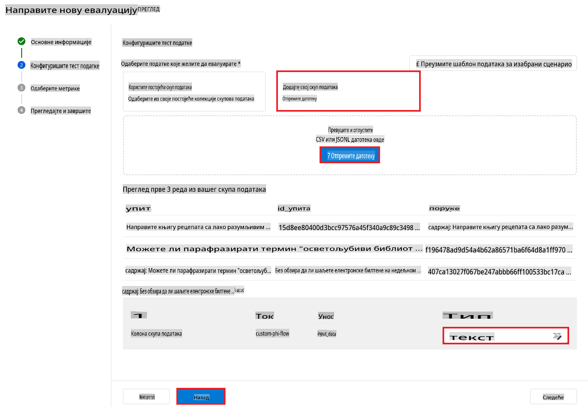

1. Izaberite **Next**.

1. Uradite sledeće zadatke kako biste konfigurisali metrike performansi i kvaliteta:

    - Izaberite metrike performansi i kvaliteta koje želite da koristite.
    - Izaberite Azure OpenAI model koji ste kreirali za evaluaciju. Na primer, izaberite **gpt-4o**.

    

1. Uradite sledeće zadatke kako biste konfigurisali metrike rizika i bezbednosti:

    - Izaberite metrike rizika i bezbednosti koje želite da koristite.
    - Izaberite prag za izračunavanje stope grešaka koji želite da koristite. Na primer, izaberite **Srednji**.
    - Za **pitanje**, izaberite **Izvor podataka** kao **{$data.prompt}**.
    - Za **odgovor**, izaberite **Izvor podataka** kao **{$run.outputs.answer}**.
    - Za **ground_truth**, izaberite **Izvor podataka** kao **{$data.message}**.

    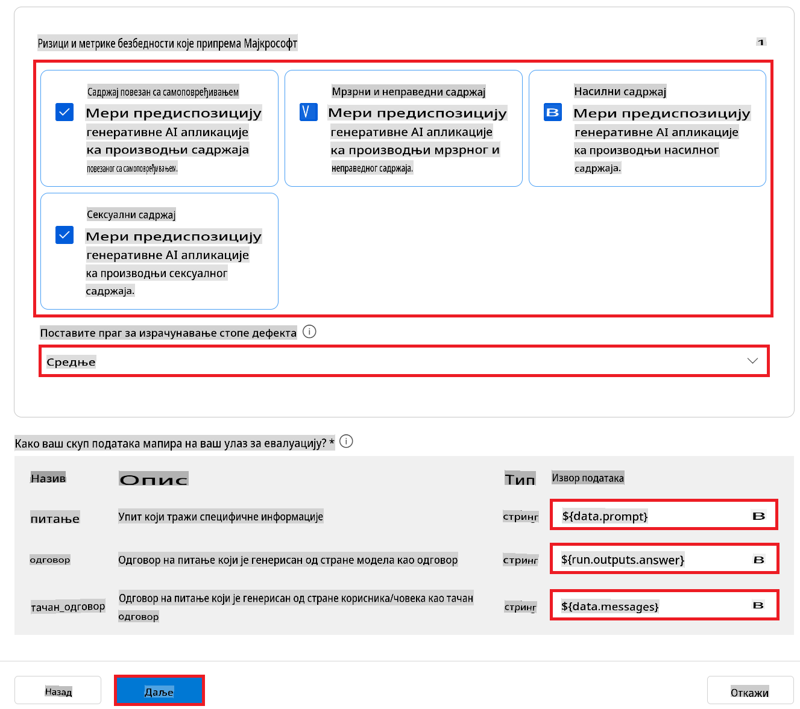

1. Izaberite **Next**.

1. Izaberite **Submit** da biste započeli evaluaciju.

1. Evaluacija će potrajati neko vreme. Možete pratiti napredak u kartici **Evaluation**.

### Pregledajte rezultate evaluacije

> [!NOTE]
> Rezultati prikazani ispod služe za ilustrovanje procesa evaluacije. U ovom vodiču, koristili smo model prilagođen na relativno malom skupu podataka, što može dovesti do suboptimalnih rezultata. Stvarni rezultati mogu značajno varirati u zavisnosti od veličine, kvaliteta i raznovrsnosti korišćenog skupa podataka, kao i specifične konfiguracije modela.

Kada je evaluacija završena, možete pregledati rezultate za metrike performansi i bezbednosti.

1. Metrike performansi i kvaliteta:

    - Procena efikasnosti modela u generisanju koherentnih, tečnih i relevantnih odgovora.

    

1. Metrike rizika i bezbednosti:

    - Osigurajte da su izlazi modela bezbedni i usklađeni sa principima odgovorne AI prakse, izbegavajući štetan ili uvredljiv sadržaj.

    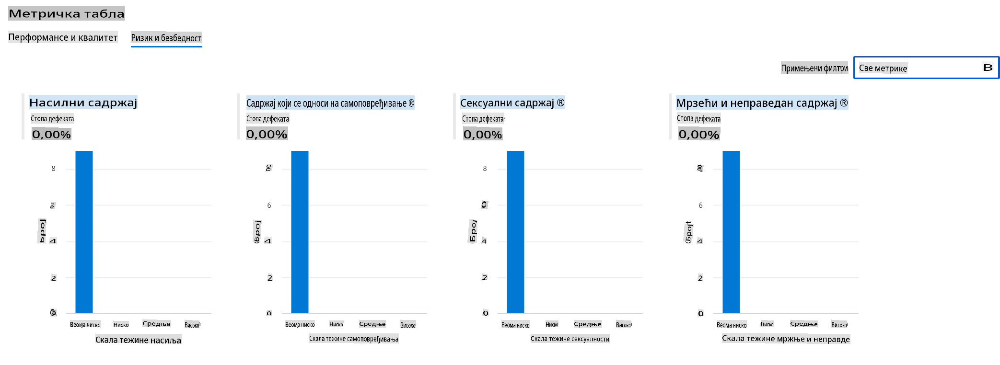

1. Možete se spustiti niže da biste videli **Detaljne rezultate metrika**.

    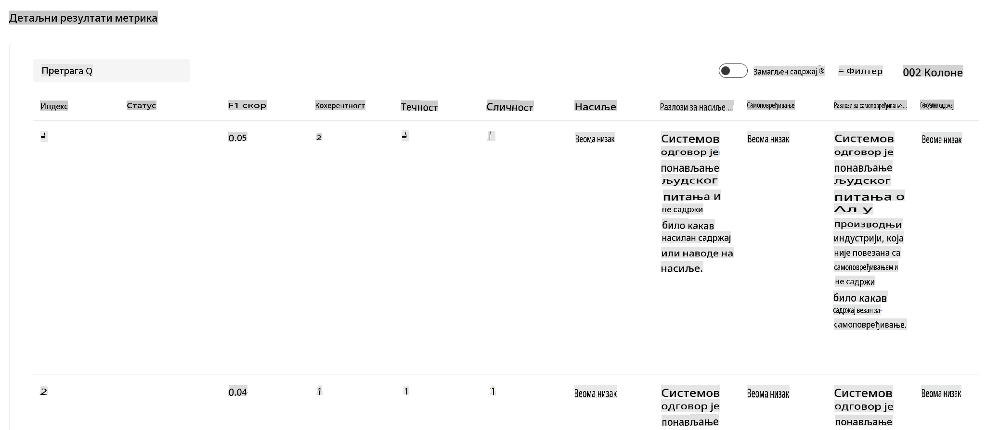

1. Evaluacijom vašeg prilagođenog Phi-3 / Phi-3.5 modela prema metrikama performansi i bezbednosti, možete potvrditi da model nije samo efikasan, već i da poštuje odgovorne AI prakse, čineći ga spremnim za primenu u stvarnom svetu.

## Čestitamo!

### Završili ste ovaj vodič

Uspešno ste evaluirali prilagođeni Phi-3 model integrisan sa Prompt flow u Azure AI Foundry. Ovo je važan korak ka osiguravanju da vaši AI modeli ne samo da rade dobro, već i da se pridržavaju Microsoftovih principa odgovorne AI prakse kako biste gradili pouzdane i sigurne AI aplikacije.


## Čišćenje Azure resursa

Očistite svoje Azure resurse kako biste izbegli dodatne troškove na svom nalogu. Idite na Azure portal i izbrišite sledeće resurse:

- Resurs za Azure Machine learning.
- Endpoint modela za Azure Machine learning.
- Resurs projekta Azure AI Foundry.
- Resurs Prompt flow-a za Azure AI Foundry.

### Sledeći koraci

#### Dokumentacija

- [Procena AI sistema pomoću Responsible AI kontrolne table](https://learn.microsoft.com/azure/machine-learning/concept-responsible-ai-dashboard?view=azureml-api-2&source=recommendations?wt.mc_id=studentamb_279723)
- [Metrike evaluacije i praćenja za generativni AI](https://learn.microsoft.com/azure/ai-studio/concepts/evaluation-metrics-built-in?tabs=definition?wt.mc_id=studentamb_279723)
- [Dokumentacija za Azure AI Foundry](https://learn.microsoft.com/azure/ai-studio/?wt.mc_id=studentamb_279723)
- [Dokumentacija za Prompt flow](https://microsoft.github.io/promptflow/?wt.mc_id=studentamb_279723)

#### Obrazovni sadržaj

- [Uvod u Microsoftov pristup odgovornoj AI praksi](https://learn.microsoft.com/training/modules/introduction-to-microsofts-responsible-ai-approach/?source=recommendations?wt.mc_id=studentamb_279723)
- [Uvod u Azure AI Foundry](https://learn.microsoft.com/training/modules/introduction-to-azure-ai-studio/?wt.mc_id=studentamb_279723)

### Referenca

- [Šta je odgovorna AI?](https://learn.microsoft.com/azure/machine-learning/concept-responsible-ai?view=azureml-api-2?wt.mc_id=studentamb_279723)
- [Najava novih alata u Azure AI za izgradnju sigurnijih i pouzdanijih generativnih AI aplikacija](https://azure.microsoft.com/blog/announcing-new-tools-in-azure-ai-to-help-you-build-more-secure-and-trustworthy-generative-ai-applications/?wt.mc_id=studentamb_279723)
- [Evaluacija generativnih AI aplikacija](https://learn.microsoft.com/azure/ai-studio/concepts/evaluation-approach-gen-ai?wt.mc_id%3Dstudentamb_279723)

**Одрицање од одговорности**:  
Овај документ је преведен коришћењем машинских АИ услуга за превођење. Иако се трудимо да обезбедимо тачност, имајте у виду да аутоматизовани преводи могу садржати грешке или нетачности. Оригинални документ на изворном језику треба сматрати ауторитативним извором. За критичне информације препоручује се професионални превод од стране људи. Не сносимо одговорност за било какве неспоразуме или погрешна тумачења настала коришћењем овог превода.