# Fino podešavanje i integracija prilagođenih Phi-3 modela sa Prompt flow u Azure AI Foundry

Ovaj kompletan primer (E2E) zasniva se na vodiču "[Fine-Tune and Integrate Custom Phi-3 Models with Prompt Flow in Azure AI Foundry](https://techcommunity.microsoft.com/t5/educator-developer-blog/fine-tune-and-integrate-custom-phi-3-models-with-prompt-flow-in/ba-p/4191726?WT.mc_id=aiml-137032-kinfeylo)" iz Microsoft Tech zajednice. U njemu se objašnjavaju procesi fino podešavanja, implementacije i integracije prilagođenih Phi-3 modela sa Prompt flow u Azure AI Foundry.  
Za razliku od E2E primera, "[Fine-Tune and Integrate Custom Phi-3 Models with Prompt Flow](./E2E_Phi-3-FineTuning_PromptFlow_Integration.md)", koji podrazumeva lokalno pokretanje koda, ovaj vodič se u potpunosti fokusira na fino podešavanje i integraciju vašeg modela unutar Azure AI / ML Studija.

## Pregled

U ovom E2E primeru naučićete kako da fino podesite Phi-3 model i integrišete ga sa Prompt flow u Azure AI Foundry. Korišćenjem Azure AI / ML Studija, uspostavićete radni tok za implementaciju i korišćenje prilagođenih AI modela. Ovaj primer je podeljen na tri scenarija:

**Scenario 1: Postavljanje Azure resursa i priprema za fino podešavanje**

**Scenario 2: Fino podešavanje Phi-3 modela i implementacija u Azure Machine Learning Studiju**

**Scenario 3: Integracija sa Prompt flow i komunikacija sa vašim prilagođenim modelom u Azure AI Foundry**

Evo pregleda ovog E2E primera.

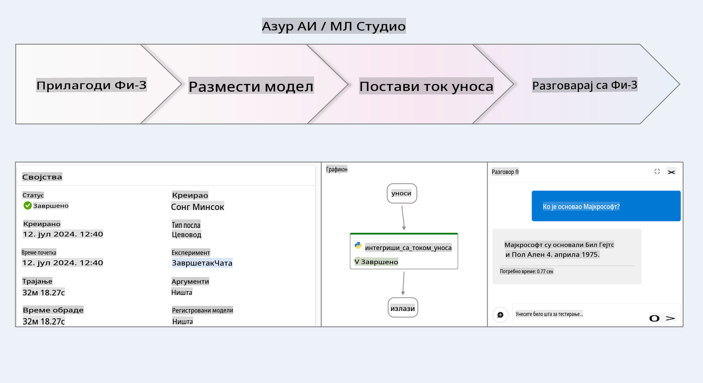

### Sadržaj

1. **[Scenario 1: Postavljanje Azure resursa i priprema za fino podešavanje](../../../../../../md/02.Application/01.TextAndChat/Phi3)**  
    - [Kreiranje Azure Machine Learning radnog prostora](../../../../../../md/02.Application/01.TextAndChat/Phi3)  
    - [Zahtev za GPU kvotama u Azure pretplati](../../../../../../md/02.Application/01.TextAndChat/Phi3)  
    - [Dodavanje uloga](../../../../../../md/02.Application/01.TextAndChat/Phi3)  
    - [Postavljanje projekta](../../../../../../md/02.Application/01.TextAndChat/Phi3)  
    - [Priprema skupa podataka za fino podešavanje](../../../../../../md/02.Application/01.TextAndChat/Phi3)  

1. **[Scenario 2: Fino podešavanje Phi-3 modela i implementacija u Azure Machine Learning Studiju](../../../../../../md/02.Application/01.TextAndChat/Phi3)**  
    - [Fino podešavanje Phi-3 modela](../../../../../../md/02.Application/01.TextAndChat/Phi3)  
    - [Implementacija fino podešenog Phi-3 modela](../../../../../../md/02.Application/01.TextAndChat/Phi3)  

1. **[Scenario 3: Integracija sa Prompt flow i komunikacija sa vašim prilagođenim modelom u Azure AI Foundry](../../../../../../md/02.Application/01.TextAndChat/Phi3)**  
    - [Integracija prilagođenog Phi-3 modela sa Prompt flow](../../../../../../md/02.Application/01.TextAndChat/Phi3)  
    - [Komunikacija sa vašim prilagođenim Phi-3 modelom](../../../../../../md/02.Application/01.TextAndChat/Phi3)  

## Scenario 1: Postavljanje Azure resursa i priprema za fino podešavanje

### Kreiranje Azure Machine Learning radnog prostora

1. Upišite *azure machine learning* u **traku za pretragu** na vrhu portala i izaberite **Azure Machine Learning** iz ponuđenih opcija.  

    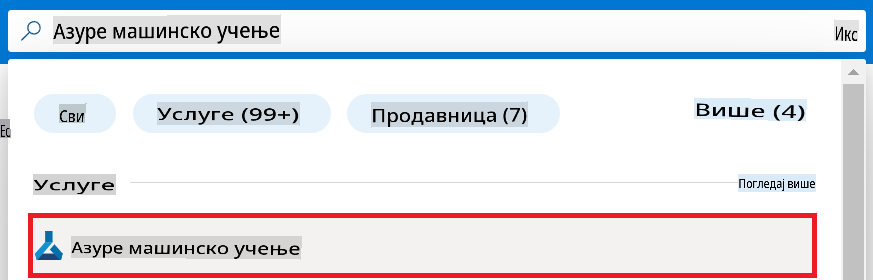  

2. Izaberite **+ Create** iz menija za navigaciju.  

3. Izaberite **New workspace** iz menija za navigaciju.  

    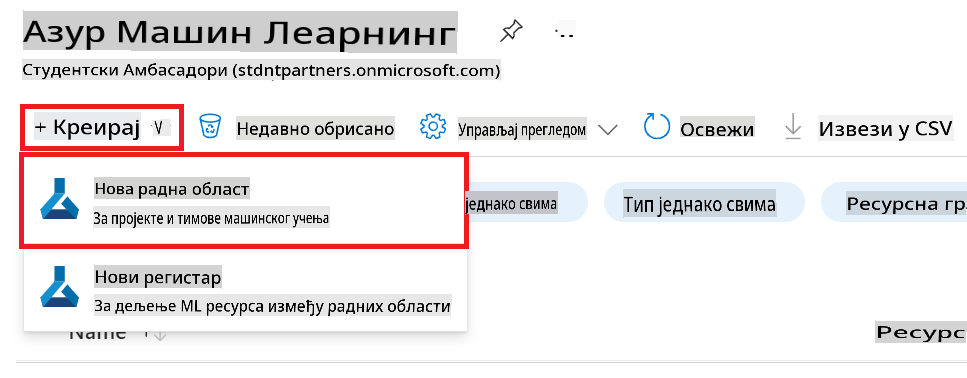  

4. Uradite sledeće zadatke:  

    - Izaberite vašu Azure **pretplatu**.  
    - Izaberite **Resource group** koju želite koristiti (kreirajte novu ako je potrebno).  
    - Unesite **Ime radnog prostora**. Mora biti jedinstvena vrednost.  
    - Izaberite **Region** koji želite koristiti.  
    - Izaberite **Storage account** koji želite koristiti (kreirajte novi ako je potrebno).  
    - Izaberite **Key vault** koji želite koristiti (kreirajte novi ako je potrebno).  
    - Izaberite **Application insights** koji želite koristiti (kreirajte novi ako je potrebno).  
    - Izaberite **Container registry** koji želite koristiti (kreirajte novi ako je potrebno).  

      

5. Izaberite **Review + Create**.  

6. Izaberite **Create**.  

### Zahtev za GPU kvotama u Azure pretplati

U ovom vodiču naučićete kako da fino podesite i implementirate Phi-3 model koristeći GPU-ove. Za fino podešavanje koristićete *Standard_NC24ads_A100_v4* GPU, koji zahteva zahtev za kvotu. Za implementaciju koristićete *Standard_NC6s_v3* GPU, koji takođe zahteva zahtev za kvotu.  

> [!NOTE]  
>  
> Samo Pay-As-You-Go pretplate (standardni tip pretplate) ispunjavaju uslove za GPU alokaciju; pretplate sa beneficijama trenutno nisu podržane.  

1. Posetite [Azure ML Studio](https://ml.azure.com/home?wt.mc_id=studentamb_279723).  

1. Uradite sledeće zadatke za zahtev *Standard NCADSA100v4 Family* kvote:  

    - Izaberite **Quota** iz leve trake sa alatkama.  
    - Izaberite **Virtual machine family** koju želite koristiti. Na primer, izaberite **Standard NCADSA100v4 Family Cluster Dedicated vCPUs**, koja uključuje *Standard_NC24ads_A100_v4* GPU.  
    - Izaberite **Request quota** iz menija za navigaciju.  

        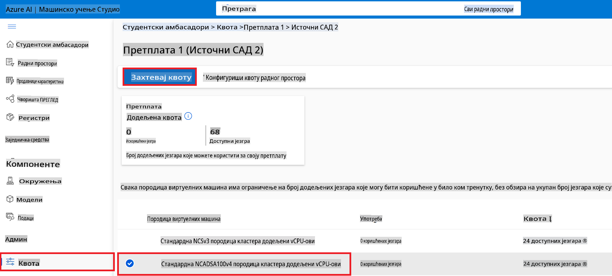  

    - Na stranici Request quota, unesite **New cores limit** koji želite koristiti. Na primer, 24.  
    - Na stranici Request quota, izaberite **Submit** za zahtev za GPU kvotu.  

1. Uradite sledeće zadatke za zahtev *Standard NCSv3 Family* kvote:  

    - Izaberite **Quota** iz leve trake sa alatkama.  
    - Izaberite **Virtual machine family** koju želite koristiti. Na primer, izaberite **Standard NCSv3 Family Cluster Dedicated vCPUs**, koja uključuje *Standard_NC6s_v3* GPU.  
    - Izaberite **Request quota** iz menija za navigaciju.  
    - Na stranici Request quota, unesite **New cores limit** koji želite koristiti. Na primer, 24.  
    - Na stranici Request quota, izaberite **Submit** za zahtev za GPU kvotu.  

### Dodavanje uloga

Za fino podešavanje i implementaciju vaših modela, prvo morate kreirati Managed Identity (UAI) i dodeliti joj odgovarajuće dozvole. Ova identifikacija će se koristiti za autentifikaciju tokom implementacije.  

#### Kreiranje Managed Identity (UAI)

1. Upišite *managed identities* u **traku za pretragu** na vrhu portala i izaberite **Managed Identities** iz ponuđenih opcija.  

    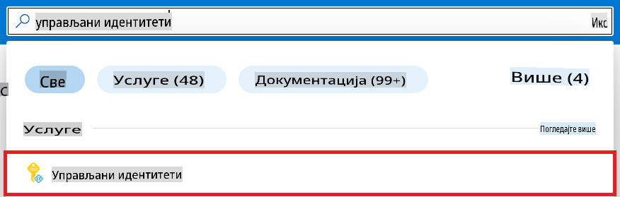  

1. Izaberite **+ Create**.  

    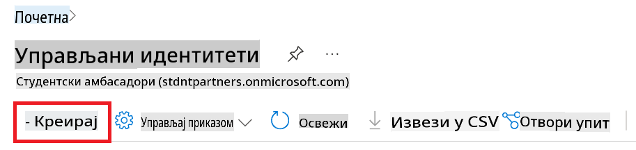  

1. Uradite sledeće zadatke:  

    - Izaberite vašu Azure **pretplatu**.  
    - Izaberite **Resource group** koju želite koristiti (kreirajte novu ako je potrebno).  
    - Izaberite **Region** koji želite koristiti.  
    - Unesite **Ime**. Mora biti jedinstvena vrednost.  

    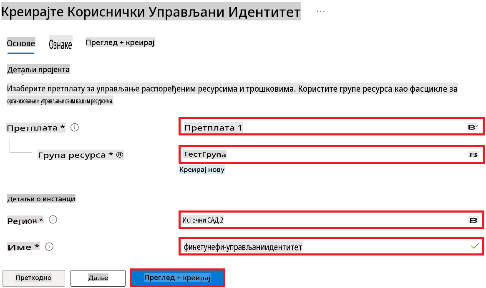  

1. Izaberite **Review + create**.  

1. Izaberite **+ Create**.  

#### Dodavanje Contributor uloge Managed Identity

1. Idite na Managed Identity resurs koji ste kreirali.  

1. Izaberite **Azure role assignments** iz leve trake sa alatkama.  

1. Izaberite **+Add role assignment** iz menija za navigaciju.  

1. Na stranici Add role assignment, uradite sledeće zadatke:  
    - Izaberite **Scope** kao **Resource group**.  
    - Izaberite vašu Azure **pretplatu**.  
    - Izaberite **Resource group** koju želite koristiti.  
    - Izaberite **Role** kao **Contributor**.  

    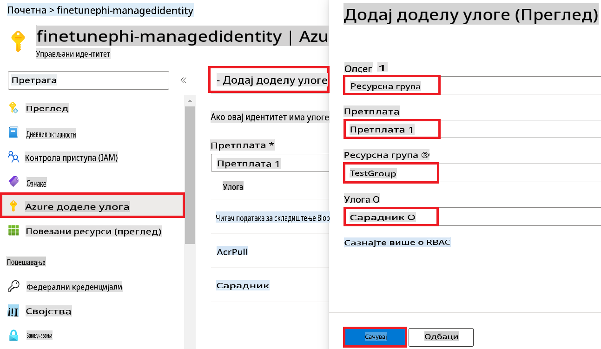  

2. Izaberite **Save**.  

#### Dodavanje Storage Blob Data Reader uloge Managed Identity  

...  
1. Posetite [Azure ML Studio](https://ml.azure.com/home?wt.mc_id=studentamb_279723).

1. Izaberite **Compute** iz levog menija.

1. Izaberite **Compute clusters** iz navigacionog menija.

1. Kliknite na **+ New**.

    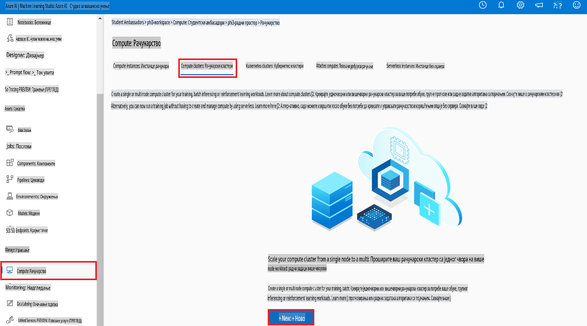

1. Uradite sledeće:

    - Izaberite **Region** koji želite da koristite.
    - Postavite **Virtual machine tier** na **Dedicated**.
    - Postavite **Virtual machine type** na **GPU**.
    - Postavite filter za **Virtual machine size** na **Select from all options**.
    - Izaberite **Virtual machine size** na **Standard_NC24ads_A100_v4**.

    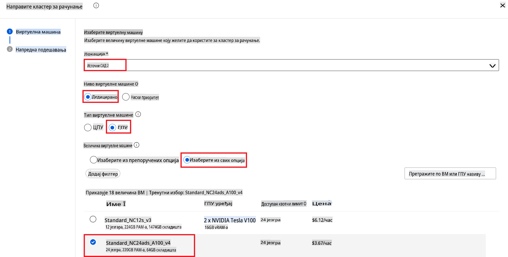

1. Kliknite na **Next**.

1. Uradite sledeće:

    - Unesite **Compute name**. Mora biti jedinstveno.
    - Postavite **Minimum number of nodes** na **0**.
    - Postavite **Maximum number of nodes** na **1**.
    - Postavite **Idle seconds before scale down** na **120**.

    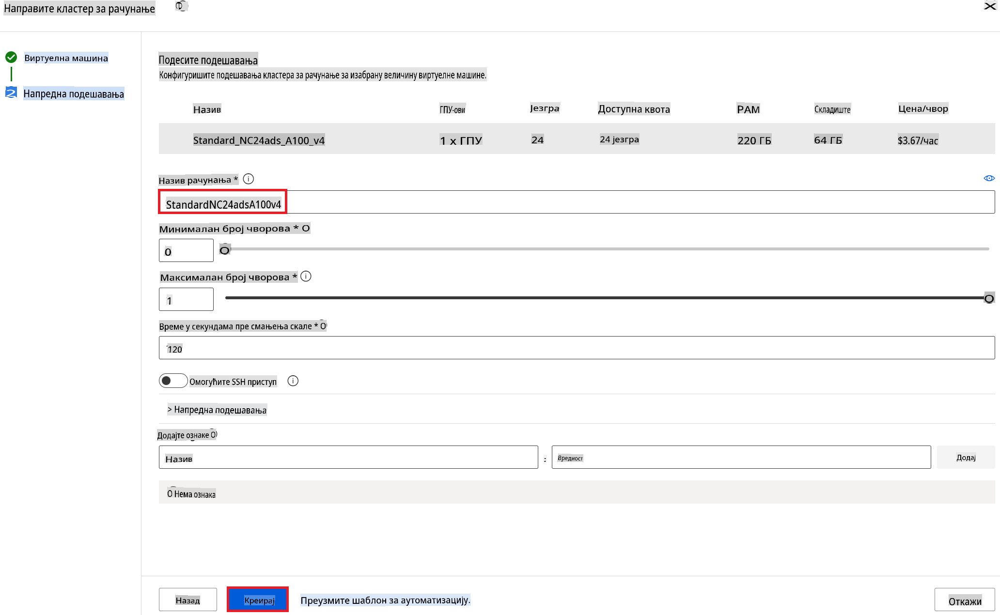

1. Kliknite na **Create**.

#### Fino podešavanje Phi-3 modela

1. Posetite [Azure ML Studio](https://ml.azure.com/home?wt.mc_id=studentamb_279723).

1. Izaberite Azure Machine Learning radni prostor koji ste kreirali.

    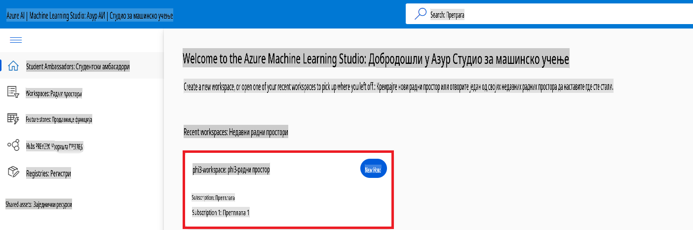

1. Uradite sledeće:

    - Izaberite **Model catalog** iz levog menija.
    - Upišite *phi-3-mini-4k* u **search bar** i izaberite **Phi-3-mini-4k-instruct** iz ponuđenih opcija.

    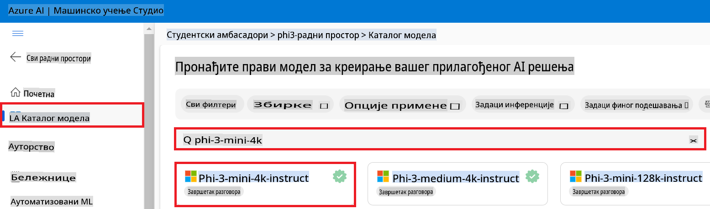

1. Izaberite **Fine-tune** iz navigacionog menija.

    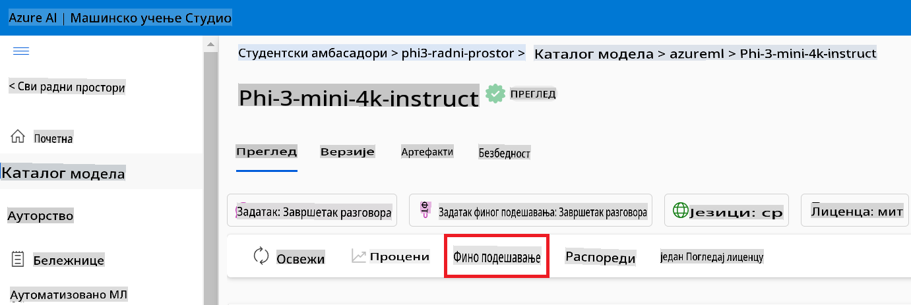

1. Uradite sledeće:

    - Postavite **Select task type** na **Chat completion**.
    - Kliknite na **+ Select data** da biste otpremili **Training data**.
    - Postavite opciju za otpremanje validacionih podataka na **Provide different validation data**.
    - Kliknite na **+ Select data** da biste otpremili **Validation data**.

    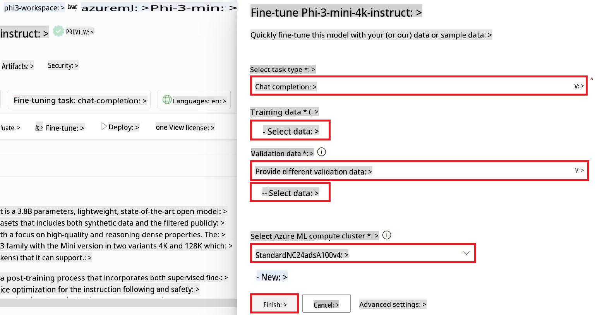

    > [!TIP]
    >
    > Možete izabrati **Advanced settings** da prilagodite konfiguracije kao što su **learning_rate** i **lr_scheduler_type** kako biste optimizovali proces finog podešavanja prema vašim specifičnim potrebama.

1. Kliknite na **Finish**.

1. U ovom zadatku ste uspešno fino podesili Phi-3 model koristeći Azure Machine Learning. Imajte na umu da proces finog podešavanja može trajati značajno vreme. Nakon pokretanja posla za fino podešavanje, potrebno je sačekati da se završi. Status posla možete pratiti tako što ćete otići na karticu Jobs u levom meniju vašeg Azure Machine Learning radnog prostora. U sledećoj seriji, model će biti implementiran i integrisan sa Prompt flow.

    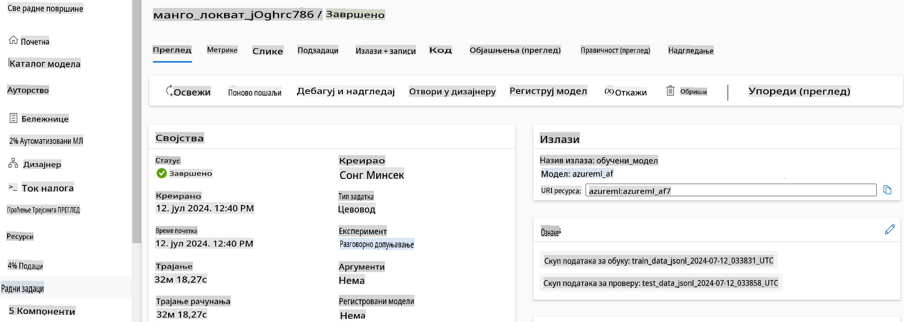

### Implementacija fino podešenog Phi-3 modela

Da biste integrisali fino podešen Phi-3 model sa Prompt flow, potrebno je da implementirate model kako bi bio dostupan za real-time inferenciju. Ovaj proces uključuje registrovanje modela, kreiranje online endpoint-a i implementaciju modela.

U ovom zadatku ćete:

- Registrovati fino podešen model u Azure Machine Learning radnom prostoru.
- Kreirati online endpoint.
- Implementirati registrovani fino podešen Phi-3 model.

#### Registrovanje fino podešenog modela

1. Posetite [Azure ML Studio](https://ml.azure.com/home?wt.mc_id=studentamb_279723).

1. Izaberite Azure Machine Learning radni prostor koji ste kreirali.

    

1. Izaberite **Models** iz levog menija.
1. Kliknite na **+ Register**.
1. Izaberite **From a job output**.

    

1. Izaberite posao koji ste kreirali.

    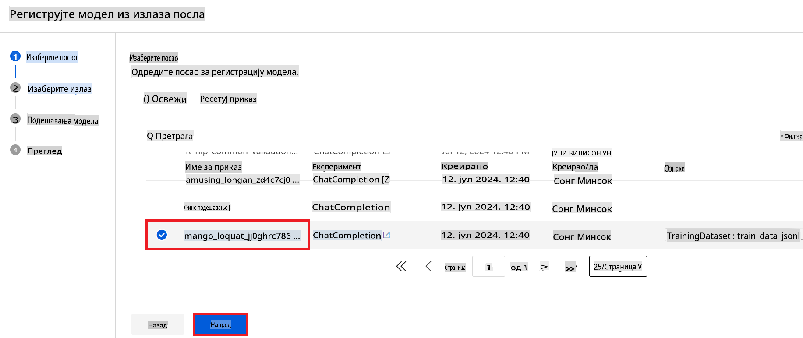

1. Kliknite na **Next**.

1. Postavite **Model type** na **MLflow**.

1. Uverite se da je **Job output** automatski izabran.

    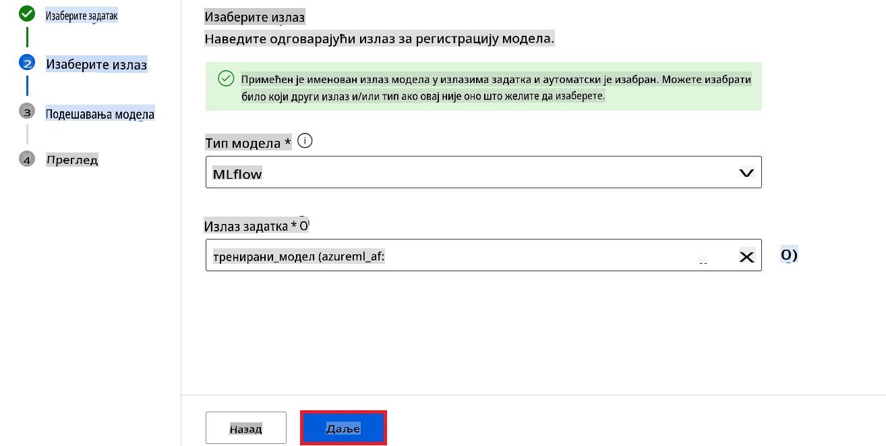

2. Kliknite na **Next**.

3. Kliknite na **Register**.

    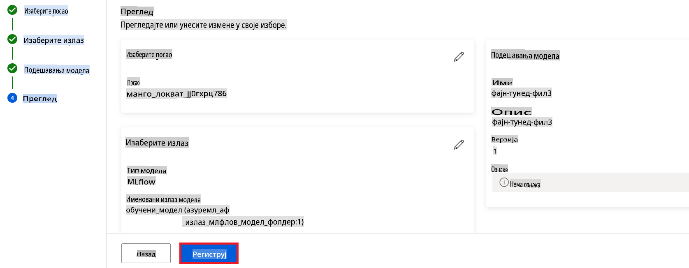

4. Registrovani model možete videti tako što ćete otići na meni **Models** u levom meniju.

    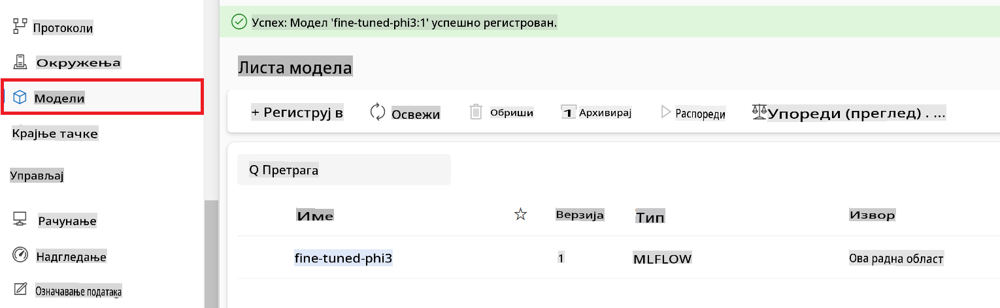

#### Implementacija fino podešenog modela

1. Idite u Azure Machine Learning radni prostor koji ste kreirali.

1. Izaberite **Endpoints** iz levog menija.

1. Izaberite **Real-time endpoints** iz navigacionog menija.

    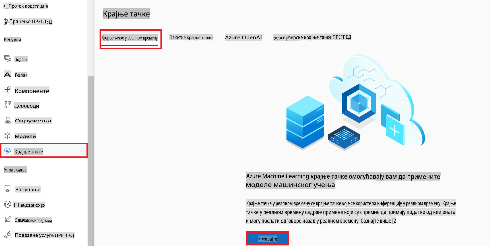

1. Kliknite na **Create**.

1. Izaberite registrovani model koji ste kreirali.

    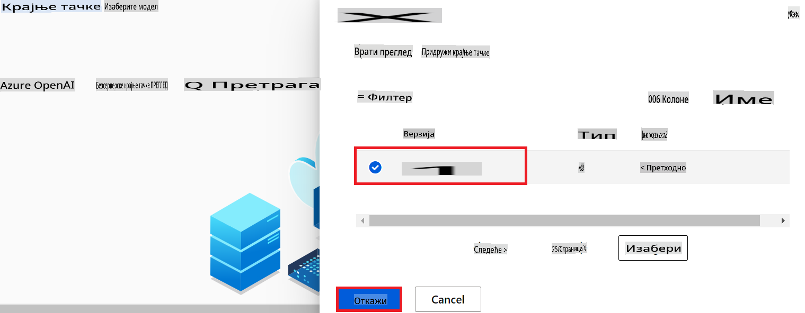

1. Kliknite na **Select**.

1. Uradite sledeće:

    - Postavite **Virtual machine** na *Standard_NC6s_v3*.
    - Postavite **Instance count** na željeni broj, na primer, *1*.
    - Postavite **Endpoint** na **New** da biste kreirali novi endpoint.
    - Unesite **Endpoint name**. Mora biti jedinstveno.
    - Unesite **Deployment name**. Mora biti jedinstveno.

    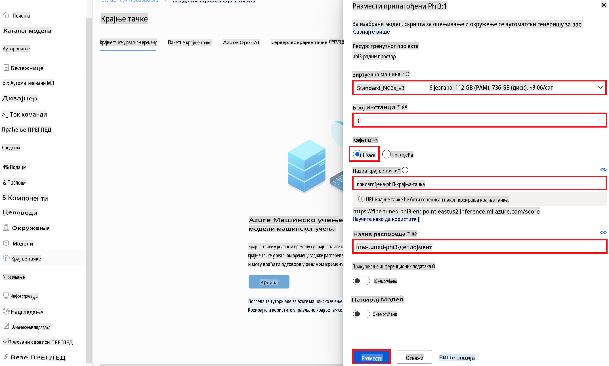

1. Kliknite na **Deploy**.

> [!WARNING]
> Kako biste izbegli dodatne troškove na vašem nalogu, obavezno obrišite kreirani endpoint u Azure Machine Learning radnom prostoru.
>

#### Provera statusa implementacije u Azure Machine Learning radnom prostoru

1. Idite u Azure Machine Learning radni prostor koji ste kreirali.

1. Izaberite **Endpoints** iz levog menija.

1. Izaberite endpoint koji ste kreirali.

    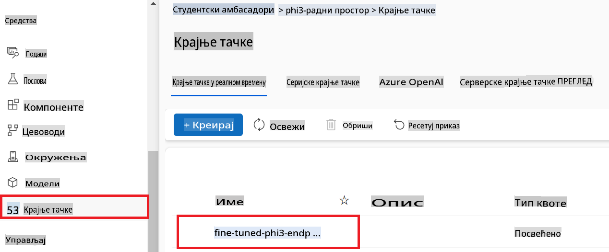

1. Na ovoj stranici možete upravljati endpoint-ovima tokom procesa implementacije.

> [!NOTE]
> Kada implementacija bude završena, uverite se da je **Live traffic** postavljen na **100%**. Ako nije, izaberite **Update traffic** kako biste podesili postavke saobraćaja. Imajte na umu da ne možete testirati model ako je saobraćaj postavljen na 0%.
>
> 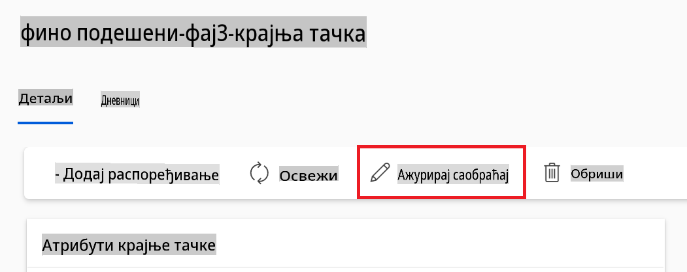
>

## Scenario 3: Integracija sa Prompt flow i razgovor sa vašim prilagođenim modelom u Azure AI Foundry

### Integracija prilagođenog Phi-3 modela sa Prompt flow

Nakon uspešne implementacije vašeg fino podešenog modela, sada možete da ga integrišete sa Prompt Flow kako biste koristili vaš model u real-time aplikacijama, omogućavajući različite interaktivne zadatke sa vašim prilagođenim Phi-3 modelom.

U ovom zadatku ćete:

- Kreirati Azure AI Foundry Hub.
- Kreirati Azure AI Foundry Project.
- Kreirati Prompt flow.
- Dodati prilagođenu konekciju za fino podešen Phi-3 model.
- Podesiti Prompt flow za razgovor sa vašim prilagođenim Phi-3 modelom.

> [!NOTE]
> Takođe možete integrisati sa Promptflow koristeći Azure ML Studio. Isti proces integracije može se primeniti i u Azure ML Studio.

#### Kreiranje Azure AI Foundry Hub-a

Pre nego što kreirate projekat, potrebno je da kreirate Hub. Hub funkcioniše kao Resource Group, omogućavajući organizaciju i upravljanje više projekata unutar Azure AI Foundry.

1. Posetite [Azure AI Foundry](https://ai.azure.com/?WT.mc_id=aiml-137032-kinfeylo).

1. Izaberite **All hubs** iz levog menija.

1. Kliknite na **+ New hub** iz navigacionog menija.

    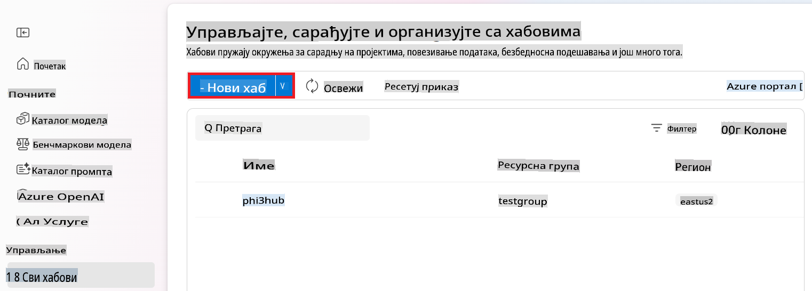

1. Uradite sledeće:

    - Unesite **Hub name**. Mora biti jedinstveno.
    - Izaberite vašu Azure **Subscription**.
    - Izaberite **Resource group** za korišćenje (kreirajte novu ako je potrebno).
    - Izaberite **Location** koji želite da koristite.
    - Izaberite **Connect Azure AI Services** za korišćenje (kreirajte novi ako je potrebno).
    - Izaberite **Connect Azure AI Search** na **Skip connecting**.

    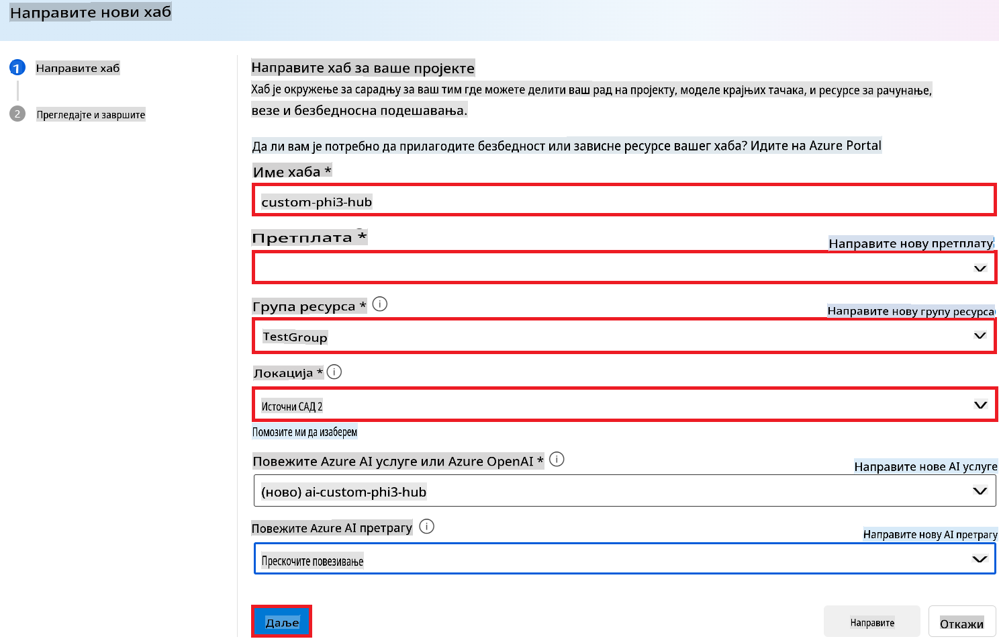

1. Kliknite na **Next**.

#### Kreiranje Azure AI Foundry Project-a

1. U okviru kreiranog Hub-a, izaberite **All projects** iz levog menija.

1. Kliknite na **+ New project** iz navigacionog menija.

    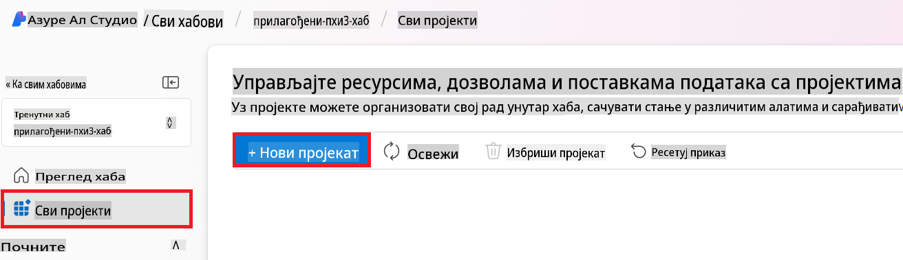

1. Unesite **Project name**. Mora biti jedinstveno.

    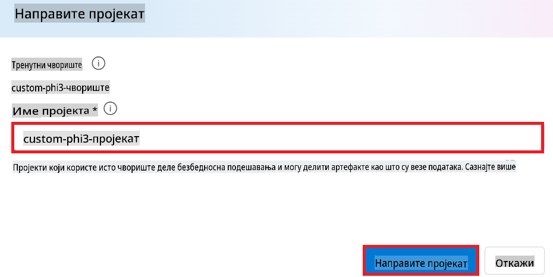

1. Kliknite na **Create a project**.

#### Dodavanje prilagođene konekcije za fino podešen Phi-3 model

Da biste integrisali vaš prilagođeni Phi-3 model sa Prompt flow, potrebno je da sačuvate endpoint i ključ modela u prilagođenoj konekciji. Ova postavka obezbeđuje pristup vašem prilagođenom Phi-3 modelu u Prompt flow-u.

#### Postavljanje API ključa i endpoint URI-ja za fino podešen Phi-3 model

1. Posetite [Azure ML Studio](https://ml.azure.com/home?WT.mc_id=aiml-137032-kinfeylo).

1. Idite u Azure Machine Learning radni prostor koji ste kreirali.

1. Izaberite **Endpoints** iz levog menija.

    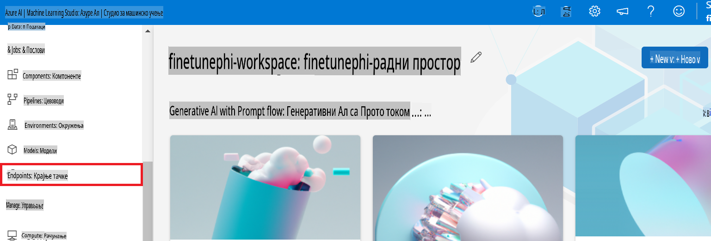

1. Izaberite endpoint koji ste kreirali.

    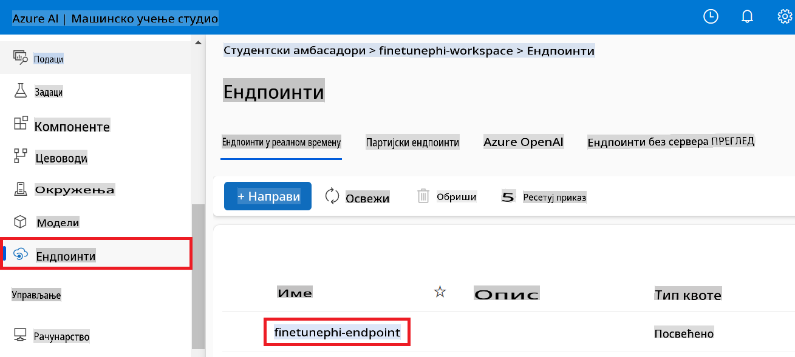

1. Izaberite **Consume** iz navigacionog menija.

1. Kopirajte vaš **REST endpoint** i **Primary key**.
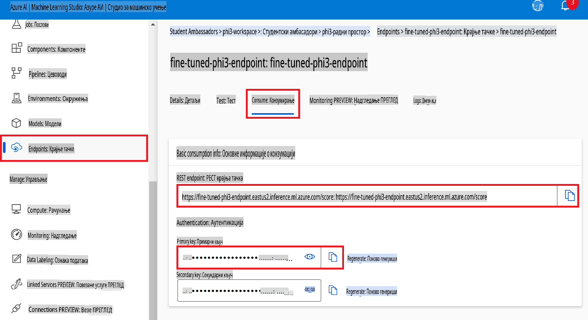

#### Dodajte prilagođenu konekciju

1. Posetite [Azure AI Foundry](https://ai.azure.com/?WT.mc_id=aiml-137032-kinfeylo).

1. Idite na projekat Azure AI Foundry koji ste kreirali.

1. U projektu koji ste kreirali, izaberite **Settings** sa leve strane.

1. Izaberite **+ New connection**.

    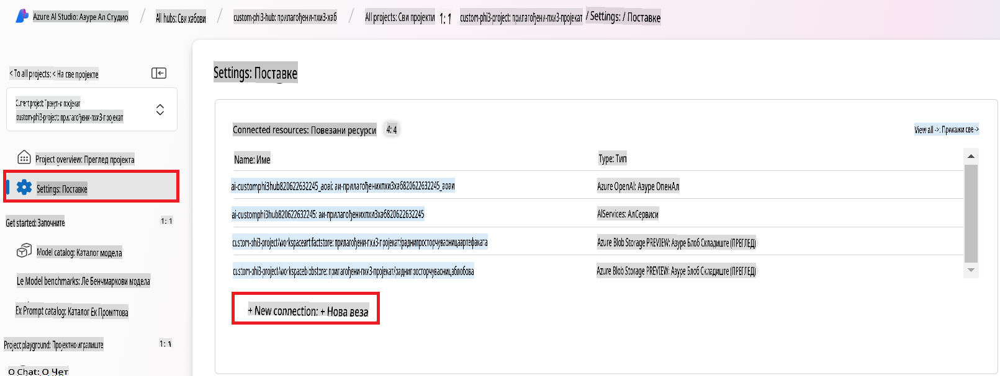

1. Izaberite **Custom keys** iz menija za navigaciju.

    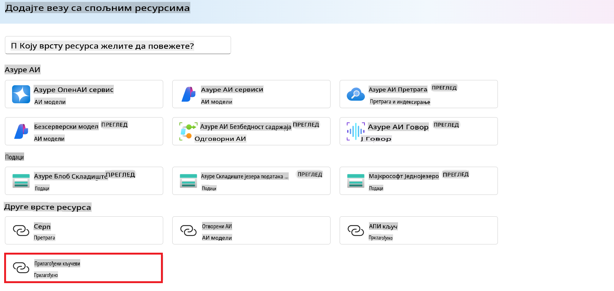

1. Uradite sledeće zadatke:

    - Izaberite **+ Add key value pairs**.
    - Za naziv ključa unesite **endpoint** i nalepite krajnju tačku koju ste kopirali iz Azure ML Studio u polje za vrednost.
    - Ponovo izaberite **+ Add key value pairs**.
    - Za naziv ključa unesite **key** i nalepite ključ koji ste kopirali iz Azure ML Studio u polje za vrednost.
    - Nakon dodavanja ključeva, izaberite **is secret** kako biste sprečili da ključ bude izložen.

    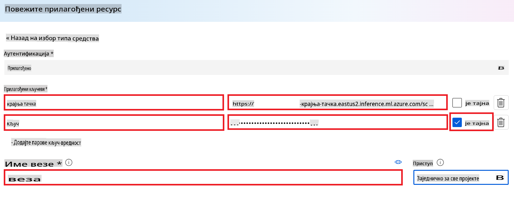

1. Izaberite **Add connection**.

#### Kreirajte Prompt flow

Dodali ste prilagođenu konekciju u Azure AI Foundry. Sada ćemo kreirati Prompt flow koristeći sledeće korake. Zatim ćete povezati ovaj Prompt flow sa prilagođenom konekcijom kako biste mogli da koristite model koji ste fino podesili unutar Prompt flow-a.

1. Idite na projekat Azure AI Foundry koji ste kreirali.

1. Izaberite **Prompt flow** sa leve strane.

1. Izaberite **+ Create** iz menija za navigaciju.

    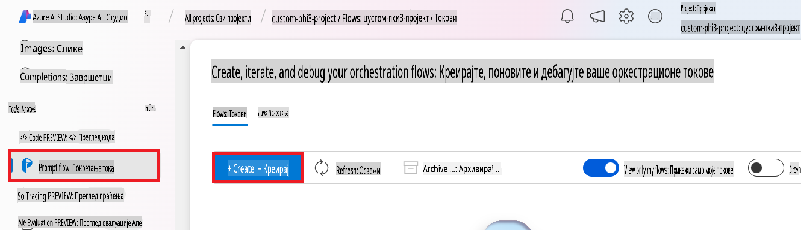

1. Izaberite **Chat flow** iz menija za navigaciju.

    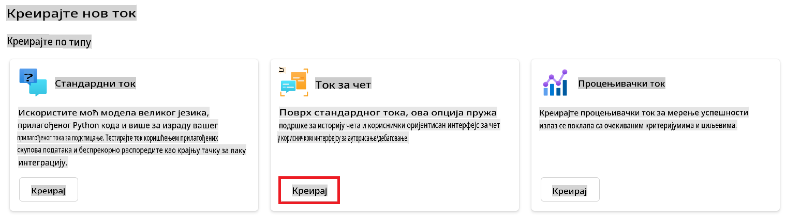

1. Unesite **Folder name** koji želite da koristite.

    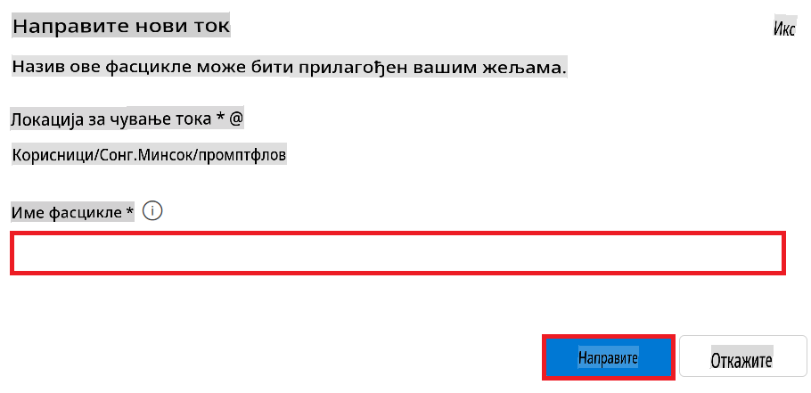

2. Izaberite **Create**.

#### Postavite Prompt flow za razgovor sa vašim prilagođenim Phi-3 modelom

Potrebno je da integrišete fino podešeni Phi-3 model u Prompt flow. Međutim, postojeći Prompt flow nije dizajniran za ovu svrhu. Stoga, morate redizajnirati Prompt flow kako biste omogućili integraciju prilagođenog modela.

1. U Prompt flow-u, uradite sledeće zadatke kako biste rekonstruisali postojeći tok:

    - Izaberite **Raw file mode**.
    - Obrišite sav postojeći kod u datoteci *flow.dag.yml*.
    - Dodajte sledeći kod u datoteku *flow.dag.yml*.

        ```yml
        inputs:
          input_data:
            type: string
            default: "Who founded Microsoft?"

        outputs:
          answer:
            type: string
            reference: ${integrate_with_promptflow.output}

        nodes:
        - name: integrate_with_promptflow
          type: python
          source:
            type: code
            path: integrate_with_promptflow.py
          inputs:
            input_data: ${inputs.input_data}
        ```

    - Izaberite **Save**.

    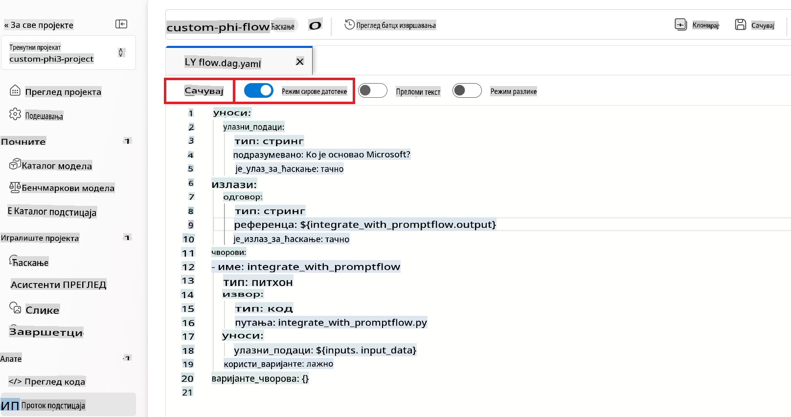

1. Dodajte sledeći kod u datoteku *integrate_with_promptflow.py* kako biste koristili prilagođeni Phi-3 model u Prompt flow-u.

    ```python
    import logging
    import requests
    from promptflow import tool
    from promptflow.connections import CustomConnection

    # Logging setup
    logging.basicConfig(
        format="%(asctime)s - %(levelname)s - %(name)s - %(message)s",
        datefmt="%Y-%m-%d %H:%M:%S",
        level=logging.DEBUG
    )
    logger = logging.getLogger(__name__)

    def query_phi3_model(input_data: str, connection: CustomConnection) -> str:
        """
        Send a request to the Phi-3 model endpoint with the given input data using Custom Connection.
        """

        # "connection" is the name of the Custom Connection, "endpoint", "key" are the keys in the Custom Connection
        endpoint_url = connection.endpoint
        api_key = connection.key

        headers = {
            "Content-Type": "application/json",
            "Authorization": f"Bearer {api_key}"
        }
        data = {
            "input_data": {
                "input_string": [
                    {"role": "user", "content": input_data}
                ],
                "parameters": {
                    "temperature": 0.7,
                    "max_new_tokens": 128
                }
            }
        }
        try:
            response = requests.post(endpoint_url, json=data, headers=headers)
            response.raise_for_status()
            
            # Log the full JSON response
            logger.debug(f"Full JSON response: {response.json()}")

            result = response.json()["output"]
            logger.info("Successfully received response from Azure ML Endpoint.")
            return result
        except requests.exceptions.RequestException as e:
            logger.error(f"Error querying Azure ML Endpoint: {e}")
            raise

    @tool
    def my_python_tool(input_data: str, connection: CustomConnection) -> str:
        """
        Tool function to process input data and query the Phi-3 model.
        """
        return query_phi3_model(input_data, connection)

    ```

    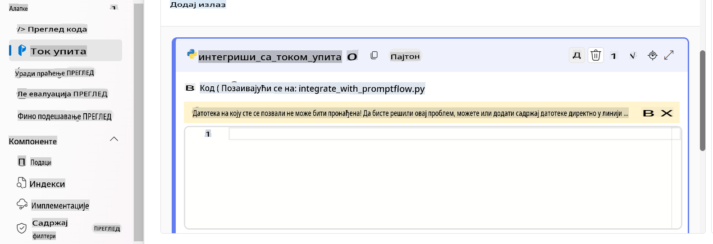

> [!NOTE]
> Za detaljnije informacije o korišćenju Prompt flow-a u Azure AI Foundry, pogledajte [Prompt flow u Azure AI Foundry](https://learn.microsoft.com/azure/ai-studio/how-to/prompt-flow).

1. Izaberite **Chat input**, **Chat output** kako biste omogućili razgovor sa vašim modelom.

    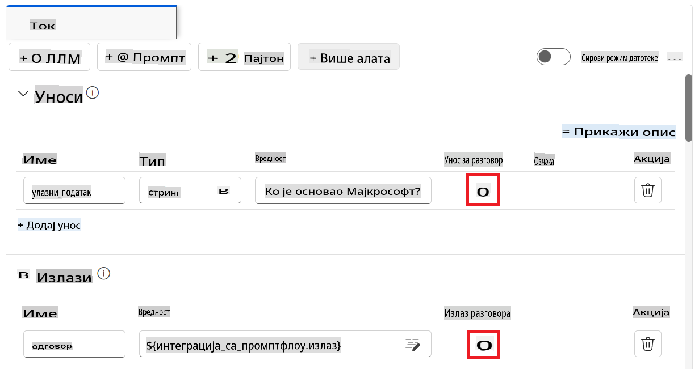

1. Sada ste spremni da razgovarate sa svojim prilagođenim Phi-3 modelom. U sledećoj vežbi naučićete kako da pokrenete Prompt flow i koristite ga za razgovor sa fino podešenim Phi-3 modelom.

> [!NOTE]
>
> Rekonstruisani tok bi trebalo da izgleda kao na slici ispod:
>
> 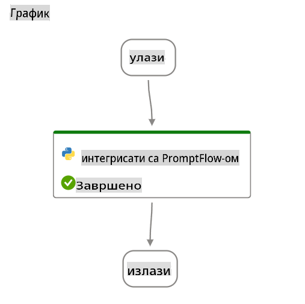
>

### Razgovarajte sa svojim prilagođenim Phi-3 modelom

Sada kada ste fino podesili i integrisali svoj prilagođeni Phi-3 model sa Prompt flow-om, spremni ste da počnete da komunicirate s njim. Ova vežba će vas voditi kroz proces postavljanja i pokretanja razgovora sa vašim modelom koristeći Prompt flow. Prateći ove korake, moći ćete u potpunosti da iskoristite mogućnosti svog fino podešenog Phi-3 modela za različite zadatke i razgovore.

- Razgovarajte sa svojim prilagođenim Phi-3 modelom koristeći Prompt flow.

#### Pokrenite Prompt flow

1. Izaberite **Start compute sessions** kako biste pokrenuli Prompt flow.

    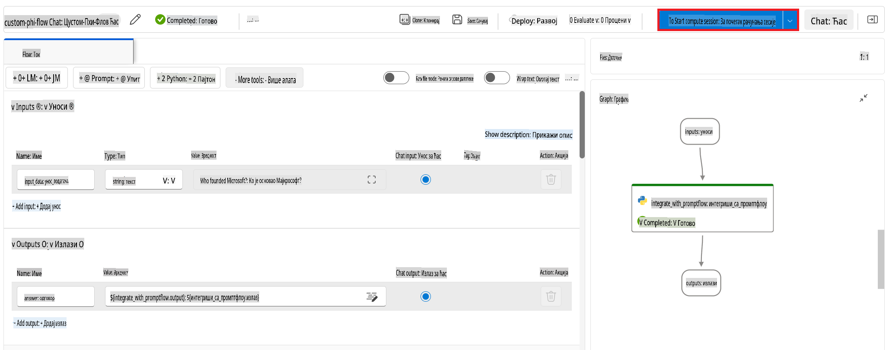

1. Izaberite **Validate and parse input** kako biste osvežili parametre.

    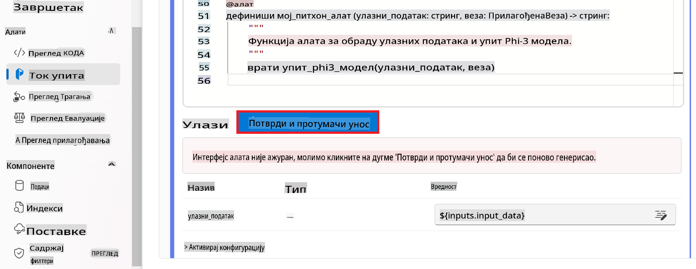

1. Izaberite **Value** za **connection** prema prilagođenoj konekciji koju ste kreirali. Na primer, *connection*.

    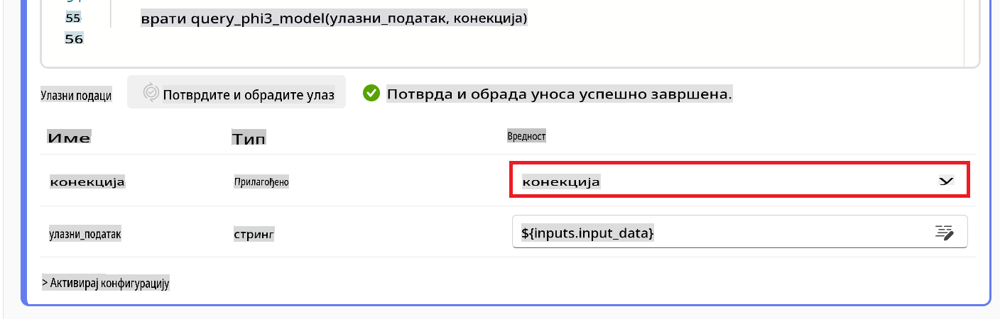

#### Razgovarajte sa svojim prilagođenim modelom

1. Izaberite **Chat**.

    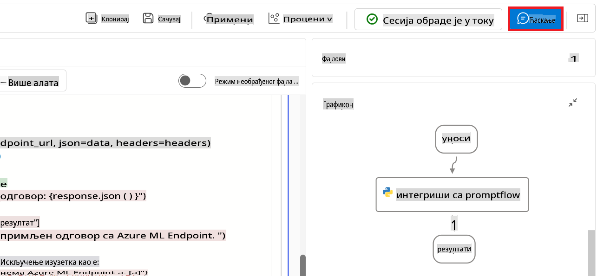

1. Evo primera rezultata: Sada možete razgovarati sa svojim prilagođenim Phi-3 modelom. Preporučuje se da postavljate pitanja zasnovana na podacima korišćenim za fino podešavanje.

    

**Одрицање од одговорности**:  
Овај документ је преведен коришћењем услуга машинског превођења заснованих на вештачкој интелигенцији. Иако тежимо тачности, молимо вас да имате у виду да аутоматски преводи могу садржати грешке или нетачности. Оригинални документ на његовом изворном језику треба сматрати ауторитативним извором. За критичне информације препоручује се професионални превод од стране људи. Не сносимо одговорност за било каква неспоразумевања или погрешна тумачења која могу произаћи из употребе овог превода.