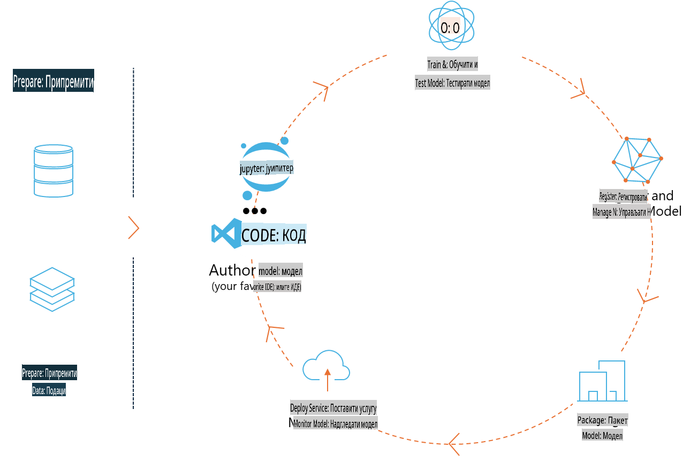
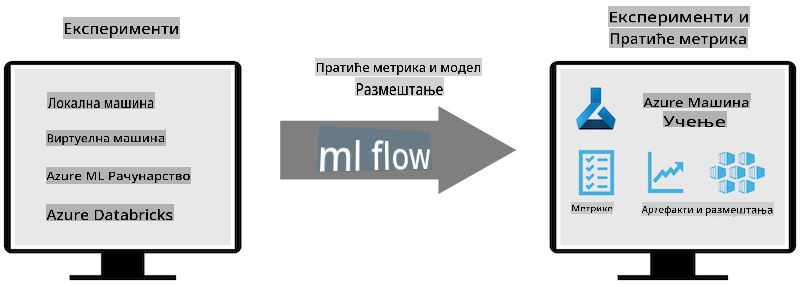
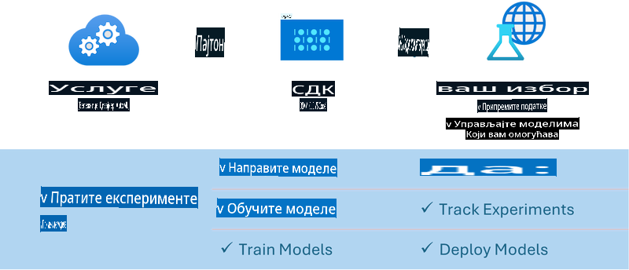

# MLflow

[MLflow](https://mlflow.org/) је платформа отвореног кода дизајнирана за управљање комплетним животним циклусом машинског учења.



MLFlow се користи за управљање животним циклусом машинског учења, укључујући експериментисање, репродуктивност, имплементацију и централни регистар модела. MLFlow тренутно нуди четири компоненте:

- **MLflow Tracking:** Снимање и претрага експеримената, кода, конфигурације података и резултата.
- **MLflow Projects:** Паковање кода за науку о подацима у формату који омогућава репродукцију на било којој платформи.
- **MLflow Models:** Имплементација модела машинског учења у различитим окружењима за сервирање.
- **Model Registry:** Чување, анотација и управљање моделима у централном репозиторијуму.

Пружа могућности за праћење експеримената, паковање кода у репродуктивне извршне јединице и дељење и имплементацију модела. MLFlow је интегрисан у Databricks и подржава разне библиотеке за машинско учење, што га чини независним од библиотека. Може се користити са било којом библиотеком за машинско учење и у било ком програмском језику, јер пружа REST API и CLI за лакше коришћење.



Кључне карактеристике MLFlow-а укључују:

- **Праћење експеримената:** Снимање и поређење параметара и резултата.
- **Управљање моделима:** Имплементација модела на различите платформе за сервирање и инференцију.
- **Регистар модела:** Заједничко управљање животним циклусом MLFlow модела, укључујући верзионисање и анотације.
- **Пројекти:** Паковање кода за машинско учење ради дељења или коришћења у продукцији.

MLFlow такође подржава MLOps циклус, који укључује припрему података, регистрацију и управљање моделима, паковање модела за извршење, имплементацију сервиса и праћење модела. Његов циљ је да поједностави процес преласка са прототипа на продукциони ток рада, посебно у облачним и edge окружењима.

## Крај-до-крај сценарио - Изградња омотача и коришћење Phi-3 као MLFlow модела

У овом крај-до-крај примеру демонстрираћемо два различита приступа за изградњу омотача око Phi-3 малог језичког модела (SLM) и затим његово покретање као MLFlow модела, било локално или у облаку, на пример, у Azure Machine Learning окружењу.



| Пројекат | Опис | Локација |
| ------------ | ----------- | -------- |
| Transformer Pipeline | Transformer Pipeline је најлакша опција за изградњу омотача ако желите да користите HuggingFace модел са MLFlow експерименталним "transformers" укусом. | [**TransformerPipeline.ipynb**](../../../../../../code/06.E2E/E2E_Phi-3-MLflow_TransformerPipeline.ipynb) |
| Custom Python Wrapper | У тренутку писања, Transformer Pipeline није подржавао генерисање MLFlow омотача за HuggingFace моделе у ONNX формату, чак ни са експерименталним optimum Python пакетом. За овакве случајеве, можете изградити свој прилагођени Python омотач за MLFlow модел. | [**CustomPythonWrapper.ipynb**](../../../../../../code/06.E2E/E2E_Phi-3-MLflow_CustomPythonWrapper.ipynb) |

## Пројекат: Transformer Pipeline

1. Потребни су вам релевантни Python пакети из MLFlow и HuggingFace:

    ``` Python
    import mlflow
    import transformers
    ```

2. Затим, треба да покренете трансформер pipeline позивајући циљни Phi-3 модел у HuggingFace регистру. Као што се види у _Phi-3-mini-4k-instruct_ картици модела, његов задатак је типа „Генерација текста“:

    ``` Python
    pipeline = transformers.pipeline(
        task = "text-generation",
        model = "microsoft/Phi-3-mini-4k-instruct"
    )
    ```

3. Сада можете сачувати трансформер pipeline вашег Phi-3 модела у MLFlow формату и додати додатне детаље као што су циљни артефакт путања, специфична подешавања конфигурације модела и тип инференције API-ја:

    ``` Python
    model_info = mlflow.transformers.log_model(
        transformers_model = pipeline,
        artifact_path = "phi3-mlflow-model",
        model_config = model_config,
        task = "llm/v1/chat"
    )
    ```

## Пројекат: Custom Python Wrapper

1. Овде можемо користити Microsoft-ов [ONNX Runtime generate() API](https://github.com/microsoft/onnxruntime-genai) за инференцију ONNX модела и кодирање/декодирање токена. Морате одабрати _onnxruntime_genai_ пакет за своју циљну рачунарску платформу, при чему је пример испод намењен CPU-у:

    ``` Python
    import mlflow
    from mlflow.models import infer_signature
    import onnxruntime_genai as og
    ```

1. Наша прилагођена класа имплементира две методе: _load_context()_ за иницијализацију **ONNX модела** Phi-3 Mini 4K Instruct, **параметара генератора** и **токенизатора**; и _predict()_ за генерисање излазних токена за дати упит:

    ``` Python
    class Phi3Model(mlflow.pyfunc.PythonModel):
        def load_context(self, context):
            # Retrieving model from the artifacts
            model_path = context.artifacts["phi3-mini-onnx"]
            model_options = {
                 "max_length": 300,
                 "temperature": 0.2,         
            }
        
            # Defining the model
            self.phi3_model = og.Model(model_path)
            self.params = og.GeneratorParams(self.phi3_model)
            self.params.set_search_options(**model_options)
            
            # Defining the tokenizer
            self.tokenizer = og.Tokenizer(self.phi3_model)
    
        def predict(self, context, model_input):
            # Retrieving prompt from the input
            prompt = model_input["prompt"][0]
            self.params.input_ids = self.tokenizer.encode(prompt)
    
            # Generating the model's response
            response = self.phi3_model.generate(self.params)
    
            return self.tokenizer.decode(response[0][len(self.params.input_ids):])
    ```

1. Сада можете користити _mlflow.pyfunc.log_model()_ функцију за генерисање прилагођеног Python омотача (у pickle формату) за Phi-3 модел, заједно са оригиналним ONNX моделом и потребним зависностима:

    ``` Python
    model_info = mlflow.pyfunc.log_model(
        artifact_path = artifact_path,
        python_model = Phi3Model(),
        artifacts = {
            "phi3-mini-onnx": "cpu_and_mobile/cpu-int4-rtn-block-32-acc-level-4",
        },
        input_example = input_example,
        signature = infer_signature(input_example, ["Run"]),
        extra_pip_requirements = ["torch", "onnxruntime_genai", "numpy"],
    )
    ```

## Потписи генерисаних MLFlow модела

1. У кораку 3 горе поменутог Transformer Pipeline пројекта, подесили смо задатак MLFlow модела на „_llm/v1/chat_“. Овакво упутство генерише API омотач модела, компатибилан са OpenAI-јевим Chat API-јем као што је приказано испод:

    ``` Python
    {inputs: 
      ['messages': Array({content: string (required), name: string (optional), role: string (required)}) (required), 'temperature': double (optional), 'max_tokens': long (optional), 'stop': Array(string) (optional), 'n': long (optional), 'stream': boolean (optional)],
    outputs: 
      ['id': string (required), 'object': string (required), 'created': long (required), 'model': string (required), 'choices': Array({finish_reason: string (required), index: long (required), message: {content: string (required), name: string (optional), role: string (required)} (required)}) (required), 'usage': {completion_tokens: long (required), prompt_tokens: long (required), total_tokens: long (required)} (required)],
    params: 
      None}
    ```

1. Као резултат, можете послати свој упит у следећем формату:

    ``` Python
    messages = [{"role": "user", "content": "What is the capital of Spain?"}]
    ```

1. Затим, користите OpenAI API-компатибилну пост-обраду, на пример, _response[0][‘choices’][0][‘message’][‘content’]_, да улепшате свој излаз у нешто овако:

    ``` JSON
    Question: What is the capital of Spain?
    
    Answer: The capital of Spain is Madrid. It is the largest city in Spain and serves as the political, economic, and cultural center of the country. Madrid is located in the center of the Iberian Peninsula and is known for its rich history, art, and architecture, including the Royal Palace, the Prado Museum, and the Plaza Mayor.
    
    Usage: {'prompt_tokens': 11, 'completion_tokens': 73, 'total_tokens': 84}
    ```

1. У кораку 3 горе поменутог Custom Python Wrapper пројекта, дозвољавамо MLFlow пакету да генерише потпис модела из датог улазног примера. Потпис нашег MLFlow омотача ће изгледати овако:

    ``` Python
    {inputs: 
      ['prompt': string (required)],
    outputs: 
      [string (required)],
    params: 
      None}
    ```

1. Дакле, наш упит би требало да садржи кључ речника „prompt“, слично овоме:

    ``` Python
    {"prompt": "<|system|>You are a stand-up comedian.<|end|><|user|>Tell me a joke about atom<|end|><|assistant|>",}
    ```

1. Излаз модела ће затим бити дат у формату низа:

    ``` JSON
    Alright, here's a little atom-related joke for you!
    
    Why don't electrons ever play hide and seek with protons?
    
    Because good luck finding them when they're always "sharing" their electrons!
    
    Remember, this is all in good fun, and we're just having a little atomic-level humor!
    ```

**Одрицање од одговорности**:  
Овај документ је преведен коришћењем машинских услуга за превођење заснованих на вештачкој интелигенцији. Иако настојимо да обезбедимо тачност, молимо вас да будете свесни да аутоматизовани преводи могу садржати грешке или нетачности. Оригинални документ на изворном језику треба сматрати ауторитативним извором. За критичне информације препоручује се професионални превод од стране људи. Не преузимамо одговорност за било каква погрешна тумачења или неспоразуме који могу произаћи из коришћења овог превода.