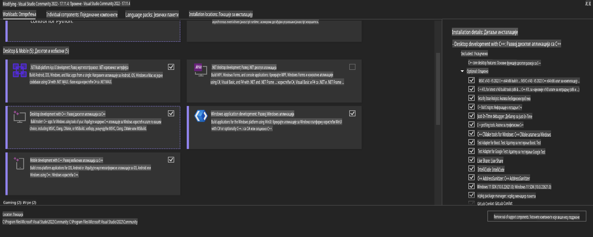
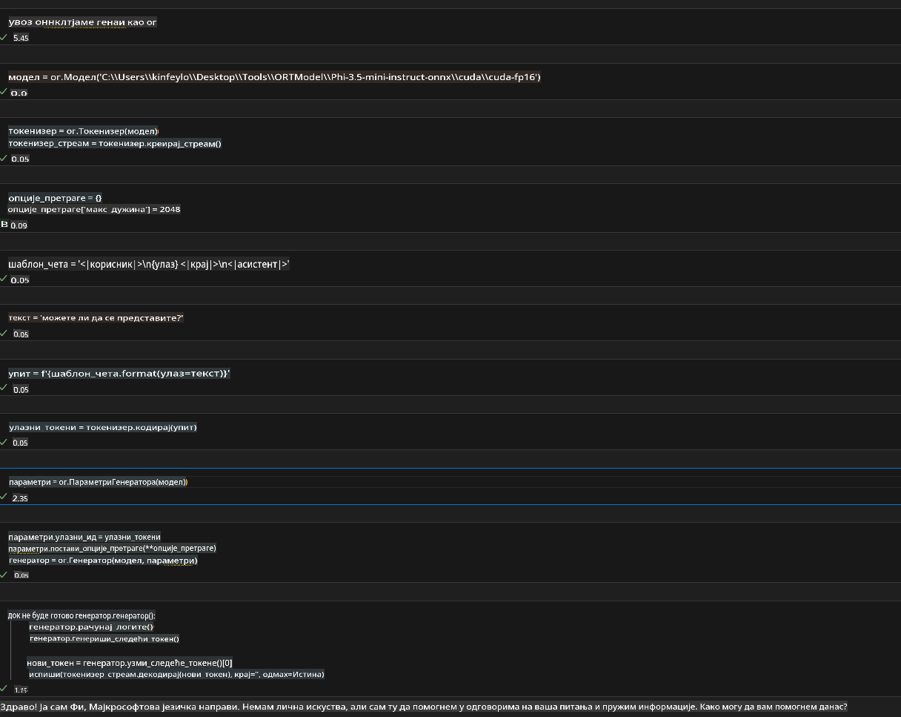
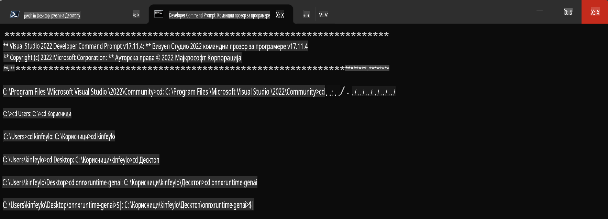

# **Vodič za OnnxRuntime GenAI Windows GPU**

Ovaj vodič pruža korake za postavljanje i korišćenje ONNX Runtime-a (ORT) sa GPU-ovima na Windowsu. Namenjen je da vam pomogne da iskoristite ubrzanje GPU-a za vaše modele, poboljšavajući performanse i efikasnost.

Dokument pruža uputstva o:

- Postavljanju okruženja: Instrukcije za instalaciju neophodnih zavisnosti poput CUDA, cuDNN i ONNX Runtime-a.
- Konfiguraciji: Kako da konfigurišete okruženje i ONNX Runtime za efikasno korišćenje GPU resursa.
- Savetima za optimizaciju: Preporuke kako da prilagodite GPU podešavanja za optimalne performanse.

### **1. Python 3.10.x / 3.11.8**

   ***Napomena*** Preporučuje se korišćenje [miniforge](https://github.com/conda-forge/miniforge/releases/latest/download/Miniforge3-Windows-x86_64.exe) kao vašeg Python okruženja.

   ```bash

   conda create -n pydev python==3.11.8

   conda activate pydev

   ```

   ***Podsetnik*** Ako ste već instalirali bilo koju ONNX biblioteku za Python, molimo vas da je deinstalirate.

### **2. Instalacija CMake-a putem winget-a**

   ```bash

   winget install -e --id Kitware.CMake

   ```

### **3. Instalacija Visual Studio 2022 - Desktop razvoj sa C++**

   ***Napomena*** Ako ne želite da kompajlirate, možete preskočiti ovaj korak.



### **4. Instalacija NVIDIA drajvera**

1. **NVIDIA GPU drajver** [https://www.nvidia.com/en-us/drivers/](https://www.nvidia.com/en-us/drivers/)

2. **NVIDIA CUDA 12.4** [https://developer.nvidia.com/cuda-12-4-0-download-archive](https://developer.nvidia.com/cuda-12-4-0-download-archive)

3. **NVIDIA CUDNN 9.4** [https://developer.nvidia.com/cudnn-downloads](https://developer.nvidia.com/cudnn-downloads)

***Podsetnik*** Koristite podrazumevana podešavanja tokom instalacije.

### **5. Postavljanje NVIDIA okruženja**

Kopirajte NVIDIA CUDNN 9.4 lib, bin, include u odgovarajuće foldere NVIDIA CUDA 12.4.

- Kopirajte fajlove iz *'C:\Program Files\NVIDIA\CUDNN\v9.4\bin\12.6'* u *'C:\Program Files\NVIDIA GPU Computing Toolkit\CUDA\v12.4\bin'*.

- Kopirajte fajlove iz *'C:\Program Files\NVIDIA\CUDNN\v9.4\include\12.6'* u *'C:\Program Files\NVIDIA GPU Computing Toolkit\CUDA\v12.4\include'*.

- Kopirajte fajlove iz *'C:\Program Files\NVIDIA\CUDNN\v9.4\lib\12.6'* u *'C:\Program Files\NVIDIA GPU Computing Toolkit\CUDA\v12.4\lib\x64'*.

### **6. Preuzimanje Phi-3.5-mini-instruct-onnx**

   ```bash

   winget install -e --id Git.Git

   winget install -e --id GitHub.GitLFS

   git lfs install

   git clone https://huggingface.co/microsoft/Phi-3.5-mini-instruct-onnx

   ```

### **7. Pokretanje InferencePhi35Instruct.ipynb**

   Otvorite [Notebook](../../../../../../code/09.UpdateSamples/Aug/ortgpu-phi35-instruct.ipynb) i izvršite ga.



### **8. Kompajliranje ORT GenAI GPU**

   ***Napomena*** 
   
   1. Prvo deinstalirajte sve što je povezano sa onnx, onnxruntime i onnxruntime-genai.

   ```bash

   pip list 
   
   ```

   Zatim deinstalirajte sve ONNX Runtime biblioteke, na primer:

   ```bash

   pip uninstall onnxruntime

   pip uninstall onnxruntime-genai

   pip uninstall onnxruntume-genai-cuda
   
   ```

   2. Proverite podršku za Visual Studio ekstenziju.

   Proverite folder *C:\Program Files\NVIDIA GPU Computing Toolkit\CUDA\v12.4\extras* da biste se uverili da postoji *C:\Program Files\NVIDIA GPU Computing Toolkit\CUDA\v12.4\extras\visual_studio_integration*. 

   Ako ne postoji, proverite druge foldere drajvera CUDA alata i kopirajte folder *visual_studio_integration* sa sadržajem u *C:\Program Files\NVIDIA GPU Computing Toolkit\CUDA\v12.4\extras\visual_studio_integration*.

   - Ako ne želite da kompajlirate, možete preskočiti ovaj korak.

   ```bash

   git clone https://github.com/microsoft/onnxruntime-genai

   ```

   - Preuzmite [https://github.com/microsoft/onnxruntime/releases/download/v1.19.2/onnxruntime-win-x64-gpu-1.19.2.zip](https://github.com/microsoft/onnxruntime/releases/download/v1.19.2/onnxruntime-win-x64-gpu-1.19.2.zip).

   - Raspakujte *onnxruntime-win-x64-gpu-1.19.2.zip*, preimenujte ga u **ort**, i kopirajte folder *ort* u *onnxruntime-genai*.

   - Koristeći Windows Terminal, idite na Developer Command Prompt za VS 2022 i pređite u folder *onnxruntime-genai*.



   - Kompajlirajte ga koristeći vaše Python okruženje.

   ```bash

   cd onnxruntime-genai

   python build.py --use_cuda  --cuda_home "C:\Program Files\NVIDIA GPU Computing Toolkit\CUDA\v12.4" --config Release
 

   cd build/Windows/Release/Wheel

   pip install .whl

   ```

**Одрицање од одговорности**:  
Овај документ је преведен коришћењем услуга машинског превођења заснованих на вештачкој интелигенцији. Иако настојимо да обезбедимо тачност, имајте у виду да аутоматски преводи могу садржати грешке или нетачности. Оригинални документ на изворном језику треба сматрати меродавним извором. За критичне информације препоручује се професионални превод од стране људи. Не сносимо одговорност за било какве неспоразуме или погрешна тумачења која могу произаћи из коришћења овог превода.