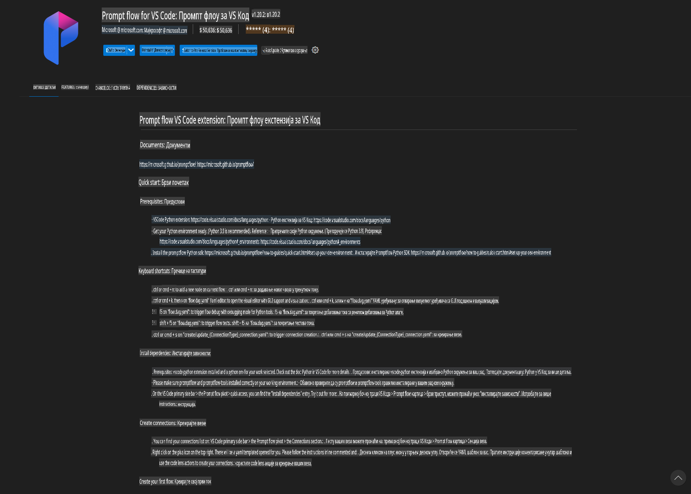
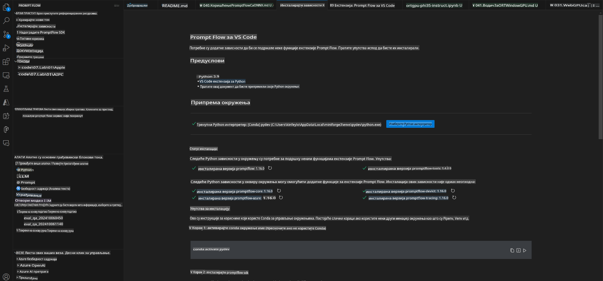
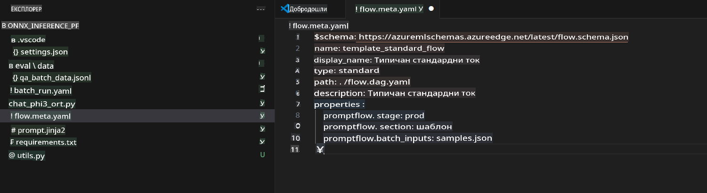
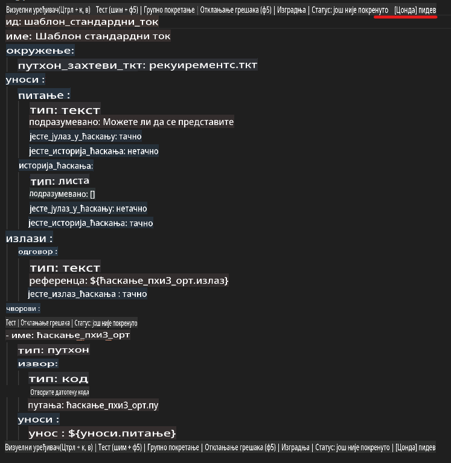
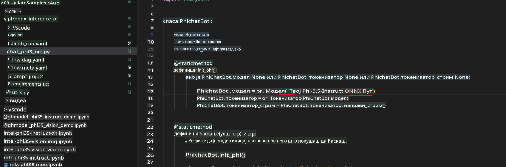
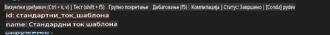
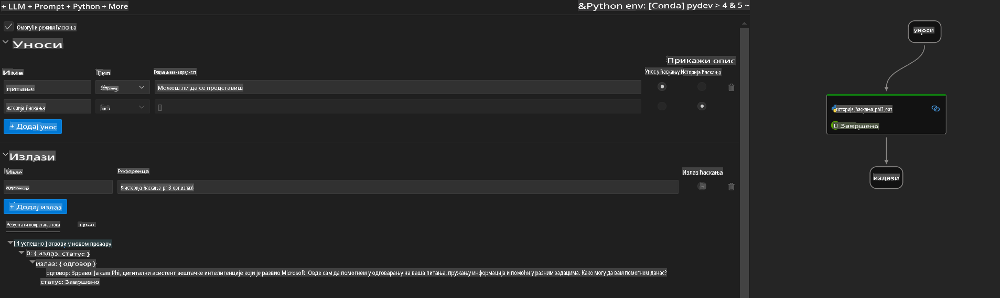
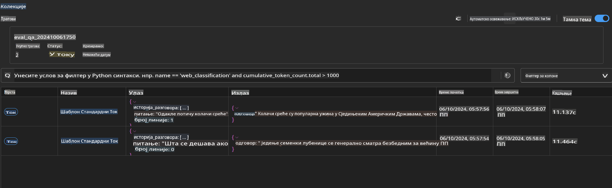

# Korišćenje Windows GPU za kreiranje Prompt flow rešenja sa Phi-3.5-Instruct ONNX 

Sledeći dokument je primer kako koristiti PromptFlow sa ONNX (Open Neural Network Exchange) za razvoj AI aplikacija zasnovanih na Phi-3 modelima.

PromptFlow je skup razvojnih alata osmišljen da pojednostavi ceo razvojni ciklus AI aplikacija zasnovanih na velikim jezičkim modelima (LLM), od ideje i prototipiranja do testiranja i evaluacije.

Integracijom PromptFlow-a sa ONNX-om, programeri mogu:

- Optimizovati performanse modela: Iskoristiti ONNX za efikasno izvođenje i implementaciju modela.
- Pojednostaviti razvoj: Koristiti PromptFlow za upravljanje radnim procesima i automatizaciju repetitivnih zadataka.
- Poboljšati saradnju: Omogućiti bolju saradnju među članovima tima pružanjem jedinstvenog razvojnog okruženja.

**Prompt flow** je skup razvojnih alata osmišljen da pojednostavi ceo razvojni ciklus AI aplikacija zasnovanih na velikim jezičkim modelima (LLM), od ideje, prototipa, testiranja, evaluacije do implementacije u produkciju i praćenja. Ovaj alat olakšava inženjering promptova i omogućava kreiranje LLM aplikacija sa kvalitetom spremnim za produkciju.

Prompt flow se može povezati sa OpenAI, Azure OpenAI Service i prilagodljivim modelima (Huggingface, lokalni LLM/SLM). Cilj nam je da implementiramo kvantizovani ONNX model Phi-3.5 u lokalne aplikacije. Prompt flow može nam pomoći da bolje isplaniramo naše poslovanje i kompletiramo lokalna rešenja zasnovana na Phi-3.5. U ovom primeru, kombinovaćemo ONNX Runtime GenAI biblioteku kako bismo završili Prompt flow rešenje zasnovano na Windows GPU.

## **Instalacija**

### **ONNX Runtime GenAI za Windows GPU**

Pročitajte ovaj vodič za postavljanje ONNX Runtime GenAI za Windows GPU [kliknite ovde](./ORTWindowGPUGuideline.md)

### **Postavljanje Prompt flow-a u VSCode**

1. Instalirajte Prompt flow ekstenziju za VS Code



2. Nakon instalacije Prompt flow ekstenzije za VS Code, kliknite na ekstenziju i izaberite **Installation dependencies**, prateći ovaj vodič za instalaciju Prompt flow SDK-a u vaše okruženje.



3. Preuzmite [Primer koda](../../../../../../code/09.UpdateSamples/Aug/pf/onnx_inference_pf) i otvorite ga u VS Code-u.



4. Otvorite **flow.dag.yaml** i izaberite Python okruženje.



   Otvorite **chat_phi3_ort.py** i promenite lokaciju vašeg Phi-3.5-instruct ONNX modela.



5. Pokrenite vaš Prompt flow za testiranje.

Otvorite **flow.dag.yaml** i kliknite na vizuelni editor.



Nakon klika, pokrenite ga za testiranje.



1. Možete pokrenuti batch u terminalu da biste videli više rezultata.

```bash

pf run create --file batch_run.yaml --stream --name 'Your eval qa name'    

```

Rezultate možete pregledati u vašem podrazumevanom pretraživaču.



**Одрицање од одговорности**:  
Овај документ је преведен коришћењем услуга машинског превођења на бази вештачке интелигенције. Иако настојимо да преводи буду тачни, молимо вас да имате у виду да аутоматизовани преводи могу садржати грешке или нетачности. Оригинални документ на његовом изворном језику треба сматрати меродавним. За критичне информације препоручује се професионални превод од стране људи. Не сносимо одговорност за било каква погрешна тумачења или неспоразуме који могу произаћи из коришћења овог превода.