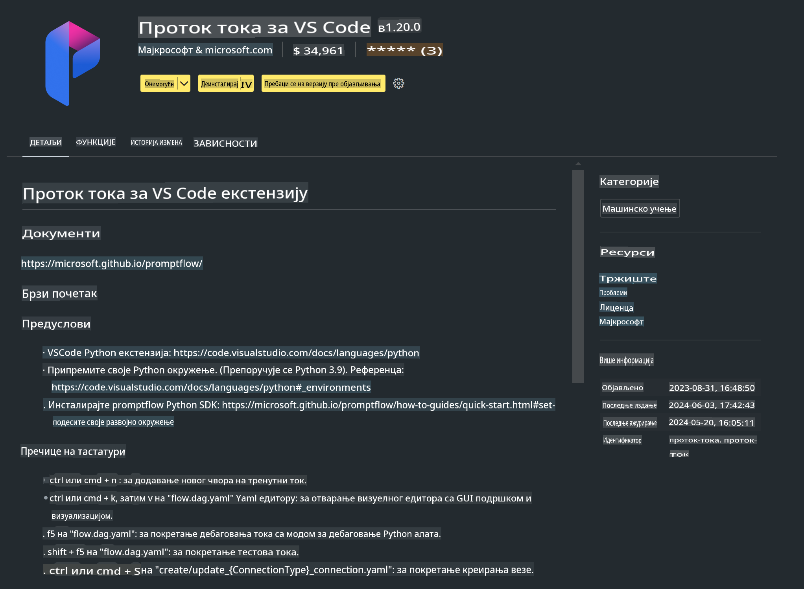

# **Лабораторија 0 - Инсталација**

Када уђемо у лабораторију, потребно је да конфигуришемо одговарајуће окружење:


### **1. Python 3.11+**

Препоручује се коришћење miniforge за конфигурисање Python окружења.

За конфигурисање miniforge, погледајте [https://github.com/conda-forge/miniforge](https://github.com/conda-forge/miniforge)

Након конфигурисања miniforge, покрените следећу команду у Power Shell-у:

```bash

conda create -n pyenv python==3.11.8 -y

conda activate pyenv

```


### **2. Инсталација Prompt flow SDK**

У Лабораторији 1 користимо Prompt flow, па је потребно конфигурисати Prompt flow SDK.

```bash

pip install promptflow --upgrade

```

Можете проверити promptflow sdk помоћу ове команде:

```bash

pf --version

```

### **3. Инсталација Visual Studio Code Prompt flow Екстензије**




### **4. Intel NPU Акцелерацијска Библиотека**

Нова генерација Intel процесора подржава NPU. Ако желите да користите NPU за локално покретање LLM-ова / SLM-ова, можете користити ***Intel NPU Акцелерацијску Библиотеку***. Ако желите да сазнате више, прочитајте [https://github.com/microsoft/PhiCookBook/blob/main/md/01.Introduction/03/AIPC_Inference.md](https://github.com/microsoft/PhiCookBook/blob/main/md/01.Introduction/03/AIPC_Inference.md).

Инсталирајте Intel NPU Акцелерацијску Библиотеку у bash-у:

```bash

pip install intel-npu-acceleration-library

```

***Напомена***: Обратите пажњу да ова библиотека подржава transformers ***4.40.2***, молимо потврдите верзију.


### **5. Остале Python библиотеке**


Креирајте requirements.txt и додајте следећи садржај:

```txt

notebook
numpy 
scipy 
scikit-learn 
matplotlib 
pandas 
pillow 
graphviz

```


### **6. Инсталација NVM**

Инсталирајте nvm у Powershell-у:

```bash

winget install -e --id CoreyButler.NVMforWindows

```

Инсталирајте nodejs 18.20:

```bash

nvm install 18.20.0

nvm use 18.20.0

```

### **7. Инсталација Visual Studio Code Подршке за Развој**

```bash

npm install --global yo generator-code

```

Честитамо! Успешно сте конфигурисали SDK. Сада пређите на практичне кораке.

**Одрицање од одговорности**:  
Овај документ је преведен коришћењем услуга машинског превођења заснованог на вештачкој интелигенцији. Иако настојимо да обезбедимо тачност, имајте у виду да аутоматски преводи могу садржати грешке или нетачности. Оригинални документ на изворном језику треба сматрати меродавним извором. За критичне информације препоручује се професионални људски превод. Не сносимо одговорност за било каква неспоразумевања или погрешна тумачења која могу проистећи из коришћења овог превода.