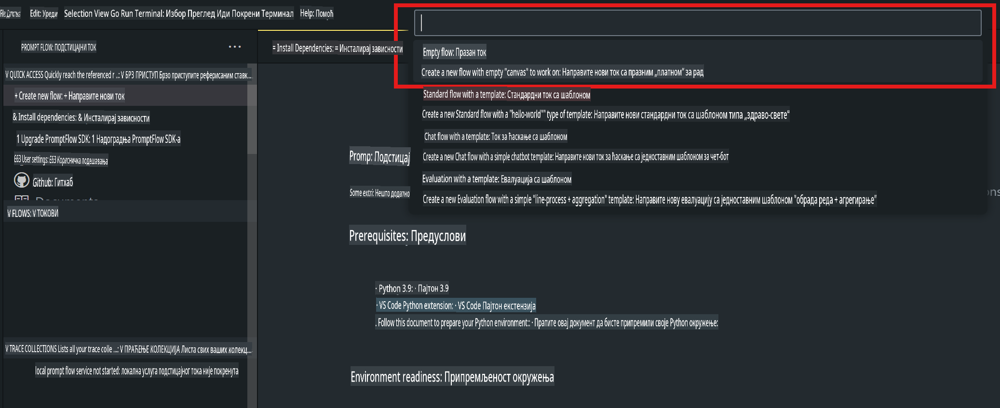
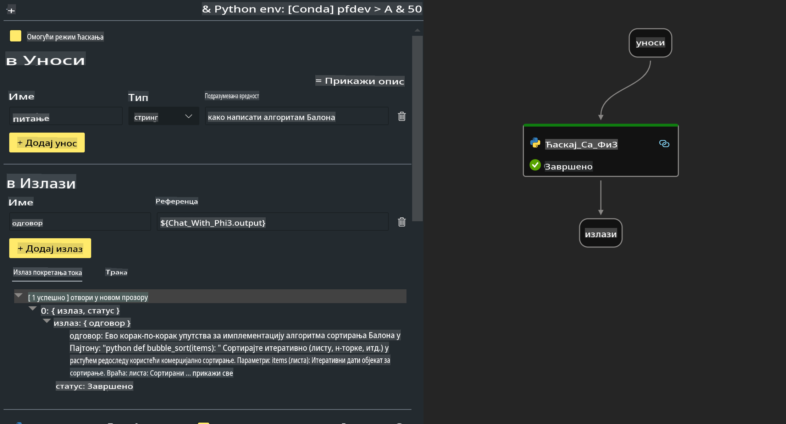

# **Lab 2 - Pokretanje Prompt flow sa Phi-3-mini na AIPC**

## **Šta je Prompt flow**

Prompt flow je skup alata za razvoj dizajniran da pojednostavi ceo razvojni ciklus AI aplikacija zasnovanih na LLM-ovima, od ideje, prototipiranja, testiranja, evaluacije do produkcijskog uvođenja i praćenja. Omogućava lakše kreiranje promptova i pomaže u izgradnji LLM aplikacija sa produkcijskim kvalitetom.

Uz Prompt flow, možete:

- Kreirati tokove koji povezuju LLM-ove, promptove, Python kod i druge alate u izvršni radni tok.

- Lakše otklanjati greške i iterirati vaše tokove, posebno interakcije sa LLM-ovima.

- Evaluirati tokove, računati metrike kvaliteta i performansi na većim skupovima podataka.

- Integrisati testiranje i evaluaciju u vaš CI/CD sistem kako biste osigurali kvalitet toka.

- Lako implementirati tokove na izabranu platformu za posluživanje ili ih integrisati u kod vaše aplikacije.

- (Opcionalno, ali toplo preporučeno) Saradnja sa timom korišćenjem cloud verzije Prompt flow-a u Azure AI.

## **Šta je AIPC**

AI PC ima CPU, GPU i NPU, svaki sa specifičnim mogućnostima ubrzanja za veštačku inteligenciju. NPU, ili jedinica za neuronsku obradu, je specijalizovani akcelerator koji obrađuje zadatke veštačke inteligencije (AI) i mašinskog učenja (ML) direktno na vašem računaru, umesto da šalje podatke na obradu u cloud. Iako GPU i CPU takođe mogu obrađivati ove zadatke, NPU je posebno dobar za AI proračune sa niskom potrošnjom energije. AI PC predstavlja fundamentalnu promenu u načinu na koji naši računari funkcionišu. To nije rešenje za problem koji ranije nije postojao, već obećava značajno poboljšanje u svakodnevnoj upotrebi računara.

Kako to funkcioniše? U poređenju sa generativnom AI tehnologijom i masivnim modelima velikih jezika (LLM-ovima) treniranim na ogromnim količinama javnih podataka, AI koji će se odvijati na vašem računaru je pristupačniji na gotovo svakom nivou. Koncept je lakši za razumevanje, a budući da je treniran na vašim podacima, bez potrebe za pristupom cloudu, prednosti su odmah privlačne širem krugu korisnika.

U bliskoj budućnosti, AI PC svet uključuje personalne asistente i manje AI modele koji direktno rade na vašem računaru, koristeći vaše podatke kako bi ponudili personalizovane, privatne i sigurnije AI funkcionalnosti za svakodnevne zadatke – vođenje beleški sa sastanaka, organizovanje fantazijskih sportskih liga, automatizaciju poboljšanja za uređivanje fotografija i videa, ili pravljenje idealnog plana za porodično okupljanje na osnovu vremena dolaska i odlaska svih članova.

## **Kreiranje tokova generisanja koda na AIPC**

***Napomena***: Ako niste završili instalaciju okruženja, posetite [Lab 0 - Instalacije](./01.Installations.md)

1. Otvorite Prompt flow ekstenziju u Visual Studio Code-u i kreirajte prazan projekat toka.



2. Dodajte ulazne i izlazne parametre i dodajte Python kod kao novi tok.



Možete se osloniti na ovu strukturu (flow.dag.yaml) za kreiranje vašeg toka.

```yaml

inputs:
  question:
    type: string
    default: how to write Bubble Algorithm
outputs:
  answer:
    type: string
    reference: ${Chat_With_Phi3.output}
nodes:
- name: Chat_With_Phi3
  type: python
  source:
    type: code
    path: Chat_With_Phi3.py
  inputs:
    question: ${inputs.question}


```

3. Dodajte kod u ***Chat_With_Phi3.py***

```python


from promptflow.core import tool

# import torch
from transformers import AutoTokenizer, pipeline,TextStreamer
import intel_npu_acceleration_library as npu_lib

import warnings

import asyncio
import platform

class Phi3CodeAgent:
    
    model = None
    tokenizer = None
    text_streamer = None
    
    model_id = "microsoft/Phi-3-mini-4k-instruct"

    @staticmethod
    def init_phi3():
        
        if Phi3CodeAgent.model is None or Phi3CodeAgent.tokenizer is None or Phi3CodeAgent.text_streamer is None:
            Phi3CodeAgent.model = npu_lib.NPUModelForCausalLM.from_pretrained(
                                    Phi3CodeAgent.model_id,
                                    torch_dtype="auto",
                                    dtype=npu_lib.int4,
                                    trust_remote_code=True
                                )
            Phi3CodeAgent.tokenizer = AutoTokenizer.from_pretrained(Phi3CodeAgent.model_id)
            Phi3CodeAgent.text_streamer = TextStreamer(Phi3CodeAgent.tokenizer, skip_prompt=True)

    

    @staticmethod
    def chat_with_phi3(prompt):
        
        Phi3CodeAgent.init_phi3()

        messages = "<|system|>You are a AI Python coding assistant. Please help me to generate code in Python.The answer only genertated Python code, but any comments and instructions do not need to be generated<|end|><|user|>" + prompt +"<|end|><|assistant|>"


        generation_args = {
            "max_new_tokens": 1024,
            "return_full_text": False,
            "temperature": 0.3,
            "do_sample": False,
            "streamer": Phi3CodeAgent.text_streamer,
        }

        pipe = pipeline(
            "text-generation",
            model=Phi3CodeAgent.model,
            tokenizer=Phi3CodeAgent.tokenizer,
            # **generation_args
        )

        result = ''

        with warnings.catch_warnings():
            warnings.simplefilter("ignore")
            response = pipe(messages, **generation_args)
            result =response[0]['generated_text']
            return result


@tool
def my_python_tool(question: str) -> str:
    if platform.system() == 'Windows':
        asyncio.set_event_loop_policy(asyncio.WindowsSelectorEventLoopPolicy())
    return Phi3CodeAgent.chat_with_phi3(question)


```

4. Možete testirati tok pomoću Debug ili Run opcije kako biste proverili da li generisanje koda funkcioniše.


5. Pokrenite tok kao razvojni API u terminalu.

```

pf flow serve --source ./ --port 8080 --host localhost   

```

Možete ga testirati u Postman-u ili Thunder Client-u.

### **Napomena**

1. Prvo pokretanje traje dugo. Preporučuje se preuzimanje phi-3 modela preko Hugging Face CLI.

2. Uzimajući u obzir ograničene mogućnosti obrade Intel NPU-a, preporučuje se korišćenje Phi-3-mini-4k-instruct modela.

3. Koristimo Intel NPU ubrzanje za kvantizaciju u INT4 format, ali ako ponovo pokrećete servis, potrebno je obrisati cache i nc_workshop foldere.

## **Resursi**

1. Naučite Promptflow [https://microsoft.github.io/promptflow/](https://microsoft.github.io/promptflow/)

2. Naučite Intel NPU ubrzanje [https://github.com/intel/intel-npu-acceleration-library](https://github.com/intel/intel-npu-acceleration-library)

3. Uzorak koda, preuzmite [Lokalni NPU Agent Uzorak Koda](../../../../../../../../../code/07.Lab/01/AIPC)

**Одрицање од одговорности**:  
Овај документ је преведен коришћењем услуга машинског превођења заснованих на вештачкој интелигенцији. Иако настојимо да обезбедимо тачност, молимо вас да имате у виду да аутоматизовани преводи могу садржати грешке или нетачности. Оригинални документ на изворном језику треба сматрати ауторитативним извором. За критичне информације препоручује се професионални превод од стране људи. Не сносимо одговорност за било какве неспоразуме или погрешна тумачења настала коришћењем овог превода.