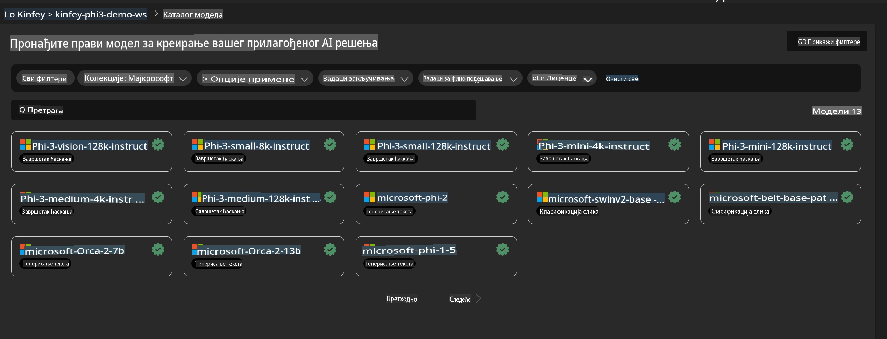
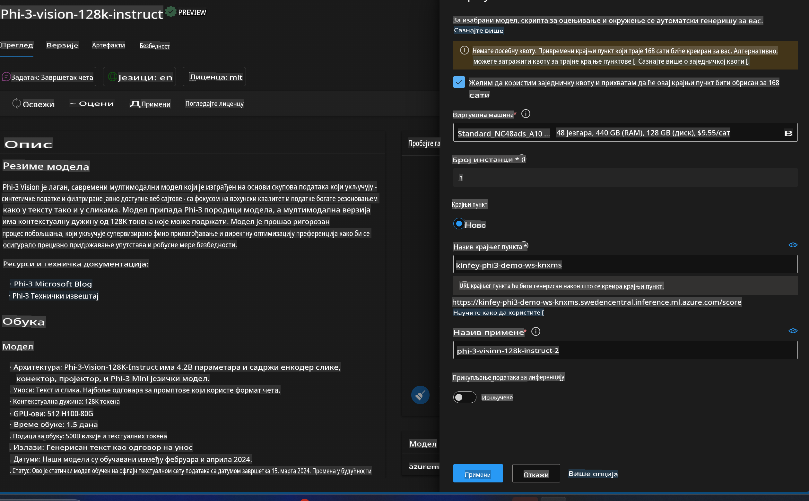
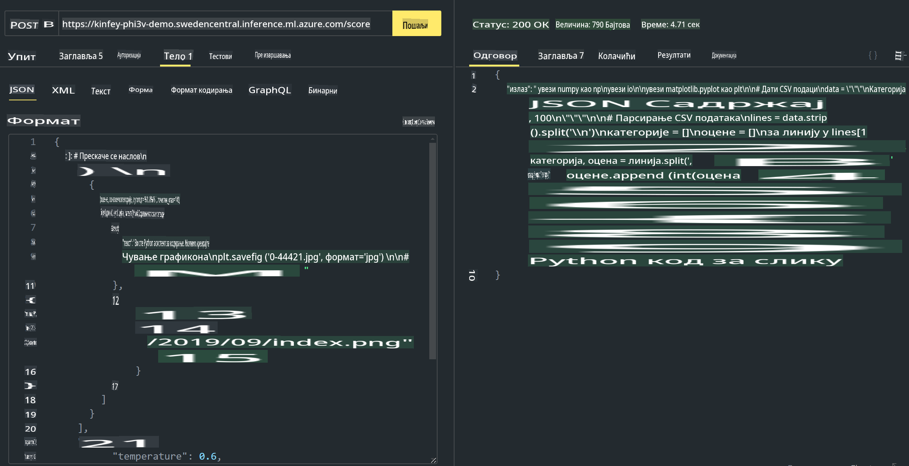

# **Lab 3 - Implementacija Phi-3-vision na Azure Machine Learning Service**

Koristimo NPU kako bismo završili produkcijsko postavljanje lokalnog koda, a zatim želimo uvesti mogućnost korišćenja PHI-3-VISION za generisanje koda iz slika.

U ovom uvodu, možemo brzo kreirati uslugu Phi-3 Vision kao Model As Service na Azure Machine Learning Service.

***Napomena***: Phi-3 Vision zahteva računske resurse za brže generisanje sadržaja. Potrebna nam je snaga cloud-a da bismo to postigli.

### **1. Kreiranje Azure Machine Learning Service**

Potrebno je da kreiramo Azure Machine Learning Service na Azure Portalu. Ako želite da naučite kako, posetite sledeći link [https://learn.microsoft.com/azure/machine-learning/quickstart-create-resources?view=azureml-api-2](https://learn.microsoft.com/azure/machine-learning/quickstart-create-resources?view=azureml-api-2)

### **2. Odabir Phi-3 Vision u Azure Machine Learning Service**



### **3. Postavljanje Phi-3-Vision na Azure**



### **4. Testiranje Endpoint-a u Postman-u**



***Napomena***

1. Parametri koji se šalju moraju uključivati Authorization, azureml-model-deployment i Content-Type. Potrebno je da proverite informacije o postavljanju kako biste ih dobili.

2. Za slanje parametara, Phi-3-Vision zahteva link ka slici. Molimo vas da se oslonite na GPT-4-Vision metod za slanje parametara, na primer:

```json

{
  "input_data":{
    "input_string":[
      {
        "role":"user",
        "content":[ 
          {
            "type": "text",
            "text": "You are a Python coding assistant.Please create Python code for image "
          },
          {
              "type": "image_url",
              "image_url": {
                "url": "https://ajaytech.co/wp-content/uploads/2019/09/index.png"
              }
          }
        ]
      }
    ],
    "parameters":{
          "temperature": 0.6,
          "top_p": 0.9,
          "do_sample": false,
          "max_new_tokens": 2048
    }
  }
}

```

3. Pozvati **/score** koristeći Post metod

**Čestitamo**! Završili ste brzo postavljanje PHI-3-VISION-a i isprobali kako koristiti slike za generisanje koda. Sledeće, možemo graditi aplikacije u kombinaciji sa NPU-ima i cloud-om.

**Одрицање од одговорности**:  
Овај документ је преведен коришћењем услуга машинског превођења заснованих на вештачкој интелигенцији. Иако настојимо да обезбедимо тачност, молимо вас да имате у виду да аутоматизовани преводи могу садржати грешке или нетачности. Оригинални документ на изворном језику треба сматрати ауторитативним извором. За критичне информације препоручује се професионални људски превод. Не сносимо одговорност за било каква погрешна тумачења или неспоразуме који могу произаћи из коришћења овог превода.