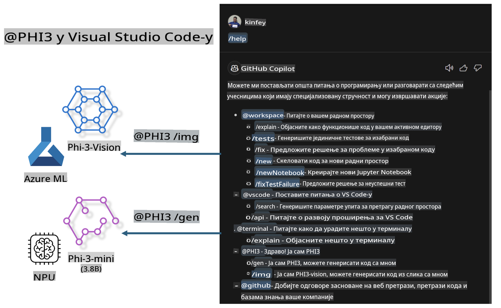

# **Napravite svoj Visual Studio Code GitHub Copilot Chat uz Microsoft Phi-3 Porodicu**

Da li ste koristili agenta za radno okruženje u GitHub Copilot Chat-u? Da li želite da napravite agenta za kodiranje za svoj tim? Ova praktična radionica ima za cilj da kombinuje open source model kako bi izgradila poslovnog agenta za kodiranje na nivou preduzeća.

## **Osnova**

### **Zašto odabrati Microsoft Phi-3**

Phi-3 je porodica modela koja uključuje phi-3-mini, phi-3-small i phi-3-medium, bazirane na različitim parametrima za generisanje teksta, kompletiranje dijaloga i generisanje koda. Takođe postoji phi-3-vision baziran na Vision tehnologiji. Pogodan je za preduzeća ili različite timove za kreiranje offline rešenja sa generativnom veštačkom inteligencijom.

Preporučuje se da pročitate ovaj link [https://github.com/microsoft/PhiCookBook/blob/main/md/01.Introduction/01/01.PhiFamily.md](https://github.com/microsoft/PhiCookBook/blob/main/md/01.Introduction/01/01.PhiFamily.md)

### **Microsoft GitHub Copilot Chat**

Ekstenzija GitHub Copilot Chat pruža interfejs za ćaskanje koji vam omogućava da komunicirate sa GitHub Copilot-om i dobijate odgovore na pitanja vezana za kodiranje direktno u okviru VS Code-a, bez potrebe da pretražujete dokumentaciju ili online forume.

Copilot Chat može koristiti isticanje sintakse, uvlačenje i druge funkcije formatiranja kako bi odgovori bili jasniji. U zavisnosti od tipa pitanja korisnika, rezultat može sadržavati linkove ka kontekstu koji je Copilot koristio za generisanje odgovora, kao što su fajlovi sa izvornim kodom ili dokumentacija, ili dugmad za pristup funkcionalnostima VS Code-a.

- Copilot Chat se integriše u vaš tok rada i pruža pomoć tamo gde vam je potrebna:

- Pokrenite inline razgovor direktno iz editora ili terminala kako biste dobili pomoć dok kodirate

- Koristite Chat prikaz kako biste imali AI asistenta uz sebe u svakom trenutku

- Pokrenite Quick Chat da postavite brzo pitanje i nastavite sa radom

GitHub Copilot Chat možete koristiti u različitim scenarijima, kao što su:

- Odgovaranje na pitanja vezana za kodiranje o tome kako najbolje rešiti problem

- Objašnjavanje tuđeg koda i predlaganje poboljšanja

- Predlaganje ispravki koda

- Generisanje test slučajeva

- Generisanje dokumentacije za kod

Preporučuje se da pročitate ovaj link [https://code.visualstudio.com/docs/copilot/copilot-chat](https://code.visualstudio.com/docs/copilot/copilot-chat?WT.mc_id=aiml-137032-kinfeylo)

### **Microsoft GitHub Copilot Chat @workspace**

Pozivanje **@workspace** u Copilot Chat-u omogućava vam da postavljate pitanja o celokupnoj bazi koda. Na osnovu pitanja, Copilot inteligentno pronalazi relevantne fajlove i simbole, koje zatim koristi u odgovoru kao linkove i primere koda.

Da bi odgovorio na vaše pitanje, **@workspace** pretražuje iste izvore koje bi programer koristio pri navigaciji kroz bazu koda u VS Code-u:

- Sve fajlove u radnom okruženju, osim onih koji su ignorisani od strane .gitignore fajla

- Strukturu direktorijuma sa ugnježdenim folderima i imenima fajlova

- GitHub-ov indeks pretrage koda, ako je radno okruženje GitHub repozitorijum i indeksirano za pretragu koda

- Simbole i definicije u radnom okruženju

- Trenutno izabrani tekst ili vidljivi tekst u aktivnom editoru

Napomena: .gitignore se zaobilazi ako imate otvoren fajl ili izabran tekst unutar ignorisanog fajla.

Preporučuje se da pročitate ovaj link [[https://code.visualstudio.com/docs/copilot/copilot-chat](https://code.visualstudio.com/docs/copilot/workspace-context?WT.mc_id=aiml-137032-kinfeylo)]

## **Saznajte više o ovoj radionici**

GitHub Copilot je značajno unapredio efikasnost programiranja u preduzećima, a svako preduzeće želi da prilagodi relevantne funkcije GitHub Copilot-a. Mnoga preduzeća su prilagodila ekstenzije slične GitHub Copilot-u na osnovu svojih poslovnih scenarija i open source modela. Za preduzeća, prilagođene ekstenzije su lakše za kontrolu, ali to takođe utiče na korisničko iskustvo. Ipak, GitHub Copilot ima jače funkcije u rešavanju opštih scenarija i profesionalnosti. Ako bi iskustvo moglo ostati dosledno, bilo bi bolje prilagoditi sopstvenu ekstenziju preduzeća. GitHub Copilot Chat pruža relevantne API-je za preduzeća kako bi proširili iskustvo ćaskanja. Održavanje doslednog iskustva uz prilagođene funkcije pruža bolje korisničko iskustvo.

Ova radionica uglavnom koristi Phi-3 model u kombinaciji sa lokalnim NPU-om i Azure hibridnim okruženjem kako bi se napravio prilagođeni Agent u GitHub Copilot Chat-u ***@PHI3*** koji pomaže programerima u preduzećima da završe generisanje koda ***(@PHI3 /gen)*** i generisanje koda na osnovu slika ***(@PHI3 /img)***.

### ***Napomena:*** 

Ova radionica je trenutno implementirana na AIPC-u Intel CPU-a i Apple Silicon-a. Nastavićemo sa ažuriranjem verzije za Qualcomm NPU.

## **Radionica**

| Ime | Opis | AIPC | Apple |
| ------------ | ----------- | -------- |-------- |
| Lab0 - Instalacije(✅) | Konfigurišite i instalirajte povezane okoline i alate | [Idi](./HOL/AIPC/01.Installations.md) |[Idi](./HOL/Apple/01.Installations.md) |
| Lab1 - Pokretanje Prompt flow-a sa Phi-3-mini (✅) | U kombinaciji sa AIPC-om / Apple Silicon-om, koristeći lokalni NPU za kreiranje generisanja koda kroz Phi-3-mini | [Idi](./HOL/AIPC/02.PromptflowWithNPU.md) |  [Idi](./HOL/Apple/02.PromptflowWithMLX.md) |
| Lab2 - Implementacija Phi-3-vision na Azure Machine Learning Service-u(✅) | Generisanje koda implementacijom Phi-3-vision modela sa Azure Machine Learning Service Model Catalog-a | [Idi](./HOL/AIPC/03.DeployPhi3VisionOnAzure.md) |[Idi](./HOL/Apple/03.DeployPhi3VisionOnAzure.md) |
| Lab3 - Kreiranje @phi-3 agenta u GitHub Copilot Chat-u(✅)  | Kreirajte prilagođeni Phi-3 agent u GitHub Copilot Chat-u za završavanje generisanja koda, generisanje grafičkog koda, RAG, itd. | [Idi](./HOL/AIPC/04.CreatePhi3AgentInVSCode.md) | [Idi](./HOL/Apple/04.CreatePhi3AgentInVSCode.md) |
| Primer koda (✅)  | Preuzmite primer koda | [Idi](../../../../../../../code/07.Lab/01/AIPC) | [Idi](../../../../../../../code/07.Lab/01/Apple) |

## **Resursi**

1. Phi-3 Cookbook [https://github.com/microsoft/Phi-3CookBook](https://github.com/microsoft/Phi-3CookBook)

2. Saznajte više o GitHub Copilot-u [https://learn.microsoft.com/training/paths/copilot/](https://learn.microsoft.com/training/paths/copilot/?WT.mc_id=aiml-137032-kinfeylo)

3. Saznajte više o GitHub Copilot Chat-u [https://learn.microsoft.com/training/paths/accelerate-app-development-using-github-copilot/](https://learn.microsoft.com/training/paths/accelerate-app-development-using-github-copilot/?WT.mc_id=aiml-137032-kinfeylo)

4. Saznajte više o GitHub Copilot Chat API-ju [https://code.visualstudio.com/api/extension-guides/chat](https://code.visualstudio.com/api/extension-guides/chat?WT.mc_id=aiml-137032-kinfeylo)

5. Saznajte više o Azure AI Foundry [https://learn.microsoft.com/training/paths/create-custom-copilots-ai-studio/](https://learn.microsoft.com/training/paths/create-custom-copilots-ai-studio/?WT.mc_id=aiml-137032-kinfeylo)

6. Saznajte više o Model Catalog-u Azure AI Foundry-ja [https://learn.microsoft.com/azure/ai-studio/how-to/model-catalog-overview](https://learn.microsoft.com/azure/ai-studio/how-to/model-catalog-overview)

**Одрицање од одговорности**:  
Овај документ је преведен коришћењем машинских услуга за превођење заснованих на вештачкој интелигенцији. Иако тежимо тачности, молимо вас да будете свесни да аутоматски преводи могу садржати грешке или нетачности. Оригинални документ на његовом изворном језику треба сматрати ауторитативним извором. За критичне информације препоручује се професионални превод од стране људи. Не сносимо одговорност за било каква погрешна схватања или погрешна тумачења која могу произаћи из употребе овог превода.