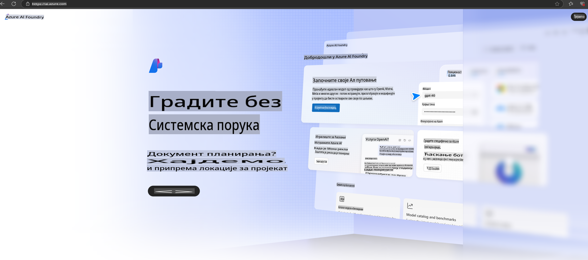

# **Korišćenje Phi-3 u Azure AI Foundry**

Sa razvojem Generativne veštačke inteligencije, nadamo se da ćemo koristiti jedinstvenu platformu za upravljanje različitim LLM i SLM modelima, integraciju podataka preduzeća, operacije prilagođavanja/RAG i evaluaciju različitih poslovnih procesa preduzeća nakon integracije LLM i SLM modela, itd., kako bi generativna veštačka inteligencija bila bolje implementirana u pametne aplikacije. [Azure AI Foundry](https://ai.azure.com) je platforma za generativnu veštačku inteligenciju na nivou preduzeća.

Uz Azure AI Foundry, možete proceniti odgovore velikih jezičkih modela (LLM) i orkestrirati komponente aplikacija sa prompt flow-om za bolje performanse. Platforma omogućava lako skaliranje kako bi se koncepti brzo transformisali u potpune produkcijske aplikacije. Kontinuirano praćenje i prilagođavanje omogućavaju dugoročan uspeh.

Možemo brzo implementirati Phi-3 model na Azure AI Foundry kroz jednostavne korake, a zatim koristiti Azure AI Foundry za obavljanje zadataka vezanih za Phi-3, kao što su Playground/Chat, prilagođavanje, evaluacija i drugi povezani poslovi.

## **1. Priprema**

Ako već imate instaliran [Azure Developer CLI](https://learn.microsoft.com/azure/developer/azure-developer-cli/overview?WT.mc_id=aiml-138114-kinfeylo) na vašem računaru, korišćenje ovog šablona je jednostavno kao pokretanje sledeće komande u novom direktorijumu.

## Ručno kreiranje

Kreiranje projekta i hab-a na Microsoft Azure AI Foundry platformi je odličan način za organizaciju i upravljanje vašim AI radom. Evo vodiča korak po korak kako da počnete:

### Kreiranje projekta u Azure AI Foundry

1. **Idite na Azure AI Foundry**: Prijavite se na Azure AI Foundry portal.
2. **Kreirajte projekat**:
   - Ako ste već u projektu, odaberite "Azure AI Foundry" u gornjem levom uglu stranice da biste se vratili na početnu stranicu.
   - Kliknite na "+ Create project".
   - Unesite ime za projekat.
   - Ako imate hab, biće automatski odabran. Ako imate pristup više hab-ova, možete odabrati drugi iz padajućeg menija. Ako želite da kreirate novi hab, kliknite na "Create new hub" i unesite ime.
   - Kliknite na "Create".

### Kreiranje hab-a u Azure AI Foundry

1. **Idite na Azure AI Foundry**: Prijavite se koristeći vaš Azure nalog.
2. **Kreirajte hab**:
   - Izaberite Centar za upravljanje iz levog menija.
   - Kliknite na "All resources", zatim strelicu pored "+ New project" i izaberite "+ New hub".
   - U dijalogu "Create a new hub", unesite ime za vaš hab (npr. contoso-hub) i prilagodite ostala polja po potrebi.
   - Kliknite na "Next", pregledajte informacije, i zatim kliknite na "Create".

Za detaljnija uputstva, možete se obratiti zvaničnoj [Microsoft dokumentaciji](https://learn.microsoft.com/azure/ai-studio/how-to/create-projects).

Nakon uspešnog kreiranja, možete pristupiti studiju koji ste kreirali putem [ai.azure.com](https://ai.azure.com/)

Na jednoj AI Foundry platformi može postojati više projekata. Kreirajte projekat u AI Foundry kao pripremu.

Kreirajte Azure AI Foundry [QuickStarts](https://learn.microsoft.com/azure/ai-studio/quickstarts/get-started-code)

## **2. Implementacija Phi modela u Azure AI Foundry**

Kliknite na opciju Explore projekta da biste ušli u Model Catalog i odabrali Phi-3.

Odaberite Phi-3-mini-4k-instruct.

Kliknite na 'Deploy' da biste implementirali Phi-3-mini-4k-instruct model.

> [!NOTE]
>
> Možete odabrati računske resurse prilikom implementacije.

## **3. Playground Chat Phi u Azure AI Foundry**

Idite na stranicu implementacije, izaberite Playground i ćaskajte sa Phi-3 na Azure AI Foundry.

## **4. Implementacija modela sa Azure AI Foundry**

Da biste implementirali model iz Azure Model Catalog, pratite sledeće korake:

- Prijavite se na Azure AI Foundry.
- Izaberite model koji želite da implementirate iz kataloga modela Azure AI Foundry.
- Na stranici sa detaljima modela, kliknite na Deploy, a zatim odaberite Serverless API sa Azure AI Content Safety.
- Izaberite projekat u kojem želite da implementirate vaše modele. Da biste koristili Serverless API opciju, vaš radni prostor mora pripadati regionu East US 2 ili Sweden Central. Možete prilagoditi ime implementacije.
- U čarobnjaku za implementaciju, odaberite Pricing and terms kako biste saznali više o cenama i uslovima korišćenja.
- Kliknite na Deploy. Sačekajte dok implementacija ne bude spremna i dok ne budete preusmereni na stranicu Deployments.
- Kliknite na Open in playground kako biste započeli interakciju sa modelom.
- Uvek se možete vratiti na stranicu Deployments, izabrati implementaciju i zabeležiti ciljnu URL adresu i tajni ključ, koje možete koristiti za pozivanje implementacije i generisanje rezultata.
- Uvek možete pronaći detalje o krajnjoj tački, URL i pristupne ključeve tako što ćete otići na karticu Build i izabrati Deployments iz odeljka Components.

> [!NOTE]
> Napominjemo da vaš nalog mora imati dozvole Azure AI Developer role na Resource Group kako bi se ovi koraci mogli izvršiti.

## **5. Korišćenje Phi API u Azure AI Foundry**

Možete pristupiti https://{Your project name}.region.inference.ml.azure.com/swagger.json putem Postman GET i kombinovati ga sa Key kako biste saznali više o dostupnim interfejsima.

Možete vrlo jednostavno dobiti parametre zahteva, kao i parametre odgovora.

**Одрицање од одговорности**:  
Овај документ је преведен коришћењем услуга машинског превођења заснованог на вештачкој интелигенцији. Иако се трудимо да обезбедимо тачност, молимо вас да имате у виду да аутоматски преводи могу садржати грешке или нетачности. Оригинални документ на његовом изворном језику треба сматрати ауторитативним извором. За критичне информације препоручује се професионални превод од стране људи. Не сносимо одговорност за било каква неспоразума или погрешна тумачења која произилазе из коришћења овог превода.