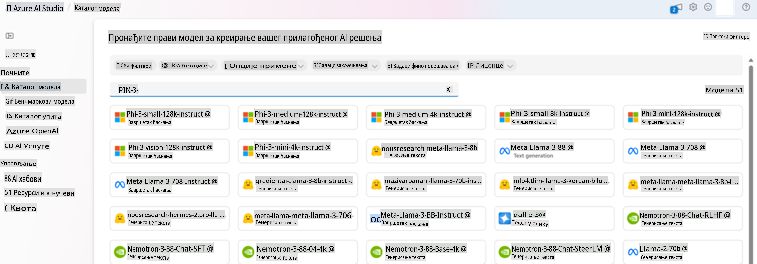
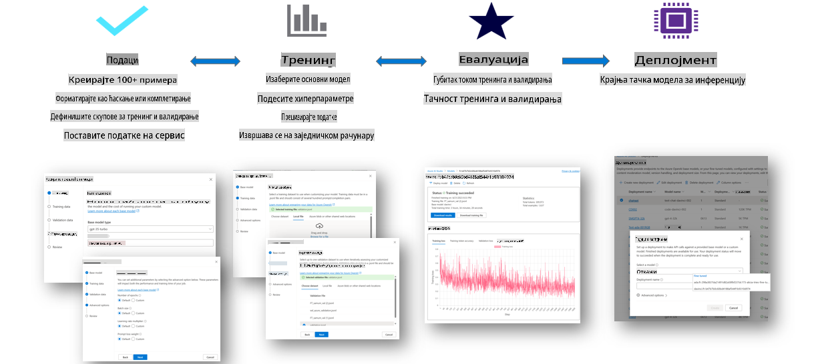
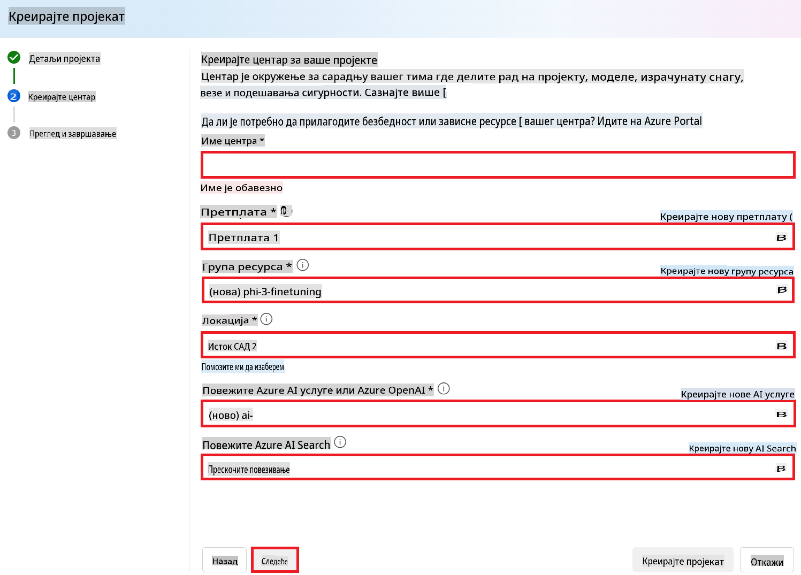
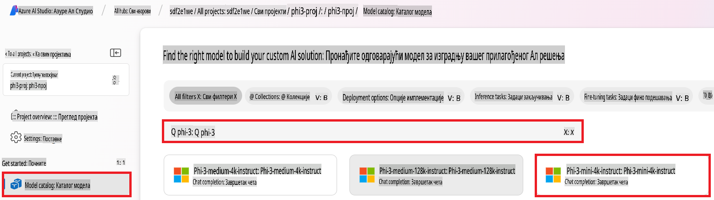
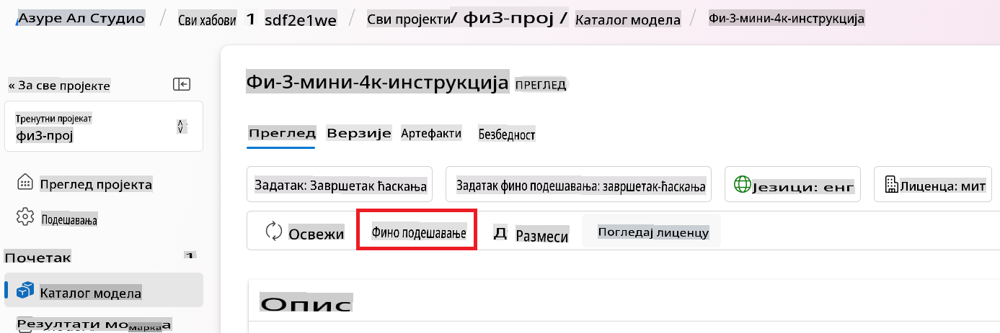
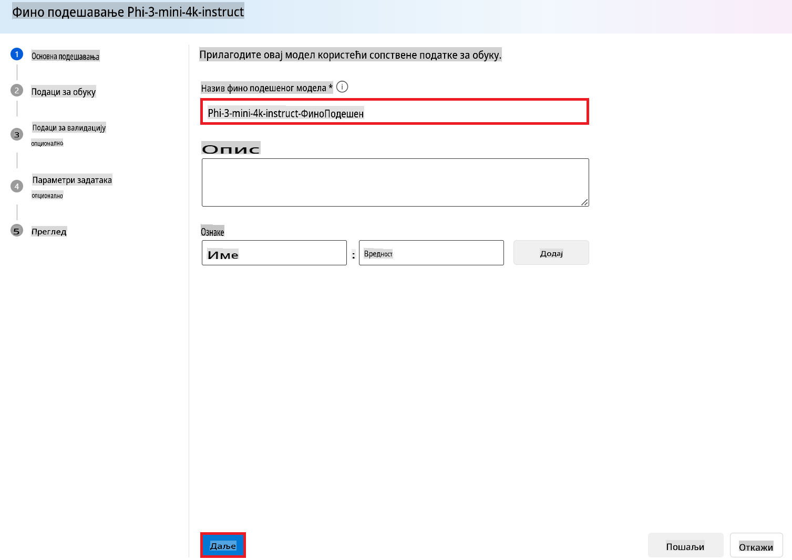
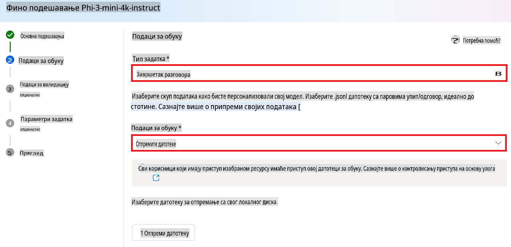
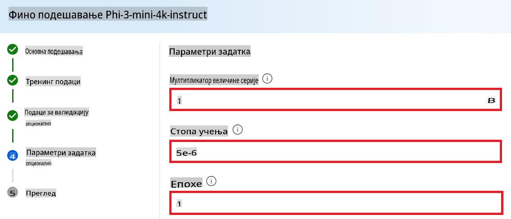
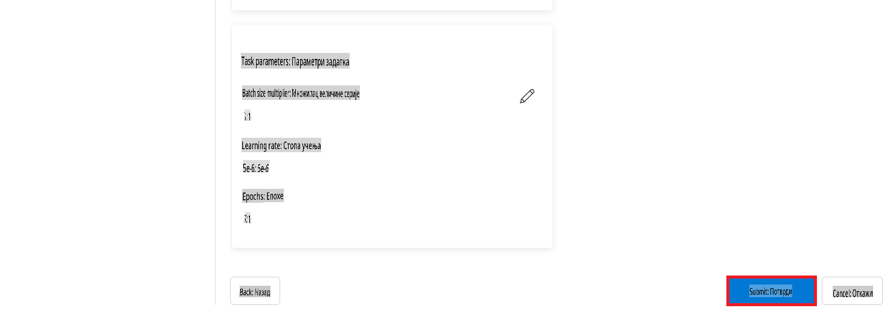
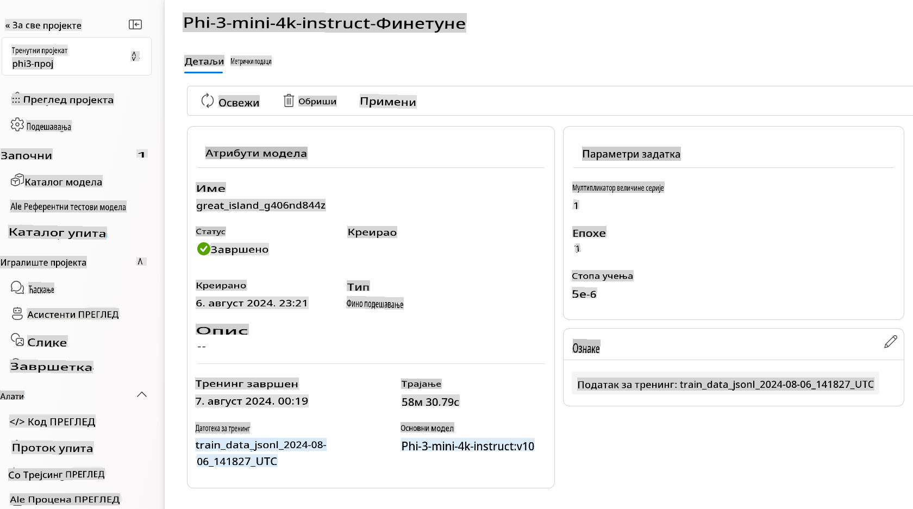

# Fino podešavanje Phi-3 sa Azure AI Foundry

Hajde da istražimo kako da fino podesimo Microsoft-ov Phi-3 Mini jezički model koristeći Azure AI Foundry. Fino podešavanje omogućava prilagođavanje Phi-3 Mini modela specifičnim zadacima, čineći ga još moćnijim i svesnijim konteksta.

## Razmatranja

- **Mogućnosti:** Koji modeli se mogu fino podešavati? Za šta osnovni model može biti fino podešen?
- **Cena:** Kakav je cenovni model za fino podešavanje?
- **Prilagodljivost:** Koliko mogu da modifikujem osnovni model – i na koje načine?
- **Pogodnost:** Kako se zapravo odvija fino podešavanje – da li moram da pišem prilagođeni kod? Da li moram da obezbedim sopstvenu infrastrukturu?
- **Bezbednost:** Fino podešeni modeli mogu nositi rizike po bezbednost – da li postoje zaštitne mere za sprečavanje nenamernih šteta?



## Priprema za fino podešavanje

### Preduslovi

> [!NOTE]
> Za modele iz porodice Phi-3, opcija plaćanja po korišćenju za fino podešavanje dostupna je samo sa habovima kreiranim u regionima **East US 2**.

- Azure pretplata. Ako nemate Azure pretplatu, kreirajte [plaćeni Azure nalog](https://azure.microsoft.com/pricing/purchase-options/pay-as-you-go) da biste počeli.

- [AI Foundry projekat](https://ai.azure.com?WT.mc_id=aiml-138114-kinfeylo).
- Azure kontrola pristupa zasnovana na ulogama (Azure RBAC) koristi se za dodeljivanje pristupa operacijama u Azure AI Foundry. Da biste izvršili korake iz ovog članka, vaš korisnički nalog mora imati __Azure AI Developer rolu__ na grupi resursa.

### Registracija provajdera pretplate

Proverite da li je pretplata registrovana za `Microsoft.Network` provajdera resursa.

1. Prijavite se na [Azure portal](https://portal.azure.com).
1. Izaberite **Pretplate** iz levog menija.
1. Izaberite pretplatu koju želite da koristite.
1. Izaberite **Postavke AI projekta** > **Provajderi resursa** iz levog menija.
1. Potvrdite da je **Microsoft.Network** na listi provajdera resursa. Ako nije, dodajte ga.

### Priprema podataka

Pripremite svoje podatke za treniranje i validaciju kako biste fino podesili svoj model. Vaši podaci za treniranje i validaciju treba da sadrže primere ulaza i izlaza kako biste želeli da model funkcioniše.

Uverite se da svi primeri za treniranje prate očekivani format za inferenciju. Da biste modele fino podešavali efikasno, obezbedite uravnotežen i raznovrstan skup podataka.

To podrazumeva održavanje ravnoteže podataka, uključivanje različitih scenarija i povremeno usklađivanje podataka za treniranje sa realnim očekivanjima, što na kraju vodi ka preciznijim i uravnoteženijim odgovorima modela.

Različiti tipovi modela zahtevaju različite formate podataka za treniranje.

### Završavanje razgovora

Podaci za treniranje i validaciju **moraju** biti formatirani kao JSON Lines (JSONL) dokument. Za `Phi-3-mini-128k-instruct` skup podataka za fino podešavanje mora biti formatiran u konverzacijskom formatu koji koristi API za završavanje razgovora.

### Primer formata datoteke

```json
    {"messages": [{"role": "system", "content": "You are an Xbox customer support agent whose primary goal is to help users with issues they are experiencing with their Xbox devices. You are friendly and concise. You only provide factual answers to queries, and do not provide answers that are not related to Xbox."}, {"role": "user", "content": "Is Xbox better than PlayStation?"}, {"role": "assistant", "content": "I apologize, but I cannot provide personal opinions. My primary job is to assist you with any issues related to your Xbox device. Do you have any Xbox-related issues that need addressing?"}]}
    {"messages": [{"role": "system", "content": "You are an Xbox customer support agent whose primary goal is to help users with issues they are experiencing with their Xbox devices. You are friendly and concise. You only provide factual answers to queries, and do not provide answers that are not related to Xbox."}, {"role": "user", "content": "Can I play PC games on my Xbox?"}, {"role": "assistant", "content": "While Xbox consoles don't natively support PC games, they can play an array of Xbox games, many of which are also available on PC. Can I assist you with finding games compatible with your Xbox device?"}]}
    {"messages": [{"role": "system", "content": "You are an Xbox customer support agent whose primary goal is to help users with issues they are experiencing with their Xbox devices. You are friendly and concise. You only provide factual answers to queries, and do not provide answers that are not related to Xbox."}, {"role": "user", "content": "I'm having trouble connecting my Xbox to the Wi-Fi."}, {"role": "assistant", "content": "No worries, let's go through the network settings on your Xbox. Can you please tell me what happens when you try to connect it to the Wi-Fi?"}]}
```

Podržani format datoteke je JSON Lines. Datoteke se otpremaju u podrazumevanu bazu podataka i postaju dostupne u vašem projektu.

## Fino podešavanje Phi-3 sa Azure AI Foundry

Azure AI Foundry omogućava prilagođavanje velikih jezičkih modela vašim ličnim skupovima podataka koristeći proces poznat kao fino podešavanje. Fino podešavanje pruža značajnu vrednost omogućavajući prilagođavanje i optimizaciju za specifične zadatke i aplikacije. To vodi ka poboljšanim performansama, efikasnosti troškova, smanjenju latencije i prilagođenim rezultatima.



### Kreiranje novog projekta

1. Prijavite se na [Azure AI Foundry](https://ai.azure.com).

1. Izaberite **+New project** da biste kreirali novi projekat u Azure AI Foundry.

    

1. Uradite sledeće zadatke:

    - Naziv hab-a projekta (**Hub name**). Mora biti jedinstvena vrednost.
    - Izaberite **Hub** koji želite da koristite (kreirajte novi ako je potrebno).

    

1. Uradite sledeće zadatke za kreiranje novog haba:

    - Unesite **Naziv haba**. Mora biti jedinstvena vrednost.
    - Izaberite vašu Azure **Pretplatu**.
    - Izaberite **Grupu resursa** koju želite da koristite (kreirajte novu ako je potrebno).
    - Izaberite **Lokaciju** koju želite da koristite.
    - Izaberite **Poveži Azure AI usluge** koje želite da koristite (kreirajte novu ako je potrebno).
    - Izaberite **Poveži Azure AI pretragu** ili **Preskoči povezivanje**.

    

1. Izaberite **Next**.
1. Izaberite **Kreiraj projekat**.

### Priprema podataka

Pre fino podešavanja, prikupite ili kreirajte skup podataka relevantan za vaš zadatak, poput uputstava za razgovor, parova pitanja i odgovora ili bilo kojih drugih relevantnih tekstualnih podataka. Očistite i obradite ove podatke uklanjanjem šuma, rešavanjem nedostajućih vrednosti i tokenizacijom teksta.

### Fino podešavanje Phi-3 modela u Azure AI Foundry

> [!NOTE]
> Fino podešavanje Phi-3 modela trenutno je podržano u projektima koji se nalaze u East US 2.

1. Izaberite **Katalog modela** iz levog menija.

1. Upišite *phi-3* u **traku za pretragu** i izaberite phi-3 model koji želite da koristite.

    

1. Izaberite **Fine-tune**.

    

1. Unesite **Naziv fino podešenog modela**.

    

1. Izaberite **Next**.

1. Uradite sledeće zadatke:

    - Izaberite **Tip zadatka** kao **Završavanje razgovora**.
    - Izaberite **Podatke za treniranje** koje želite da koristite. Možete ih otpremiti preko Azure AI Foundry ili iz lokalnog okruženja.

    

1. Izaberite **Next**.

1. Otvorite **Podatke za validaciju** koje želite da koristite, ili izaberite **Automatska podela podataka za treniranje**.

    

1. Izaberite **Next**.

1. Uradite sledeće zadatke:

    - Izaberite **Multiplikator veličine serije** koji želite da koristite.
    - Izaberite **Stopu učenja** koju želite da koristite.
    - Izaberite broj **Epoh** koje želite da koristite.

    

1. Izaberite **Submit** da započnete proces fino podešavanja.

    

1. Kada vaš model bude fino podešen, status će biti prikazan kao **Završeno**, kao što je prikazano na slici ispod. Sada možete da postavite model i koristite ga u svojoj aplikaciji, u igralištu ili u protoku upita. Za više informacija, pogledajte [Kako postaviti Phi-3 porodicu malih jezičkih modela sa Azure AI Foundry](https://learn.microsoft.com/azure/ai-studio/how-to/deploy-models-phi-3?tabs=phi-3-5&pivots=programming-language-python).

    

> [!NOTE]
> Za detaljnije informacije o fino podešavanju Phi-3, posetite [Fino podešavanje Phi-3 modela u Azure AI Foundry](https://learn.microsoft.com/azure/ai-studio/how-to/fine-tune-phi-3?tabs=phi-3-mini).

## Brisanje vaših fino podešenih modela

Možete obrisati fino podešen model iz liste modela za fino podešavanje u [Azure AI Foundry](https://ai.azure.com) ili sa stranice sa detaljima modela. Izaberite fino podešen model koji želite da obrišete sa stranice za fino podešavanje, a zatim izaberite dugme za brisanje kako biste obrisali model.

> [!NOTE]
> Ne možete obrisati prilagođeni model ako ima postojeću implementaciju. Prvo morate obrisati implementaciju modela pre nego što možete obrisati svoj prilagođeni model.

## Troškovi i kvote

### Razmatranja troškova i kvota za Phi-3 modele fino podešene kao usluga

Phi modeli fino podešeni kao usluga nude se od strane Microsoft-a i integrišu se sa Azure AI Foundry za upotrebu. Cene možete pronaći prilikom [postavljanja](https://learn.microsoft.com/azure/ai-studio/how-to/deploy-models-phi-3?tabs=phi-3-5&pivots=programming-language-python) ili fino podešavanja modela u okviru kartice za cene i uslove u čarobnjaku za postavljanje.

## Filtriranje sadržaja

Modeli implementirani kao usluga sa opcijom plaćanja po korišćenju zaštićeni su Azure AI Content Safety. Kada su implementirani na krajnje tačke u realnom vremenu, možete se isključiti iz ove funkcionalnosti. Sa omogućenim Azure AI Content Safety, i upit i odgovor prolaze kroz niz modela klasifikacije usmerenih na detekciju i sprečavanje štetnog sadržaja. Sistem za filtriranje sadržaja detektuje i preduzima mere na specifičnim kategorijama potencijalno štetnog sadržaja u ulaznim upitima i izlaznim odgovorima. Saznajte više o [Azure AI Content Safety](https://learn.microsoft.com/azure/ai-studio/concepts/content-filtering).

**Konfiguracija fino podešavanja**

Hiperparametri: Definišite hiperparametre poput stope učenja, veličine serije i broja epoh za treniranje.

**Funkcija gubitka**

Izaberite odgovarajuću funkciju gubitka za vaš zadatak (npr. unakrsna entropija).

**Optimizator**

Izaberite optimizator (npr. Adam) za ažuriranje gradijenata tokom treniranja.

**Proces fino podešavanja**

- Učitajte prethodno trenirani model: Učitajte Phi-3 Mini kontrolnu tačku.
- Dodajte prilagođene slojeve: Dodajte slojeve specifične za zadatak (npr. glavu za klasifikaciju za uputstva za razgovor).

**Trenirajte model**
Fino podesite model koristeći pripremljeni skup podataka. Pratite napredak u treniranju i prilagodite hiperparametre po potrebi.

**Evaluacija i validacija**

Validacioni skup: Podelite svoje podatke na skupove za treniranje i validaciju.

**Procena performansi**

Koristite metrike poput tačnosti, F1-skora ili perplexity za procenu performansi modela.

## Čuvanje fino podešenog modela

**Kontrolna tačka**
Sačuvajte kontrolnu tačku fino podešenog modela za buduću upotrebu.

## Implementacija

- Implementirajte kao veb uslugu: Implementirajte svoj fino podešeni model kao veb uslugu u Azure AI Foundry.
- Testirajte krajnju tačku: Pošaljite testne upite implementiranoj krajnjoj tački kako biste proverili njenu funkcionalnost.

## Iteracija i unapređenje

Iterirajte: Ako performanse nisu zadovoljavajuće, iterirajte prilagođavanjem hiperparametara, dodavanjem više podataka ili dodatnim fino podešavanjem.

## Praćenje i usavršavanje

Kontinuirano pratite ponašanje modela i usavršavajte ga po potrebi.

## Prilagođavanje i proširenje

Prilagođeni zadaci: Phi-3 Mini može se fino podesiti za razne zadatke osim uputstava za razgovor. Istražite druge primene!
Eksperimentišite: Isprobajte različite arhitekture, kombinacije slojeva i tehnike za poboljšanje performansi.

> [!NOTE]
> Fino podešavanje je iterativan proces. Eksperimentišite, učite i prilagodite svoj model kako biste postigli najbolje rezultate za svoj specifični zadatak!

**Одрицање од одговорности**:  
Овај документ је преведен коришћењем услуга машинског превођења заснованих на вештачкој интелигенцији. Иако тежимо тачности, молимо вас да будете свесни да аутоматски преводи могу садржати грешке или нетачности. Оригинални документ на његовом изворном језику треба сматрати ауторитативним извором. За критичне информације препоручује се професионални људски превод. Не сносимо одговорност за било каква погрешна тумачења или неразумевања која произилазе из коришћења овог превода.