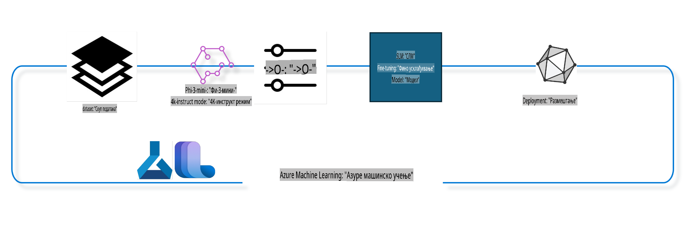

## Kako koristiti komponente za dovršavanje razgovora iz Azure ML sistema za prilagođavanje modela

U ovom primeru ćemo izvesti prilagođavanje modela Phi-3-mini-4k-instruct kako bismo završili razgovor između dve osobe koristeći ultrachat_200k dataset.



Primer će vam pokazati kako da izvedete prilagođavanje koristeći Azure ML SDK i Python, a zatim da implementirate prilagođeni model na mrežnu tačku za realno-vremensku inferencu.

### Podaci za obuku

Koristićemo ultrachat_200k dataset. Ovo je strogo filtrirana verzija UltraChat dataset-a i korišćena je za obuku Zephyr-7B-β, savremenog modela za razgovor sa 7 milijardi parametara.

### Model

Koristićemo Phi-3-mini-4k-instruct model kako bismo pokazali kako korisnik može prilagoditi model za zadatak dovršavanja razgovora. Ako ste otvorili ovu beležnicu sa specifične stranice modela, ne zaboravite da zamenite ime specifičnog modela.

### Zadaci

- Izabrati model za prilagođavanje.
- Izabrati i istražiti podatke za obuku.
- Konfigurisati posao prilagođavanja.
- Pokrenuti posao prilagođavanja.
- Pregledati metrike obuke i evaluacije.
- Registrovati prilagođeni model.
- Implementirati prilagođeni model za realno-vremensku inferencu.
- Očistiti resurse.

## 1. Postavljanje preduslova

- Instalirati zavisnosti.
- Povezati se na AzureML Workspace. Saznajte više na set up SDK authentication. Zamenite <WORKSPACE_NAME>, <RESOURCE_GROUP> i <SUBSCRIPTION_ID> ispod.
- Povezati se na AzureML sistemski registar.
- Postaviti opciono ime eksperimenta.
- Proveriti ili kreirati računar.

> [!NOTE]
> Zahtjevi: jedan GPU čvor može imati više GPU kartica. Na primer, u jednom čvoru Standard_NC24rs_v3 postoje 4 NVIDIA V100 GPU-a, dok u Standard_NC12s_v3 postoje 2 NVIDIA V100 GPU-a. Pogledajte dokumentaciju za ove informacije. Broj GPU kartica po čvoru se postavlja u parametru gpus_per_node ispod. Ispravno postavljanje ove vrednosti obezbediće iskorišćenje svih GPU-ova u čvoru. Preporučeni GPU računski SKU-ovi mogu se pronaći ovde i ovde.

### Python biblioteke

Instalirajte zavisnosti pokretanjem donje ćelije. Ovo nije opcionalni korak ako radite u novom okruženju.

```bash
pip install azure-ai-ml
pip install azure-identity
pip install datasets==2.9.0
pip install mlflow
pip install azureml-mlflow
```

### Interakcija sa Azure ML

1. Ovaj Python skript se koristi za interakciju sa Azure Machine Learning (Azure ML) servisom. Evo pregleda šta radi:

    - Uvozi potrebne module iz azure.ai.ml, azure.identity i azure.ai.ml.entities paketa. Takođe uvozi time modul.

    - Pokušava da se autentifikuje koristeći DefaultAzureCredential(), koji pruža pojednostavljeno iskustvo autentifikacije za brzo započinjanje razvoja aplikacija u Azure oblaku. Ako to ne uspe, prelazi na InteractiveBrowserCredential(), koji pruža interaktivni prozor za prijavu.

    - Zatim pokušava da kreira MLClient instancu koristeći from_config metodu, koja čita konfiguraciju iz podrazumevanog config fajla (config.json). Ako to ne uspe, kreira MLClient instancu ručnim pružanjem subscription_id, resource_group_name i workspace_name.

    - Kreira još jednu MLClient instancu, ovaj put za Azure ML registar nazvan "azureml". Ovaj registar je mesto gde se čuvaju modeli, pipeline-ovi za prilagođavanje i okruženja.

    - Postavlja ime eksperimenta na "chat_completion_Phi-3-mini-4k-instruct".

    - Generiše jedinstveni vremenski pečat konvertujući trenutno vreme (u sekundama od epohe, kao broj sa pokretnim zarezom) u ceo broj, a zatim u string. Ovaj vremenski pečat se može koristiti za kreiranje jedinstvenih imena i verzija.

    ```python
    # Import necessary modules from Azure ML and Azure Identity
    from azure.ai.ml import MLClient
    from azure.identity import (
        DefaultAzureCredential,
        InteractiveBrowserCredential,
    )
    from azure.ai.ml.entities import AmlCompute
    import time  # Import time module
    
    # Try to authenticate using DefaultAzureCredential
    try:
        credential = DefaultAzureCredential()
        credential.get_token("https://management.azure.com/.default")
    except Exception as ex:  # If DefaultAzureCredential fails, use InteractiveBrowserCredential
        credential = InteractiveBrowserCredential()
    
    # Try to create an MLClient instance using the default config file
    try:
        workspace_ml_client = MLClient.from_config(credential=credential)
    except:  # If that fails, create an MLClient instance by manually providing the details
        workspace_ml_client = MLClient(
            credential,
            subscription_id="<SUBSCRIPTION_ID>",
            resource_group_name="<RESOURCE_GROUP>",
            workspace_name="<WORKSPACE_NAME>",
        )
    
    # Create another MLClient instance for the Azure ML registry named "azureml"
    # This registry is where models, fine-tuning pipelines, and environments are stored
    registry_ml_client = MLClient(credential, registry_name="azureml")
    
    # Set the experiment name
    experiment_name = "chat_completion_Phi-3-mini-4k-instruct"
    
    # Generate a unique timestamp that can be used for names and versions that need to be unique
    timestamp = str(int(time.time()))
    ```

## 2. Izaberite osnovni model za prilagođavanje

1. Phi-3-mini-4k-instruct je model sa 3,8 milijardi parametara, lagan, savremen otvoreni model izgrađen na dataset-ima korišćenim za Phi-2. Model pripada Phi-3 porodici modela, a Mini verzija dolazi u dve varijante: 4K i 128K, što je dužina konteksta (u tokenima) koju može podržati. Moramo prilagoditi model za našu specifičnu svrhu kako bismo ga koristili. Možete pregledati ove modele u katalogu modela u AzureML Studio, filtriranjem prema zadatku dovršavanja razgovora. U ovom primeru koristimo Phi-3-mini-4k-instruct model. Ako ste otvorili ovu beležnicu za drugi model, zamenite ime modela i verziju u skladu s tim.

    > [!NOTE]
    > id svojstvo modela. Ovo će biti prosleđeno kao ulaz za posao prilagođavanja. Ovo je takođe dostupno kao polje Asset ID na stranici sa detaljima modela u AzureML Studio katalogu modela.

2. Ovaj Python skript interaguje sa Azure Machine Learning (Azure ML) servisom. Evo pregleda šta radi:

    - Postavlja model_name na "Phi-3-mini-4k-instruct".

    - Koristi get metodu models svojstva objekta registry_ml_client da preuzme najnoviju verziju modela sa specificiranim imenom iz Azure ML registra. Metoda get se poziva sa dva argumenta: ime modela i oznaka koja specificira da treba preuzeti najnoviju verziju modela.

    - Štampa poruku na konzoli koja ukazuje na ime, verziju i id modela koji će se koristiti za prilagođavanje. Metoda format string-a se koristi za umetanje imena, verzije i id modela u poruku. Ime, verzija i id modela se pristupaju kao svojstva objekta foundation_model.

    ```python
    # Set the model name
    model_name = "Phi-3-mini-4k-instruct"
    
    # Get the latest version of the model from the Azure ML registry
    foundation_model = registry_ml_client.models.get(model_name, label="latest")
    
    # Print the model name, version, and id
    # This information is useful for tracking and debugging
    print(
        "\n\nUsing model name: {0}, version: {1}, id: {2} for fine tuning".format(
            foundation_model.name, foundation_model.version, foundation_model.id
        )
    )
    ```

## 3. Kreirajte računar za upotrebu sa poslom

Posao prilagođavanja radi ISKLJUČIVO sa GPU računarom. Veličina računara zavisi od veličine modela i u većini slučajeva postaje teško identifikovati pravi računar za posao. U ovoj ćeliji, vodič korisnika pomaže u izboru pravog računara za posao.

> [!NOTE]
> Računari navedeni ispod rade sa najoptimizovanijom konfiguracijom. Bilo kakve promene u konfiguraciji mogu dovesti do Cuda Out Of Memory greške. U takvim slučajevima, pokušajte da unapredite računar na veću veličinu.

> [!NOTE]
> Prilikom odabira compute_cluster_size ispod, uverite se da je računar dostupan u vašoj grupi resursa. Ako određeni računar nije dostupan, možete podneti zahtev za pristup resursima računara.

### Provera podrške modela za prilagođavanje

1. Ovaj Python skript interaguje sa Azure Machine Learning (Azure ML) modelom. Evo pregleda šta radi:

    - Uvozi ast modul, koji pruža funkcije za obradu stabala Python apstraktne sintakse.

    - Proverava da li objekat foundation_model (koji predstavlja model u Azure ML) ima oznaku pod nazivom finetune_compute_allow_list. Oznake u Azure ML su parovi ključeva i vrednosti koje možete kreirati i koristiti za filtriranje i sortiranje modela.

    - Ako oznaka finetune_compute_allow_list postoji, koristi ast.literal_eval funkciju za bezbedno parsiranje vrednosti oznake (string) u Python listu. Ova lista se zatim dodeljuje promenljivoj computes_allow_list. Zatim štampa poruku koja ukazuje da treba kreirati računar iz liste.

    - Ako oznaka finetune_compute_allow_list ne postoji, postavlja computes_allow_list na None i štampa poruku koja ukazuje da oznaka finetune_compute_allow_list nije deo oznaka modela.

    - Ukratko, ovaj skript proverava specifičnu oznaku u metapodacima modela, konvertuje vrednost oznake u listu ako postoji i pruža povratne informacije korisniku u skladu s tim.

    ```python
    # Import the ast module, which provides functions to process trees of the Python abstract syntax grammar
    import ast
    
    # Check if the 'finetune_compute_allow_list' tag is present in the model's tags
    if "finetune_compute_allow_list" in foundation_model.tags:
        # If the tag is present, use ast.literal_eval to safely parse the tag's value (a string) into a Python list
        computes_allow_list = ast.literal_eval(
            foundation_model.tags["finetune_compute_allow_list"]
        )  # convert string to python list
        # Print a message indicating that a compute should be created from the list
        print(f"Please create a compute from the above list - {computes_allow_list}")
    else:
        # If the tag is not present, set computes_allow_list to None
        computes_allow_list = None
        # Print a message indicating that the 'finetune_compute_allow_list' tag is not part of the model's tags
        print("`finetune_compute_allow_list` is not part of model tags")
    ```

### Provera instance računara

1. Ovaj Python skript interaguje sa Azure Machine Learning (Azure ML) servisom i izvodi nekoliko provera na instanci računara. Evo pregleda šta radi:

    - Pokušava da preuzme instancu računara sa imenom sačuvanim u compute_cluster iz Azure ML radnog prostora. Ako je stanje provisioninga instance računara "failed", podiže ValueError.

    - Proverava da li computes_allow_list nije None. Ako nije, konvertuje sve veličine računara u listi u mala slova i proverava da li veličina trenutne instance računara odgovara listi. Ako ne odgovara, podiže ValueError.

    - Ako je computes_allow_list None, proverava da li je veličina instance računara u listi nepodržanih GPU VM veličina. Ako jeste, podiže ValueError.

    - Preuzima listu svih dostupnih veličina računara u radnom prostoru. Zatim iterira kroz ovu listu, i za svaku veličinu računara proverava da li njeno ime odgovara veličini trenutne instance računara. Ako odgovara, preuzima broj GPU-ova za tu veličinu računara i postavlja gpu_count_found na True.

    - Ako je gpu_count_found True, štampa broj GPU-ova u instanci računara. Ako je gpu_count_found False, podiže ValueError.

    - Ukratko, ovaj skript izvodi nekoliko provera na instanci računara u Azure ML radnom prostoru, uključujući proveru stanja provisioninga, veličine prema listi dozvola ili zabrana, i broja GPU-ova koje poseduje.
    
    ```python
    # Print the exception message
    print(e)
    # Raise a ValueError if the compute size is not available in the workspace
    raise ValueError(
        f"WARNING! Compute size {compute_cluster_size} not available in workspace"
    )
    
    # Retrieve the compute instance from the Azure ML workspace
    compute = workspace_ml_client.compute.get(compute_cluster)
    # Check if the provisioning state of the compute instance is "failed"
    if compute.provisioning_state.lower() == "failed":
        # Raise a ValueError if the provisioning state is "failed"
        raise ValueError(
            f"Provisioning failed, Compute '{compute_cluster}' is in failed state. "
            f"please try creating a different compute"
        )
    
    # Check if computes_allow_list is not None
    if computes_allow_list is not None:
        # Convert all compute sizes in computes_allow_list to lowercase
        computes_allow_list_lower_case = [x.lower() for x in computes_allow_list]
        # Check if the size of the compute instance is in computes_allow_list_lower_case
        if compute.size.lower() not in computes_allow_list_lower_case:
            # Raise a ValueError if the size of the compute instance is not in computes_allow_list_lower_case
            raise ValueError(
                f"VM size {compute.size} is not in the allow-listed computes for finetuning"
            )
    else:
        # Define a list of unsupported GPU VM sizes
        unsupported_gpu_vm_list = [
            "standard_nc6",
            "standard_nc12",
            "standard_nc24",
            "standard_nc24r",
        ]
        # Check if the size of the compute instance is in unsupported_gpu_vm_list
        if compute.size.lower() in unsupported_gpu_vm_list:
            # Raise a ValueError if the size of the compute instance is in unsupported_gpu_vm_list
            raise ValueError(
                f"VM size {compute.size} is currently not supported for finetuning"
            )
    
    # Initialize a flag to check if the number of GPUs in the compute instance has been found
    gpu_count_found = False
    # Retrieve a list of all available compute sizes in the workspace
    workspace_compute_sku_list = workspace_ml_client.compute.list_sizes()
    available_sku_sizes = []
    # Iterate over the list of available compute sizes
    for compute_sku in workspace_compute_sku_list:
        available_sku_sizes.append(compute_sku.name)
        # Check if the name of the compute size matches the size of the compute instance
        if compute_sku.name.lower() == compute.size.lower():
            # If it does, retrieve the number of GPUs for that compute size and set gpu_count_found to True
            gpus_per_node = compute_sku.gpus
            gpu_count_found = True
    # If gpu_count_found is True, print the number of GPUs in the compute instance
    if gpu_count_found:
        print(f"Number of GPU's in compute {compute.size}: {gpus_per_node}")
    else:
        # If gpu_count_found is False, raise a ValueError
        raise ValueError(
            f"Number of GPU's in compute {compute.size} not found. Available skus are: {available_sku_sizes}."
            f"This should not happen. Please check the selected compute cluster: {compute_cluster} and try again."
        )
    ```

## 4. Izaberite dataset za prilagođavanje modela

1. Koristimo ultrachat_200k dataset. Dataset ima četiri podele, pogodne za Supervised fine-tuning (sft).
Generisanje rangiranja (gen). Broj primera po podeli prikazan je kako sledi:

    ```bash
    train_sft test_sft  train_gen  test_gen
    207865  23110  256032  28304
    ```

1. Sledeće ćelije prikazuju osnovnu pripremu podataka za prilagođavanje:

### Vizualizujte neke redove podataka

Želimo da ovaj uzorak brzo radi, pa sačuvajte train_sft, test_sft fajlove koji sadrže 5% već skraćenih redova. To znači da će prilagođeni model imati nižu tačnost, pa ga ne treba koristiti u stvarnom svetu.
Skript download-dataset.py se koristi za preuzimanje ultrachat_200k dataset-a i transformisanje dataset-a u format koji komponente pipeline-a za prilagođavanje mogu konzumirati. Takođe, pošto je dataset veliki, ovde imamo samo deo dataset-a.

1. Pokretanjem donjeg skripta preuzima se samo 5% podataka. Ovo se može povećati promenom parametra dataset_split_pc na željeni procenat.

    > [!NOTE]
    > Neki jezički modeli imaju različite kodove jezika, pa nazivi kolona u dataset-u treba da odražavaju isto.

1. Evo primera kako podaci treba da izgledaju.
Dataset za dovršavanje razgovora se čuva u parquet formatu sa svakim unosom koji koristi sledeću šemu:

    - Ovo je JSON (JavaScript Object Notation) dokument, koji je popularan format za razmenu podataka. Ovo nije izvršni kod, već način za čuvanje i prenos podataka. Evo pregleda njegove strukture:

    - "prompt": Ovaj ključ sadrži string vrednost koja predstavlja zadatak ili pitanje postavljeno AI asistentu.

    - "messages": Ovaj ključ sadrži niz objekata. Svaki objekat predstavlja poruku u razgovoru između korisnika i AI asistenta. Svaki objekat poruke ima dva ključa:

    - "content": Ovaj ključ sadrži string vrednost koja predstavlja sadržaj poruke.
    - "role": Ovaj ključ sadrži string vrednost koja predstavlja ulogu entiteta koji je poslao poruku. Može biti "user" ili "assistant".
    - "prompt_id": Ovaj ključ sadrži string vrednost koja predstavlja jedinstveni identifikator za prompt.

1. U ovom specifičnom JSON dokumentu, predstavljen je razgovor gde korisnik traži od AI asistenta da kreira protagonistu za distopijsku priču. Asistent odgovara, a korisnik zatim traži više detalja. Asistent se slaže da pruži više detalja. Ceo razgovor je povezan sa specifičnim prompt_id.

    ```python
    {
        // The task or question posed to an AI assistant
        "prompt": "Create a fully-developed protagonist who is challenged to survive within a dystopian society under the rule of a tyrant. ...",
        
        // An array of objects, each representing a message in a conversation between a user and an AI assistant
        "messages":[
            {
                // The content of the user's message
                "content": "Create a fully-developed protagonist who is challenged to survive within a dystopian society under the rule of a tyrant. ...",
                // The role of the entity that sent the message
                "role": "user"
            },
            {
                // The content of the assistant's message
                "content": "Name: Ava\n\n Ava was just 16 years old when the world as she knew it came crashing down. The government had collapsed, leaving behind a chaotic and lawless society. ...",
                // The role of the entity that sent the message
                "role": "assistant"
            },
            {
                // The content of the user's message
                "content": "Wow, Ava's story is so intense and inspiring! Can you provide me with more details.  ...",
                // The role of the entity that sent the message
                "role": "user"
            }, 
            {
                // The content of the assistant's message
                "content": "Certainly! ....",
                // The role of the entity that sent the message
                "role": "assistant"
            }
        ],
        
        // A unique identifier for the prompt
        "prompt_id": "d938b65dfe31f05f80eb8572964c6673eddbd68eff3db6bd234d7f1e3b86c2af"
    }
    ```

### Preuzimanje podataka

1. Ovaj Python skript se koristi za preuzimanje dataset-a koristeći pomoćni skript nazvan download-dataset.py. Evo pregleda šta radi:

    - Uvozi os modul, koji pruža prenosiv način za korišćenje funkcionalnosti zavisnih od operativnog sistema.

    - Koristi os.system funkciju za pokretanje download-dataset.py skripta u shell-u sa specifičnim komandno-linijskim argumentima. Argumenti specificiraju dataset koji treba preuzeti (HuggingFaceH4/ultrachat_200k), direktorijum u koji treba da se preuzme (ultrachat_200k_dataset) i procenat podele dataset-a (5). os.system funkcija vraća status izlaza komande koju je izvršila; ovaj status se čuva u promenljivoj exit_status.

    - Proverava da li exit_status nije 0. U Unix-like operativnim sistemima, status izlaza 0 obično ukazuje na to da je komanda uspešno izvršena, dok bilo koji drugi broj ukazuje na grešku. Ako exit_status nije 0, podiže Exception sa porukom koja ukazuje na grešku prilikom preuzimanja dataset-a.

    - Ukratko, ovaj skript pokreće komandu za preuzimanje dataset-a koristeći pomoćni skript i podiže izuzetak ako komanda ne uspe.
    
    ```python
    # Import the os module, which provides a way of using operating system dependent functionality
    import os
    
    # Use the os.system function to run the download-dataset.py script in the shell with specific command-line arguments
    # The arguments specify the dataset to download (HuggingFaceH4/ultrachat_200k), the directory to download it to (ultrachat_200k_dataset), and the percentage of the dataset to split (5)
    # The os.system function returns the exit status of the command it executed; this status is stored in the exit_status variable
    exit_status = os.system(
        "python ./download-dataset.py --dataset HuggingFaceH4/ultrachat_200k --download_dir ultrachat_200k_dataset --dataset_split_pc 5"
    )
    
    # Check if exit_status is not 0
    # In Unix-like operating systems, an exit status of 0 usually indicates that a command has succeeded, while any other number indicates an error
    # If exit_status is not 0, raise an Exception with a message indicating that there was an error downloading the dataset
    if exit_status != 0:
        raise Exception("Error downloading dataset")
    ```

### Učitavanje podataka u DataFrame

1. Ovaj Python skript učitava JSON Lines fajl u pandas DataFrame i prikazuje prvih 5 redova. Evo pregleda šta radi:

    - Uvozi pandas biblioteku, koja je moćna biblioteka za manipulaciju i analizu podataka.

    - Postavlja maksimalnu širinu kolone za pandas opcije prikaza na 0. Ovo znači da će ceo tekst svake kolone biti prikazan bez skraćenja kada se DataFrame štampa.

    - Koristi pd.read_json funkciju za učitavanje train_sft.jsonl fajla iz ultrachat_200k_dataset direktorijuma u DataFrame. Argument lines=True ukazuje na to da je fajl u JSON Lines formatu, gde je svaki red zaseban JSON objekat.

    - Koristi head metodu za prikaz prvih 5 redova DataFrame-a. Ako DataFrame ima manje od 5 redova, prikazaće sve.

    - Ukratko, ovaj skript učitava JSON Lines fajl u DataFrame i prikazuje prvih 5 redova sa celim tekstom kolona.
    
    ```python
    # Import the pandas library, which is a powerful data manipulation and analysis library
    import pandas as pd
    
    # Set the maximum column width for pandas' display options to 0
    # This means that the full text of each column will be displayed without truncation when the DataFrame is printed
    pd.set_option("display.max_colwidth", 0)
    
    # Use the pd.read_json function to load the train_sft.jsonl file from the ultrachat_200k_dataset directory into a DataFrame
    # The lines=True argument indicates that the file is in JSON Lines format, where each line is a separate JSON object
    df = pd.read_json("./ultrachat_200k_dataset/train_sft.jsonl", lines=True)
    
    # Use the head method to display the first 5 rows of the DataFrame
    # If the DataFrame has less than 5 rows, it will display all of them
    df.head()
    ```

## 5. Podnošenje posla za prilagođavanje koristeći model i podatke kao ulaze

Kreirajte posao koji koristi pipeline komponentu za dovršavanje razgovora. Saznajte više o svim parametrima koji se podržavaju za prilagođavanje.

### Definisanje parametara za prilagođavanje

1. Parametri za prilagođavanje mogu se grupisati u dve kategorije - parametri obuke i parametri optimizacije.

1. Parametri obuke definišu aspekte obuke kao što su:

    - Optimizator, raspored koji treba koristiti.
    - Metrička vrednost za optimizaciju prilagođavanja.
    - Broj koraka obuke, veličina batch-a i tako dalje.
    - Parametri optimizacije pomažu u optimizaciji GPU memorije i efikasnom korišćenju računskih resursa.

1. Ispod su neki od parametara koji pripadaju ovoj kategoriji. Parametri optimizacije se razlikuju za svaki model i pakovani su sa modelom kako bi se nosili sa ovim varijacijama.

    - Omogućavanje deepspeed-a i LoRA-e.
    - Omogućavanje obuke sa mešovitom preciznošću.
    - Omogućavanje obuke na više čvorova.

> [!NOTE]
> Supervizovano prilagođavanje može rezultirati gubitkom usklađenosti ili katastrofalnim zaboravom. Preporučujemo proveru ovog problema i pokretanje faze usklađivanja nakon prilagođavanja.

### Parametri prilagođavanja

1. Ovaj Python skript postavlja parametre za prilagođavanje modela. Evo pregleda šta radi:

    - Postavlja podrazumevane parametre obuke kao što su broj epoha obuke, veličine batch-a za obuku i evaluaciju, stopa učenja i tip rasporeda stope učenja.

    - Postavlja podrazumevane parametre optimizacije kao što su da li će se primeniti Layer-wise Relevance Propagation (LoRa) i DeepSpeed, i DeepSpeed faza.

    - Kombinuje parametre obuke i optimizacije u jedan rečnik nazvan finetune_parameters.

    - Proverava
### Konfigurisanje Pipeline-a

Ovaj Python skript definiše i konfiguriše mašinsko učenje pipeline koristeći Azure Machine Learning SDK. Evo pregleda šta radi:

1. Uvozi neophodne module iz Azure AI ML SDK.
2. Preuzima pipeline komponentu pod nazivom "chat_completion_pipeline" iz registra.
3. Definiše pipeline posao koristeći `@pipeline` decorator and the function `create_pipeline`. The name of the pipeline is set to `pipeline_display_name`.

1. Inside the `create_pipeline` function, it initializes the fetched pipeline component with various parameters, including the model path, compute clusters for different stages, dataset splits for training and testing, the number of GPUs to use for fine-tuning, and other fine-tuning parameters.

1. It maps the output of the fine-tuning job to the output of the pipeline job. This is done so that the fine-tuned model can be easily registered, which is required to deploy the model to an online or batch endpoint.

1. It creates an instance of the pipeline by calling the `create_pipeline` function.

1. It sets the `force_rerun` setting of the pipeline to `True`, meaning that cached results from previous jobs will not be used.

1. It sets the `continue_on_step_failure` setting of the pipeline to `False`, što znači da će pipeline stati ako bilo koji korak ne uspe.
4. Ukratko, ovaj skript definiše i konfiguriše pipeline za zadatak završetka četa koristeći Azure Machine Learning SDK.

```python
    # Import necessary modules from the Azure AI ML SDK
    from azure.ai.ml.dsl import pipeline
    from azure.ai.ml import Input
    
    # Fetch the pipeline component named "chat_completion_pipeline" from the registry
    pipeline_component_func = registry_ml_client.components.get(
        name="chat_completion_pipeline", label="latest"
    )
    
    # Define the pipeline job using the @pipeline decorator and the function create_pipeline
    # The name of the pipeline is set to pipeline_display_name
    @pipeline(name=pipeline_display_name)
    def create_pipeline():
        # Initialize the fetched pipeline component with various parameters
        # These include the model path, compute clusters for different stages, dataset splits for training and testing, the number of GPUs to use for fine-tuning, and other fine-tuning parameters
        chat_completion_pipeline = pipeline_component_func(
            mlflow_model_path=foundation_model.id,
            compute_model_import=compute_cluster,
            compute_preprocess=compute_cluster,
            compute_finetune=compute_cluster,
            compute_model_evaluation=compute_cluster,
            # Map the dataset splits to parameters
            train_file_path=Input(
                type="uri_file", path="./ultrachat_200k_dataset/train_sft.jsonl"
            ),
            test_file_path=Input(
                type="uri_file", path="./ultrachat_200k_dataset/test_sft.jsonl"
            ),
            # Training settings
            number_of_gpu_to_use_finetuning=gpus_per_node,  # Set to the number of GPUs available in the compute
            **finetune_parameters
        )
        return {
            # Map the output of the fine tuning job to the output of pipeline job
            # This is done so that we can easily register the fine tuned model
            # Registering the model is required to deploy the model to an online or batch endpoint
            "trained_model": chat_completion_pipeline.outputs.mlflow_model_folder
        }
    
    # Create an instance of the pipeline by calling the create_pipeline function
    pipeline_object = create_pipeline()
    
    # Don't use cached results from previous jobs
    pipeline_object.settings.force_rerun = True
    
    # Set continue on step failure to False
    # This means that the pipeline will stop if any step fails
    pipeline_object.settings.continue_on_step_failure = False
    ```

### Podnošenje Posla

1. Ovaj Python skript podnosi pipeline posao mašinskog učenja u Azure Machine Learning radni prostor i čeka da se posao završi. Evo pregleda šta radi:
   - Poziva metodu `create_or_update` objekta `jobs` u `workspace_ml_client` kako bi podneo pipeline posao. Pipeline koji će se pokrenuti je određen promenljivom `pipeline_object`, a eksperiment pod kojim se posao pokreće određen je `experiment_name`.
   - Zatim poziva metodu `stream` objekta `jobs` u `workspace_ml_client` kako bi čekao da se pipeline posao završi. Posao za čekanje je određen atributom `name` objekta `pipeline_job`.
   - Ukratko, ovaj skript podnosi pipeline posao mašinskog učenja u Azure Machine Learning radni prostor i čeka da se posao završi.

```python
    # Submit the pipeline job to the Azure Machine Learning workspace
    # The pipeline to be run is specified by pipeline_object
    # The experiment under which the job is run is specified by experiment_name
    pipeline_job = workspace_ml_client.jobs.create_or_update(
        pipeline_object, experiment_name=experiment_name
    )
    
    # Wait for the pipeline job to complete
    # The job to wait for is specified by the name attribute of the pipeline_job object
    workspace_ml_client.jobs.stream(pipeline_job.name)
    ```

## 6. Registracija fino podešenog modela u radni prostor

Registrovaćemo model iz izlaza posla fino podešavanja. Ovo će pratiti povezanost između fino podešenog modela i posla fino podešavanja. Posao fino podešavanja, dalje, prati povezanost sa osnovnim modelom, podacima i kodom za obuku.

### Registracija ML Modela

1. Ovaj Python skript registruje mašinski model koji je treniran u Azure Machine Learning pipeline. Evo pregleda šta radi:
   - Uvozi neophodne module iz Azure AI ML SDK.
   - Proverava da li je izlaz `trained_model` dostupan iz pipeline posla pozivanjem metode `get` objekta `jobs` u `workspace_ml_client` i pristupanjem njegovom atributu `outputs`.
   - Konstruše putanju do treniranog modela formatiranjem stringa sa imenom pipeline posla i imenom izlaza ("trained_model").
   - Definiše ime za fino podešeni model dodajući "-ultrachat-200k" originalnom imenu modela i zamenjujući sve kose crte sa crticama.
   - Priprema se za registraciju modela kreiranjem objekta `Model` sa raznim parametrima, uključujući putanju do modela, tip modela (MLflow model), ime i verziju modela, i opis modela.
   - Registruje model pozivanjem metode `create_or_update` objekta `models` u `workspace_ml_client` sa objektom `Model` kao argumentom.
   - Štampa registrovani model.
2. Ukratko, ovaj skript registruje mašinski model koji je treniran u Azure Machine Learning pipeline.

```python
    # Import necessary modules from the Azure AI ML SDK
    from azure.ai.ml.entities import Model
    from azure.ai.ml.constants import AssetTypes
    
    # Check if the `trained_model` output is available from the pipeline job
    print("pipeline job outputs: ", workspace_ml_client.jobs.get(pipeline_job.name).outputs)
    
    # Construct a path to the trained model by formatting a string with the name of the pipeline job and the name of the output ("trained_model")
    model_path_from_job = "azureml://jobs/{0}/outputs/{1}".format(
        pipeline_job.name, "trained_model"
    )
    
    # Define a name for the fine-tuned model by appending "-ultrachat-200k" to the original model name and replacing any slashes with hyphens
    finetuned_model_name = model_name + "-ultrachat-200k"
    finetuned_model_name = finetuned_model_name.replace("/", "-")
    
    print("path to register model: ", model_path_from_job)
    
    # Prepare to register the model by creating a Model object with various parameters
    # These include the path to the model, the type of the model (MLflow model), the name and version of the model, and a description of the model
    prepare_to_register_model = Model(
        path=model_path_from_job,
        type=AssetTypes.MLFLOW_MODEL,
        name=finetuned_model_name,
        version=timestamp,  # Use timestamp as version to avoid version conflict
        description=model_name + " fine tuned model for ultrachat 200k chat-completion",
    )
    
    print("prepare to register model: \n", prepare_to_register_model)
    
    # Register the model by calling the create_or_update method of the models object in the workspace_ml_client with the Model object as the argument
    registered_model = workspace_ml_client.models.create_or_update(
        prepare_to_register_model
    )
    
    # Print the registered model
    print("registered model: \n", registered_model)
    ```

## 7. Postavljanje fino podešenog modela na online endpoint

Online endpointi pružaju trajni REST API koji se može koristiti za integraciju sa aplikacijama koje trebaju koristiti model.

### Upravljanje Endpointom

1. Ovaj Python skript kreira upravljani online endpoint u Azure Machine Learning za registrovani model. Evo pregleda šta radi:
   - Uvozi neophodne module iz Azure AI ML SDK.
   - Definiše jedinstveno ime za online endpoint dodavanjem vremenskog pečata stringu "ultrachat-completion-".
   - Priprema se za kreiranje online endpointa kreiranjem objekta `ManagedOnlineEndpoint` sa raznim parametrima, uključujući ime endpointa, opis endpointa i način autentifikacije ("key").
   - Kreira online endpoint pozivanjem metode `begin_create_or_update` objekta `workspace_ml_client` sa objektom `ManagedOnlineEndpoint` kao argumentom. Zatim čeka da se operacija kreiranja završi pozivanjem metode `wait`.
2. Ukratko, ovaj skript kreira upravljani online endpoint u Azure Machine Learning za registrovani model.

```python
    # Import necessary modules from the Azure AI ML SDK
    from azure.ai.ml.entities import (
        ManagedOnlineEndpoint,
        ManagedOnlineDeployment,
        ProbeSettings,
        OnlineRequestSettings,
    )
    
    # Define a unique name for the online endpoint by appending a timestamp to the string "ultrachat-completion-"
    online_endpoint_name = "ultrachat-completion-" + timestamp
    
    # Prepare to create the online endpoint by creating a ManagedOnlineEndpoint object with various parameters
    # These include the name of the endpoint, a description of the endpoint, and the authentication mode ("key")
    endpoint = ManagedOnlineEndpoint(
        name=online_endpoint_name,
        description="Online endpoint for "
        + registered_model.name
        + ", fine tuned model for ultrachat-200k-chat-completion",
        auth_mode="key",
    )
    
    # Create the online endpoint by calling the begin_create_or_update method of the workspace_ml_client with the ManagedOnlineEndpoint object as the argument
    # Then wait for the creation operation to complete by calling the wait method
    workspace_ml_client.begin_create_or_update(endpoint).wait()
    ```

> [!NOTE]  
> Ovde možete pronaći listu SKU-ova podržanih za postavljanje - [Managed online endpoints SKU list](https://learn.microsoft.com/azure/machine-learning/reference-managed-online-endpoints-vm-sku-list)

### Postavljanje ML Modela

1. Ovaj Python skript postavlja registrovani mašinski model na upravljani online endpoint u Azure Machine Learning. Evo pregleda šta radi:
   - Uvozi modul `ast`, koji pruža funkcije za obradu stabala apstraktne sintakse Pythona.
   - Postavlja tip instance za postavljanje na "Standard_NC6s_v3".
   - Proverava da li je oznaka `inference_compute_allow_list` prisutna u osnovnom modelu. Ako jeste, konvertuje vrednost oznake iz stringa u Python listu i dodeljuje je `inference_computes_allow_list`. Ako nije, postavlja `inference_computes_allow_list` na `None`.
   - Proverava da li je specificirani tip instance u dozvoljenoj listi. Ako nije, štampa poruku tražeći od korisnika da odabere tip instance iz dozvoljene liste.
   - Priprema se za kreiranje postavljanja kreiranjem objekta `ManagedOnlineDeployment` sa raznim parametrima, uključujući ime postavljanja, ime endpointa, ID modela, tip i broj instanci, postavke za proveru živosti i postavke zahteva.
   - Kreira postavljanje pozivanjem metode `begin_create_or_update` objekta `workspace_ml_client` sa objektom `ManagedOnlineDeployment` kao argumentom. Zatim čeka da se operacija završi pozivanjem metode `wait`.
   - Postavlja saobraćaj endpointa da usmeri 100% saobraćaja na postavljanje "demo".
   - Ažurira endpoint pozivanjem metode `begin_create_or_update` objekta `workspace_ml_client` sa objektom endpoint kao argumentom. Zatim čeka da se operacija ažuriranja završi pozivanjem metode `result`.
2. Ukratko, ovaj skript postavlja registrovani mašinski model na upravljani online endpoint u Azure Machine Learning.

```python
    # Import the ast module, which provides functions to process trees of the Python abstract syntax grammar
    import ast
    
    # Set the instance type for the deployment
    instance_type = "Standard_NC6s_v3"
    
    # Check if the `inference_compute_allow_list` tag is present in the foundation model
    if "inference_compute_allow_list" in foundation_model.tags:
        # If it is, convert the tag value from a string to a Python list and assign it to `inference_computes_allow_list`
        inference_computes_allow_list = ast.literal_eval(
            foundation_model.tags["inference_compute_allow_list"]
        )
        print(f"Please create a compute from the above list - {computes_allow_list}")
    else:
        # If it's not, set `inference_computes_allow_list` to `None`
        inference_computes_allow_list = None
        print("`inference_compute_allow_list` is not part of model tags")
    
    # Check if the specified instance type is in the allow list
    if (
        inference_computes_allow_list is not None
        and instance_type not in inference_computes_allow_list
    ):
        print(
            f"`instance_type` is not in the allow listed compute. Please select a value from {inference_computes_allow_list}"
        )
    
    # Prepare to create the deployment by creating a `ManagedOnlineDeployment` object with various parameters
    demo_deployment = ManagedOnlineDeployment(
        name="demo",
        endpoint_name=online_endpoint_name,
        model=registered_model.id,
        instance_type=instance_type,
        instance_count=1,
        liveness_probe=ProbeSettings(initial_delay=600),
        request_settings=OnlineRequestSettings(request_timeout_ms=90000),
    )
    
    # Create the deployment by calling the `begin_create_or_update` method of the `workspace_ml_client` with the `ManagedOnlineDeployment` object as the argument
    # Then wait for the creation operation to complete by calling the `wait` method
    workspace_ml_client.online_deployments.begin_create_or_update(demo_deployment).wait()
    
    # Set the traffic of the endpoint to direct 100% of the traffic to the "demo" deployment
    endpoint.traffic = {"demo": 100}
    
    # Update the endpoint by calling the `begin_create_or_update` method of the `workspace_ml_client` with the `endpoint` object as the argument
    # Then wait for the update operation to complete by calling the `result` method
    workspace_ml_client.begin_create_or_update(endpoint).result()
    ```

## 8. Testiranje endpointa sa uzorkom podataka

Uzećemo uzorak podataka iz testnog skupa podataka i poslati na online endpoint za inferenciju. Zatim ćemo prikazati dobijene oznake zajedno sa stvarnim oznakama.

### Čitanje rezultata

1. Ovaj Python skript čita JSON Lines fajl u pandas DataFrame, uzima nasumičan uzorak i resetuje indeks. Evo pregleda šta radi:
   - Čita fajl `./ultrachat_200k_dataset/test_gen.jsonl` u pandas DataFrame. Funkcija `read_json` se koristi sa argumentom `lines=True` jer je fajl u JSON Lines formatu, gde je svaki red zaseban JSON objekat.
   - Uzima nasumičan uzorak od 1 reda iz DataFrame-a. Funkcija `sample` se koristi sa argumentom `n=1` da bi se odredio broj nasumičnih redova za odabir.
   - Resetuje indeks DataFrame-a. Funkcija `reset_index` se koristi sa argumentom `drop=True` da bi se odbacio originalni indeks i zamenio novim indeksom sa podrazumevanim celobrojnim vrednostima.
   - Prikazuje prva 2 reda DataFrame-a koristeći funkciju `head` sa argumentom 2. Međutim, pošto DataFrame sadrži samo jedan red nakon uzorkovanja, prikazaće se samo taj jedan red.
2. Ukratko, ovaj skript čita JSON Lines fajl u pandas DataFrame, uzima nasumičan uzorak od 1 reda, resetuje indeks i prikazuje prvi red.

```python
    # Import pandas library
    import pandas as pd
    
    # Read the JSON Lines file './ultrachat_200k_dataset/test_gen.jsonl' into a pandas DataFrame
    # The 'lines=True' argument indicates that the file is in JSON Lines format, where each line is a separate JSON object
    test_df = pd.read_json("./ultrachat_200k_dataset/test_gen.jsonl", lines=True)
    
    # Take a random sample of 1 row from the DataFrame
    # The 'n=1' argument specifies the number of random rows to select
    test_df = test_df.sample(n=1)
    
    # Reset the index of the DataFrame
    # The 'drop=True' argument indicates that the original index should be dropped and replaced with a new index of default integer values
    # The 'inplace=True' argument indicates that the DataFrame should be modified in place (without creating a new object)
    test_df.reset_index(drop=True, inplace=True)
    
    # Display the first 2 rows of the DataFrame
    # However, since the DataFrame only contains one row after the sampling, this will only display that one row
    test_df.head(2)
    ```

### Kreiranje JSON objekta

1. Ovaj Python skript kreira JSON objekat sa specifičnim parametrima i čuva ga u fajl. Evo pregleda šta radi:
   - Uvozi modul `json`, koji pruža funkcije za rad sa JSON podacima.
   - Kreira rečnik `parameters` sa ključevima i vrednostima koji predstavljaju parametre za mašinski model. Ključevi su "temperature", "top_p", "do_sample" i "max_new_tokens", a odgovarajuće vrednosti su 0.6, 0.9, `True` i 200.
   - Kreira još jedan rečnik `test_json` sa dva ključa: "input_data" i "params". Vrednost ključa "input_data" je još jedan rečnik sa ključevima "input_string" i "parameters". Vrednost "input_string" je lista koja sadrži prvu poruku iz DataFrame-a `test_df`. Vrednost "parameters" je rečnik `parameters` kreiran ranije. Vrednost "params" je prazan rečnik.
   - Otvara fajl pod nazivom `sample_score.json`.

```python
    # Import the json module, which provides functions to work with JSON data
    import json
    
    # Create a dictionary `parameters` with keys and values that represent parameters for a machine learning model
    # The keys are "temperature", "top_p", "do_sample", and "max_new_tokens", and their corresponding values are 0.6, 0.9, True, and 200 respectively
    parameters = {
        "temperature": 0.6,
        "top_p": 0.9,
        "do_sample": True,
        "max_new_tokens": 200,
    }
    
    # Create another dictionary `test_json` with two keys: "input_data" and "params"
    # The value of "input_data" is another dictionary with keys "input_string" and "parameters"
    # The value of "input_string" is a list containing the first message from the `test_df` DataFrame
    # The value of "parameters" is the `parameters` dictionary created earlier
    # The value of "params" is an empty dictionary
    test_json = {
        "input_data": {
            "input_string": [test_df["messages"][0]],
            "parameters": parameters,
        },
        "params": {},
    }
    
    # Open a file named `sample_score.json` in the `./ultrachat_200k_dataset` directory in write mode
    with open("./ultrachat_200k_dataset/sample_score.json", "w") as f:
        # Write the `test_json` dictionary to the file in JSON format using the `json.dump` function
        json.dump(test_json, f)
    ```

### Pozivanje Endpointa

1. Ovaj Python skript poziva online endpoint u Azure Machine Learning da bi ocenio JSON fajl. Evo pregleda šta radi:
   - Poziva metodu `invoke` svojstva `online_endpoints` objekta `workspace_ml_client`. Ova metoda se koristi za slanje zahteva online endpointu i dobijanje odgovora.
   - Navodi ime endpointa i postavljanja sa argumentima `endpoint_name` i `deployment_name`. U ovom slučaju, ime endpointa se čuva u promenljivoj `online_endpoint_name`, a ime postavljanja je "demo".
   - Navodi putanju do JSON fajla koji treba oceniti sa argumentom `request_file`. U ovom slučaju, fajl je `./ultrachat_200k_dataset/sample_score.json`.
   - Čuva odgovor od endpointa u promenljivoj `response`.
   - Štampa sirovi odgovor.
2. Ukratko, ovaj skript poziva online endpoint u Azure Machine Learning da bi ocenio JSON fajl i štampa odgovor.

```python
    # Invoke the online endpoint in Azure Machine Learning to score the `sample_score.json` file
    # The `invoke` method of the `online_endpoints` property of the `workspace_ml_client` object is used to send a request to an online endpoint and get a response
    # The `endpoint_name` argument specifies the name of the endpoint, which is stored in the `online_endpoint_name` variable
    # The `deployment_name` argument specifies the name of the deployment, which is "demo"
    # The `request_file` argument specifies the path to the JSON file to be scored, which is `./ultrachat_200k_dataset/sample_score.json`
    response = workspace_ml_client.online_endpoints.invoke(
        endpoint_name=online_endpoint_name,
        deployment_name="demo",
        request_file="./ultrachat_200k_dataset/sample_score.json",
    )
    
    # Print the raw response from the endpoint
    print("raw response: \n", response, "\n")
    ```

## 9. Brisanje online endpointa

1. Nemojte zaboraviti da izbrišete online endpoint, jer ćete u suprotnom ostaviti aktivan obračun za računarstvo koje koristi endpoint. Ova linija Python koda briše online endpoint u Azure Machine Learning. Evo pregleda šta radi:
   - Poziva metodu `begin_delete` svojstva `online_endpoints` objekta `workspace_ml_client`. Ova metoda se koristi za pokretanje brisanja online endpointa.
   - Navodi ime endpointa koji treba obrisati sa argumentom `name`. U ovom slučaju, ime endpointa se čuva u promenljivoj `online_endpoint_name`.
   - Poziva metodu `wait` kako bi sačekao da se operacija brisanja završi. Ovo je blokirajuća operacija, što znači da će sprečiti nastavak skripta dok se brisanje ne završi.
2. Ukratko, ova linija koda pokreće brisanje online endpointa u Azure Machine Learning i čeka da se operacija završi.

```python
    # Delete the online endpoint in Azure Machine Learning
    # The `begin_delete` method of the `online_endpoints` property of the `workspace_ml_client` object is used to start the deletion of an online endpoint
    # The `name` argument specifies the name of the endpoint to be deleted, which is stored in the `online_endpoint_name` variable
    # The `wait` method is called to wait for the deletion operation to complete. This is a blocking operation, meaning that it will prevent the script from continuing until the deletion is finished
    workspace_ml_client.online_endpoints.begin_delete(name=online_endpoint_name).wait()
    ```

**Одрицање од одговорности**:  
Овај документ је преведен коришћењем услуга машинског превођења заснованих на вештачкој интелигенцији. Иако настојимо да превод буде тачан, имајте у виду да аутоматски преводи могу садржати грешке или нетачности. Оригинални документ на његовом изворном језику треба сматрати меродавним. За критичне информације препоручује се професионални превод од стране људи. Не сносимо одговорност за било какве неспоразуме или погрешна тумачења настала услед коришћења овог превода.