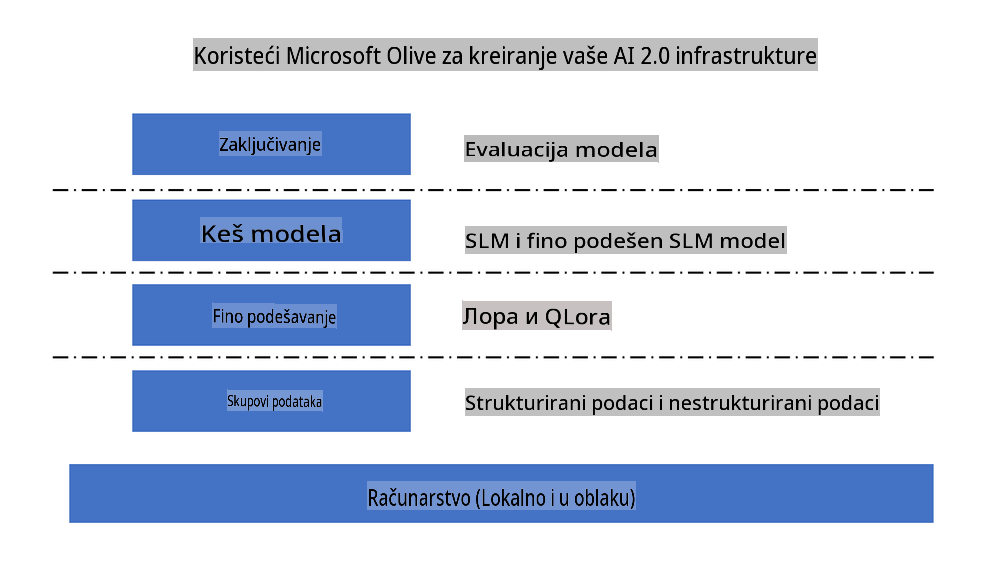
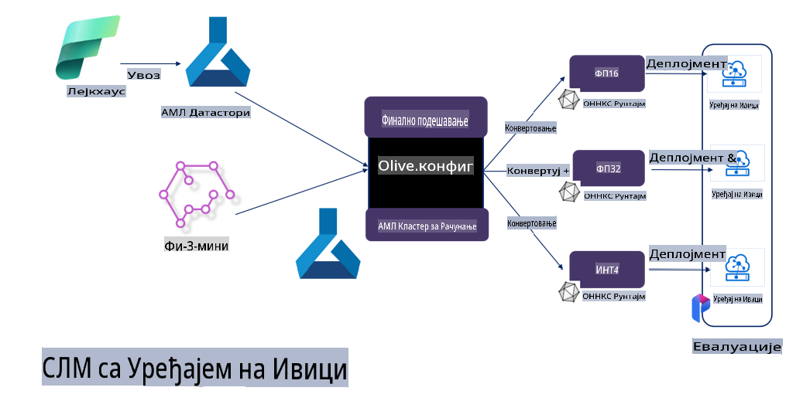

# **Fino podešavanje Phi-3 uz Microsoft Olive**

[Olive](https://github.com/microsoft/OLive?WT.mc_id=aiml-138114-kinfeylo) je jednostavan alat za optimizaciju modela uzimajući u obzir specifičnosti hardvera. Kombinuje vodeće tehnike u industriji u oblasti kompresije modela, optimizacije i kompajlacije.

Dizajniran je da pojednostavi proces optimizacije modela mašinskog učenja, osiguravajući njihovu maksimalnu efikasnost na određenim hardverskim arhitekturama.

Bez obzira da li radite na aplikacijama u oblaku ili na uređajima na ivici mreže, Olive vam omogućava da optimizujete modele jednostavno i efikasno.

## Ključne karakteristike:
- Olive objedinjuje i automatizuje tehnike optimizacije za željene hardverske ciljeve.
- Nema univerzalne tehnike optimizacije koja odgovara svim scenarijima, pa Olive omogućava proširivost tako što stručnjaci iz industrije mogu da dodaju svoje inovacije u optimizaciji.

## Smanjenje inženjerskog napora:
- Programeri često moraju da uče i koriste različite alate specifične za hardverske proizvođače kako bi pripremili i optimizovali obučene modele za implementaciju.
- Olive pojednostavljuje ovo iskustvo automatizacijom tehnika optimizacije za željeni hardver.

## Rešenje za potpunu optimizaciju spremno za upotrebu:

Kombinovanjem i podešavanjem integrisanih tehnika, Olive nudi jedinstveno rešenje za optimizaciju od početka do kraja.
Uzima u obzir ograničenja kao što su tačnost i kašnjenje dok optimizuje modele.

## Korišćenje Microsoft Olive za fino podešavanje

Microsoft Olive je vrlo jednostavan alat otvorenog koda za optimizaciju modela koji pokriva i fino podešavanje i referenciranje u oblasti generativne veštačke inteligencije. Potrebna je samo jednostavna konfiguracija, u kombinaciji sa korišćenjem malih jezičkih modela otvorenog koda i povezanih okruženja za izvršavanje (AzureML / lokalni GPU, CPU, DirectML). Na taj način možete završiti fino podešavanje ili referenciranje modela kroz automatsku optimizaciju i pronaći najbolji model za implementaciju u oblaku ili na uređajima na ivici mreže. Ovo omogućava preduzećima da izgrade sopstvene vertikalne modele za industriju, bilo lokalno ili u oblaku.



## Fino podešavanje Phi-3 uz Microsoft Olive 



## Primer koda i demonstracija za Phi-3 Olive
U ovom primeru koristićete Olive za:

- Fino podešavanje LoRA adaptera za klasifikaciju fraza na kategorije: Tuga, Radost, Strah, Iznenađenje.
- Spajanje težina adaptera sa osnovnim modelom.
- Optimizaciju i kvantizaciju modela u int4.

[Primer koda](../../code/03.Finetuning/olive-ort-example/README.md)

### Instalacija Microsoft Olive

Instalacija Microsoft Olive je vrlo jednostavna i može se izvršiti za CPU, GPU, DirectML i Azure ML.

```bash
pip install olive-ai
```

Ako želite da pokrenete ONNX model na CPU-u, možete koristiti:

```bash
pip install olive-ai[cpu]
```

Ako želite da pokrenete ONNX model na GPU-u, možete koristiti:

```python
pip install olive-ai[gpu]
```

Ako želite da koristite Azure ML, koristite:

```python
pip install git+https://github.com/microsoft/Olive#egg=olive-ai[azureml]
```

**Napomena**
Zahtevani operativni sistem: Ubuntu 20.04 / 22.04 

### **Config.json Microsoft Olive-a**

Nakon instalacije, možete konfigurirati različite postavke specifične za model kroz Config fajl, uključujući podatke, računanje, obuku, implementaciju i generisanje modela.

**1. Podaci**

Na Microsoft Olive-u, podržana je obuka na lokalnim i podacima u oblaku, što se može podesiti u podešavanjima.

*Podešavanje lokalnih podataka*

Možete jednostavno podesiti skup podataka koji treba da se koristi za fino podešavanje, obično u json formatu, i prilagoditi ga šablonu podataka. Ovo treba prilagoditi zahtevima modela (na primer, prilagoditi formatu koji zahteva Microsoft Phi-3-mini. Ako imate druge modele, molimo vas da se konsultujete sa zahtevima za fino podešavanje drugih modela).

```json

    "data_configs": [
        {
            "name": "dataset_default_train",
            "type": "HuggingfaceContainer",
            "load_dataset_config": {
                "params": {
                    "data_name": "json", 
                    "data_files":"dataset/dataset-classification.json",
                    "split": "train"
                }
            },
            "pre_process_data_config": {
                "params": {
                    "dataset_type": "corpus",
                    "text_cols": [
                            "phrase",
                            "tone"
                    ],
                    "text_template": "### Text: {phrase}\n### The tone is:\n{tone}",
                    "corpus_strategy": "join",
                    "source_max_len": 2048,
                    "pad_to_max_len": false,
                    "use_attention_mask": false
                }
            }
        }
    ],
```

**Podešavanje izvora podataka u oblaku**

Povezivanjem sa skladištem podataka Azure AI Studio/Azure Machine Learning Service možete povezati podatke u oblaku. Takođe možete izabrati različite izvore podataka kroz Microsoft Fabric i Azure Data kao podršku za fino podešavanje.

```json

    "data_configs": [
        {
            "name": "dataset_default_train",
            "type": "HuggingfaceContainer",
            "load_dataset_config": {
                "params": {
                    "data_name": "json", 
                    "data_files": {
                        "type": "azureml_datastore",
                        "config": {
                            "azureml_client": {
                                "subscription_id": "Your Azure Subscrition ID",
                                "resource_group": "Your Azure Resource Group",
                                "workspace_name": "Your Azure ML Workspaces name"
                            },
                            "datastore_name": "workspaceblobstore",
                            "relative_path": "Your train_data.json Azure ML Location"
                        }
                    },
                    "split": "train"
                }
            },
            "pre_process_data_config": {
                "params": {
                    "dataset_type": "corpus",
                    "text_cols": [
                            "Question",
                            "Best Answer"
                    ],
                    "text_template": "<|user|>\n{Question}<|end|>\n<|assistant|>\n{Best Answer}\n<|end|>",
                    "corpus_strategy": "join",
                    "source_max_len": 2048,
                    "pad_to_max_len": false,
                    "use_attention_mask": false
                }
            }
        }
    ],
    
```

**2. Konfiguracija računanja**

Ako želite da radite lokalno, možete direktno koristiti lokalne resurse podataka. Ako želite da koristite resurse Azure AI Studio/Azure Machine Learning Service, potrebno je da konfigurišete odgovarajuće Azure parametre, naziv računarske snage, itd.

```json

    "systems": {
        "aml": {
            "type": "AzureML",
            "config": {
                "accelerators": ["gpu"],
                "hf_token": true,
                "aml_compute": "Your Azure AI Studio / Azure Machine Learning Service Compute Name",
                "aml_docker_config": {
                    "base_image": "Your Azure AI Studio / Azure Machine Learning Service docker",
                    "conda_file_path": "conda.yaml"
                }
            }
        },
        "azure_arc": {
            "type": "AzureML",
            "config": {
                "accelerators": ["gpu"],
                "aml_compute": "Your Azure AI Studio / Azure Machine Learning Service Compute Name",
                "aml_docker_config": {
                    "base_image": "Your Azure AI Studio / Azure Machine Learning Service docker",
                    "conda_file_path": "conda.yaml"
                }
            }
        }
    },
```

***Napomena***

Pošto se pokreće kroz kontejner na Azure AI Studio/Azure Machine Learning Service, potrebno je konfigurisati odgovarajuće okruženje. Ovo se podešava u conda.yaml okruženju.

```yaml

name: project_environment
channels:
  - defaults
dependencies:
  - python=3.8.13
  - pip=22.3.1
  - pip:
      - einops
      - accelerate
      - azure-keyvault-secrets
      - azure-identity
      - bitsandbytes
      - datasets
      - huggingface_hub
      - peft
      - scipy
      - sentencepiece
      - torch>=2.2.0
      - transformers
      - git+https://github.com/microsoft/Olive@jiapli/mlflow_loading_fix#egg=olive-ai[gpu]
      - --extra-index-url https://aiinfra.pkgs.visualstudio.com/PublicPackages/_packaging/ORT-Nightly/pypi/simple/ 
      - ort-nightly-gpu==1.18.0.dev20240307004
      - --extra-index-url https://aiinfra.pkgs.visualstudio.com/PublicPackages/_packaging/onnxruntime-genai/pypi/simple/
      - onnxruntime-genai-cuda

    

```

**3. Izbor SLM-a**

Model možete koristiti direktno sa Hugging Face-a ili ga možete kombinovati sa Model Catalog-om Azure AI Studio/Azure Machine Learning za izbor modela koji želite da koristite. U donjem primeru koda koristićemo Microsoft Phi-3-mini kao primer.

Ako imate model lokalno, možete koristiti ovu metodu:

```json

    "input_model":{
        "type": "PyTorchModel",
        "config": {
            "hf_config": {
                "model_name": "model-cache/microsoft/phi-3-mini",
                "task": "text-generation",
                "model_loading_args": {
                    "trust_remote_code": true
                }
            }
        }
    },
```

Ako želite da koristite model iz Azure AI Studio/Azure Machine Learning Service, možete koristiti ovu metodu:

```json

    "input_model":{
        "type": "PyTorchModel",
        "config": {
            "model_path": {
                "type": "azureml_registry_model",
                "config": {
                    "name": "microsoft/Phi-3-mini-4k-instruct",
                    "registry_name": "azureml-msr",
                    "version": "11"
                }
            },
             "model_file_format": "PyTorch.MLflow",
             "hf_config": {
                "model_name": "microsoft/Phi-3-mini-4k-instruct",
                "task": "text-generation",
                "from_pretrained_args": {
                    "trust_remote_code": true
                }
            }
        }
    },
```

**Napomena:**
Moramo se integrisati sa Azure AI Studio/Azure Machine Learning Service, pa prilikom postavljanja modela obratite pažnju na verziju i povezano imenovanje.

Svi modeli na Azure moraju biti postavljeni na PyTorch.MLflow.

Potrebno je da imate Hugging Face nalog i povežete ključ sa Key vrednošću Azure AI Studio/Azure Machine Learning.

**4. Algoritam**

Microsoft Olive veoma dobro integriše Lora i QLora algoritme za fino podešavanje. Sve što treba da konfigurišete su relevantni parametri. Ovde uzimam QLora kao primer.

```json
        "lora": {
            "type": "LoRA",
            "config": {
                "target_modules": [
                    "o_proj",
                    "qkv_proj"
                ],
                "double_quant": true,
                "lora_r": 64,
                "lora_alpha": 64,
                "lora_dropout": 0.1,
                "train_data_config": "dataset_default_train",
                "eval_dataset_size": 0.3,
                "training_args": {
                    "seed": 0,
                    "data_seed": 42,
                    "per_device_train_batch_size": 1,
                    "per_device_eval_batch_size": 1,
                    "gradient_accumulation_steps": 4,
                    "gradient_checkpointing": false,
                    "learning_rate": 0.0001,
                    "num_train_epochs": 3,
                    "max_steps": 10,
                    "logging_steps": 10,
                    "evaluation_strategy": "steps",
                    "eval_steps": 187,
                    "group_by_length": true,
                    "adam_beta2": 0.999,
                    "max_grad_norm": 0.3
                }
            }
        },
```

Ako želite konverziju kvantizacije, glavna grana Microsoft Olive-a već podržava metodu onnxruntime-genai. Možete je podesiti prema svojim potrebama:

1. Spojite težine adaptera sa osnovnim modelom.
2. Konvertujte model u onnx model sa potrebnom preciznošću pomoću ModelBuilder-a.

Na primer, konverzija u kvantizovani INT4:

```json

        "merge_adapter_weights": {
            "type": "MergeAdapterWeights"
        },
        "builder": {
            "type": "ModelBuilder",
            "config": {
                "precision": "int4"
            }
        }
```

**Napomena** 
- Ako koristite QLoRA, konverzija kvantizacije uz ONNXRuntime-genai trenutno nije podržana.

- Ovde treba naglasiti da možete podesiti gore navedene korake prema svojim potrebama. Nije potrebno kompletno konfigurisati sve ove korake. U zavisnosti od vaših potreba, možete direktno koristiti korake algoritma bez finog podešavanja. Na kraju, potrebno je konfigurisati odgovarajuće engine.

```json

    "engine": {
        "log_severity_level": 0,
        "host": "aml",
        "target": "aml",
        "search_strategy": false,
        "execution_providers": ["CUDAExecutionProvider"],
        "cache_dir": "../model-cache/models/phi3-finetuned/cache",
        "output_dir" : "../model-cache/models/phi3-finetuned"
    }
```

**5. Završeno fino podešavanje**

Na komandnoj liniji, izvršite u direktorijumu olive-config.json:

```bash
olive run --config olive-config.json  
```

**Одрицање од одговорности**:  
Овај документ је преведен коришћењем услуга машинског превођења базираног на вештачкој интелигенцији. Иако тежимо прецизности, имајте у виду да аутоматизовани преводи могу садржати грешке или нетачности. Оригинални документ на његовом изворном језику треба сматрати ауторитативним извором. За критичне информације препоручује се професионални превод од стране људи. Не сносимо одговорност за било каква погрешна тумачења или неспоразуме који произилазе из коришћења овог превода.