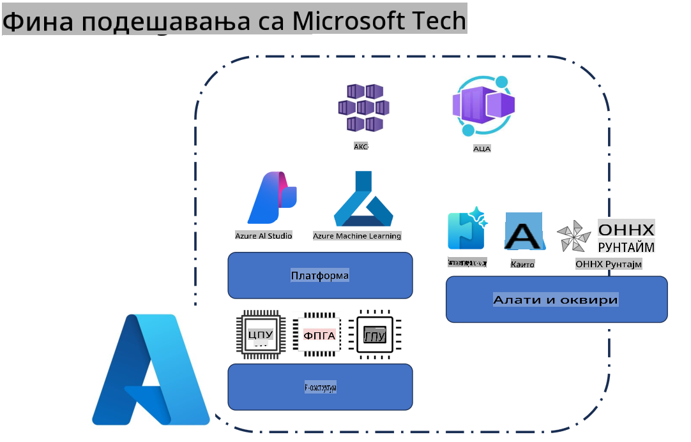
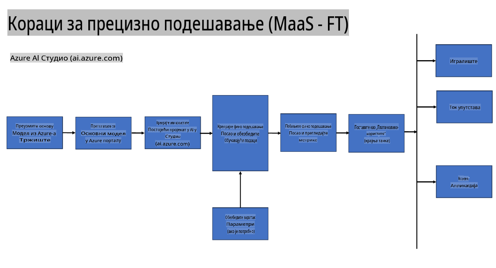
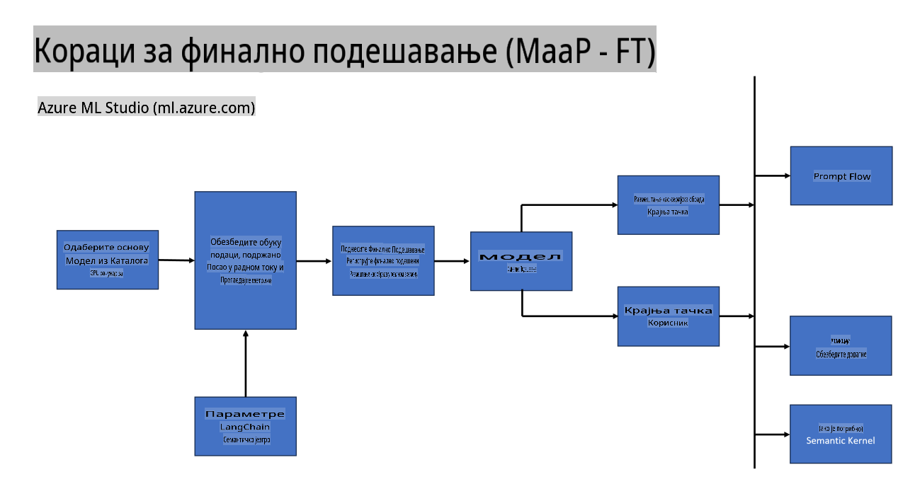
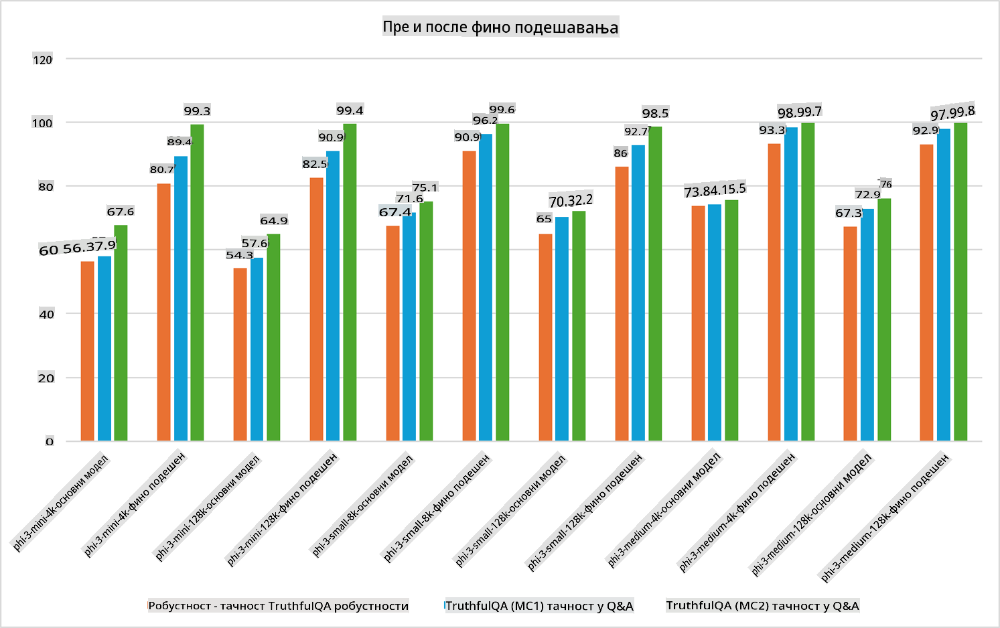

## Scenariji za fino podešavanje

**Platforma** Ovo uključuje razne tehnologije kao što su Azure AI Foundry, Azure Machine Learning, AI Tools, Kaito i ONNX Runtime.

**Infrastruktura** Ovo uključuje CPU i FPGA, koji su ključni za proces finog podešavanja. Evo ikona za svaku od ovih tehnologija.

**Alati i Okviri** Ovo uključuje ONNX Runtime i ONNX Runtime. Evo ikona za svaku od ovih tehnologija.  
[Umetnite ikone za ONNX Runtime i ONNX Runtime]

Proces finog podešavanja uz Microsoft tehnologije uključuje različite komponente i alate. Razumevanjem i korišćenjem ovih tehnologija možemo efikasno prilagoditi naše aplikacije i kreirati bolje rešenja.

## Model kao usluga

Fino podešavanje modela koristeći hostovano fino podešavanje, bez potrebe za kreiranjem i upravljanjem infrastrukturom.

Serverless fino podešavanje je dostupno za Phi-3-mini i Phi-3-medium modele, omogućavajući programerima da brzo i lako prilagode modele za cloud i edge scenarije bez potrebe za organizacijom infrastrukture. Takođe smo objavili da je Phi-3-small sada dostupan kroz našu ponudu Model-as-a-Service, tako da programeri mogu brzo i lako započeti razvoj AI-a bez upravljanja osnovnom infrastrukturom.

## Model kao platforma

Korisnici upravljaju sopstvenom infrastrukturom kako bi fino podesili svoje modele.

[Primer finog podešavanja](https://github.com/Azure/azureml-examples/blob/main/sdk/python/foundation-models/system/finetune/chat-completion/chat-completion.ipynb)

## Scenariji za fino podešavanje

| | | | | | | |
|-|-|-|-|-|-|-|
|Scenario|LoRA|QLoRA|PEFT|DeepSpeed|ZeRO|DORA|
|Prilagođavanje unapred obučenih LLM-ova specifičnim zadacima ili domenima|Da|Da|Da|Da|Da|Da|
|Fino podešavanje za NLP zadatke kao što su klasifikacija teksta, prepoznavanje imenovanih entiteta i mašinsko prevođenje|Da|Da|Da|Da|Da|Da|
|Fino podešavanje za QA zadatke|Da|Da|Da|Da|Da|Da|
|Fino podešavanje za generisanje odgovora sličnih ljudskim u chatbotovima|Da|Da|Da|Da|Da|Da|
|Fino podešavanje za generisanje muzike, umetnosti ili drugih oblika kreativnosti|Da|Da|Da|Da|Da|Da|
|Smanjenje računarskih i finansijskih troškova|Da|Da|Ne|Da|Da|Ne|
|Smanjenje upotrebe memorije|Ne|Da|Ne|Da|Da|Da|
|Korišćenje manjeg broja parametara za efikasno fino podešavanje|Ne|Da|Da|Ne|Ne|Da|
|Memorijski efikasan oblik paralelizma podataka koji omogućava pristup ukupnoj GPU memoriji svih dostupnih GPU uređaja|Ne|Ne|Ne|Da|Da|Da|

## Primeri performansi finog podešavanja

**Одрицање од одговорности**:  
Овај документ је преведен коришћењем машинских AI услуга за превођење. Иако се трудимо да обезбедимо тачност, молимо вас да имате у виду да аутоматски преводи могу садржати грешке или нетачности. Оригинални документ на његовом изворном језику треба сматрати ауторитативним извором. За критичне информације препоручује се професионални људски превод. Не сносимо одговорност за било каква погрешна тумачења или неразумевања која могу произаћи из употребе овог превода.