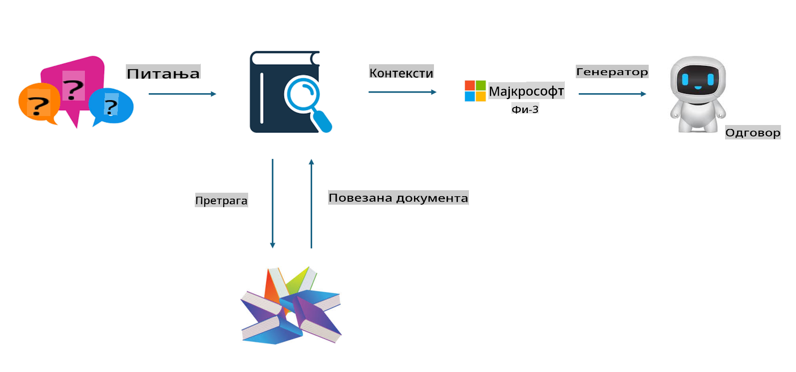

## Fajntjuning naspram RAG-a

## Generisanje uz pomoć pretrage (Retrieval Augmented Generation)

RAG je kombinacija pretrage podataka i generisanja teksta. Struktuirani i nestruktuirani podaci preduzeća čuvaju se u vektorskoj bazi podataka. Kada se traži relevantan sadržaj, pronalazi se odgovarajući sažetak i sadržaj kako bi se formirao kontekst, a zatim se kombinuju sposobnosti LLM/SLM za generisanje teksta.

## Proces RAG-a

## Fajntjuning
Fajntjuning se zasniva na unapređenju određenog modela. Nije potrebno početi od algoritma modela, ali je potrebno kontinuirano akumulirati podatke. Ako želite precizniju terminologiju i izraze u industrijskim primenama, fajntjuning je bolji izbor. Međutim, ako se vaši podaci često menjaju, fajntjuning može postati komplikovan.

## Kako odabrati
Ako naš odgovor zahteva uvođenje spoljašnjih podataka, RAG je najbolji izbor.

Ako je potrebno izvesti stabilno i precizno industrijsko znanje, fajntjuning će biti dobar izbor. RAG daje prioritet pronalaženju relevantnog sadržaja, ali možda neće uvek precizno obuhvatiti specijalizovane nijanse.

Fajntjuning zahteva visokokvalitetan skup podataka, i ako se radi samo o malom obimu podataka, neće doneti značajnu razliku. RAG je fleksibilniji.  
Fajntjuning je poput crne kutije, metafizike, i teško je razumeti unutrašnji mehanizam. Ali RAG olakšava pronalaženje izvora podataka, čime se efikasno koriguju halucinacije ili greške u sadržaju i pruža bolja transparentnost.

**Одрицање од одговорности**:  
Овај документ је преведен коришћењем услуга машинског превођења заснованих на вештачкој интелигенцији. Иако настојимо да обезбедимо тачност, имајте у виду да аутоматски преводи могу садржати грешке или нетачности. Оригинални документ на изворном језику треба сматрати меродавним извором. За критичне информације препоручује се професионални превод од стране људи. Не сносимо одговорност за било каква неспоразума или погрешна тумачења која могу настати коришћењем овог превода.