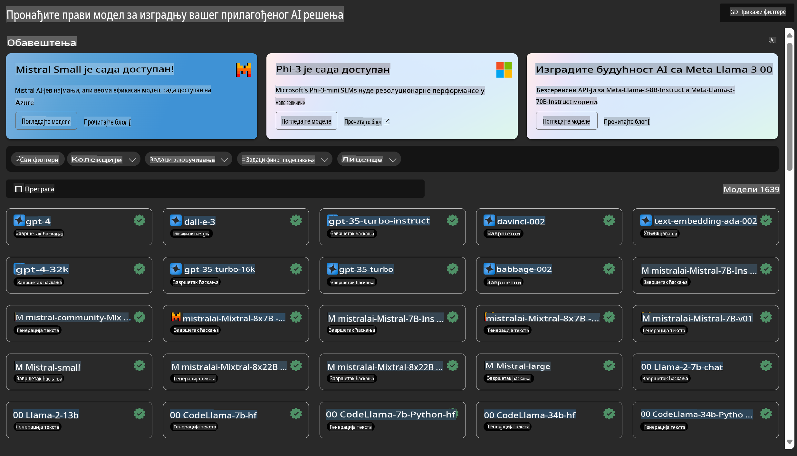

# **Uvođenje Azure Machine Learning servisa**

[Azure Machine Learning](https://ml.azure.com?WT.mc_id=aiml-138114-kinfeylo) je cloud servis za ubrzavanje i upravljanje životnim ciklusom projekata mašinskog učenja (ML).

ML profesionalci, naučnici za podatke i inženjeri mogu ga koristiti u svojim svakodnevnim radnim tokovima za:

- Treniranje i implementaciju modela.  
Upravljanje operacijama mašinskog učenja (MLOps).  
- Možete kreirati model u Azure Machine Learning-u ili koristiti model napravljen na nekoj od open-source platformi, kao što su PyTorch, TensorFlow ili scikit-learn.  
- MLOps alati pomažu vam da pratite, ponovo trenirate i ponovo implementirate modele.  

## Za koga je Azure Machine Learning?

**Naučnici za podatke i ML inženjeri**  

Mogu koristiti alate za ubrzavanje i automatizaciju svojih svakodnevnih radnih tokova.  
Azure ML nudi funkcionalnosti za pravednost, objašnjivost, praćenje i mogućnost revizije.  

**Razvojni programeri aplikacija**  

Mogu besprekorno integrisati modele u aplikacije ili servise.  

**Razvojni programeri platformi**  

Imaju pristup robusnom skupu alata podržanih izdržljivim Azure Resource Manager API-jevima.  
Ovi alati omogućavaju kreiranje naprednih ML alata.  

**Preduzeća**  

Korišćenjem Microsoft Azure clouda, preduzeća imaju koristi od poznate sigurnosti i kontrole pristupa zasnovane na ulogama.  
Postavite projekte kako biste kontrolisali pristup zaštićenim podacima i specifičnim operacijama.  

## Produktivnost za sve članove tima  

ML projekti često zahtevaju tim sa raznovrsnim veštinama za izgradnju i održavanje.  

Azure ML nudi alate koji vam omogućavaju da:  
- Sarađujete sa svojim timom putem zajedničkih beležnica, računarskih resursa, serverless računanja, podataka i okruženja.  
- Razvijate modele sa pravednošću, objašnjivošću, praćenjem i mogućnošću revizije kako biste ispunili zahteve za praćenje porekla i reviziju.  
- Brzo i lako implementirate ML modele u velikim razmerama i efikasno ih upravljate i nadgledate pomoću MLOps-a.  
- Pokrećete radne tokove mašinskog učenja bilo gde uz ugrađenu upravu, sigurnost i usklađenost.  

## Alati kompatibilni sa različitim platformama  

Svaki član ML tima može koristiti svoje omiljene alate za obavljanje posla.  
Bilo da pokrećete brze eksperimente, fino podešavate hiperparametre, gradite pipeline-ove ili upravljate inferencijama, možete koristiti poznata sučelja, uključujući:  
- Azure Machine Learning Studio  
- Python SDK (v2)  
- Azure CLI (v2)  
- Azure Resource Manager REST API-je  

Kako usavršavate modele i sarađujete tokom razvojnog ciklusa, možete deliti i pronalaziti resurse, podatke i metrike unutar Azure Machine Learning Studio korisničkog interfejsa.  

## **LLM/SLM u Azure ML-u**  

Azure ML je dodao mnoge funkcije vezane za LLM/SLM, kombinujući LLMOps i SLMOps kako bi stvorio generativnu platformu veštačke inteligencije za preduzeća.  

### **Katalog modela**  

Korisnici u preduzećima mogu implementirati različite modele u skladu sa različitim poslovnim scenarijima putem Kataloga modela i pružiti usluge kao Model as Service za pristup razvojnim programerima ili korisnicima preduzeća.  

  

Katalog modela u Azure Machine Learning Studio je centralno mesto za otkrivanje i korišćenje širokog spektra modela koji vam omogućavaju izgradnju aplikacija baziranih na generativnoj veštačkoj inteligenciji. Katalog modela sadrži stotine modela različitih provajdera, kao što su Azure OpenAI Service, Mistral, Meta, Cohere, Nvidia, Hugging Face, uključujući i modele koje je obučio Microsoft. Modeli provajdera koji nisu Microsoft definišu se kao proizvodi koji nisu Microsoftovi, prema Microsoftovim uslovima korišćenja proizvoda, i podložni su uslovima koji dolaze uz model.  

### **Job Pipeline**  

Osnova pipeline-a mašinskog učenja je da podeli kompletan zadatak mašinskog učenja na višekorake radne tokove. Svaki korak je upravljiva komponenta koja se može pojedinačno razvijati, optimizovati, konfigurisati i automatizovati. Koraci su povezani putem jasno definisanih interfejsa. Servis pipeline-a Azure Machine Learning automatski orkestrira sve zavisnosti između koraka pipeline-a.  

Prilikom fino podešavanja SLM / LLM, možemo upravljati našim podacima, procesima obuke i generisanja putem pipeline-a.  

  

### **Prompt flow**  

Prednosti korišćenja Azure Machine Learning prompt flow-a  
Azure Machine Learning prompt flow nudi niz prednosti koje korisnicima pomažu da pređu sa ideje na eksperimentisanje, a zatim na proizvodno spremne aplikacije bazirane na LLM-u:  

**Agilnost u inženjeringu prompta**  

Interaktivno iskustvo autorstva: Azure Machine Learning prompt flow pruža vizuelni prikaz strukture toka, omogućavajući korisnicima da lako razumeju i navigiraju kroz svoje projekte. Takođe nudi iskustvo kodiranja slično beležnicama za efikasan razvoj i otklanjanje grešaka u tokovima.  
Varijante za podešavanje prompta: Korisnici mogu kreirati i upoređivati više varijanti prompta, olakšavajući iterativni proces usavršavanja.  

Evaluacija: Ugrađeni tokovi evaluacije omogućavaju korisnicima da procene kvalitet i efikasnost svojih prompta i tokova.  

Sveobuhodni resursi: Azure Machine Learning prompt flow uključuje biblioteku ugrađenih alata, primera i šablona koji služe kao polazna tačka za razvoj, inspirišući kreativnost i ubrzavajući proces.  

**Spremnost za preduzeća za aplikacije bazirane na LLM-u**  

Saradnja: Azure Machine Learning prompt flow podržava timsku saradnju, omogućavajući više korisnika da zajedno rade na projektima inženjeringa prompta, dele znanje i održavaju kontrolu verzija.  

Sve-u-jednom platforma: Azure Machine Learning prompt flow pojednostavljuje ceo proces inženjeringa prompta, od razvoja i evaluacije do implementacije i praćenja. Korisnici mogu lako implementirati svoje tokove kao Azure Machine Learning endpoint-e i pratiti njihovu performansu u realnom vremenu, osiguravajući optimalno funkcionisanje i kontinuirano unapređenje.  

Azure Machine Learning rešenja spremna za preduzeća: Prompt flow koristi robusna rešenja Azure Machine Learning-a spremna za preduzeća, pružajući sigurnu, skalabilnu i pouzdanu osnovu za razvoj, eksperimentisanje i implementaciju tokova.  

Sa Azure Machine Learning prompt flow-om, korisnici mogu osloboditi svoju agilnost u inženjeringu prompta, efikasno sarađivati i koristiti rešenja spremna za preduzeća za uspešan razvoj i implementaciju aplikacija baziranih na LLM-u.  

Kombinujući računarsku snagu, podatke i različite komponente Azure ML-a, razvojni programeri u preduzećima mogu lako izgraditi sopstvene aplikacije veštačke inteligencije.  

**Одрицање од одговорности**:  
Овај документ је преведен коришћењем услуга машинског превођења заснованих на вештачкој интелигенцији. Иако настојимо да обезбедимо тачност, молимо вас да имате у виду да аутоматизовани преводи могу садржати грешке или нетачности. Оригинални документ на изворном језику треба сматрати ауторитативним извором. За критичне информације препоручује се професионални превод од стране људи. Не преузимамо одговорност за било каква погрешна тумачења или неспоразуме који могу произаћи из употребе овог превода.