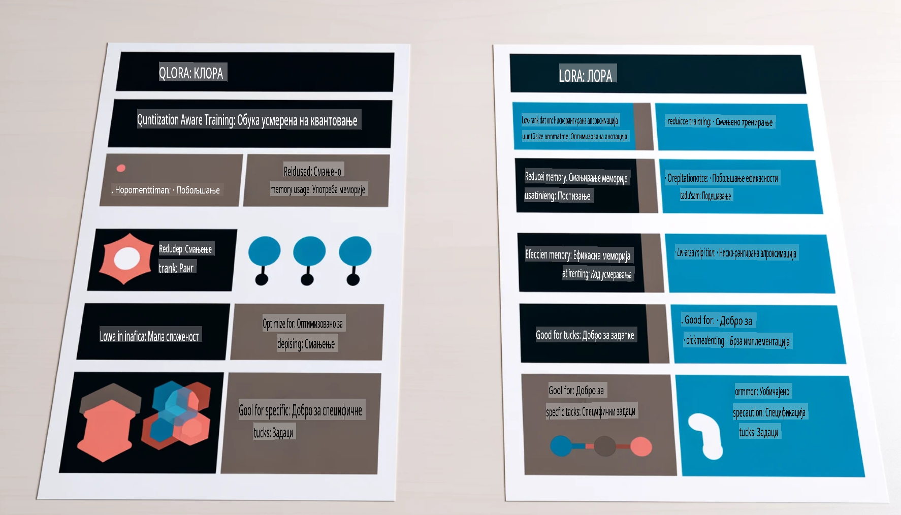

# **Neka Phi-3 postane stručnjak u industriji**

Da biste uveli model Phi-3 u industriju, potrebno je dodati industrijske poslovne podatke u model Phi-3. Imamo dve različite opcije: prva je RAG (Retrieval Augmented Generation), a druga je Fine Tuning.

## **RAG naspram Fine-Tuning**

### **Retrieval Augmented Generation**

RAG je kombinacija preuzimanja podataka i generisanja teksta. Struktuisani i nestruktuisani podaci preduzeća se čuvaju u vektorskoj bazi podataka. Prilikom pretrage relevantnog sadržaja pronalaze se sažeci i sadržaji koji formiraju kontekst, a zatim se kombinuju sa sposobnošću LLM/SLM za generisanje teksta.

### **Fine-tuning**

Fine-tuning se zasniva na unapređenju određenog modela. Nije potrebno početi od algoritma modela, ali je potrebno kontinuirano akumulirati podatke. Ako želite precizniju terminologiju i izraze u industrijskim aplikacijama, fine-tuning je bolji izbor. Međutim, ako se vaši podaci često menjaju, fine-tuning može postati komplikovan.

### **Kako izabrati**

1. Ako naš odgovor zahteva uvođenje eksternih podataka, RAG je najbolji izbor.

2. Ako je potrebno proizvesti stabilno i precizno industrijsko znanje, fine-tuning će biti dobar izbor. RAG daje prioritet pronalaženju relevantnog sadržaja, ali možda neće uvek pogoditi specifične nijanse.

3. Fine-tuning zahteva visokokvalitetan skup podataka, a ako je reč o malom obimu podataka, neće napraviti veliku razliku. RAG je fleksibilniji.

4. Fine-tuning je poput "crne kutije", teško je razumeti njegov unutrašnji mehanizam. Ali RAG omogućava lakše pronalaženje izvora podataka, čime se efikasno smanjuju halucinacije ili greške u sadržaju i pruža veća transparentnost.

### **Scenariji**

1. Vertikalne industrije koje zahtevaju specifičnu profesionalnu terminologiju i izraze – ***Fine-tuning*** je najbolji izbor.

2. QA sistem koji uključuje sintezu različitih tačaka znanja – ***RAG*** je najbolji izbor.

3. Kombinacija automatizovanog poslovnog toka – ***RAG + Fine-tuning*** je najbolji izbor.

## **Kako koristiti RAG**

Vektorska baza podataka je kolekcija podataka sačuvanih u matematičkom obliku. Vektorske baze podataka olakšavaju modelima mašinskog učenja da zapamte prethodne unose, omogućavajući primenu mašinskog učenja u slučajevima kao što su pretraga, preporuke i generisanje teksta. Podaci se mogu identifikovati na osnovu metrika sličnosti, a ne tačnih podudaranja, što omogućava modelima da razumeju kontekst podataka.

Vektorska baza podataka je ključ za realizaciju RAG-a. Podatke možemo konvertovati u vektorsko skladište putem vektorskih modela kao što su text-embedding-3, jina-ai-embedding, itd.

Saznajte više o kreiranju RAG aplikacije [https://github.com/microsoft/Phi-3CookBook](https://github.com/microsoft/Phi-3CookBook?WT.mc_id=aiml-138114-kinfeylo) 

## **Kako koristiti Fine-tuning**

Najčešće korišćeni algoritmi u Fine-tuningu su Lora i QLora. Kako odabrati?
- [Saznajte više uz ovaj uzorak beležnice](../../../../code/04.Finetuning/Phi_3_Inference_Finetuning.ipynb)
- [Primer Python FineTuning uzorka](../../../../code/04.Finetuning/FineTrainingScript.py)

### **Lora i QLora**

LoRA (Low-Rank Adaptation) i QLoRA (Quantized Low-Rank Adaptation) su tehnike koje se koriste za fino podešavanje velikih jezičkih modela (LLMs) pomoću PEFT (Parameter Efficient Fine Tuning). PEFT tehnike su dizajnirane za efikasniju obuku modela u poređenju sa tradicionalnim metodama.  
LoRA je samostalna tehnika za fino podešavanje koja smanjuje memorijski otisak primenom aproksimacije niskog ranga na matricu ažuriranja težina. Nudi brzo vreme obuke i održava performanse blizu tradicionalnih metoda finog podešavanja.  

QLoRA je proširena verzija LoRA koja uključuje tehnike kvantizacije kako bi dodatno smanjila upotrebu memorije. QLoRA kvantizuje preciznost parametara težina u prethodno obučenom LLM na 4-bitnu preciznost, što je efikasnije u pogledu memorije od LoRA. Međutim, obuka sa QLoRA je oko 30% sporija od obuke sa LoRA zbog dodatnih koraka kvantizacije i dekvantizacije.  

QLoRA koristi LoRA kao dodatak za ispravljanje grešaka uvedenih tokom kvantizacije. QLoRA omogućava fino podešavanje masivnih modela sa milijardama parametara na relativno malim, lako dostupnim GPU-ovima. Na primer, QLoRA može fino podesiti model sa 70 milijardi parametara koji zahteva 36 GPU-ova koristeći samo 2.

**Одрицање од одговорности**:  
Овај документ је преведен коришћењем услуга машинског превођења заснованих на вештачкој интелигенцији. Иако настојимо да обезбедимо тачност, молимо вас да будете свесни да аутоматски преводи могу садржати грешке или нетачности. Оригинални документ на изворном језику треба сматрати меродавним. За критичне информације препоручује се професионални превод од стране људи. Не преузимамо одговорност за било каква погрешна тумачења или неспоразуме који могу произаћи из употребе овог превода.