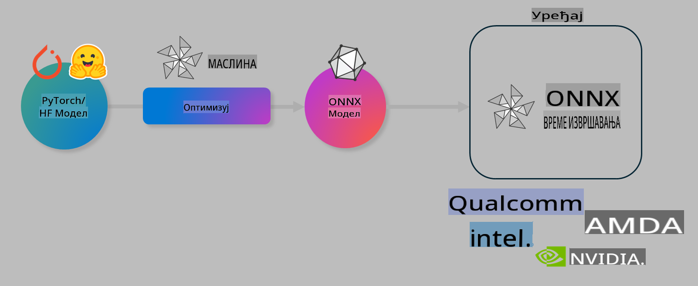

# Lab. Optimizujte AI modele za inferenciju na uređaju

## Uvod

> [!IMPORTANT]
> Ova laboratorija zahteva **Nvidia A10 ili A100 GPU** sa odgovarajućim drajverima i instaliranim CUDA toolkit-om (verzija 12+).

> [!NOTE]
> Ovo je laboratorija od **35 minuta** koja će vam pružiti praktičan uvod u osnovne koncepte optimizacije modela za inferenciju na uređaju koristeći OLIVE.

## Ciljevi učenja

Do kraja ove laboratorije, moći ćete da koristite OLIVE za:

- Kvantizaciju AI modela koristeći AWQ metodu kvantizacije.
- Fino podešavanje AI modela za specifičan zadatak.
- Generisanje LoRA adaptera (fino podešen model) za efikasnu inferenciju na uređaju koristeći ONNX Runtime.

### Šta je Olive

Olive (*O*NNX *live*) je alat za optimizaciju modela sa pratećim CLI-jem koji omogućava isporuku modela za ONNX runtime +++https://onnxruntime.ai+++ sa visokim kvalitetom i performansama.



Ulaz za Olive je obično PyTorch ili Hugging Face model, dok je izlaz optimizovan ONNX model koji se izvršava na uređaju (cilj za implementaciju) koristeći ONNX runtime. Olive optimizuje model za AI akcelerator ciljnog uređaja (NPU, GPU, CPU) koji obezbeđuje proizvođač hardvera kao što su Qualcomm, AMD, Nvidia ili Intel.

Olive izvršava *workflow*, koji je uređeni niz pojedinačnih zadataka optimizacije modela nazvanih *passes* - primeri uključuju: kompresiju modela, hvatanje grafa, kvantizaciju, optimizaciju grafa. Svaki pass ima skup parametara koji se mogu podešavati kako bi se postigli najbolji metrički rezultati, poput tačnosti i latencije, koje procenjuje odgovarajući evaluator. Olive koristi strategiju pretrage koja primenjuje algoritam pretrage za automatsko podešavanje svakog passa pojedinačno ili seta pass-ova zajedno.

#### Prednosti Olive-a

- **Smanjuje frustraciju i vreme** provedeno na ručnim eksperimentima pokušaja i greške sa različitim tehnikama optimizacije grafa, kompresije i kvantizacije. Definišite svoje zahteve za kvalitet i performanse i dozvolite Olive-u da automatski pronađe najbolji model za vas.
- **40+ ugrađenih komponenti za optimizaciju modela** koje pokrivaju najsavremenije tehnike u kvantizaciji, kompresiji, optimizaciji grafa i fino podešavanju.
- **Jednostavan CLI** za uobičajene zadatke optimizacije modela. Na primer, olive quantize, olive auto-opt, olive finetune.
- Ugrađeno pakovanje i implementacija modela.
- Podržava generisanje modela za **Multi LoRA serving**.
- Konstrukcija workflow-a koristeći YAML/JSON za orkestraciju zadataka optimizacije i implementacije modela.
- **Hugging Face** i **Azure AI** integracija.
- Ugrađeni **mehanizam keširanja** za **smanjenje troškova**.

## Uputstva za laboratoriju
> [!NOTE]
> Molimo vas da osigurate da ste konfigurisali svoj Azure AI Hub i projekat, kao i svoj A100 računar prema uputstvima iz Laboratorije 1.

### Korak 0: Povezivanje sa Azure AI Compute

Povezaćete se sa Azure AI računarom koristeći daljinsku funkciju u **VS Code-u.**

1. Otvorite svoju **VS Code** desktop aplikaciju:
1. Otvorite **command palette** koristeći **Shift+Ctrl+P**.
1. U command palette-u potražite **AzureML - remote: Connect to compute instance in New Window**.
1. Pratite uputstva na ekranu da biste se povezali sa računarom. Ovo će uključivati odabir vaše Azure pretplate, resursne grupe, projekta i imena računara koje ste postavili u Laboratoriji 1.
1. Kada se povežete sa svojim Azure ML računarom, ovo će biti prikazano u **donjem levom uglu Visual Code-a** `><Azure ML: Compute Name`

### Korak 1: Klonirajte ovaj repo

U VS Code-u, možete otvoriti novi terminal koristeći **Ctrl+J** i klonirati ovaj repo:

U terminalu biste trebali videti prompt

```
azureuser@computername:~/cloudfiles/code$ 
```
Klonirajte rešenje

```bash
cd ~/localfiles
git clone https://github.com/microsoft/phi-3cookbook.git
```

### Korak 2: Otvorite folder u VS Code-u

Da biste otvorili relevantan folder u VS Code-u, izvršite sledeću komandu u terminalu, koja će otvoriti novi prozor:

```bash
code phi-3cookbook/code/04.Finetuning/Olive-lab
```

Alternativno, možete otvoriti folder tako što ćete odabrati **File** > **Open Folder**.

### Korak 3: Zavisnosti

Otvorite prozor terminala u VS Code-u na svom Azure AI računarskom instanci (savjet: **Ctrl+J**) i izvršite sledeće komande za instalaciju zavisnosti:

```bash
conda create -n olive-ai python=3.11 -y
conda activate olive-ai
pip install -r requirements.txt
az extension remove -n azure-cli-ml
az extension add -n ml
```

> [!NOTE]
> Instalacija svih zavisnosti trajaće ~5 minuta.

U ovoj laboratoriji ćete preuzeti i otpremiti modele u Azure AI katalog modela. Da biste pristupili katalogu modela, moraćete da se prijavite na Azure koristeći:

```bash
az login
```

> [!NOTE]
> Tokom prijavljivanja od vas će se tražiti da odaberete svoju pretplatu. Uverite se da ste postavili pretplatu na onu koja je obezbeđena za ovu laboratoriju.

### Korak 4: Izvršite Olive komande

Otvorite prozor terminala u VS Code-u na svom Azure AI računarskom instanci (savjet: **Ctrl+J**) i uverite se da je aktivirano `olive-ai` conda okruženje:

```bash
conda activate olive-ai
```

Zatim, izvršite sledeće Olive komande u komandnoj liniji.

1. **Pregledajte podatke:** U ovom primeru, fino podešavate Phi-3.5-Mini model kako bi bio specijalizovan za odgovaranje na pitanja vezana za putovanja. Kod ispod prikazuje prvih nekoliko zapisa u dataset-u, koji su u JSON lines formatu:
   
    ```bash
    head data/data_sample_travel.jsonl
    ```
1. **Kvantizujte model:** Pre nego što trenirate model, prvo ga kvantizujte sledećom komandom koja koristi tehniku pod nazivom Active Aware Quantization (AWQ) +++https://arxiv.org/abs/2306.00978+++. AWQ kvantizuje težine modela uzimajući u obzir aktivacije proizvedene tokom inferencije. Ovo znači da proces kvantizacije uzima u obzir stvarnu distribuciju podataka u aktivacijama, što dovodi do boljeg očuvanja tačnosti modela u poređenju sa tradicionalnim metodama kvantizacije težina.
    
    ```bash
    olive quantize \
       --model_name_or_path microsoft/Phi-3.5-mini-instruct \
       --trust_remote_code \
       --algorithm awq \
       --output_path models/phi/awq \
       --log_level 1
    ```
    
    Potrebno je **~8 minuta** da se završi AWQ kvantizacija, koja će **smanjiti veličinu modela sa ~7.5GB na ~2.5GB**.
   
   U ovoj laboratoriji, prikazujemo vam kako da unesete modele iz Hugging Face-a (na primer: `microsoft/Phi-3.5-mini-instruct`). However, Olive also allows you to input models from the Azure AI catalog by updating the `model_name_or_path` argument to an Azure AI asset ID (for example:  `azureml://registries/azureml/models/Phi-3.5-mini-instruct/versions/4`). 

1. **Train the model:** Next, the `olive finetune` komanda fino podešava kvantizovani model. Kvantizovanje modela *pre* fino podešavanja umesto nakon toga daje bolju tačnost jer proces fino podešavanja povrati deo gubitka iz kvantizacije.
    
    ```bash
    olive finetune \
        --method lora \
        --model_name_or_path models/phi/awq \
        --data_files "data/data_sample_travel.jsonl" \
        --data_name "json" \
        --text_template "<|user|>\n{prompt}<|end|>\n<|assistant|>\n{response}<|end|>" \
        --max_steps 100 \
        --output_path ./models/phi/ft \
        --log_level 1
    ```
    
    Potrebno je **~6 minuta** da se završi fino podešavanje (sa 100 koraka).

1. **Optimizujte:** Kada je model treniran, sada ga optimizujete koristeći Olive-ovu `auto-opt` command, which will capture the ONNX graph and automatically perform a number of optimizations to improve the model performance for CPU by compressing the model and doing fusions. It should be noted, that you can also optimize for other devices such as NPU or GPU by just updating the `--device` and `--provider` argumente - ali za potrebe ove laboratorije koristićemo CPU.

    ```bash
    olive auto-opt \
       --model_name_or_path models/phi/ft/model \
       --adapter_path models/phi/ft/adapter \
       --device cpu \
       --provider CPUExecutionProvider \
       --use_ort_genai \
       --output_path models/phi/onnx-ao \
       --log_level 1
    ```
    
    Potrebno je **~5 minuta** da se završi optimizacija.

### Korak 5: Brzi test inferencije modela

Da biste testirali inferenciju modela, kreirajte Python fajl u svom folderu pod nazivom **app.py** i kopirajte sledeći kod:

```python
import onnxruntime_genai as og
import numpy as np

print("loading model and adapters...", end="", flush=True)
model = og.Model("models/phi/onnx-ao/model")
adapters = og.Adapters(model)
adapters.load("models/phi/onnx-ao/model/adapter_weights.onnx_adapter", "travel")
print("DONE!")

tokenizer = og.Tokenizer(model)
tokenizer_stream = tokenizer.create_stream()

params = og.GeneratorParams(model)
params.set_search_options(max_length=100, past_present_share_buffer=False)
user_input = "what is the best thing to see in chicago"
params.input_ids = tokenizer.encode(f"<|user|>\n{user_input}<|end|>\n<|assistant|>\n")

generator = og.Generator(model, params)

generator.set_active_adapter(adapters, "travel")

print(f"{user_input}")

while not generator.is_done():
    generator.compute_logits()
    generator.generate_next_token()

    new_token = generator.get_next_tokens()[0]
    print(tokenizer_stream.decode(new_token), end='', flush=True)

print("\n")
```

Izvršite kod koristeći:

```bash
python app.py
```

### Korak 6: Otpremite model na Azure AI

Otpremanje modela u Azure AI repozitorijum modela omogućava deljenje modela sa ostalim članovima vašeg razvojnog tima i takođe obezbeđuje kontrolu verzija modela. Da biste otpremili model, pokrenite sledeću komandu:

> [!NOTE]
> Ažurirajte `{}` placeholders with the name of your resource group and Azure AI Project Name. 

To find your resource group `"resourceGroup"i ime Azure AI projekta, pokrenite sledeću komandu 

```
az ml workspace show
```

Ili tako što ćete otići na +++ai.azure.com+++ i odabrati **management center** **project** **overview**

Ažurirajte `{}` rezervisane znakove sa imenom vaše resursne grupe i imenom Azure AI projekta.

```bash
az ml model create \
    --name ft-for-travel \
    --version 1 \
    --path ./models/phi/onnx-ao \
    --resource-group {RESOURCE_GROUP_NAME} \
    --workspace-name {PROJECT_NAME}
```
Zatim možete videti svoj otpremljeni model i implementirati ga na https://ml.azure.com/model/list

**Одрицање од одговорности**:  
Овај документ је преведен коришћењем услуга машинског превођења заснованих на вештачкој интелигенцији. Иако се трудимо да превод буде тачан, имајте на уму да аутоматизовани преводи могу садржати грешке или нетачности. Оригинални документ на изворном језику треба сматрати меродавним извором. За критичне информације препоручује се професионални превод од стране људи. Не сносимо одговорност за било каква неспоразума или погрешна тумачења која могу произаћи из употребе овог превода.