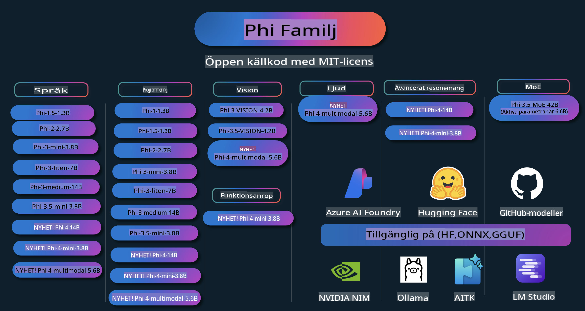

# Phi Cookbook: Praktiska Exempel med Microsofts Phi-modeller

Phi är en serie av öppen källkod AI-modeller utvecklade av Microsoft.

Phi är för närvarande den mest kraftfulla och kostnadseffektiva lilla språkmodellen (SLM), med mycket bra resultat i flerspråkighet, resonemang, text-/chatgenerering, kodning, bilder, ljud och andra scenarier.

Du kan distribuera Phi till molnet eller till edge-enheter, och du kan enkelt bygga generativa AI-applikationer med begränsad datorkraft.

Följ dessa steg för att komma igång med dessa resurser:
1. **Forka Repositoriet**: Klicka 
2. **Klona Repositoriet**:   `git clone https://github.com/microsoft/PhiCookBook.git`
3. [**Gå med i Microsoft AI Discord Community och träffa experter och andra utvecklare**](https://discord.com/invite/ByRwuEEgH4?WT.mc_id=aiml-137032-kinfeylo)

## Innehållsförteckning

- Introduktion
  - [Välkommen till Phi-familjen](./md/01.Introduction/01/01.PhiFamily.md)
  - [Ställa in din miljö](./md/01.Introduction/01/01.EnvironmentSetup.md)
  - [Förstå Nyckelteknologier](./md/01.Introduction/01/01.Understandingtech.md)
  - [AI-säkerhet för Phi-modeller](./md/01.Introduction/01/01.AISafety.md)
  - [Hårdvarustöd för Phi](./md/01.Introduction/01/01.Hardwaresupport.md)
  - [Phi-modeller & Tillgänglighet på olika plattformar](./md/01.Introduction/01/01.Edgeandcloud.md)
  - [Använda Guidance-ai och Phi](./md/01.Introduction/01/01.Guidance.md)
  - [GitHub Marketplace-modeller](https://github.com/marketplace/models)
  - [Azure AI Modellkatalog](https://ai.azure.com)

- Inference Phi i olika miljöer
    -  [Hugging face](./md/01.Introduction/02/01.HF.md)
    -  [GitHub Modeller](./md/01.Introduction/02/02.GitHubModel.md)
    -  [Azure AI Foundry Modellkatalog](./md/01.Introduction/02/03.AzureAIFoundry.md)
    -  [Ollama](./md/01.Introduction/02/04.Ollama.md)
    -  [AI Toolkit VSCode (AITK)](./md/01.Introduction/02/05.AITK.md)
    -  [NVIDIA NIM](./md/01.Introduction/02/06.NVIDIA.md)

- Inference Phi-familjen
    - [Inference Phi på iOS](./md/01.Introduction/03/iOS_Inference.md)
    - [Inference Phi på Android](./md/01.Introduction/03/Android_Inference.md)
- [Inference Phi i Jetson](./md/01.Introduction/03/Jetson_Inference.md)
    - [Inference Phi i AI PC](./md/01.Introduction/03/AIPC_Inference.md)
    - [Inference Phi med Apple MLX Framework](./md/01.Introduction/03/MLX_Inference.md)
    - [Inference Phi i Lokal Server](./md/01.Introduction/03/Local_Server_Inference.md)
    - [Inference Phi i Fjärrserver med AI Toolkit](./md/01.Introduction/03/Remote_Interence.md)
    - [Inference Phi med Rust](./md/01.Introduction/03/Rust_Inference.md)
    - [Inference Phi--Vision lokalt](./md/01.Introduction/03/Vision_Inference.md)
    - [Inference Phi med Kaito AKS, Azure Containers (officiellt stöd)](./md/01.Introduction/03/Kaito_Inference.md)
-  [Kvantifiera Phi-familjen](./md/01.Introduction/04/QuantifyingPhi.md)
    - [Kvantifiera Phi-3.5 / 4 med llama.cpp](./md/01.Introduction/04/UsingLlamacppQuantifyingPhi.md)
    - [Kvantifiera Phi-3.5 / 4 med Generative AI-tillägg för onnxruntime](./md/01.Introduction/04/UsingORTGenAIQuantifyingPhi.md)
    - [Kvantifiera Phi-3.5 / 4 med Intel OpenVINO](./md/01.Introduction/04/UsingIntelOpenVINOQuantifyingPhi.md)
    - [Kvantifiera Phi-3.5 / 4 med Apple MLX Framework](./md/01.Introduction/04/UsingAppleMLXQuantifyingPhi.md)

-  Utvärdera Phi
    - [Ansvarsfull AI](./md/01.Introduction/05/ResponsibleAI.md)
    - [Azure AI Foundry för utvärdering](./md/01.Introduction/05/AIFoundry.md)
    - [Använda Promptflow för utvärdering](./md/01.Introduction/05/Promptflow.md)
 
- RAG med Azure AI Search
    - [Hur man använder Phi-4-mini och Phi-4-multimodal (RAG) med Azure AI Search](https://github.com/microsoft/PhiCookBook/blob/main/code/06.E2E/E2E_Phi-4-RAG-Azure-AI-Search.ipynb)

- Exempel på Phi-applikationsutveckling
  - Text- och chattapplikationer
    - Phi-4 Exempel 🆕
      - [📓] [Chatta med Phi-4-mini ONNX-modell](./md/02.Application/01.TextAndChat/Phi4/ChatWithPhi4ONNX/README.md)
      - [Chatta med Phi-4 lokal ONNX-modell .NET](../../md/04.HOL/dotnet/src/LabsPhi4-Chat-01OnnxRuntime)
      - [Chat .NET Console App med Phi-4 ONNX med Semantic Kernel](../../md/04.HOL/dotnet/src/LabsPhi4-Chat-02SK)
    - Phi-3 / 3.5 Exempel
      - [Lokal chatbot i webbläsaren med Phi3, ONNX Runtime Web och WebGPU](https://github.com/microsoft/onnxruntime-inference-examples/tree/main/js/chat)
      - [OpenVino Chat](./md/02.Application/01.TextAndChat/Phi3/E2E_OpenVino_Chat.md)
      - [Multi-modell - Interaktiv Phi-3-mini och OpenAI Whisper](./md/02.Application/01.TextAndChat/Phi3/E2E_Phi-3-mini_with_whisper.md)
      - [MLFlow - Bygga ett omslag och använda Phi-3 med MLFlow](./md//02.Application/01.TextAndChat/Phi3/E2E_Phi-3-MLflow.md)
      - [Modelloptimering - Hur man optimerar Phi-3-min-modellen för ONNX Runtime Web med Olive](https://github.com/microsoft/Olive/tree/main/examples/phi3)
      - [WinUI3-app med Phi-3 mini-4k-instruct-onnx](https://github.com/microsoft/Phi3-Chat-WinUI3-Sample/)
      - [WinUI3 Multi Model AI-drivet anteckningsappsexempel](https://github.com/microsoft/ai-powered-notes-winui3-sample)
      - [Finjustera och integrera anpassade Phi-3-modeller med Promptflow](./md/02.Application/01.TextAndChat/Phi3/E2E_Phi-3-FineTuning_PromptFlow_Integration.md)
      - [Finjustera och integrera anpassade Phi-3-modeller med Promptflow i Azure AI Foundry](./md/02.Application/01.TextAndChat/Phi3/E2E_Phi-3-FineTuning_PromptFlow_Integration_AIFoundry.md)
      - [Utvärdera den finjusterade Phi-3 / Phi-3.5-modellen i Azure AI Foundry med fokus på Microsofts principer för ansvarsfull AI](./md/02.Application/01.TextAndChat/Phi3/E2E_Phi-3-Evaluation_AIFoundry.md)
- [📓] [Phi-3.5-mini-instruct språkförutsägelseexempel (Kinesiska/Engelska)](../../md/02.Application/01.TextAndChat/Phi3/phi3-instruct-demo.ipynb)  
      - [Phi-3.5-Instruct WebGPU RAG Chatbot](./md/02.Application/01.TextAndChat/Phi3/WebGPUWithPhi35Readme.md)  
      - [Använd Windows GPU för att skapa en Prompt Flow-lösning med Phi-3.5-Instruct ONNX](./md/02.Application/01.TextAndChat/Phi3/UsingPromptFlowWithONNX.md)  
      - [Använd Microsoft Phi-3.5 tflite för att skapa en Android-app](./md/02.Application/01.TextAndChat/Phi3/UsingPhi35TFLiteCreateAndroidApp.md)  
      - [Q&A .NET-exempel med lokal ONNX Phi-3-modell med Microsoft.ML.OnnxRuntime](../../md/04.HOL/dotnet/src/LabsPhi301)  
      - [Konsolchatt .NET-app med Semantic Kernel och Phi-3](../../md/04.HOL/dotnet/src/LabsPhi302)  

  - Azure AI Inference SDK Kodbaserade Exempel  
    - Phi-4 Exempel 🆕  
      - [📓] [Generera projektkod med Phi-4-multimodal](./md/02.Application/02.Code/Phi4/GenProjectCode/README.md)  
    - Phi-3 / 3.5 Exempel  
      - [Bygg din egen Visual Studio Code GitHub Copilot Chat med Microsoft Phi-3 Family](./md/02.Application/02.Code/Phi3/VSCodeExt/README.md)  
      - [Skapa din egen Visual Studio Code Chat Copilot Agent med Phi-3.5 via GitHub-modeller](/md/02.Application/02.Code/Phi3/CreateVSCodeChatAgentWithGitHubModels.md)  

  - Avancerade Resonemangsexempel  
    - Phi-4 Exempel 🆕  
      - [📓] [Phi-4-mini resonemangsexempel](./md/02.Application/03.AdvancedReasoning/Phi4/AdvancedResoningPhi4mini/README.md)  

  - Demos  
      - [Phi-4-mini demos hostade på Hugging Face Spaces](https://huggingface.co/spaces/microsoft/phi-4-mini?WT.mc_id=aiml-137032-kinfeylo)  
      - [Phi-4-multimodal demos hostade på Hugging Face Spaces](https://huggingface.co/spaces/microsoft/phi-4-multimodal?WT.mc_id=aiml-137032-kinfeylo)  

  - Visuella Exempel  
    - Phi-4 Exempel 🆕  
      - [📓] [Använd Phi-4-multimodal för att läsa bilder och generera kod](./md/02.Application/04.Vision/Phi4/CreateFrontend/README.md)  
    - Phi-3 / 3.5 Exempel  
      - [📓][Phi-3-vision-Image text till text](../../md/02.Application/04.Vision/Phi3/E2E_Phi-3-vision-image-text-to-text-online-endpoint.ipynb)  
      - [Phi-3-vision-ONNX](https://onnxruntime.ai/docs/genai/tutorials/phi3-v.html)  
      - [📓][Phi-3-vision CLIP Embedding](../../md/02.Application/04.Vision/Phi3/E2E_Phi-3-vision-image-text-to-text-online-endpoint.ipynb)  
      - [DEMO: Phi-3 Återvinning](https://github.com/jennifermarsman/PhiRecycling/)  
      - [Phi-3-vision - Visuell språkassistent - med Phi3-Vision och OpenVINO](https://docs.openvino.ai/nightly/notebooks/phi-3-vision-with-output.html)  
      - [Phi-3 Vision Nvidia NIM](./md/02.Application/04.Vision/Phi3/E2E_Nvidia_NIM_Vision.md)  
      - [Phi-3 Vision OpenVino](./md/02.Application/04.Vision/Phi3/E2E_OpenVino_Phi3Vision.md)  
      - [📓][Phi-3.5 Vision multiframe eller multi-image exempel](../../md/02.Application/04.Vision/Phi3/phi3-vision-demo.ipynb)  
      - [Phi-3 Vision Lokal ONNX-modell med Microsoft.ML.OnnxRuntime .NET](../../md/04.HOL/dotnet/src/LabsPhi303)  
      - [Menybaserad Phi-3 Vision Lokal ONNX-modell med Microsoft.ML.OnnxRuntime .NET](../../md/04.HOL/dotnet/src/LabsPhi304)  

  - Ljudexempel  
    - Phi-4 Exempel 🆕  
      - [📓] [Extrahera ljudtranskriptioner med Phi-4-multimodal](./md/02.Application/05.Audio/Phi4/Transciption/README.md)  
      - [📓] [Phi-4-multimodal ljudexempel](../../md/02.Application/05.Audio/Phi4/Siri/demo.ipynb)  
      - [📓] [Phi-4-multimodal talöversättningsexempel](../../md/02.Application/05.Audio/Phi4/Translate/demo.ipynb)  
      - [.NET-konsolapplikation som använder Phi-4-multimodal Audio för att analysera en ljudfil och generera en transkription](../../md/04.HOL/dotnet/src/LabsPhi4-MultiModal-02Audio)  

  - MOE Exempel  
    - Phi-3 / 3.5 Exempel  
      - [📓] [Phi-3.5 Mixture of Experts Models (MoEs) Social Media Exempel](../../md/02.Application/06.MoE/Phi3/phi3_moe_demo.ipynb)  
      - [📓] [Bygga en Retrieval-Augmented Generation (RAG)-pipeline med NVIDIA NIM Phi-3 MOE, Azure AI Search och LlamaIndex](../../md/02.Application/06.MoE/Phi3/azure-ai-search-nvidia-rag.ipynb)  

  - Exempel på Funktionsanrop  
    - Phi-4 Exempel 🆕  
      - [📓] [Använda Funktionsanrop med Phi-4-mini](./md/02.Application/07.FunctionCalling/Phi4/FunctionCallingBasic/README.md)  

  - Multimodala Blandningsexempel  
    - Phi-4 Exempel 🆕  
-  [📓] [Använda Phi-4-multimodal som teknikjournalist](../../md/02.Application/08.Multimodel/Phi4/TechJournalist/phi_4_mm_audio_text_publish_news.ipynb)
      - [.NET-konsolapplikation som använder Phi-4-multimodal för att analysera bilder](../../md/04.HOL/dotnet/src/LabsPhi4-MultiModal-01Images)

- Fine-tuning Phi-exempel
  - [Fine-tuning-scenarier](./md/03.FineTuning/FineTuning_Scenarios.md)
  - [Fine-tuning vs RAG](./md/03.FineTuning/FineTuning_vs_RAG.md)
  - [Fine-tuning: Låt Phi-3 bli en branschexpert](./md/03.FineTuning/LetPhi3gotoIndustriy.md)
  - [Fine-tuning Phi-3 med AI Toolkit för VS Code](./md/03.FineTuning/Finetuning_VSCodeaitoolkit.md)
  - [Fine-tuning Phi-3 med Azure Machine Learning Service](./md/03.FineTuning/Introduce_AzureML.md)
  - [Fine-tuning Phi-3 med Lora](./md/03.FineTuning/FineTuning_Lora.md)
  - [Fine-tuning Phi-3 med QLora](./md/03.FineTuning/FineTuning_Qlora.md)
  - [Fine-tuning Phi-3 med Azure AI Foundry](./md/03.FineTuning/FineTuning_AIFoundry.md)
  - [Fine-tuning Phi-3 med Azure ML CLI/SDK](./md/03.FineTuning/FineTuning_MLSDK.md)
  - [Fine-tuning med Microsoft Olive](./md/03.FineTuning/FineTuning_MicrosoftOlive.md)
  - [Fine-tuning med Microsoft Olive Hands-On Lab](./md/03.FineTuning/olive-lab/readme.md)
  - [Fine-tuning Phi-3-vision med Weights and Bias](./md/03.FineTuning/FineTuning_Phi-3-visionWandB.md)
  - [Fine-tuning Phi-3 med Apple MLX Framework](./md/03.FineTuning/FineTuning_MLX.md)
  - [Fine-tuning Phi-3-vision (officiellt stöd)](./md/03.FineTuning/FineTuning_Vision.md)
  - [Fine-tuning Phi-3 med Kaito AKS, Azure Containers (officiellt stöd)](./md/03.FineTuning/FineTuning_Kaito.md)
  - [Fine-tuning Phi-3 och 3.5 Vision](https://github.com/2U1/Phi3-Vision-Finetune)

- Hands-on Lab
  - [Utforska avancerade modeller: LLMs, SLMs, lokal utveckling och mer](https://github.com/microsoft/aitour-exploring-cutting-edge-models)
  - [Lås upp NLP-potential: Fine-tuning med Microsoft Olive](https://github.com/azure/Ignite_FineTuning_workshop)

- Akademiska forskningsartiklar och publikationer
  - [Textbooks Are All You Need II: phi-1.5 teknisk rapport](https://arxiv.org/abs/2309.05463)
  - [Phi-3 teknisk rapport: En mycket kapabel språkmodell lokalt på din telefon](https://arxiv.org/abs/2404.14219)
  - [Phi-4 teknisk rapport](https://arxiv.org/abs/2412.08905)
  - [Optimera små språkmodeller för funktion-anrop i fordon](https://arxiv.org/abs/2501.02342)
  - [(WhyPHI) Fine-tuning PHI-3 för flervalsfrågor: Metodologi, resultat och utmaningar](https://arxiv.org/abs/2501.01588)

## Använda Phi-modeller

### Phi på Azure AI Foundry

Du kan lära dig hur du använder Microsoft Phi och bygger E2E-lösningar på olika hårdvaruenheter. För att uppleva Phi själv, börja med att testa modellerna och anpassa Phi för dina scenarier via [Azure AI Foundry Azure AI Model Catalog](https://aka.ms/phi3-azure-ai). Du kan läsa mer i Kom igång med [Azure AI Foundry](/md/02.QuickStart/AzureAIFoundry_QuickStart.md).

**Playground**  
Varje modell har en dedikerad testmiljö: [Azure AI Playground](https://aka.ms/try-phi3).

### Phi på GitHub-modeller

Du kan lära dig hur du använder Microsoft Phi och bygger E2E-lösningar på olika hårdvaruenheter. För att uppleva Phi själv, börja med att testa modellen och anpassa Phi för dina scenarier via [GitHub Model Catalog](https://github.com/marketplace/models?WT.mc_id=aiml-137032-kinfeylo). Du kan läsa mer i Kom igång med [GitHub Model Catalog](/md/02.QuickStart/GitHubModel_QuickStart.md).

**Playground**
Varje modell har en dedikerad [playground för att testa modellen](/md/02.QuickStart/GitHubModel_QuickStart.md).

### Phi på Hugging Face

Du kan också hitta modellen på [Hugging Face](https://huggingface.co/microsoft)

**Playground**  
[Hugging Chat playground](https://huggingface.co/chat/models/microsoft/Phi-3-mini-4k-instruct)

## Ansvarsfull AI

Microsoft är engagerade i att hjälpa våra kunder att använda våra AI-produkter på ett ansvarsfullt sätt, dela våra lärdomar och bygga förtroendebaserade partnerskap genom verktyg som Transparency Notes och Impact Assessments. Många av dessa resurser finns tillgängliga på [https://aka.ms/RAI](https://aka.ms/RAI).  
Microsofts tillvägagångssätt för ansvarsfull AI är förankrat i våra AI-principer: rättvisa, pålitlighet och säkerhet, integritet och säkerhet, inkludering, transparens och ansvarsskyldighet.

Storskaliga modeller för naturligt språk, bilder och tal - som de som används i detta exempel - kan potentiellt bete sig på sätt som är orättvisa, opålitliga eller stötande, vilket i sin tur kan orsaka skada. Vänligen konsultera [Azure OpenAI-tjänstens Transparency note](https://learn.microsoft.com/legal/cognitive-services/openai/transparency-note?tabs=text) för att bli informerad om risker och begränsningar.

Det rekommenderade tillvägagångssättet för att mildra dessa risker är att inkludera ett säkerhetssystem i din arkitektur som kan upptäcka och förhindra skadligt beteende. [Azure AI Content Safety](https://learn.microsoft.com/azure/ai-services/content-safety/overview) tillhandahåller ett oberoende skyddslager som kan upptäcka skadligt innehåll som genereras av användare eller AI i applikationer och tjänster. Azure AI Content Safety inkluderar text- och bild-API:er som gör det möjligt att identifiera skadligt material. Inom Azure AI Foundry låter Content Safety-tjänsten dig visa, utforska och prova exempel på kod för att upptäcka skadligt innehåll i olika modaliteter. Följande [quickstart-dokumentation](https://learn.microsoft.com/azure/ai-services/content-safety/quickstart-text?tabs=visual-studio%2Clinux&pivots=programming-language-rest) guidar dig genom att göra förfrågningar till tjänsten.

En annan aspekt att ta hänsyn till är den övergripande applikationsprestandan. För applikationer med flera modaliteter och modeller innebär prestanda att systemet fungerar som du och dina användare förväntar sig, inklusive att det inte genererar skadliga resultat. Det är viktigt att utvärdera prestandan för din övergripande applikation med hjälp av [Performance and Quality och Risk and Safety-utvärderare](https://learn.microsoft.com/azure/ai-studio/concepts/evaluation-metrics-built-in). Du har också möjlighet att skapa och utvärdera med [anpassade utvärderare](https://learn.microsoft.com/azure/ai-studio/how-to/develop/evaluate-sdk#custom-evaluators).

Du kan utvärdera din AI-applikation i din utvecklingsmiljö med hjälp av [Azure AI Evaluation SDK](https://microsoft.github.io/promptflow/index.html). Med antingen en testdatamängd eller ett mål mäts dina generativa AI-applikationsresultat kvantitativt med inbyggda utvärderare eller anpassade utvärderare som du väljer. För att komma igång med Azure AI Evaluation SDK för att utvärdera ditt system kan du följa [quickstart-guiden](https://learn.microsoft.com/azure/ai-studio/how-to/develop/flow-evaluate-sdk). När du har genomfört en utvärderingskörning kan du [visualisera resultaten i Azure AI Foundry](https://learn.microsoft.com/azure/ai-studio/how-to/evaluate-flow-results).

## Varumärken

Detta projekt kan innehålla varumärken eller logotyper för projekt, produkter eller tjänster. Auktoriserad användning av Microsofts varumärken eller logotyper är föremål för och måste följa [Microsofts riktlinjer för varumärken och varumärkesanvändning](https://www.microsoft.com/legal/intellectualproperty/trademarks/usage/general).  
Användning av Microsofts varumärken eller logotyper i modifierade versioner av detta projekt får inte orsaka förvirring eller antyda sponsring från Microsoft. All användning av tredje parts varumärken eller logotyper är föremål för dessa tredje parters policyer.

**Ansvarsfriskrivning**:  
Detta dokument har översatts med hjälp av maskinbaserade AI-översättningstjänster. Även om vi strävar efter noggrannhet, bör det noteras att automatiserade översättningar kan innehålla fel eller felaktigheter. Det ursprungliga dokumentet på dess originalspråk bör betraktas som den auktoritativa källan. För kritisk information rekommenderas professionell mänsklig översättning. Vi ansvarar inte för eventuella missförstånd eller feltolkningar som uppstår vid användning av denna översättning.