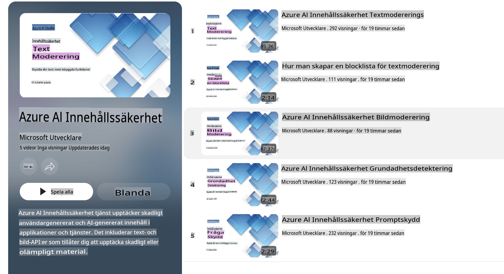

# AI-säkerhet för Phi-modeller

Phi-familjen av modeller utvecklades i enlighet med [Microsoft Responsible AI Standard](https://query.prod.cms.rt.microsoft.com/cms/api/am/binary/RE5cmFl), som är en företagsövergripande uppsättning krav baserade på följande sex principer: ansvarsskyldighet, transparens, rättvisa, tillförlitlighet och säkerhet, integritet och säkerhet samt inkludering, vilka utgör [Microsofts principer för ansvarsfull AI](https://www.microsoft.com/ai/responsible-ai).

Precis som tidigare Phi-modeller tillämpades en mångfacetterad säkerhetsutvärdering och efterträningsstrategi, med ytterligare åtgärder för att ta hänsyn till de flerspråkiga funktionerna i denna version. Vår strategi för säkerhetsträning och utvärderingar, inklusive tester över flera språk och riskkategorier, beskrivs i [Phi Safety Post-Training Paper](https://arxiv.org/abs/2407.13833). Även om Phi-modellerna drar nytta av detta tillvägagångssätt bör utvecklare tillämpa bästa praxis för ansvarsfull AI, inklusive att kartlägga, mäta och mildra risker kopplade till deras specifika användningsområde och kulturella samt språkliga kontext.

## Bästa praxis

Precis som andra modeller kan Phi-familjen av modeller potentiellt bete sig på sätt som är orättvisa, opålitliga eller stötande.

Några av de begränsande beteendena hos SLM och LLM som du bör vara medveten om inkluderar:

- **Tjänstekvalitet:** Phi-modellerna är främst tränade på engelskspråkig text. Andra språk än engelska kommer att uppleva sämre prestanda. Engelska språkvarianter med mindre representation i träningsdata kan prestera sämre än standardamerikansk engelska.
- **Representation av skador och förstärkning av stereotyper:** Dessa modeller kan över- eller underrepresentera grupper av människor, radera representationen av vissa grupper eller förstärka nedsättande eller negativa stereotyper. Trots säkerhetsträning efteråt kan dessa begränsningar fortfarande finnas på grund av olika nivåer av representation av olika grupper eller förekomsten av exempel på negativa stereotyper i träningsdata som speglar verkliga mönster och samhälleliga fördomar.
- **Olämpligt eller stötande innehåll:** Dessa modeller kan generera andra typer av olämpligt eller stötande innehåll, vilket kan göra dem olämpliga att använda i känsliga sammanhang utan ytterligare åtgärder som är specifika för användningsfallet.
- **Informationspålitlighet:** Språkmodeller kan generera nonsensartat innehåll eller fabricera innehåll som kan låta rimligt men som är felaktigt eller föråldrat.
- **Begränsat omfång för kod:** Majoriteten av Phi-3:s träningsdata är baserade på Python och använder vanliga paket som "typing, math, random, collections, datetime, itertools". Om modellen genererar Python-skript som använder andra paket eller skript på andra språk rekommenderar vi starkt att användare manuellt verifierar alla API-användningar.

Utvecklare bör tillämpa bästa praxis för ansvarsfull AI och är ansvariga för att säkerställa att ett specifikt användningsområde uppfyller relevanta lagar och regler (t.ex. integritet, handel, etc.).

## Överväganden för ansvarsfull AI

Precis som andra språkmodeller kan Phi-seriens modeller potentiellt bete sig på sätt som är orättvisa, opålitliga eller stötande. Några av de begränsande beteendena som du bör vara medveten om inkluderar:

**Tjänstekvalitet:** Phi-modellerna är främst tränade på engelskspråkig text. Andra språk än engelska kommer att uppleva sämre prestanda. Engelska språkvarianter med mindre representation i träningsdata kan prestera sämre än standardamerikansk engelska.

**Representation av skador och förstärkning av stereotyper:** Dessa modeller kan över- eller underrepresentera grupper av människor, radera representationen av vissa grupper eller förstärka nedsättande eller negativa stereotyper. Trots säkerhetsträning efteråt kan dessa begränsningar fortfarande finnas på grund av olika nivåer av representation av olika grupper eller förekomsten av exempel på negativa stereotyper i träningsdata som speglar verkliga mönster och samhälleliga fördomar.

**Olämpligt eller stötande innehåll:** Dessa modeller kan generera andra typer av olämpligt eller stötande innehåll, vilket kan göra dem olämpliga att använda i känsliga sammanhang utan ytterligare åtgärder som är specifika för användningsfallet.

**Informationspålitlighet:** Språkmodeller kan generera nonsensartat innehåll eller fabricera innehåll som kan låta rimligt men som är felaktigt eller föråldrat.

**Begränsat omfång för kod:** Majoriteten av Phi-3:s träningsdata är baserade på Python och använder vanliga paket som "typing, math, random, collections, datetime, itertools". Om modellen genererar Python-skript som använder andra paket eller skript på andra språk rekommenderar vi starkt att användare manuellt verifierar alla API-användningar.

Utvecklare bör tillämpa bästa praxis för ansvarsfull AI och är ansvariga för att säkerställa att ett specifikt användningsområde uppfyller relevanta lagar och regler (t.ex. integritet, handel, etc.). Viktiga områden att överväga inkluderar:

**Fördelning:** Modellerna kanske inte är lämpliga för scenarier som kan ha en betydande påverkan på juridisk status eller fördelning av resurser eller livsmöjligheter (exempelvis bostäder, anställning, kredit, etc.) utan ytterligare utvärderingar och avbiasningstekniker.

**Högrisk-scenarier:** Utvecklare bör bedöma lämpligheten av att använda modeller i högrisk-scenarier där orättvisa, opålitliga eller stötande resultat kan vara mycket kostsamma eller leda till skada. Detta inkluderar att ge råd i känsliga eller expertområden där noggrannhet och tillförlitlighet är kritiska (exempelvis juridisk eller medicinsk rådgivning). Ytterligare skyddsåtgärder bör implementeras på applikationsnivå beroende på distributionskontexten.

**Desinformation:** Modeller kan generera felaktig information. Utvecklare bör följa bästa praxis för transparens och informera slutanvändare om att de interagerar med ett AI-system. På applikationsnivå kan utvecklare bygga in feedbackmekanismer och pipelines för att förankra svar i användningsspecifik, kontextuell information, en teknik känd som Retrieval Augmented Generation (RAG).

**Generering av skadligt innehåll:** Utvecklare bör utvärdera resultat utifrån deras kontext och använda tillgängliga säkerhetsklassificerare eller anpassade lösningar som är lämpliga för deras användningsfall.

**Missbruk:** Andra former av missbruk, såsom bedrägeri, spam eller skapande av skadlig programvara, kan vara möjliga, och utvecklare bör säkerställa att deras applikationer inte bryter mot gällande lagar och regler.

### Finjustering och AI-innehållssäkerhet

Efter att ha finjusterat en modell rekommenderar vi starkt att använda [Azure AI Content Safety](https://learn.microsoft.com/azure/ai-services/content-safety/overview) för att övervaka innehållet som genereras av modellerna, identifiera och blockera potentiella risker, hot och kvalitetsproblem.

[Azure AI Content Safety](https://learn.microsoft.com/azure/ai-services/content-safety/overview) stöder både text- och bildinnehåll. Det kan distribueras i molnet, fristående containrar och på edge/inbäddade enheter.

## Översikt av Azure AI Content Safety

Azure AI Content Safety är inte en lösning som passar alla; den kan anpassas för att överensstämma med företagens specifika policyer. Dessutom gör dess flerspråkiga modeller det möjligt att förstå flera språk samtidigt.

- **Azure AI Content Safety**  
- **Microsoft Developer**  
- **5 videor**  

Azure AI Content Safety-tjänsten upptäcker skadligt användargenererat och AI-genererat innehåll i applikationer och tjänster. Den inkluderar text- och bild-API:er som gör det möjligt att upptäcka skadligt eller olämpligt material.

[AI Content Safety Playlist](https://www.youtube.com/playlist?list=PLlrxD0HtieHjaQ9bJjyp1T7FeCbmVcPkQ)

**Ansvarsfriskrivning**:  
Detta dokument har översatts med maskinbaserade AI-översättningstjänster. Även om vi strävar efter noggrannhet, bör du vara medveten om att automatiserade översättningar kan innehålla fel eller brister. Det ursprungliga dokumentet på dess originalspråk bör betraktas som den auktoritativa källan. För kritisk information rekommenderas professionell, mänsklig översättning. Vi ansvarar inte för eventuella missförstånd eller feltolkningar som uppstår vid användning av denna översättning.