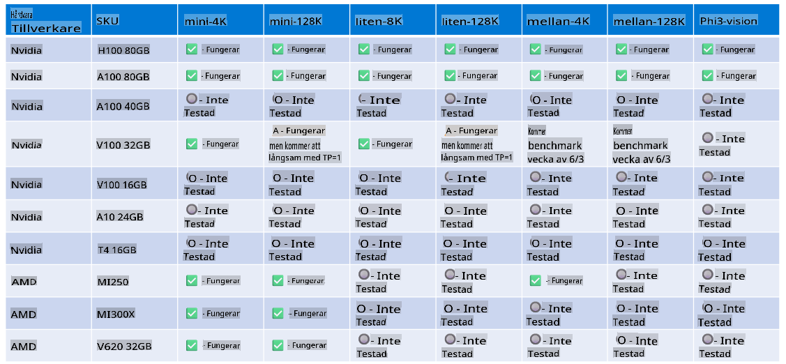

# Phi-hårdvarustöd

Microsoft Phi har optimerats för ONNX Runtime och stöder Windows DirectML. Det fungerar bra på olika typer av hårdvara, inklusive GPU:er, CPU:er och till och med mobila enheter.

## Enhetshårdvara
Specifikt stöds följande hårdvara:

- GPU SKU: RTX 4090 (DirectML)
- GPU SKU: 1 A100 80GB (CUDA)
- CPU SKU: Standard F64s v2 (64 vCPUs, 128 GiB minne)

## Mobil SKU

- Android - Samsung Galaxy S21
- Apple iPhone 14 eller högre A16/A17-processor

## Phi-hårdvaruspecifikation

- Minimikonfiguration som krävs.
- Windows: DirectX 12-kompatibel GPU och minst 4GB kombinerat RAM

CUDA: NVIDIA GPU med Compute Capability >= 7.02



## Köra onnxruntime på flera GPU:er

För närvarande är tillgängliga Phi ONNX-modeller endast för 1 GPU. Det är möjligt att stödja multi-gpu för Phi-modellen, men ORT med 2 GPU:er garanterar inte att det ger högre genomströmning jämfört med 2 instanser av ORT. Se [ONNX Runtime](https://onnxruntime.ai/) för de senaste uppdateringarna.

På [Build 2024 GenAI ONNX Team](https://youtu.be/WLW4SE8M9i8?si=EtG04UwDvcjunyfC) tillkännagav de att de hade aktiverat multi-instans istället för multi-gpu för Phi-modeller.

För närvarande gör detta det möjligt att köra en onnxruntime- eller onnxruntime-genai-instans med miljövariabeln CUDA_VISIBLE_DEVICES enligt följande.

```Python
CUDA_VISIBLE_DEVICES=0 python infer.py
CUDA_VISIBLE_DEVICES=1 python infer.py
```

Utforska gärna Phi vidare på [Azure AI Foundry](https://ai.azure.com)

**Ansvarsfriskrivning**:  
Detta dokument har översatts med hjälp av maskinbaserade AI-översättningstjänster. Även om vi strävar efter noggrannhet, vänligen notera att automatiska översättningar kan innehålla fel eller felaktigheter. Det ursprungliga dokumentet på dess ursprungliga språk bör betraktas som den auktoritativa källan. För kritisk information rekommenderas professionell human översättning. Vi ansvarar inte för eventuella missförstånd eller feltolkningar som uppstår till följd av användningen av denna översättning.