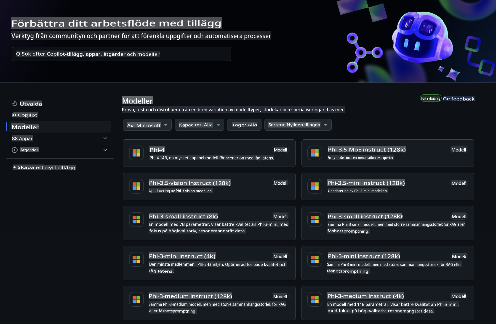
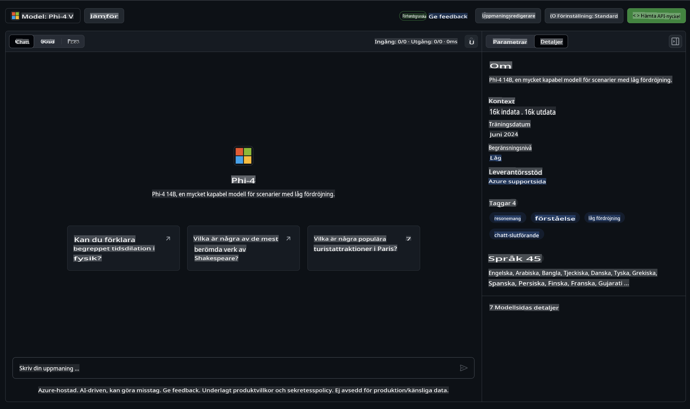
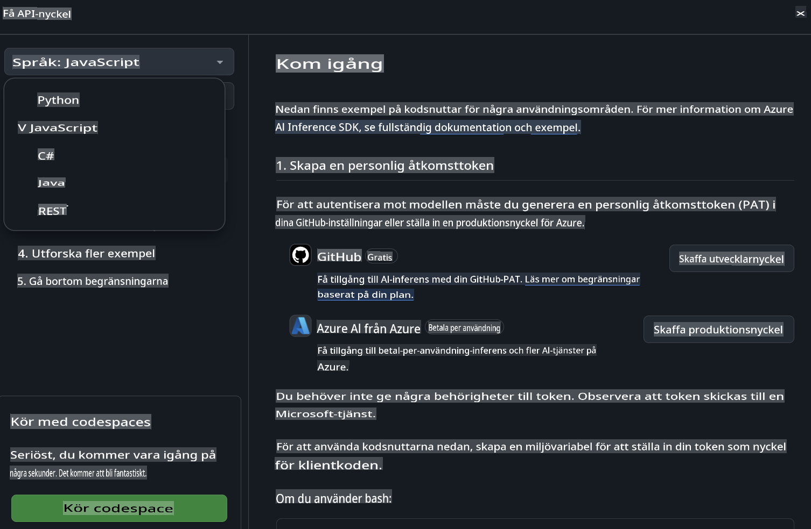
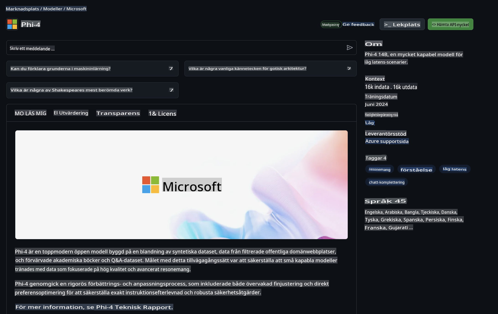

## Phi-familjen i GitHub-modeller

Välkommen till [GitHub Models](https://github.com/marketplace/models)! Vi har allt redo för dig att utforska AI-modeller som hostas på Azure AI.



För mer information om modellerna som finns tillgängliga på GitHub Models, kolla in [GitHub Model Marketplace](https://github.com/marketplace/models).

## Tillgängliga modeller

Varje modell har en dedikerad testmiljö och exempelkod.



### Phi-familjen i GitHub Model Catalog

- [Phi-4](https://github.com/marketplace/models/azureml/Phi-4)

- [Phi-3.5-MoE instruct (128k)](https://github.com/marketplace/models/azureml/Phi-3-5-MoE-instruct)

- [Phi-3.5-vision instruct (128k)](https://github.com/marketplace/models/azureml/Phi-3-5-vision-instruct)

- [Phi-3.5-mini instruct (128k)](https://github.com/marketplace/models/azureml/Phi-3-5-mini-instruct)

- [Phi-3-Medium-128k-Instruct](https://github.com/marketplace/models/azureml/Phi-3-medium-128k-instruct)

- [Phi-3-medium-4k-instruct](https://github.com/marketplace/models/azureml/Phi-3-medium-4k-instruct)

- [Phi-3-mini-128k-instruct](https://github.com/marketplace/models/azureml/Phi-3-mini-128k-instruct)

- [Phi-3-mini-4k-instruct](https://github.com/marketplace/models/azureml/Phi-3-mini-4k-instruct)

- [Phi-3-small-128k-instruct](https://github.com/marketplace/models/azureml/Phi-3-small-128k-instruct)

- [Phi-3-small-8k-instruct](https://github.com/marketplace/models/azureml/Phi-3-small-8k-instruct)

## Komma igång

Det finns några grundläggande exempel som är redo att köras. Du hittar dem i mappen för exempel. Om du vill hoppa direkt till ditt favoritspråk kan du hitta exemplen på följande språk:

- Python
- JavaScript
- C#
- Java
- cURL

Det finns även en dedikerad Codespaces-miljö för att köra exemplen och modellerna.



## Exempelkod

Nedan finns exempel på kodsnuttar för några användningsfall. För ytterligare information om Azure AI Inference SDK, se fullständig dokumentation och exempel.

## Konfiguration

1. Skapa en personlig åtkomsttoken  
Du behöver inte ge några behörigheter till token. Observera att token kommer att skickas till en Microsoft-tjänst.

För att använda kodsnuttarna nedan, skapa en miljövariabel för att sätta din token som nyckel för klientkoden.

Om du använder bash:  
```
export GITHUB_TOKEN="<your-github-token-goes-here>"
```  
Om du använder PowerShell:  

```
$Env:GITHUB_TOKEN="<your-github-token-goes-here>"
```  

Om du använder Windows kommandotolk:  

```
set GITHUB_TOKEN=<your-github-token-goes-here>
```  

## Python-exempel

### Installera beroenden  
Installera Azure AI Inference SDK med pip (Krav: Python >=3.8):  

```
pip install azure-ai-inference
```  

### Kör ett grundläggande kodexempel  

Detta exempel demonstrerar ett grundläggande anrop till chat completion API. Det använder GitHub AI-modellens inferens-endpoint och din GitHub-token. Anropet är synkront.  

```python
import os
from azure.ai.inference import ChatCompletionsClient
from azure.ai.inference.models import SystemMessage, UserMessage
from azure.core.credentials import AzureKeyCredential

endpoint = "https://models.inference.ai.azure.com"
model_name = "Phi-4"
token = os.environ["GITHUB_TOKEN"]

client = ChatCompletionsClient(
    endpoint=endpoint,
    credential=AzureKeyCredential(token),
)

response = client.complete(
    messages=[
        UserMessage(content="I have $20,000 in my savings account, where I receive a 4% profit per year and payments twice a year. Can you please tell me how long it will take for me to become a millionaire? Also, can you please explain the math step by step as if you were explaining it to an uneducated person?"),
    ],
    temperature=0.4,
    top_p=1.0,
    max_tokens=2048,
    model=model_name
)

print(response.choices[0].message.content)
```  

### Kör en konversation med flera omgångar  

Detta exempel demonstrerar en konversation med flera omgångar med chat completion API. När du använder modellen för en chattapplikation behöver du hantera historiken för den konversationen och skicka de senaste meddelandena till modellen.  

```
import os
from azure.ai.inference import ChatCompletionsClient
from azure.ai.inference.models import AssistantMessage, SystemMessage, UserMessage
from azure.core.credentials import AzureKeyCredential

token = os.environ["GITHUB_TOKEN"]
endpoint = "https://models.inference.ai.azure.com"
# Replace Model_Name
model_name = "Phi-4"

client = ChatCompletionsClient(
    endpoint=endpoint,
    credential=AzureKeyCredential(token),
)

messages = [
    SystemMessage(content="You are a helpful assistant."),
    UserMessage(content="What is the capital of France?"),
    AssistantMessage(content="The capital of France is Paris."),
    UserMessage(content="What about Spain?"),
]

response = client.complete(messages=messages, model=model_name)

print(response.choices[0].message.content)
```  

### Strömma utdata  

För en bättre användarupplevelse vill du strömma modellens svar så att den första token visas tidigt och du undviker att vänta på långa svar.  

```
import os
from azure.ai.inference import ChatCompletionsClient
from azure.ai.inference.models import SystemMessage, UserMessage
from azure.core.credentials import AzureKeyCredential

token = os.environ["GITHUB_TOKEN"]
endpoint = "https://models.inference.ai.azure.com"
# Replace Model_Name
model_name = "Phi-4"

client = ChatCompletionsClient(
    endpoint=endpoint,
    credential=AzureKeyCredential(token),
)

response = client.complete(
    stream=True,
    messages=[
        SystemMessage(content="You are a helpful assistant."),
        UserMessage(content="Give me 5 good reasons why I should exercise every day."),
    ],
    model=model_name,
)

for update in response:
    if update.choices:
        print(update.choices[0].delta.content or "", end="")

client.close()
```  

## GRATIS användning och begränsningar för GitHub-modeller  



[Begränsningarna för testmiljön och gratis API-användning](https://docs.github.com/en/github-models/prototyping-with-ai-models#rate-limits) är avsedda att hjälpa dig att experimentera med modeller och prototyper för din AI-applikation. För användning utöver dessa begränsningar, och för att skala din applikation, måste du tilldela resurser från ett Azure-konto och autentisera därifrån istället för med din GitHub personliga åtkomsttoken. Du behöver inte ändra något annat i din kod. Använd denna länk för att upptäcka hur du går bortom gratisnivåns begränsningar i Azure AI.

### Information

Kom ihåg att när du interagerar med en modell så experimenterar du med AI, vilket innebär att innehållsfel kan förekomma.

Funktionen är föremål för olika begränsningar (inklusive förfrågningar per minut, förfrågningar per dag, tokens per förfrågan och samtidiga förfrågningar) och är inte utformad för produktionsanvändning.

GitHub Models använder Azure AI Content Safety. Dessa filter kan inte stängas av som en del av GitHub Models-upplevelsen. Om du väljer att använda modeller via en betaltjänst, vänligen konfigurera dina innehållsfilter för att uppfylla dina krav.

Denna tjänst omfattas av GitHubs förhandsvillkor.

**Ansvarsfriskrivning**:  
Detta dokument har översatts med hjälp av maskinbaserade AI-översättningstjänster. Även om vi strävar efter noggrannhet, bör det noteras att automatiserade översättningar kan innehålla fel eller brister. Det ursprungliga dokumentet på dess originalspråk bör betraktas som den auktoritativa källan. För kritisk information rekommenderas professionell mänsklig översättning. Vi ansvarar inte för eventuella missförstånd eller feltolkningar som uppstår vid användning av denna översättning.