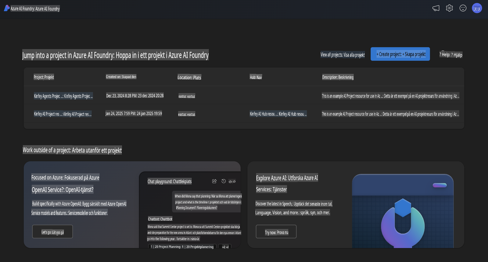
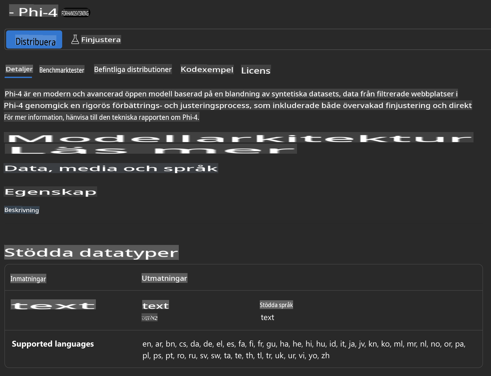
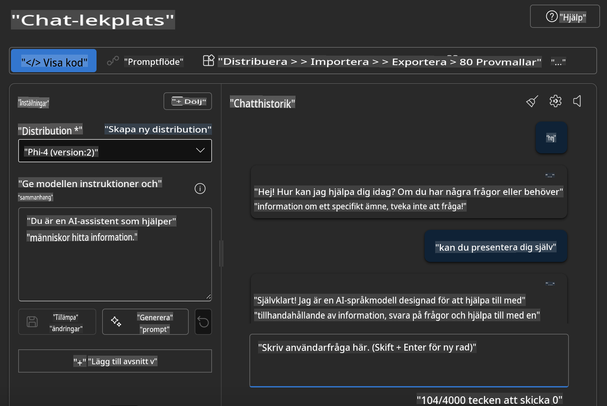

## Phi-familjen i Azure AI Foundry

[Azure AI Foundry](https://ai.azure.com) är en pålitlig plattform som ger utvecklare möjlighet att driva innovation och forma framtiden med AI på ett säkert, tryggt och ansvarsfullt sätt.

[Azure AI Foundry](https://ai.azure.com) är utformad för att utvecklare ska kunna:

- Bygga generativa AI-applikationer på en plattform i företagsklass.
- Utforska, bygga, testa och distribuera med hjälp av toppmoderna AI-verktyg och ML-modeller, baserade på ansvarsfulla AI-principer.
- Samarbeta med ett team genom hela livscykeln för applikationsutveckling.

Med Azure AI Foundry kan du utforska ett brett utbud av modeller, tjänster och funktioner, och börja skapa AI-applikationer som bäst uppfyller dina mål. Plattformen Azure AI Foundry möjliggör skalbarhet för att enkelt omvandla koncepttester till fullfjädrade produktionsapplikationer. Kontinuerlig övervakning och förbättring bidrar till långsiktig framgång.



Förutom att använda Azure AOAI Service i Azure AI Foundry kan du också använda tredjepartsmodeller i Azure AI Foundry Model Catalog. Detta är ett bra val om du vill använda Azure AI Foundry som din plattform för AI-lösningar.

Vi kan snabbt distribuera Phi-familjens modeller via Model Catalog i Azure AI Foundry.


### **Distribuera Phi-4 i Azure AI Foundry**



### **Testa Phi-4 i Azure AI Foundry Playground**



### **Köra Python-kod för att anropa Azure AI Foundry Phi-4**

```python

import os  
import base64
from openai import AzureOpenAI  
from azure.identity import DefaultAzureCredential, get_bearer_token_provider  
        
endpoint = os.getenv("ENDPOINT_URL", "Your Azure AOAI Service Endpoint")  
deployment = os.getenv("DEPLOYMENT_NAME", "Phi-4")  
      
token_provider = get_bearer_token_provider(  
    DefaultAzureCredential(),  
    "https://cognitiveservices.azure.com/.default"  
)  
  
client = AzureOpenAI(  
    azure_endpoint=endpoint,  
    azure_ad_token_provider=token_provider,  
    api_version="2024-05-01-preview",  
)  
  

chat_prompt = [
    {
        "role": "system",
        "content": "You are an AI assistant that helps people find information."
    },
    {
        "role": "user",
        "content": "can you introduce yourself"
    }
] 
    
# Include speech result if speech is enabled  
messages = chat_prompt 

completion = client.chat.completions.create(  
    model=deployment,  
    messages=messages,
    max_tokens=800,  
    temperature=0.7,  
    top_p=0.95,  
    frequency_penalty=0,  
    presence_penalty=0,
    stop=None,  
    stream=False  
)  
  
print(completion.to_json())  

```

**Ansvarsfriskrivning**:  
Detta dokument har översatts med hjälp av maskinbaserade AI-översättningstjänster. Även om vi strävar efter noggrannhet, vänligen notera att automatiska översättningar kan innehålla fel eller felaktigheter. Det ursprungliga dokumentet på dess originalspråk bör betraktas som den auktoritativa källan. För kritisk information rekommenderas professionell human översättning. Vi ansvarar inte för eventuella missförstånd eller feltolkningar som uppstår till följd av användningen av denna översättning.