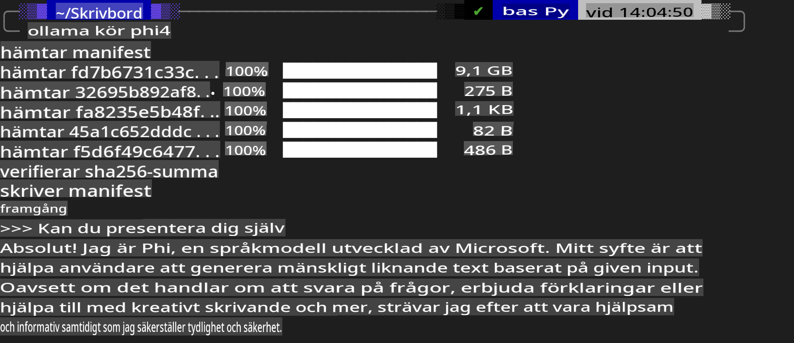
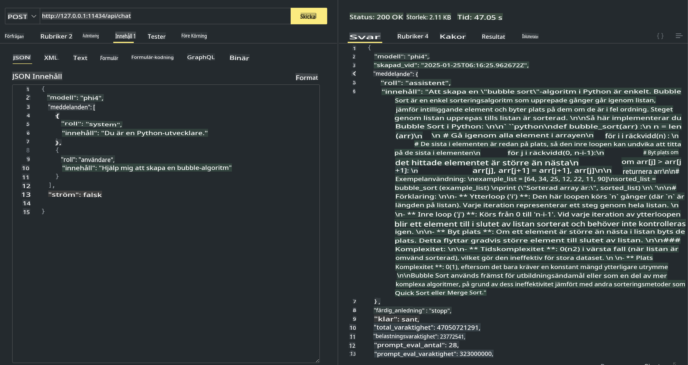

## Phi-familjen i Ollama

[Ollama](https://ollama.com) gör det möjligt för fler att direkt distribuera öppen källkod LLM eller SLM genom enkla skript, och kan även bygga API:er för att underlätta lokala Copilot-applikationsscenarier.

## **1. Installation**

Ollama fungerar på Windows, macOS och Linux. Du kan installera Ollama via denna länk ([https://ollama.com/download](https://ollama.com/download)). Efter en lyckad installation kan du direkt använda Ollama-skript för att anropa Phi-3 via ett terminalfönster. Du kan se alla [tillgängliga bibliotek i Ollama](https://ollama.com/library). Om du öppnar detta repository i en Codespace kommer Ollama redan att vara installerat.

```bash

ollama run phi4

```

> [!NOTE]
> Modellen kommer att laddas ner första gången du kör den. Du kan naturligtvis också direkt ange den nedladdade Phi-4-modellen. Vi använder WSL som exempel för att köra kommandot. När modellen har laddats ner framgångsrikt kan du interagera direkt i terminalen.



## **2. Anropa phi-4 API från Ollama**

Om du vill anropa Phi-4 API som genereras av Ollama kan du använda detta kommando i terminalen för att starta Ollama-servern.

```bash

ollama serve

```

> [!NOTE]
> Om du kör macOS eller Linux, observera att du kan stöta på följande fel **"Error: listen tcp 127.0.0.1:11434: bind: address already in use"**. Detta fel kan uppstå när du kör kommandot. Du kan antingen ignorera det felet, eftersom det vanligtvis indikerar att servern redan körs, eller så kan du stoppa och starta om Ollama:

**macOS**

```bash

brew services restart ollama

```

**Linux**

```bash

sudo systemctl stop ollama

```

Ollama stöder två API: generate och chat. Du kan anropa modellens API som tillhandahålls av Ollama baserat på dina behov, genom att skicka förfrågningar till den lokala tjänsten som körs på port 11434.

**Chat**

```bash

curl http://127.0.0.1:11434/api/chat -d '{
  "model": "phi3",
  "messages": [
    {
      "role": "system",
      "content": "Your are a python developer."
    },
    {
      "role": "user",
      "content": "Help me generate a bubble algorithm"
    }
  ],
  "stream": false
  
}'

This is the result in Postman



## Additional Resources

Check the list of available models in Ollama in [their library](https://ollama.com/library).

Pull your model from the Ollama server using this command

```bash
ollama pull phi4
```

Run the model using this command

```bash
ollama run phi4
```

***Note:*** Visit this link [https://github.com/ollama/ollama/blob/main/docs/api.md](https://github.com/ollama/ollama/blob/main/docs/api.md) to learn more

## Calling Ollama from Python

You can use `requests` or `urllib3` to make requests to the local server endpoints used above. However, a popular way to use Ollama in Python is via the [openai](https://pypi.org/project/openai/) SDK, since Ollama provides OpenAI-compatible server endpoints as well.

Here is an example for phi3-mini:

```python
import openai

client = openai.OpenAI(
    base_url="http://localhost:11434/v1",
    api_key="nokeyneeded",
)

response = client.chat.completions.create(
    model="phi4",
    temperature=0.7,
    n=1,
    messages=[
        {"role": "system", "content": "You are a helpful assistant."},
        {"role": "user", "content": "Write a haiku about a hungry cat"},
    ],
)

print("Response:")
print(response.choices[0].message.content)
```

## Calling Ollama from JavaScript 

```javascript
// Exempel på att sammanfatta en fil med Phi-4
script({
    model: "ollama:phi4",
    title: "Summarize with Phi-4",
    system: ["system"],
})

// Exempel på sammanfattning
const file = def("FILE", env.files)
$`Summarize ${file} in a single paragraph.`
```

## Calling Ollama from C#

Create a new C# Console application and add the following NuGet package:

```bash
dotnet add package Microsoft.SemanticKernel --version 1.34.0
```

Then replace this code in the `Program.cs` file

```csharp
using Microsoft.SemanticKernel;
using Microsoft.SemanticKernel.ChatCompletion;

// lägg till chat completion-tjänst med den lokala Ollama-serverns endpoint
#pragma warning disable SKEXP0001, SKEXP0003, SKEXP0010, SKEXP0011, SKEXP0050, SKEXP0052
builder.AddOpenAIChatCompletion(
    modelId: "phi4",
    endpoint: new Uri("http://localhost:11434/"),
    apiKey: "non required");

// anropa en enkel prompt till chattjänsten
string prompt = "Write a joke about kittens";
var response = await kernel.InvokePromptAsync(prompt);
Console.WriteLine(response.GetValue<string>());
```

Run the app with the command:

```bash
dotnet run

**Ansvarsfriskrivning**:  
Detta dokument har översatts med hjälp av AI-baserade maskinöversättningstjänster. Även om vi strävar efter noggrannhet, bör du vara medveten om att automatiserade översättningar kan innehålla fel eller felaktigheter. Det ursprungliga dokumentet på sitt originalspråk bör betraktas som den auktoritativa källan. För kritisk information rekommenderas professionell mänsklig översättning. Vi tar inget ansvar för eventuella missförstånd eller feltolkningar som uppstår vid användning av denna översättning.